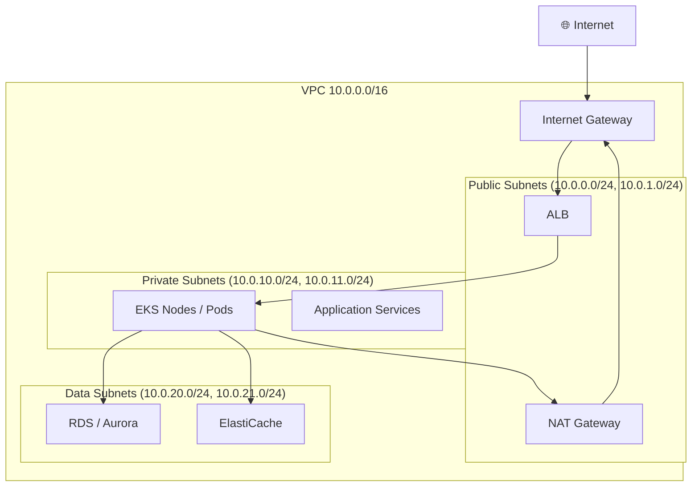
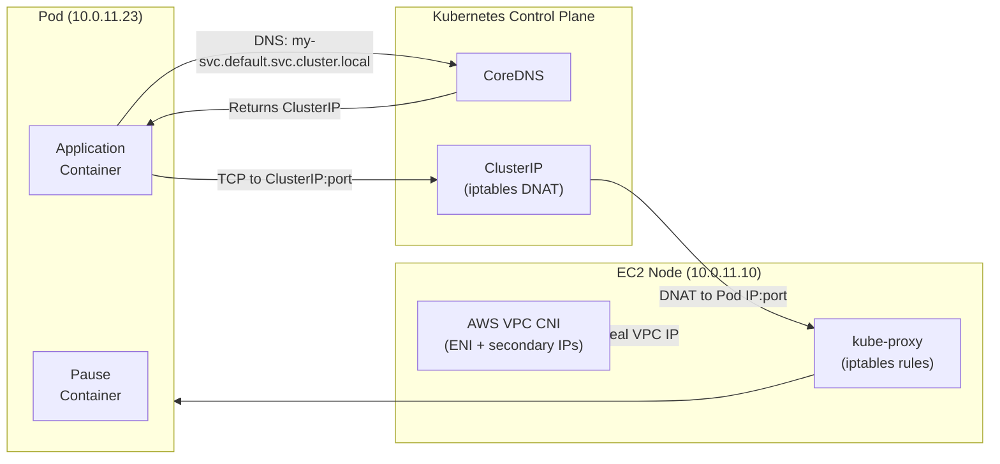
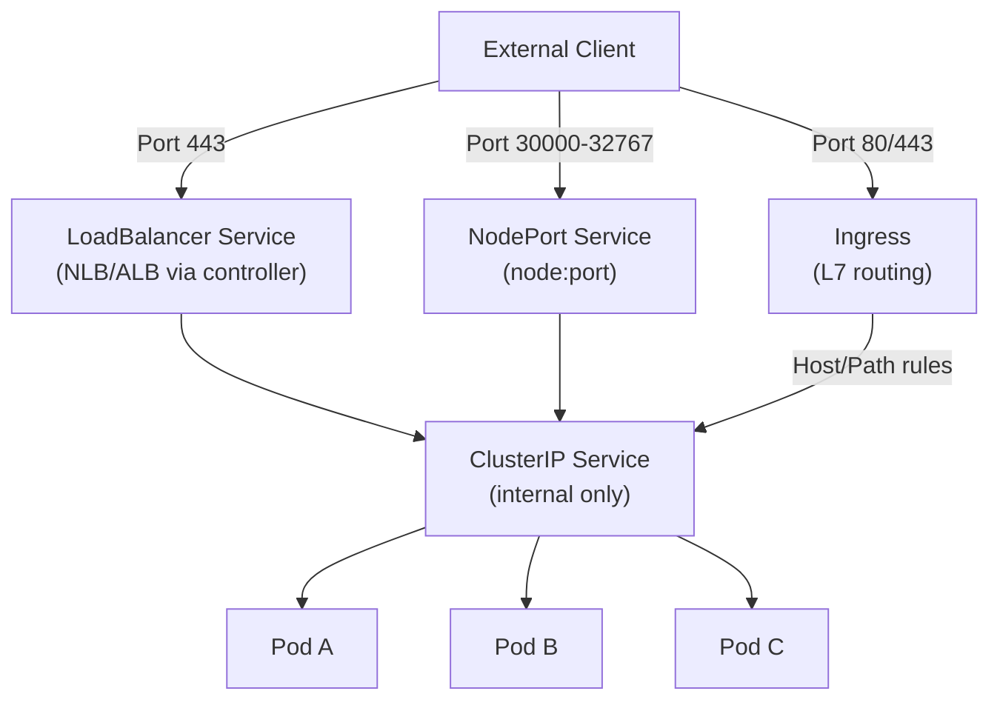

# Networking Fundamentals for DevOps and Cloud Engineers: What Actually Matters in Production

> Part 1 of the series: *"Networking for DevOps and Cloud Architects: From Packets to Production"*

---

## Table of Contents

- [Why This Matters for DevOps and Cloud Engineers](#why-this-matters)
- [Mental Model](#mental-model)
- [Core Concepts](#core-concepts)
- [How It Works in Real Production Systems](#how-it-works-in-real-production-systems)
- [End-to-End Traffic Flow Example](#end-to-end-traffic-flow-example)
- [Common Failure Patterns](#common-failure-patterns)
- [Commands Every Engineer Should Know](#commands-every-engineer-should-know)
- [AWS / Cloud Angle](#aws--cloud-angle)
- [Kubernetes Angle](#kubernetes-angle)
- [Troubleshooting Framework](#troubleshooting-framework)
- [Senior Engineer Interview Explanation](#senior-engineer-interview-explanation)
- [Production Checklist](#production-checklist)
- [Key Takeaways](#key-takeaways)

---

## Why This Matters

Most networking knowledge in DevOps teams is tribal. Someone gets paged at 2am because a pod can't reach an RDS database, and they either know what to check or they don't. The engineers who can navigate a broken network path — without panic, methodically, in production — are senior engineers. The ones who can't are expensive passengers.

Networking is not optional knowledge for cloud engineers. Every single thing you build rides on it:

- **CI/CD pipelines** pull artifacts over the network. When your build agent can't reach ECR, it's a networking problem.
- **EKS clusters** rely on CoreDNS, VPC CNI, and kube-proxy working in concert. Any of those breaking silently means your service is unreachable.
- **RDS/Aurora databases** sit in private subnets. Getting to them requires correct route tables, security groups, and subnet associations — all networking.
- **Zero-downtime deployments** require your load balancer health checks and connection draining to work correctly. Both networking.
- **TLS certificate expiry** takes down HTTPS endpoints. Networking.
- **Latency and timeout incidents** almost always start with a network-layer hypothesis.

If you cannot read a packet's journey from a browser to a pod and back, you cannot reliably operate production systems. This article exists to close that gap.

---

## Mental Model

**Think of the network as a series of handoff desks in a large building.**

Each desk only knows what it needs to know for its job:

- The **IP layer** is the building's mailroom: it knows source and destination addresses and routes the envelope.
- The **TCP layer** is the registered mail system: it tracks delivery, handles lost packages, and reorders them if they arrive out of sequence.
- **DNS** is the building's directory service: you say "I need to reach the billing team," and it gives you a room number (IP address).
- **Load balancers** are the reception desks: they receive incoming visitors and direct them to the right person, distributing the load.
- **Security groups and NACLs** are the security checkpoints: they inspect who is trying to enter or leave and allow or deny passage.
- **TLS** is the sealed envelope: even if someone intercepts it in transit, they can't read the contents.

The job of every DevOps/cloud engineer is to know which desk is responsible for what — so when something breaks, you walk the chain and find the desk that failed.

---

## Core Concepts

### 1. The OSI Model — What You Actually Need

You don't need to memorize all 7 layers for production work. You need to understand the *operative layers*:

| Layer | Name | What you touch daily |
|-------|------|----------------------|
| L3 | Network | IP addresses, routing, CIDR blocks, VPCs, route tables |
| L4 | Transport | TCP/UDP, ports, connection state, timeouts |
| L7 | Application | HTTP/HTTPS, DNS, TLS, gRPC, WebSockets |

Layers 1–2 (Physical/Data Link) matter when you're debugging NIC issues or VLANs. In cloud, your provider handles those. Layers 5–6 (Session/Presentation) are mostly abstracted into L7 in practice.

**Why it matters operationally:** When you get a timeout, knowing whether it's at L3 (routing), L4 (TCP handshake), or L7 (HTTP response) cuts your debugging time in half. A `connection refused` is L4. A `no route to host` is L3. A `502 Bad Gateway` is L7.

---

### 2. IP Addressing and CIDR Notation

An IP address is a 32-bit number written as four octets: `10.0.1.45`.

CIDR notation (`10.0.0.0/16`) describes a range. The `/16` means the first 16 bits are fixed — the network prefix. That leaves 16 bits for host addresses: 65,536 addresses.

**Quick CIDR cheat sheet:**

| CIDR | Hosts (usable) | Typical use |
|------|----------------|-------------|
| /32 | 1 | Single host, security group rules |
| /28 | 14 | Small subnet |
| /24 | 254 | Standard subnet |
| /16 | 65,534 | VPC range |
| /8 | 16M | Class A private space |

**Private address ranges (RFC 1918):**
- `10.0.0.0/8`
- `172.16.0.0/12`
- `192.168.0.0/16`

These are non-routable on the public internet. Everything inside your VPC uses these. When you try to connect to a private IP from outside without a VPN or PrivateLink, it fails — not because of a firewall, but because the internet has no route for it.

**Subnet arithmetic matters.** In AWS, every subnet loses 5 IPs to AWS reservations (network address, VPC router, DNS, future use, broadcast). A `/28` gives you 16 addresses, minus 5 = **11 usable**. If you're launching 10 EKS nodes in that subnet, you're already tight — and EKS assigns IPs to pods, not just nodes.

---

### 3. TCP vs. UDP — When It Matters

**TCP (Transmission Control Protocol):**
- Connection-oriented: three-way handshake (SYN → SYN-ACK → ACK)
- Ordered, reliable delivery
- Acknowledgments and retransmissions
- **Used by:** HTTP/HTTPS, databases (MySQL, PostgreSQL, Redis), SSH, Kubernetes API server

**UDP (User Datagram Protocol):**
- Connectionless: fire and forget
- No guarantee of delivery or order
- Lower latency, lower overhead
- **Used by:** DNS queries, QUIC/HTTP3, syslog, metrics over statsd, NTP

**Why it matters in production:**

TCP's three-way handshake adds latency. Every new connection to your API adds at least one round-trip before a byte of application data moves. This is why:
- Connection pooling matters (reuse established connections)
- Keep-alive headers exist
- HTTP/2 multiplexes multiple requests over a single TCP connection

If your pod makes a fresh TCP connection to RDS on every request, you're paying that handshake cost 10,000 times per second at scale.

**TCP connection states you'll encounter while debugging:**

```
SYN_SENT     → client sent SYN, waiting for SYN-ACK
SYN_RECEIVED → server got SYN, sent SYN-ACK
ESTABLISHED  → handshake complete, data flowing
FIN_WAIT_1   → initiating close
TIME_WAIT    → closed, waiting for delayed packets (2 × MSL, usually 60s)
CLOSE_WAIT   → received FIN, waiting for local app to close
```

`TIME_WAIT` is frequently misdiagnosed as "port exhaustion" in high-throughput services. If you see thousands of sockets in `TIME_WAIT`, your application is opening too many short-lived connections. The fix is connection pooling, not tuning `net.ipv4.tcp_tw_reuse` (though that's sometimes necessary too).

---

### 4. DNS — The Thing That Breaks Everything

DNS resolves human-readable names to IP addresses. The resolution chain:

```
Application → /etc/resolv.conf → Recursive Resolver → Root NS → TLD NS → Authoritative NS → Answer
```

**Key record types:**

| Record | Purpose | Production use |
|--------|---------|----------------|
| A | Name → IPv4 | Direct IP resolution |
| AAAA | Name → IPv6 | IPv6 endpoints |
| CNAME | Name → Name | ALB DNS names, CDN |
| MX | Mail exchange | Email routing |
| TXT | Arbitrary text | Domain verification, SPF/DKIM |
| NS | Nameserver | Delegation |
| SRV | Service record | gRPC, service discovery |

**TTL is not optional configuration.** TTL (Time to Live) controls how long resolvers cache a record. A 300-second TTL means clients may use a stale IP for up to 5 minutes after you update the record. During a failover or blue/green switch, that staleness matters. Many teams set TTLs low before a planned migration and forget to set them back — leaving them at 60 seconds and hammering their authoritative DNS servers.

**Negative caching.** DNS also caches `NXDOMAIN` (name doesn't exist) responses — for the TTL of the SOA record's `minimum` field. If a pod queries a service name that doesn't exist yet and gets `NXDOMAIN`, it may cache that failure and keep failing even after the service is created.

---

### 5. Ports — What They Represent and Why They Matter

A port is a 16-bit number (0–65535) that identifies a specific process or service on a host. Together, an IP address and port form a **socket**.

**Well-known ports (0–1023):** Assigned by IANA
- 22 → SSH
- 53 → DNS
- 80 → HTTP
- 443 → HTTPS
- 3306 → MySQL
- 5432 → PostgreSQL
- 6379 → Redis
- 8080 → Common HTTP alternative

**Ephemeral ports (1024–65535, typically 32768–60999 on Linux):** Used by clients when initiating connections. When your pod connects to RDS on port 5432, the OS assigns a random ephemeral port on the client side. This return traffic comes back to that ephemeral port. Your security groups need to allow this — which is why stateful security groups (AWS) handle this automatically, but stateless NACLs require explicit outbound ephemeral port rules.

---

### 6. Routing — How Packets Find Their Way

Routing is the process of forwarding packets between networks. A router (or route table) maintains entries of the form:

```
Destination CIDR → Next Hop
```

**Longest prefix match wins.** If your route table has:
```
10.0.0.0/16 → local
0.0.0.0/0   → igw-xxxx (Internet Gateway)
```

A packet destined for `10.0.1.5` matches `10.0.0.0/16` (more specific) and stays local. A packet to `8.8.8.8` only matches `0.0.0.0/0` and goes to the IGW.

This is why private subnets don't have `0.0.0.0/0 → IGW` — they route internet-bound traffic to a NAT Gateway instead, and the NAT Gateway has a public IP. Your instance stays private, but can initiate outbound internet connections.

---

### 7. NAT — Network Address Translation

NAT allows private IPs to communicate with the public internet by substituting the source IP with a public one.

**In AWS:**

- **NAT Gateway:** Managed service, placed in a public subnet. Your private instances route `0.0.0.0/0` to it. It translates the source IP to its Elastic IP.
- **Instance-based NAT:** Older pattern, uses a specific EC2 instance.

**The asymmetry problem:** NAT only works for *outbound-initiated* connections. An external system cannot initiate a connection directly to a private IP behind NAT (this is where NLBs, ALBs, and PrivateLink exist to solve the ingress problem).

**Connection tracking:** NAT maintains a state table mapping internal socket (IP:port) → external socket. When the response comes back, it reverse-translates. If you have a long-lived connection (e.g., a WebSocket to an external API from a private subnet), and the NAT Gateway's connection table entry expires, the connection drops silently. This is a real production failure pattern.

---

### 8. TLS — Encrypted Transport

TLS (Transport Layer Security) provides encryption, authentication, and integrity over TCP.

**The TLS handshake (TLS 1.2 simplified):**

```
Client → Server: ClientHello (cipher suites, TLS version)
Server → Client: ServerHello + Certificate + ServerHelloDone
Client → Server: ClientKeyExchange (encrypted pre-master secret)
Both compute: session keys
Client → Server: ChangeCipherSpec + Finished
Server → Client: ChangeCipherSpec + Finished
[Encrypted application data begins]
```

**TLS 1.3** reduces the handshake to 1 round-trip and adds 0-RTT resumption, which matters at scale.

**What engineers get wrong about TLS:**

1. **Certificate chain vs. leaf cert:** Your ALB or NGINX must serve the full chain (leaf + intermediates), not just the leaf. If the intermediate is missing, some clients (particularly mobile or embedded) will reject the certificate.
2. **SNI (Server Name Indication):** Allows a single IP to serve multiple TLS certificates. The client sends the desired hostname in the ClientHello, before the handshake completes. This is how ALBs with multiple domains work, how Kubernetes Ingress controllers do TLS termination, and why `openssl s_client` needs `-servername` to test correctly.
3. **Certificate expiry:** Set alerts at 30 and 7 days before expiry. Automate rotation. Production outages from expired certs are embarrassing and entirely preventable.
4. **Mutual TLS (mTLS):** Both sides present certificates. Used in service meshes (Istio, Linkerd), internal APIs, and anywhere you need strong identity verification between services.

---

### 9. Load Balancing — Distribution, Not Just Redundancy

A load balancer distributes incoming traffic across a pool of backends. But it also handles:

- **Health checks:** Removes unhealthy backends from rotation
- **Connection draining:** Lets in-flight requests complete before deregistering a backend
- **Sticky sessions:** Routes a user consistently to the same backend (useful for stateful apps, dangerous for stateless ones)
- **TLS termination:** Decrypts HTTPS at the LB, forwards plain HTTP to backends (reducing compute cost on backends)
- **Protocol translation:** ALBs can do HTTP/2 on the frontend, HTTP/1.1 to backends

**Layer 4 vs Layer 7 load balancing:**

| Feature | L4 (NLB) | L7 (ALB) |
|---------|----------|----------|
| Routing basis | IP/port | HTTP headers, path, host |
| TLS termination | Optional (passthrough available) | Yes |
| WebSocket support | Yes | Yes |
| gRPC | Yes (TCP passthrough) | Yes (native) |
| Latency | Ultra-low | Slightly higher |
| Use case | TCP apps, high throughput | HTTP/HTTPS microservices |
| Preserves client IP | Yes (uses proxy protocol or direct) | Via X-Forwarded-For header |

---

### 10. Firewalls — Security Groups vs. NACLs

**Security Groups (Stateful):**
- Operate at the instance/ENI level
- Stateful: if you allow inbound port 443, return traffic is automatically allowed
- Default: all outbound allowed, all inbound denied
- Rules are allow-only (no explicit deny)
- Evaluated as a whole (all matching rules are applied, most permissive wins for allow)

**Network ACLs (Stateless):**
- Operate at the subnet boundary
- Stateless: you must explicitly allow both inbound and outbound, including ephemeral ports
- Support allow and deny rules
- Rules evaluated in order; first match wins
- Default NACL: allows everything

**In practice:** Security groups are your primary control plane. NACLs are your subnet-level last line of defense — useful for blanket blocking a CIDR range that's attacking you, or enforcing isolation between subnets. Most engineers over-rely on security groups and under-use NACLs. But don't use NACLs as your only control — they're stateless and easy to misconfigure.

---

## How It Works in Real Production Systems

### AWS VPC Architecture

A well-designed VPC for a production workload typically looks like this:



The tiered subnet model enforces the principle of least exposure:
- Public subnets host only resources that must receive internet traffic (ALBs, NAT GW)
- Private subnets host compute (EKS nodes, Lambda, EC2)
- Data subnets host databases with no route to the internet at all

A common mistake is putting EKS nodes in public subnets "to simplify networking." You get cheaper egress, but your nodes are directly exposed to the internet even with security groups — that's a security posture you don't want.

---

### How Kubernetes Networking Layers Stack

In an EKS cluster, multiple networking systems operate simultaneously:



Key insight: With AWS VPC CNI, pod IPs are real VPC IPs. There's no overlay network. A pod at `10.0.11.23` is directly routable from anywhere in the VPC. This simplifies troubleshooting but means you can exhaust subnet IPs faster than expected.

---

### DNS in Kubernetes

When a pod resolves `my-service.default.svc.cluster.local`:

1. The pod's `/etc/resolv.conf` points to CoreDNS (ClusterIP, typically `10.96.0.10`)
2. The query hits CoreDNS
3. CoreDNS checks its `ServiceEntry` cache — it watches the Kubernetes API for Service objects
4. Returns the ClusterIP for the service
5. The pod connects to the ClusterIP
6. kube-proxy's iptables rules DNAT the connection to one of the backing pod IPs

**The ndots trap:** By default, Kubernetes sets `ndots:5` in `/etc/resolv.conf`. This means for any hostname with fewer than 5 dots, the resolver tries appending each search domain before trying the hostname as-is. A query for `api.example.com` actually generates:
```
api.example.com.default.svc.cluster.local
api.example.com.svc.cluster.local
api.example.com.cluster.local
api.example.com.us-east-1.compute.internal
api.example.com    ← actual query (tried last)
```

This means **5 DNS queries** for one external hostname. At 10,000 requests/second, that's 50,000 DNS queries/second. CoreDNS starts dropping under this load, causing intermittent timeouts across your entire cluster. The fix: use fully qualified domain names (append a trailing dot: `api.example.com.`) or configure `dnsConfig` to reduce `ndots`.

---

## End-to-End Traffic Flow Example

**Scenario:** A user's browser makes an HTTPS request to `https://api.example.com/v1/users`

```
┌─────────────────────────────────────────────────────────────────────┐
│  1. Browser DNS Resolution                                          │
│     Query: api.example.com → Route 53 → Returns ALB DNS CNAME     │
│     ALB DNS → Returns ALB IP (e.g., 54.23.11.45)                  │
└─────────────────────────────────────┬───────────────────────────────┘
                                       │
┌─────────────────────────────────────▼───────────────────────────────┐
│  2. TCP Handshake + TLS Handshake (Client → ALB:443)               │
│     SYN → SYN-ACK → ACK                                            │
│     ClientHello (SNI: api.example.com) → Certificate → Keys        │
│     TLS session established. ALB decrypts traffic.                 │
└─────────────────────────────────────┬───────────────────────────────┘
                                       │
┌─────────────────────────────────────▼───────────────────────────────┐
│  3. ALB Routing                                                     │
│     ALB checks listener rules:                                     │
│     Host: api.example.com, Path: /v1/* → Target Group: api-tg     │
│     ALB checks health of targets → selects healthy pod IP:8080     │
│     Adds headers: X-Forwarded-For, X-Forwarded-Proto: https        │
└─────────────────────────────────────┬───────────────────────────────┘
                                       │
┌─────────────────────────────────────▼───────────────────────────────┐
│  4. Traffic hits EKS Pod                                           │
│     (If using AWS Load Balancer Controller with IP mode:           │
│      direct to pod IP, bypasses kube-proxy)                        │
│     (If using NodePort mode:                                       │
│      hits node:NodePort → iptables DNAT → pod IP:8080)            │
└─────────────────────────────────────┬───────────────────────────────┘
                                       │
┌─────────────────────────────────────▼───────────────────────────────┐
│  5. Application Processing                                          │
│     Pod receives HTTP request                                       │
│     App resolves: postgres.default.svc.cluster.local → CoreDNS    │
│     Gets ClusterIP → kube-proxy DNAT → RDS endpoint               │
│     (Or directly: rds.endpoint.us-east-1.rds.amazonaws.com)       │
└─────────────────────────────────────┬───────────────────────────────┘
                                       │
┌─────────────────────────────────────▼───────────────────────────────┐
│  6. Database Query                                                  │
│     Pod (10.0.11.23:ephemeral) → Security Group check →            │
│     RDS (10.0.20.5:5432)                                           │
│     RDS SG allows: source = EKS node SG on port 5432              │
└─────────────────────────────────────┬───────────────────────────────┘
                                       │
┌─────────────────────────────────────▼───────────────────────────────┐
│  7. Response Path                                                   │
│     DB → Pod → ALB (re-encrypted if needed) → Browser             │
└─────────────────────────────────────────────────────────────────────┘
```

**Where things commonly break in this flow:**

- Step 1: DNS misconfiguration, wrong TTL during migration
- Step 2: TLS cert expired, missing intermediate cert, wrong SNI
- Step 3: ALB target group shows unhealthy — wrong health check path, pod not ready
- Step 4: kube-proxy iptables rules stale, pod not in EndpointSlice
- Step 5: CoreDNS down, ndots exhaustion
- Step 6: Security group doesn't allow EKS SG → RDS SG, wrong port
- Step 7: Asymmetric routing if multiple NICs or misconfigured pod network

---

## Common Failure Patterns

### Failure 1: `connection timed out` vs `connection refused`

**Symptom:** Service is unreachable

**Understanding the difference:**
- `Connection timed out` — packet was sent, no response. Likely a firewall/SG silently dropping packets, or routing hole.
- `Connection refused` — destination received the packet but nothing is listening on that port. Process isn't running, wrong port, or app crashed.

**Verify:**
```bash
# Test if port is reachable
nc -zv <hostname> <port>

# Try TCP connect with timeout
curl -v --connect-timeout 5 http://<hostname>:<port>/health
```

**Fix:** For timeout — check security groups, NACLs, route tables. For refused — check if the service/process is running, correct port in config.

---

### Failure 2: DNS Resolution Fails Inside Kubernetes

**Symptom:** `nslookup: can't resolve 'my-service'` inside a pod, intermittent timeouts

**Likely cause:**
- CoreDNS pods are down or OOMKilled
- ndots exhaustion causing DNS flood and drops
- CoreDNS ConfigMap misconfigured
- Pod's DNS policy set incorrectly

**Verify:**
```bash
# Check CoreDNS pods
kubectl get pods -n kube-system -l k8s-app=kube-dns

# Check CoreDNS logs
kubectl logs -n kube-system -l k8s-app=kube-dns --tail=50

# Test DNS from inside a pod
kubectl run -it --rm debug --image=busybox --restart=Never -- nslookup kubernetes.default

# Check CoreDNS resource usage
kubectl top pods -n kube-system -l k8s-app=kube-dns
```

**Fix:** Scale CoreDNS, add resource limits, configure NodeLocal DNSCache to reduce CoreDNS load.

---

### Failure 3: ALB Target Group Unhealthy

**Symptom:** 502/503 errors from ALB, `No healthy targets`

**Likely causes:**
- Health check path returning non-200
- Security group on nodes/pods not allowing ALB to reach health check port
- Pod not yet ready (readinessProbe failing)
- Health check interval/threshold too aggressive

**Verify:**
```bash
# Check target health via AWS CLI
aws elbv2 describe-target-health \
  --target-group-arn <arn>

# Check pod readiness
kubectl get pods -o wide
kubectl describe pod <pod-name>

# Check security group allows ALB CIDR or SG to reach pods
aws ec2 describe-security-groups --group-ids <sg-id>
```

**Fix:** Align health check path with an actual working endpoint, fix readinessProbe, update security group rules.

---

### Failure 4: Ephemeral Port Exhaustion

**Symptom:** Intermittent connection failures from high-throughput service, `cannot assign requested address`

**Likely cause:** Application opening too many short-lived TCP connections. Linux ephemeral port range is ~28,000 ports. At 28,000 concurrent short-lived connections, you run out.

**Verify:**
```bash
# Count sockets in TIME_WAIT
ss -tan | grep TIME-WAIT | wc -l

# Check current ephemeral port range
cat /proc/sys/net/ipv4/ip_local_port_range

# Count connections per state
ss -tan | awk '{print $1}' | sort | uniq -c
```

**Fix:** Add connection pooling in your application, tune `net.ipv4.ip_local_port_range` to widen range, enable `net.ipv4.tcp_tw_reuse`.

---

### Failure 5: Asymmetric Routing

**Symptom:** Connections work intermittently, RST packets in tcpdump, strange half-open connections

**Likely cause:** A packet takes one path in, a different path out. The stateful device (NAT, firewall, load balancer) only sees half the conversation and drops it.

**Common in:** Multi-NIC instances, pods with custom network routes, misconfigured VPC peering, Transit Gateway route tables

**Verify:**
```bash
# Trace the actual path
traceroute <destination>

# Capture asymmetric RSTs
tcpdump -i any -nn 'tcp[tcpflags] & tcp-rst != 0'
```

**Fix:** Ensure routing is symmetric — traffic in and out must flow through the same stateful device. In AWS, this usually means checking route tables in both VPCs and ensuring the return path is explicit.

---

### Failure 6: TLS Certificate Mismatch / Expired

**Symptom:** `SSL_ERROR_RX_RECORD_TOO_LONG`, `certificate verify failed`, `ERR_CERT_DATE_INVALID`

**Verify:**
```bash
# Check cert expiry and chain
openssl s_client -connect api.example.com:443 -servername api.example.com 2>/dev/null \
  | openssl x509 -noout -dates -subject -issuer

# Check if intermediate certs are present
openssl s_client -connect api.example.com:443 -servername api.example.com 2>/dev/null \
  | openssl x509 -noout -text | grep -A2 "Subject Alternative Name"
```

**Fix:** Renew cert, upload full chain (leaf + intermediates) to ACM or NGINX.

---

### Failure 7: NAT Gateway Connection Tracking Timeout

**Symptom:** Long-lived connections (WebSockets, DB connections) drop after ~350 seconds of idle

**Likely cause:** NAT Gateway has a 350-second idle timeout for TCP connections. Connections that are idle (no traffic) for that period are silently dropped from the NAT state table. The next packet gets no response.

**Verify:**
```bash
# Check for idle connections being reset
tcpdump -i eth0 'tcp[tcpflags] & tcp-rst != 0'

# Check connection keepalive settings on application side
ss -eto | grep -i keepalive
```

**Fix:** Enable TCP keepalive at the OS or application level (`SO_KEEPALIVE`). For databases, configure the connection pool's keepalive. For WebSockets, configure application-level ping/pong frames.

---

## Commands Every Engineer Should Know

### `ping` — Basic Reachability

```bash
ping -c 4 10.0.1.5
```

**What it proves:** ICMP reachability between two IPs at L3. Routing is working.

**Good result:** Low, consistent RTT. 0% packet loss.

**Bad result:** `Request timeout` — likely ICMP blocked by security group or NACL (not necessarily that TCP is broken too). `Network unreachable` — no route to the destination.

> Note: AWS security groups block ICMP by default. `ping` failing doesn't mean TCP is blocked. Always follow up with `nc` or `curl`.

---

### `nc` (netcat) — Port-Level Reachability

```bash
nc -zv 10.0.1.5 5432
```

**What it proves:** TCP connection can be established to a specific port. Tests L4 connectivity.

**Good result:** `Connection to 10.0.1.5 5432 port [tcp/postgresql] succeeded!`

**Bad result:**
- `Connection refused` — host is up, but nothing listening on that port
- `Connection timed out` — firewall is silently dropping the packet

---

### `curl` — Full HTTP/HTTPS Test

```bash
# Full verbose output including TLS and headers
curl -v --connect-timeout 10 https://api.example.com/health

# Show only timing breakdown
curl -w "\n\nDNS: %{time_namelookup}s\nConnect: %{time_connect}s\nTLS: %{time_appconnect}s\nTTFB: %{time_starttransfer}s\nTotal: %{time_total}s\n" \
     -o /dev/null -s https://api.example.com/health
```

**What it proves:** Full request pipeline — DNS, TCP, TLS, HTTP.

**Good result:** HTTP 200, low time-to-first-byte.

**Bad result:** Each phase of the timing output tells you where time is spent. High `time_namelookup` → DNS problem. High `time_connect` → routing/firewall. High `time_appconnect` → TLS issue. High `time_starttransfer` → backend processing.

---

### `dig` — DNS Debugging

```bash
# Basic lookup
dig api.example.com

# Lookup with specific resolver
dig @8.8.8.8 api.example.com

# Check authoritative answer
dig +trace api.example.com

# From inside Kubernetes pod, query CoreDNS directly
dig @10.96.0.10 my-service.default.svc.cluster.local
```

**What it proves:** DNS resolution, which server answered, TTL remaining.

**Good result:** `ANSWER SECTION` has expected IP, short query time.

**Bad result:** `NXDOMAIN` — name doesn't exist. `SERVFAIL` — resolver error. Long query time — resolver is slow or overloaded.

---

### `traceroute` — Path Tracing

```bash
traceroute -n 8.8.8.8

# Use TCP SYN instead of ICMP (better against firewalls)
traceroute -T -p 443 api.example.com
```

**What it proves:** Every hop between source and destination. Where routing diverges from expected path.

**Good result:** Clean hops with increasing latency, terminating at destination.

**Bad result:** `* * *` at a specific hop — that hop doesn't respond to probes (common for firewalls/NATs). Request never reaches destination — routing hole.

---

### `ss` — Socket State

```bash
# All TCP connections with process info
ss -tanp

# Count connections by state
ss -tan | awk 'NR>1 {print $1}' | sort | uniq -c | sort -rn

# Show established connections to a specific port
ss -tan state established '( dport = :5432 or sport = :5432 )'
```

**What it proves:** Active connections, socket states, which process owns which socket.

**Good result:** Expected connections in ESTABLISHED state, no abnormal counts of TIME_WAIT or CLOSE_WAIT.

**Bad result:** Large count of TIME_WAIT → connection churn. Large count of CLOSE_WAIT → application isn't closing connections properly (likely a bug).

---

### `tcpdump` — Packet-Level Capture

```bash
# Capture traffic on port 5432
tcpdump -i eth0 -nn 'port 5432'

# Capture and save for Wireshark
tcpdump -i eth0 -w /tmp/capture.pcap

# Look for RST packets
tcpdump -i any -nn 'tcp[tcpflags] & tcp-rst != 0'

# DNS traffic
tcpdump -i any -nn 'port 53'
```

**What it proves:** Exact packets flowing (or not flowing). Ground truth at the wire level.

**Good result:** SYN → SYN-ACK → ACK → data flowing.

**Bad result:** SYN with no SYN-ACK → firewall dropping. SYN-ACK then RST → security group allowing TCP but something rejecting at L7.

> Use `tcpdump` when everything else is ambiguous. It is the final arbiter.

---

### `openssl s_client` — TLS Inspection

```bash
openssl s_client -connect api.example.com:443 \
  -servername api.example.com \
  -showcerts 2>/dev/null | openssl x509 -noout -text | grep -E "Not Before|Not After|Subject:|DNS:"
```

**What it proves:** Certificate details, expiry, SANs, chain of trust.

**Good result:** Valid cert, not expired, SANs match the hostname.

**Bad result:** `Verify return code: 20 (unable to get local issuer certificate)` → missing intermediate. `Verify return code: 10 (certificate has expired)` → renew immediately.

---

### Kubernetes Commands

```bash
# Get all services and their ClusterIPs
kubectl get svc -A

# Check endpoints behind a service (are pods healthy and registered?)
kubectl get endpoints my-service

# Describe an Ingress (check rules, backend, TLS)
kubectl describe ingress my-ingress

# Check pod network info
kubectl get pod my-pod -o wide

# Check DNS resolution from a pod
kubectl exec -it my-pod -- nslookup my-service.default.svc.cluster.local

# Check CoreDNS configmap
kubectl get configmap coredns -n kube-system -o yaml

# Check node-level iptables DNAT rules for a service
sudo iptables -t nat -L KUBE-SERVICES -n | grep <ClusterIP>

# Check AWS VPC CNI assigned IPs
kubectl get nodes -o custom-columns="NAME:.metadata.name,MAX_PODS:.metadata.annotations.vpc\.amazonaws\.com/eniconfig"
```

---

### AWS CLI

```bash
# Check route tables for a subnet
aws ec2 describe-route-tables \
  --filters "Name=association.subnet-id,Values=subnet-xxxx" \
  --query 'RouteTables[*].Routes'

# Check security group rules
aws ec2 describe-security-groups --group-ids sg-xxxx \
  --query 'SecurityGroups[*].IpPermissions'

# Check ALB target health
aws elbv2 describe-target-health \
  --target-group-arn arn:aws:elasticloadbalancing:...

# Check NAT Gateway status
aws ec2 describe-nat-gateways --filter Name=state,Values=available

# Describe VPC endpoints
aws ec2 describe-vpc-endpoints --filters "Name=vpc-id,Values=vpc-xxxx"
```

---

## AWS / Cloud Angle

### VPC Design Principles

**CIDR Planning:** Start larger than you think you need. A `/16` for the VPC is standard. Allocate `/20` or larger per subnet. You cannot resize a subnet after creation, and expanding a VPC requires adding a secondary CIDR block — painful to retrofit.

**Multi-AZ:** Always distribute across at least 3 AZs in production. Your NAT Gateways, ALBs, and EKS node groups should all be multi-AZ. Single-AZ deployments are not production.

**VPC Peering vs. Transit Gateway:**

| Feature | VPC Peering | Transit Gateway |
|---------|-------------|-----------------|
| Topology | Point-to-point | Hub-and-spoke |
| Transitive routing | No | Yes |
| Cost | Free (data transfer charges) | Per-attachment + per-GB |
| Scale | Tens of VPCs max | Thousands of VPCs |
| Use case | Small number of VPCs | Large multi-account setups |

If you have more than 5 VPCs that need to communicate, use Transit Gateway.

**Security Groups as First-Class Networking:**

The most underused pattern: reference security groups in security group rules rather than CIDRs. Instead of:
```
RDS inbound: 10.0.10.0/24 port 5432
```

Use:
```
RDS inbound: sg-eks-nodes port 5432
```

Now any new EKS node in that SG gets access automatically. Any resource removed from that SG loses access. This is how you build least-privilege that scales.

**VPC Endpoints:** For services like S3, DynamoDB, ECR, and Secrets Manager — use VPC Endpoints. Traffic stays on the AWS network, doesn't go through NAT Gateway (saving cost), and your security posture improves. 

- **Gateway endpoints:** S3, DynamoDB (free, route-table based)
- **Interface endpoints:** ECR, Secrets Manager, SSM, and others (cost per AZ per hour)

In EKS, pulling container images from ECR over NAT Gateway is expensive at scale. ECR interface endpoints pay for themselves quickly.

**Route 53 Private Hosted Zones:**

For internal service discovery in AWS:
- Create a private hosted zone (e.g., `internal.example.com`)
- Associate it with your VPCs
- Create A/CNAME records for internal services
- Only resolvable from within the associated VPCs

This is how you give services stable DNS names (`db.internal.example.com`) that can point at RDS endpoints, internal NLBs, or PrivateLink endpoints — and can be swapped without touching application configs.

---

## Kubernetes Angle

### The Kubernetes Networking Contract

Kubernetes mandates:
1. Every pod gets a unique IP
2. Pods can communicate with any other pod without NAT
3. Nodes can communicate with pods without NAT
4. The IP a pod sees itself as is the same IP others use to reach it

How this is implemented depends on the CNI plugin. In EKS with AWS VPC CNI, pods get real VPC IPs. In other environments, you might have an overlay (VXLAN, IPIP) where pod IPs are only routable within the cluster.

### Service Types and When to Use Each



**ClusterIP:** Default. Gives a stable virtual IP that load-balances to pod IPs. Only accessible inside the cluster. Use for all service-to-service communication.

**NodePort:** Exposes a port on every node. Used internally by LoadBalancer services. Not for direct production use — bypasses Ingress, harder to secure, port range is ugly.

**LoadBalancer:** Provisions a cloud load balancer (NLB or ALB via controller). Use when you need direct TCP/UDP access or non-HTTP protocols. One LB per service = expensive at scale.

**Ingress:** L7 HTTP router. One ALB can route to dozens of services based on host and path. Use this for HTTP/HTTPS services instead of one LoadBalancer per service.

**Headless Service (`clusterIP: None`):** No ClusterIP; DNS returns individual pod IPs. Used for StatefulSets (databases, Kafka) where clients need to connect to specific pods.

---

### kube-proxy and iptables

`kube-proxy` watches the Kubernetes API for Service and EndpointSlice changes and programs iptables rules on every node.

When a pod sends traffic to a ClusterIP (`10.96.100.50:80`), the kernel hits an iptables chain that DNAT's (Destination Network Address Translation) the packet to one of the backing pod IPs:

```
-A KUBE-SERVICES -d 10.96.100.50/32 -p tcp --dport 80 -j KUBE-SVC-XXXX
-A KUBE-SVC-XXXX -m statistic --mode random --probability 0.33 -j KUBE-SEP-AAAA
-A KUBE-SVC-XXXX -m statistic --mode random --probability 0.50 -j KUBE-SEP-BBBB
-A KUBE-SVC-XXXX -j KUBE-SEP-CCCC
-A KUBE-SEP-AAAA -j DNAT --to-destination 10.0.11.5:8080
```

**The scaling problem:** With thousands of services and pods, iptables chains become very long. Rule evaluation is linear. This is why large clusters migrate to **IPVS mode** (hash table lookups, O(1)) or **eBPF-based CNIs** (Cilium) that replace iptables entirely.

### NetworkPolicy

`NetworkPolicy` is Kubernetes-native firewall. Without a CNI that enforces it (Calico, Cilium, AWS VPC CNI with network policy enabled), NetworkPolicy objects are no-ops.

```yaml
apiVersion: networking.k8s.io/v1
kind: NetworkPolicy
metadata:
  name: allow-api-to-db
  namespace: production
spec:
  podSelector:
    matchLabels:
      role: database
  policyTypes:
  - Ingress
  ingress:
  - from:
    - podSelector:
        matchLabels:
          role: api
    ports:
    - protocol: TCP
      port: 5432
```

This is your zero-trust baseline in Kubernetes. Default-deny all, then explicitly allow what's needed. Without this, any compromised pod in any namespace can reach your database.

---

## Troubleshooting Framework

When something is broken, resist the urge to immediately change things. Diagnose first. Changing random settings without understanding the problem creates new problems.

**Step 1: What exactly is failing?**
- Get the exact error message. `Connection timed out`, `Connection refused`, `NXDOMAIN`, `502`, `503` each tell a different story.
- What changed recently? Deployment, security group edit, CIDR block change?
- Is it 100% of requests or intermittent?

**Step 2: Is DNS working?**
```bash
# From the failing pod/instance
dig my-service.default.svc.cluster.local
nslookup api.example.com

# From outside the cluster
dig @<Route53-resolver-IP> internal.example.com
```
If DNS fails, everything fails. Fix DNS before investigating anything else.

**Step 3: Is the destination reachable at L3?**
```bash
ping -c 4 <target-ip>         # ICMP (may be blocked)
traceroute -n <target-ip>     # Trace path
```
If no route exists, check VPC route tables, peering routes, and TGW route tables.

**Step 4: Is the port open?**
```bash
nc -zv <target-ip> <port>
curl --connect-timeout 5 http://<target-ip>:<port>/
```
If port is closed: check security groups, NACLs, and whether the process is actually listening (`ss -tlnp`).

**Step 5: Is TLS working?**
```bash
openssl s_client -connect <host>:443 -servername <host>
curl -v https://<host>/ 2>&1 | grep -E "SSL|TLS|certificate|error"
```
Check: cert expiry, SAN match, chain completeness, TLS version compatibility.

**Step 6: Is the load balancer healthy?**
```bash
aws elbv2 describe-target-health --target-group-arn <arn>
kubectl describe ingress <name>
kubectl get events --field-selector reason=FailedBuildModel
```
Check: health check configuration, target registration, backend security groups.

**Step 7: Is the backend healthy?**
```bash
kubectl get pods -o wide
kubectl describe pod <pod>
kubectl logs <pod> --tail=100
kubectl get endpoints <service>
```
If no endpoints exist for a service, the pod selector in the Service doesn't match pod labels, or no pods are ready.

**Step 8: Are logs and metrics confirming the same story?**
- CloudWatch: ALB access logs, VPC Flow Logs, NAT Gateway metrics
- Kubernetes: Application logs, CoreDNS metrics, kube-proxy metrics
- APM: Distributed traces showing where latency accumulates

VPC Flow Logs are particularly powerful — they show accepted and rejected traffic at the ENI level with source/destination IP and port. Enable them for every VPC in production.

---

## Senior Engineer Interview Explanation

*If asked "Walk me through how you'd design networking for an EKS-based microservices platform" in an interview:*

---

"I'd start with the VPC design. Multi-AZ, with separate subnet tiers for public (ALBs, NAT Gateways), private (EKS nodes), and data (RDS, ElastiCache). I'd size CIDR blocks generously because AWS VPC CNI assigns pod IPs directly from the subnet — run out of IPs and pods fail to schedule.

For ingress, I'd use the AWS Load Balancer Controller with an ALB Ingress in IP mode — traffic goes directly from ALB to pods, bypassing kube-proxy. This cuts a hop and makes troubleshooting cleaner.

For internal service communication, Kubernetes ClusterIP Services and CoreDNS. I'd configure NodeLocal DNSCache to reduce CoreDNS load at scale and avoid the ndots:5 amplification problem.

Security: security groups per workload, not per subnet. NetworkPolicy enabled with Cilium or AWS VPC CNI network policy. Default-deny in production namespaces.

For egress, NAT Gateways per AZ. VPC Interface Endpoints for ECR, Secrets Manager, and SSM to avoid NAT costs and keep traffic on-network.

Observability: VPC Flow Logs to S3 with Athena for ad-hoc queries. ALB access logs. CoreDNS metrics in Prometheus. Distributed tracing with OpenTelemetry.

The failure modes I'd design against: DNS failure cascades (NodeLocal DNS), NAT Gateway connection tracking drops (application keepalives), ALB target deregistration races (connection draining), and IP exhaustion (generous CIDR planning, multiple ENIs per node)."

---

That answer demonstrates you understand the system end-to-end — not just that Kubernetes has "Services" but why each choice was made and what breaks if you get it wrong.

---

## Production Checklist

### Before Launching a New Service or Environment

**VPC/Networking:**
- [ ] VPC CIDR is large enough for projected pod count (account for AWS VPC CNI)
- [ ] Subnets are in at least 3 AZs
- [ ] Public subnets have IGW route; private subnets route to NAT GW
- [ ] NAT Gateways are deployed per-AZ (not single-AZ)
- [ ] Route tables are attached to correct subnets
- [ ] VPC Flow Logs enabled and shipping to S3 or CloudWatch

**Security Groups:**
- [ ] SGs reference other SGs, not hardcoded CIDRs where possible
- [ ] RDS/ElastiCache SGs only allow source from app-tier SG
- [ ] No 0.0.0.0/0 inbound on TCP 22 (SSH) or 3389 (RDP)
- [ ] ALB SG allows 80/443 from internet; instance SG allows ALB SG only

**DNS:**
- [ ] Route 53 records created with appropriate TTLs
- [ ] Private hosted zones associated with correct VPCs
- [ ] CoreDNS resource limits set appropriately for cluster size
- [ ] NodeLocal DNSCache deployed in large clusters (>50 nodes)

**TLS:**
- [ ] Certificates issued and valid for all SANs
- [ ] Full certificate chain (leaf + intermediates) configured
- [ ] Certificate expiry alerts set at 30 and 7 days
- [ ] ACM auto-renewal confirmed for ACM-managed certs

**Load Balancers:**
- [ ] Health check path returns 200 for healthy backends
- [ ] Connection draining / deregistration delay configured (≥30s)
- [ ] ALB access logs enabled
- [ ] Deletion protection enabled on production ALBs

**Kubernetes:**
- [ ] Services have correct selectors matching pod labels
- [ ] `kubectl get endpoints <svc>` shows expected pod IPs
- [ ] NetworkPolicy defined (default-deny + explicit allows)
- [ ] Readiness probes configured to reflect actual service readiness
- [ ] CoreDNS autoscaling enabled

### Before Troubleshooting an Incident

- [ ] Check if DNS resolves (`dig`, `nslookup`)
- [ ] Check if destination is reachable (`nc -zv`)
- [ ] Check VPC Flow Logs for REJECT entries
- [ ] Check ALB target health
- [ ] Check pod endpoints (`kubectl get endpoints`)
- [ ] Check recent deployments, SG changes, route table changes
- [ ] Check for certificate expiry (`openssl s_client`)
- [ ] Check application logs for connection errors

---

## Key Takeaways

1. **Networking failure modes are finite.** Every production networking incident is one of: DNS failure, routing hole, firewall block, wrong port, TLS error, or application misconfiguration. Learning to distinguish between them quickly is what makes you senior.

2. **`connection timed out` and `connection refused` are fundamentally different.** Timeout = firewall. Refused = nobody home. Treating them the same doubles your diagnosis time.

3. **DNS breaks everything and is always worth checking first.** Before blaming the network, verify DNS. Broken DNS looks like broken everything else.

4. **CIDR planning is irreversible.** You cannot resize a subnet. Plan generously, especially for EKS where pods consume real VPC IPs.

5. **Security groups over NACLs, SG references over CIDR ranges.** Security groups are stateful, easier to reason about, and scale well when you reference SGs instead of hardcoding IPs.

6. **The ndots:5 problem is a real CoreDNS killer.** At scale, every external DNS query becomes 5 queries. NodeLocal DNSCache and FQDN awareness are not optional in large clusters.

7. **NAT Gateway connection tracking has a 350-second idle timeout.** Any long-lived connection through NAT (WebSockets, DB connections) needs application-level keepalives or it will silently drop.

8. **VPC Flow Logs are your network truth.** When all else fails, Flow Logs show you exactly what traffic was accepted and rejected at the ENI level. Enable them everywhere. Query them with Athena.

---

*Next in the series: [DNS Deep Dive — From Resolution to Production Failures](./02-dns-deep-dive.md)*

---

> **Feedback or corrections?** Open an issue or PR. This is a living document.
