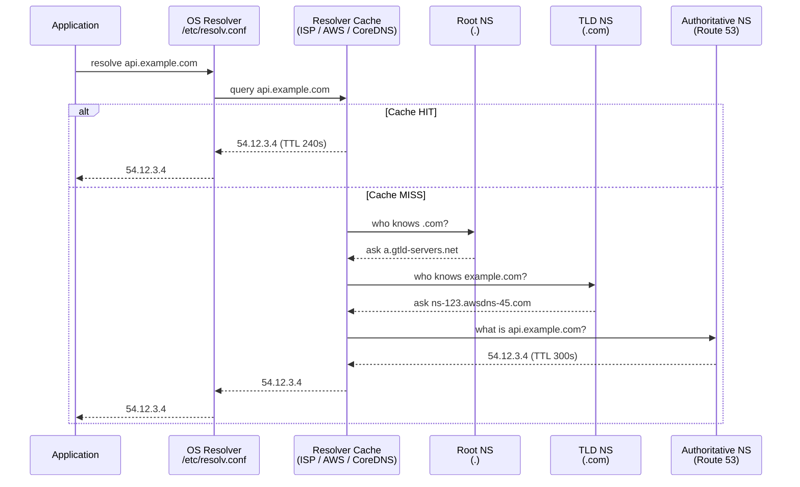
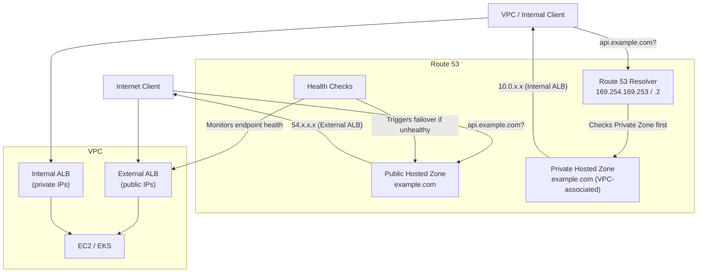
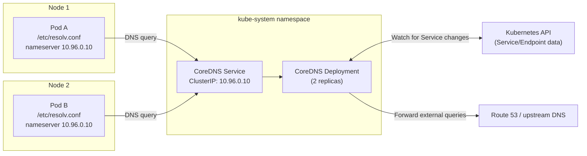
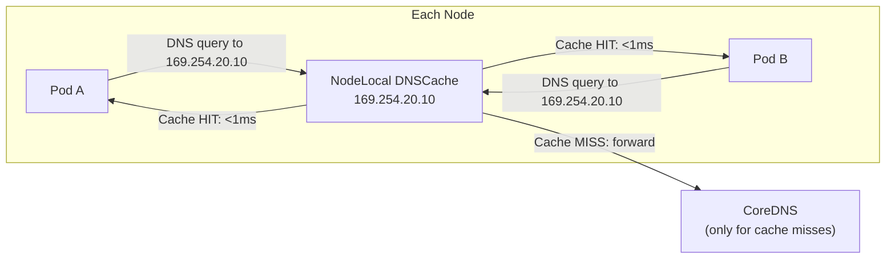
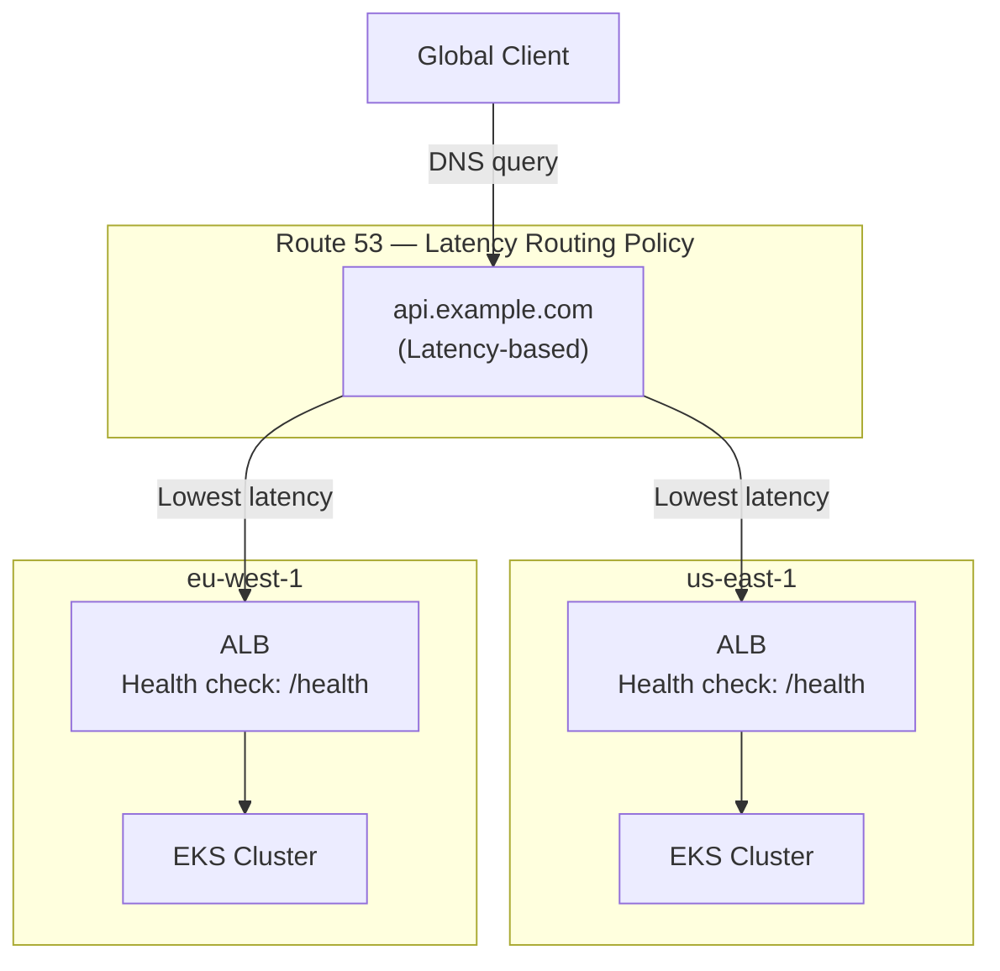

# DNS Deep Dive: Resolution, Failures, CoreDNS, and Route 53

> Part 2 of the series: *"Networking for DevOps and Cloud Architects: From Packets to Production"*
>
> Prerequisites: [Part 1 — Networking Fundamentals](./01-networking-fundamentals.md)

---

## Table of Contents

- [Why This Matters](#why-this-matters)
- [Mental Model](#mental-model)
- [Core Concepts](#core-concepts)
- [How It Works in Real Production Systems](#how-it-works-in-real-production-systems)
- [End-to-End Resolution Flow](#end-to-end-resolution-flow)
- [Common Failure Patterns](#common-failure-patterns)
- [Commands Every Engineer Should Know](#commands-every-engineer-should-know)
- [AWS / Route 53 Angle](#aws--route-53-angle)
- [Kubernetes / CoreDNS Angle](#kubernetes--coredns-angle)
- [Troubleshooting Framework](#troubleshooting-framework)
- [Senior Engineer Interview Explanation](#senior-engineer-interview-explanation)
- [Production Checklist](#production-checklist)
- [Key Takeaways](#key-takeaways)

---

## Why This Matters

DNS is the first thing that runs and the first thing that breaks. Every request your system makes — to an external API, a database, an internal microservice, an S3 bucket — starts with a DNS resolution. If that resolution fails, times out, or returns stale data, nothing else matters. The downstream system could be perfectly healthy, and your service still dies.

What makes DNS incidents particularly brutal:

- **They're invisible in application logs.** Most apps log `connection refused to payments-api.internal` — not `DNS resolution failed for payments-api.internal`. Engineers chase the wrong layer.
- **They're intermittent.** UDP packet loss, flapping nameservers, and TTL timing create failures that appear random and disappear before anyone can reproduce them.
- **They cascade.** One CoreDNS pod getting OOMKilled in a Kubernetes cluster can make hundreds of pods unable to resolve any service name — regardless of whether the services themselves are healthy.
- **They hide in plain sight.** DNS caches stale records. You update a record, restart the service, and it still hits the old IP — because a resolver cached it for 300 more seconds.

**Real incident shapes:**

- EKS deployment succeeds, but new pods can't talk to RDS: DNS resolution in CoreDNS queued behind a flood of external queries generated by the `ndots:5` search domain expansion.
- Blue/green cutover: Route 53 record updated, but 20% of users still hit the old stack for 15 minutes because their ISP's resolver ignored your TTL.
- Certificate renewal on a new IP: app connects to the cached old IP, gets a TLS handshake failure, engineers spend 2 hours suspecting TLS when it's DNS.

DNS is not infrastructure you deploy and forget. It is a live system that requires the same operational rigor as compute or storage.

---

## Mental Model

**Think of DNS as a distributed, hierarchical, eventually-consistent phonebook with caching at every layer.**

- **Distributed:** No single server holds all records. Authority is delegated across thousands of nameservers worldwide.
- **Hierarchical:** The tree starts at the root (`.`), branches through TLDs (`.com`, `.io`), then domains (`example.com`), then subdomains.
- **Eventually consistent:** When you update a record, it doesn't propagate instantly. Every resolver that cached the old answer keeps serving it until TTL expires. There is no "flush all DNS" button on the internet.
- **Caching at every layer:** OS resolver cache, application-level cache (JVM, Go net package), corporate DNS resolver, ISP resolver, each with its own TTL clock.

The operational implication: **DNS changes are not instantaneous.** Plan for TTL. Lower it before changes. Raise it after.

---

## Core Concepts

### 1. The DNS Hierarchy

```
.                          ← Root zone (13 root server clusters)
├── com.                   ← TLD nameserver (Verisign for .com)
│   └── example.com.       ← Authoritative nameserver (you or Route 53)
│       ├── api.example.com
│       └── db.example.com
├── io.
└── internal.              ← Private / split-horizon
```

**The root zone** is served by 13 named root server clusters (a.root-servers.net through m.root-servers.net), each anycast to hundreds of physical nodes worldwide. You've never directly queried them manually, but every cold DNS resolution starts there.

**Delegation** is how the hierarchy works. The root knows which servers are authoritative for `.com`. Those servers know which are authoritative for `example.com`. `example.com`'s nameservers know the actual records. Each step is a referral, not a full answer.

---

### 2. Resolution Types

| Type | Description | Who does it |
|------|-------------|-------------|
| **Recursive** | Resolver does all the work, returns final answer | Resolvers (Route 53, 8.8.8.8, CoreDNS) |
| **Iterative** | Each server gives the next referral, client follows | Root/TLD servers respond iteratively |
| **Authoritative** | Server holds the actual zone, gives definitive answer | Route 53, BIND, PowerDNS |

When your application queries DNS, it talks to a **recursive resolver**. The resolver does iterative queries on your behalf, caches results, and returns the final answer. Your app never talks to root servers directly.

---

### 3. The Resolution Chain in Detail



**The cache hit path is why DNS is fast.** Most queries never reach root or TLD servers — the recursive resolver has a cached answer. The cache miss path (full resolution) typically takes 50–300ms. The cache hit path takes 1–5ms.

**Why this matters operationally:** During your first deployment in a new environment, every DNS query is a cache miss. Under heavy startup load (many pods launching simultaneously), this creates a resolver spike. This is one reason CoreDNS needs proper resource limits and autoscaling — not for steady-state traffic, but for burst.

---

### 4. DNS Record Types — The Ones That Matter

**A Record** — maps hostname to IPv4 address

```
api.example.com.    300    IN    A    54.12.3.4
```

One hostname can have multiple A records. Resolvers may return them in different orders (round-robin DNS). This is not real load balancing — clients cache the first IP and reuse it until TTL expires. Don't rely on DNS round-robin for load distribution.

**CNAME Record** — maps hostname to another hostname

```
api.example.com.    300    IN    CNAME    my-alb-1234.us-east-1.elb.amazonaws.com.
```

A CNAME chain means multiple resolution steps. A common mistake: pointing your apex domain (`example.com`, no subdomain) to a CNAME. The DNS spec forbids CNAMEs at zone apex because the apex needs SOA and NS records, which cannot coexist with a CNAME. Route 53 solves this with **Alias records** (not a real CNAME, resolves at the Route 53 level to the current A record of the target).

**MX Record** — mail exchanger, not relevant for application networking but you'll see it

**TXT Record** — arbitrary text. Used for: domain ownership verification, SPF (email authentication), DKIM public keys, ACME DNS-01 challenge (Let's Encrypt certificate issuance)

**NS Record** — delegates a zone to specific nameservers

```
example.com.    172800    IN    NS    ns-123.awsdns-45.com.
```

If your NS records are wrong after a domain transfer, **nothing works**. The internet can't find your authoritative nameserver.

**SRV Record** — service location record with port and priority

```
_grpc._tcp.my-service.    60    IN    SRV    0 5 50051 grpc-backend.example.com.
```

Used by gRPC for service discovery, Kubernetes for some internal resolution, and various service meshes. Rarely configured manually in cloud environments.

**PTR Record** — reverse DNS. Maps IP to hostname. Used for: email deliverability (mail servers verify PTR), some security tooling, human-readable logs. AWS assigns PTR records for EC2 instances by default (`ip-10-0-1-5.ec2.internal`).

---

### 5. TTL — The Most Misunderstood DNS Concept

TTL (Time to Live) is set by the **zone owner** (you) on each record. It tells resolvers how long to cache the answer.

**The math that catches engineers off-guard:**

If `api.example.com` has a TTL of 300s and a resolver cached it 4 minutes ago, that resolver will serve the stale IP for another 60 seconds after you update the record. Users whose resolver cached it 1 second ago will see stale data for 299 more seconds.

**Maximum blast radius of a DNS change = TTL at time of change.**

This is why the playbook for DNS migrations is:

```
1. Weeks before: lower TTL to 60s
2. Verify low TTL is propagated (dig +short api.example.com → check TTL returned)
3. Make the DNS change
4. Monitor for 5 minutes
5. If good: raise TTL back to 300s+
6. If bad: revert (change takes ~60s to propagate due to low TTL)
```

**Default TTLs by environment:**

| Environment | Recommended TTL | Reasoning |
|-------------|-----------------|-----------|
| Production stable records | 300–3600s | Balance between caching and flexibility |
| Records involved in failover | 60s | Fast convergence during incidents |
| Pre-migration window | 60s | Fast rollback window |
| Records that never change | 3600–86400s | Reduce resolver load |
| Kubernetes internal (CoreDNS) | 5–30s | Pods change frequently |

---

### 6. Search Domains and ndots — The Kubernetes DNS Multiplier

This concept breaks production clusters at scale and is not taught in basic DNS courses.

In Linux, `/etc/resolv.conf` controls DNS behavior:

```
nameserver 10.96.0.10
search default.svc.cluster.local svc.cluster.local cluster.local ec2.internal
options ndots:5
```

`ndots:5` means: *if the query name has fewer than 5 dots, try appending each search domain before trying the name as-is.*

For a query to `my-service` (0 dots):
```
my-service.default.svc.cluster.local   → hit CoreDNS → answer found ✓
```

For a query to `api.stripe.com` (2 dots, fewer than 5):
```
api.stripe.com.default.svc.cluster.local  → NXDOMAIN
api.stripe.com.svc.cluster.local          → NXDOMAIN
api.stripe.com.cluster.local              → NXDOMAIN
api.stripe.com.ec2.internal               → NXDOMAIN
api.stripe.com.                           → answer found ✓  (5th query)
```

**Five DNS queries to reach one external API.** A service making 1,000 requests/second to an external API generates 5,000 DNS queries/second — 4,000 of which are wasted NXDOMAIN lookups hitting CoreDNS.

At around 500–1,000 req/s per service, this becomes measurable. At 5,000+ req/s, CoreDNS starts dropping queries under load and you see intermittent DNS timeouts *across the entire cluster* — for internal and external names alike.

**Fixes:**

1. **Use FQDNs with trailing dot:** `api.stripe.com.` — skips search domain expansion entirely
2. **Set `dnsConfig` on pods** that make heavy external calls:
   ```yaml
   spec:
     dnsConfig:
       options:
       - name: ndots
         value: "2"
   ```
3. **Deploy NodeLocal DNSCache** — caches DNS on each node, dramatically reduces CoreDNS load

---

### 7. Split-Horizon DNS

Split-horizon (or split-brain DNS) serves different answers for the same query depending on where the query comes from.

**Classic pattern:**

| Source | Query | Answer |
|--------|-------|--------|
| Internet | `api.example.com` | `54.12.3.4` (ALB public IP) |
| VPC / internal | `api.example.com` | `10.0.5.100` (internal ALB IP) |

**Why you need it:** Without split-horizon, internal services querying `api.example.com` take a path: internal → internet → back to your ALB → back into your VPC. This is called **hairpinning**. It adds latency, consumes NAT Gateway bandwidth, and is fragile.

**How Route 53 implements it:** Route 53 Private Hosted Zones. Create a private hosted zone for `example.com`, associate it with your VPC, and create records that resolve to internal IPs. The public `example.com` hosted zone continues to serve public IPs. Queries from within the VPC hit the private zone first.

**The gotcha:** You must keep private and public zones in sync for records that exist in both. A common mistake: adding a new service to the public zone but forgetting the private zone. Internal services then hairpin over the internet.

---

### 8. Negative Caching — The Silent Failure

When a name doesn't exist, resolvers cache that negative response too. The duration is controlled by the **SOA record's minimum TTL** (or the negative TTL in RFC 2308).

**The failure scenario:**

1. Your service starts, tries to resolve `payments-svc.default.svc.cluster.local`
2. CoreDNS returns `NXDOMAIN` — the Service object doesn't exist yet
3. The pod caches `NXDOMAIN`
4. You create the Service
5. Pod keeps getting `NXDOMAIN` for the cached duration (typically 5–30s in Kubernetes)
6. In applications with retry logic, this self-heals. In applications without it, the connection fails and the pod crashes or returns errors.

This is why deployment order matters: create the Service before the pods that depend on it.

---

## How It Works in Real Production Systems

### Route 53 in AWS Architecture

Route 53 plays multiple roles simultaneously:



**Route 53 Resolver** is the DNS resolver AWS provides to every VPC at the `.2` address of the VPC CIDR (`10.0.0.2` for a `10.0.0.0/16` VPC) and also at `169.254.169.253`. It handles:

- Resolving public DNS names (via internet)
- Resolving Route 53 public and private hosted zones
- Resolving internal EC2 names (`ip-10-0-1-5.ec2.internal`)

**Inbound and Outbound Resolver Endpoints** enable hybrid DNS:

- **Inbound endpoint:** On-premises DNS can forward queries to Route 53 (to resolve AWS private zones)
- **Outbound endpoint:** Route 53 can forward queries to on-premises DNS (to resolve corporate hostnames from AWS)

This is the standard pattern for hybrid cloud connectivity. If your EKS pods need to resolve `db.corp.internal` (an on-premises hostname), you configure a Resolver forwarding rule pointing that domain to your on-premises DNS server IPs.

---

### DNS Routing Policies in Route 53

Route 53 is not just a DNS server — it's a traffic management layer. Understanding when to use each policy prevents over-engineering.

| Policy | Behavior | Use case |
|--------|----------|----------|
| **Simple** | Returns one or more records | Single backend, no failover |
| **Weighted** | Distributes by percentage | Canary deployments, A/B testing |
| **Latency** | Routes to lowest-latency region | Multi-region active-active |
| **Failover** | Primary/standby with health check | DR, active-passive setups |
| **Geolocation** | Routes by query origin country | Data residency, regional content |
| **Geoproximity** | Routes by geographic proximity with bias | Fine-grained global routing |
| **Multivalue** | Returns up to 8 healthy records | Client-side LB, simple redundancy |
| **IP-based** | Routes by client CIDR | Office routing, network-based segmentation |

**Weighted routing for canary deployments** is a legitimate use case: set 95% weight on the stable stack, 5% on the canary. DNS-level canary works well for services where you don't have a smart load balancer in front. The limitation: TTL means you can't instantly shift 100% of traffic. Always pair with a low TTL (60s) when using DNS for traffic shifting.

**Health checks are mandatory with Failover routing.** Route 53 health checks probe your endpoints every 10–30 seconds from multiple AWS edge locations. A record is only returned in DNS responses if the health check passes. Without health checks, failover routing doesn't automatically failover — the primary record keeps being served even if the backend is down.

> Health check gotcha: Route 53 health check IPs come from a [published CIDR range](https://ip-ranges.amazonaws.com/ip-ranges.json). Your ALB security groups or firewall must allow inbound traffic from these IPs. If you block them, Route 53 marks your endpoint unhealthy and stops routing traffic to it — even though it's perfectly healthy.

---

### CoreDNS in Kubernetes/EKS

CoreDNS is the cluster DNS server. It runs as a Deployment (typically 2 replicas) in `kube-system`, exposed via a ClusterIP Service (usually `10.96.0.10`). Every pod's `/etc/resolv.conf` points to this address.



**CoreDNS Corefile** — the configuration that controls behavior:

```
.:53 {
    errors
    health {
       lameduck 5s
    }
    ready
    kubernetes cluster.local in-addr.arpa ip6.arpa {
       pods insecure
       fallthrough in-addr.arpa ip6.arpa
       ttl 30
    }
    prometheus :9153
    forward . /etc/resolv.conf {
       max_concurrent 1000
    }
    cache 30
    loop
    reload
    loadbalance
}
```

Key directives:

- `kubernetes cluster.local` — CoreDNS watches Kubernetes API and resolves `<service>.<namespace>.svc.cluster.local`
- `forward . /etc/resolv.conf` — all non-cluster queries are forwarded to the upstream resolver (Route 53 at `10.0.0.2`)
- `cache 30` — cache responses for 30 seconds (reduces upstream queries)
- `max_concurrent 1000` — max simultaneous forwarded queries; if this is hit, queries are dropped

**The `max_concurrent` limit** is a frequent silent failure. Under ndots load, CoreDNS queues external forwarded queries. Once `max_concurrent` is hit, new queries are dropped without error — the pod just times out waiting. Increase this value and watch the `coredns_forward_requests_total` metric.

---

### NodeLocal DNSCache

NodeLocal DNSCache is a DaemonSet that runs a local DNS cache on every node. Pods are redirected to `169.254.20.10` (a link-local address) instead of CoreDNS.



**Benefits:**
- Reduces CoreDNS load by 80–90% in typical clusters
- Eliminates conntrack table contention (UDP queries through iptables create conntrack entries; NodeLocal uses TCP to CoreDNS, avoiding this at scale)
- Local cache means faster resolution for repeated queries

**Deploy NodeLocal DNSCache when:** your cluster has >30 nodes, or any service makes >200 external DNS queries/second.

---

## End-to-End Resolution Flow

**Scenario: EKS pod sends an HTTP request to `https://api.stripe.com/v1/charges`**

```
┌────────────────────────────────────────────────────────────────────────────┐
│ Step 1: Application calls getaddrinfo("api.stripe.com")                   │
│                                                                            │
│  Go/Python/JVM DNS resolver reads /etc/resolv.conf:                       │
│    nameserver 169.254.20.10  (NodeLocal DNSCache, if deployed)            │
│    nameserver 10.96.0.10     (CoreDNS ClusterIP)                          │
│    search default.svc.cluster.local svc.cluster.local cluster.local       │
│    options ndots:5                                                         │
│                                                                            │
│  "api.stripe.com" has 2 dots < 5 → search domain expansion kicks in       │
└────────────────────────────────────────────────────────────────────────────┘
                  │
                  ▼
┌────────────────────────────────────────────────────────────────────────────┐
│ Step 2: Query 1 — api.stripe.com.default.svc.cluster.local               │
│                                                                            │
│  NodeLocal DNSCache → cache miss → forward to CoreDNS                    │
│  CoreDNS → kubernetes plugin → checks Service cache → NXDOMAIN           │
│  Response: NXDOMAIN (cached for SOA minimum TTL ~5s)                      │
└────────────────────────────────────────────────────────────────────────────┘
                  │
                  ▼
┌────────────────────────────────────────────────────────────────────────────┐
│ Steps 3–4: Queries 2–4 for remaining search domains                       │
│                                                                            │
│  api.stripe.com.svc.cluster.local    → NXDOMAIN                          │
│  api.stripe.com.cluster.local        → NXDOMAIN                          │
│  (No ec2.internal in EKS by default — depends on kubelet config)          │
└────────────────────────────────────────────────────────────────────────────┘
                  │
                  ▼
┌────────────────────────────────────────────────────────────────────────────┐
│ Step 5: Query 5 — api.stripe.com. (absolute)                              │
│                                                                            │
│  CoreDNS → forward plugin → Route 53 Resolver (10.0.0.2)                 │
│  Route 53 → authoritative NS for stripe.com                               │
│  Returns: 104.18.12.67, 104.18.13.67 (TTL 300s)                          │
└────────────────────────────────────────────────────────────────────────────┘
                  │
                  ▼
┌────────────────────────────────────────────────────────────────────────────┐
│ Step 6: TCP + TLS to 104.18.12.67:443                                     │
│                                                                            │
│  EKS pod ephemeral IP → Security Group outbound check → pass              │
│  NAT Gateway (private subnet) → Elastic IP → internet                     │
│  TCP SYN → SYN-ACK → ACK                                                 │
│  TLS handshake → certificate for *.stripe.com verified                    │
│  HTTP/2 request dispatched                                                 │
└────────────────────────────────────────────────────────────────────────────┘
                  │
                  ▼
┌────────────────────────────────────────────────────────────────────────────┐
│ Step 7: Response + Caching                                                 │
│                                                                            │
│  HTTP 200 response received                                                │
│  NodeLocal DNSCache stores api.stripe.com → 104.18.12.67 for 300s        │
│  Next request from any pod on this node → cache hit, 0 upstream queries   │
└────────────────────────────────────────────────────────────────────────────┘
```

**The fix if this is too slow:** Set `ndots: 2` in pod dnsConfig, or use `api.stripe.com.` (FQDN with trailing dot). Eliminates 4 wasted queries.

---

**Scenario: Internal service-to-service resolution (`payment-svc` → `user-svc`)**

```
┌──────────────────────────────────────────────────────────────────────────┐
│ Pod queries: user-svc.default.svc.cluster.local                         │
│ (This is how Kubernetes fully-qualified internal names work)             │
└──────────────────────────────────────────────────────────────────────────┘
                 │
                 ▼
┌──────────────────────────────────────────────────────────────────────────┐
│ NodeLocal DNSCache → cache miss on first query                          │
│ Forward to CoreDNS                                                       │
└──────────────────────────────────────────────────────────────────────────┘
                 │
                 ▼
┌──────────────────────────────────────────────────────────────────────────┐
│ CoreDNS kubernetes plugin:                                               │
│   Watches Kubernetes API for Service objects                             │
│   Finds: user-svc in namespace default                                   │
│   ClusterIP: 10.96.45.200                                                │
│   Returns A record: user-svc.default.svc.cluster.local → 10.96.45.200  │
└──────────────────────────────────────────────────────────────────────────┘
                 │
                 ▼
┌──────────────────────────────────────────────────────────────────────────┐
│ Pod connects to ClusterIP 10.96.45.200:8080                             │
│ iptables DNAT rule (kube-proxy) → one of the endpoint pod IPs           │
│ Request arrives at user-svc pod                                          │
└──────────────────────────────────────────────────────────────────────────┘
```

---

## Common Failure Patterns

### Failure 1: NXDOMAIN for a Service That Exists

**Symptom:** `nslookup: can't resolve 'my-service'` or `dial tcp: lookup my-service: no such host` inside a pod

**Likely causes:**
- Service doesn't exist in the queried namespace — pod is in `staging`, service is in `production`
- Query is for short name (`my-service`) but service is in a different namespace — short names only search the pod's own namespace
- CoreDNS pod is down or restarting
- Service selector doesn't match pod labels (Service exists, but endpoints are empty — though this isn't DNS, it manifests similarly)

**Verify:**
```bash
# Check if the service exists in the correct namespace
kubectl get svc -A | grep my-service

# Test DNS from inside the pod with full FQDN
kubectl exec -it <pod> -- nslookup my-service.production.svc.cluster.local

# Check CoreDNS health
kubectl get pods -n kube-system -l k8s-app=kube-dns
kubectl logs -n kube-system -l k8s-app=kube-dns --tail=30
```

**Fix:** Use fully qualified service names (`<service>.<namespace>.svc.cluster.local`) in cross-namespace calls. Fix namespace, or ensure the Service exists and is correctly labelled.

---

### Failure 2: Intermittent DNS Timeouts Under Load

**Symptom:** Occasional 5-second delays on requests, random `context deadline exceeded` errors in logs, more frequent under traffic spikes

**Likely causes:**
- ndots:5 search domain expansion flooding CoreDNS with NXDOMAIN queries
- CoreDNS `max_concurrent` limit hit — queries are being dropped
- CoreDNS pods are memory-constrained and being throttled or OOMKilled
- No NodeLocal DNSCache, all pods share two CoreDNS pods

**Verify:**
```bash
# Check CoreDNS resource usage
kubectl top pods -n kube-system -l k8s-app=kube-dns

# Check for OOMKilled
kubectl describe pods -n kube-system -l k8s-app=kube-dns | grep -A5 "Last State"

# Check CoreDNS metrics (if Prometheus is available)
# coredns_dns_requests_total
# coredns_forward_requests_total
# coredns_dns_responses_total{rcode="NXDOMAIN"}

# Measure DNS latency from inside a pod
kubectl exec -it <pod> -- time nslookup api.stripe.com
```

**Fix:**
1. Increase CoreDNS replicas and resource limits
2. Deploy NodeLocal DNSCache
3. Set `ndots: 2` on pods making heavy external calls
4. Increase `max_concurrent` in CoreDNS Corefile

---

### Failure 3: DNS Caching Stale Records After Migration

**Symptom:** After updating a Route 53 record, some clients still reach the old IP for minutes or hours

**Likely causes:**
- TTL was set high (e.g., 3600s) before the change
- ISP resolver ignoring TTL (some do — it's a known problem with certain large ISP resolvers)
- Application-level DNS cache (JVM caches DNS aggressively by default: `networkaddress.cache.ttl=60` in JVM security properties)
- CDN edge caching the DNS record

**Verify:**
```bash
# Check what TTL your record currently has from multiple resolvers
dig @8.8.8.8 api.example.com     # Google
dig @1.1.1.1 api.example.com     # Cloudflare
dig @10.0.0.2 api.example.com    # Route 53 (from inside VPC)

# Check what answer different resolvers return (should match new IP)
# TTL value in answer decrements — check it's going down, not stuck
```

**Fix:**
- Can't fix past caching — wait for TTL to expire
- For JVM: set `networkaddress.cache.ttl=10` and `networkaddress.cache.negative.ttl=0` in JVM security config
- For future migrations: lower TTL days before the change, not minutes before

---

### Failure 4: Route 53 Health Check Marks Healthy Endpoint as Unhealthy

**Symptom:** Failover routing kicks in, traffic goes to secondary, but primary is actually healthy

**Likely causes:**
- Route 53 health check IPs not allowed in security group rules
- Health check path returns non-2xx for internal reasons (maintenance mode, DB connection issue)
- Health check using HTTPS but certificate mismatch
- Health check threshold too sensitive (fails on 1 check instead of 3)

**Verify:**
```bash
# Get Route 53 health checker IP ranges
curl -s https://ip-ranges.amazonaws.com/ip-ranges.json | \
  python3 -c "import sys,json; [print(p['ip_prefix']) for p in json.load(sys.stdin)['prefixes'] if p['service']=='ROUTE53_HEALTHCHECKS']"

# Test health check endpoint manually
curl -v https://api.example.com/health

# Check health check status in AWS console or CLI
aws route53 get-health-check-status --health-check-id <id>
```

**Fix:** Allow Route 53 health checker CIDRs in security group. Fix health check endpoint. Tune failure threshold.

---

### Failure 5: Split-Horizon DNS Not Working — Hairpinning Over Internet

**Symptom:** Internal service-to-service calls are routed over the internet (visible in NAT Gateway metrics, high latency), even though an internal endpoint exists

**Likely causes:**
- Private hosted zone not associated with the querying VPC
- Private hosted zone has the same name as public zone but doesn't have the record
- EC2 instance attribute `enableDnsSupport` or `enableDnsHostnames` not enabled on VPC

**Verify:**
```bash
# From inside VPC - check which IP is returned
dig api.example.com

# Expected: internal IP (10.x.x.x)
# Bad: public IP (hairpinning) or NXDOMAIN

# Check private hosted zone VPC associations
aws route53 list-vpc-association-authorizations --hosted-zone-id <private-zone-id>

# Check VPC DNS attributes
aws ec2 describe-vpc-attribute \
  --vpc-id vpc-xxxx \
  --attribute enableDnsSupport

aws ec2 describe-vpc-attribute \
  --vpc-id vpc-xxxx \
  --attribute enableDnsHostnames
```

**Fix:** Associate the private hosted zone with the correct VPC. Ensure VPC has `enableDnsSupport: true`. Add missing records to the private zone.

---

### Failure 6: CoreDNS Loop — Crash Loop on Startup

**Symptom:** CoreDNS pods in `CrashLoopBackOff` with error: `Loop (127.0.0.1:PORT -> :53) detected for zone "."` 

**Cause:** The node's `/etc/resolv.conf` points to `127.0.0.1` or `127.0.0.53` (common on Ubuntu 18.04+ using systemd-resolved). CoreDNS reads this as its upstream forwarder, tries to forward queries to localhost, which hits CoreDNS itself — infinite loop.

**Verify:**
```bash
# Check node's /etc/resolv.conf
cat /etc/resolv.conf

# If it shows 127.0.0.53 or 127.0.0.1 → this is the problem
```

**Fix:** Add the `loop` detection plugin (already in default CoreDNS config — it catches this). Use `resolvConf` in kubelet config to point to `/run/systemd/resolve/resolv.conf` instead of `/etc/resolv.conf`. This is a known issue in EKS with Ubuntu worker node AMIs.

---

## Commands Every Engineer Should Know

### `dig` — The Primary DNS Debugging Tool

```bash
# Basic A record lookup
dig api.example.com

# Query specific record type
dig MX example.com
dig TXT example.com
dig NS example.com

# Query a specific resolver (bypass OS cache)
dig @8.8.8.8 api.example.com
dig @10.0.0.2 api.example.com    # Route 53 resolver from VPC

# Full resolution trace (shows each delegation step)
dig +trace api.example.com

# Short output — just the IP
dig +short api.example.com

# Check TTL remaining in resolver cache
dig api.example.com | grep -A2 "ANSWER SECTION"

# Query CoreDNS directly from inside a pod
dig @10.96.0.10 my-service.default.svc.cluster.local

# Check if DNSSEC is valid
dig +dnssec api.example.com
```

**What to look for:**

```
;; ANSWER SECTION:
api.example.com.    243    IN    A    54.12.3.4
                    ^^^
                    TTL remaining in this resolver's cache
                    If this is near 0, it will re-query soon
                    If it's stuck at the full TTL, the cache is fresh
```

**AUTHORITY SECTION** present → answer came from an authoritative nameserver (not cache)
**No AUTHORITY SECTION** → answer from resolver cache

`dig +trace` shows every delegation hop. When a domain change isn't propagating, `+trace` shows you exactly which nameserver is returning stale data — and its TTL.

---

### `nslookup` — Quick Lookups, Legacy but Everywhere

```bash
# Basic lookup
nslookup api.example.com

# Query specific server
nslookup api.example.com 8.8.8.8

# Reverse lookup (IP to hostname)
nslookup 54.12.3.4
```

`dig` is strictly better — use `nslookup` when `dig` isn't installed (common in minimal container images).

---

### `resolvectl` / `systemd-resolve` — Modern Linux DNS State

```bash
# Show current DNS configuration and statistics
resolvectl status

# Show DNS cache for a domain
resolvectl query api.example.com

# Flush DNS cache (use carefully in production)
resolvectl flush-caches

# Show per-interface DNS servers
resolvectl dns
```

---

### `curl` with DNS Timing

```bash
# Isolate DNS resolution time
curl -w "DNS: %{time_namelookup}s\nConnect: %{time_connect}s\nTotal: %{time_total}s\n" \
     -o /dev/null -s https://api.example.com/health

# Force a specific IP (bypass DNS entirely — useful for testing)
curl --resolve api.example.com:443:54.12.3.4 https://api.example.com/health

# Use a different DNS server for resolution
curl --dns-servers 8.8.8.8 https://api.example.com/health
```

**`--resolve`** is your most powerful DNS debugging tool in curl. If the request works with `--resolve` but fails normally, the problem is definitively DNS. This also lets you test a new IP before updating DNS.

---

### `tcpdump` — Capture DNS Traffic

```bash
# Capture all DNS traffic (UDP 53 and TCP 53)
tcpdump -i any -nn 'port 53'

# Capture DNS on a pod's network namespace
# First get the pod's container ID
kubectl get pod <pod-name> -o jsonpath='{.status.containerStatuses[0].containerID}'

# Run tcpdump in the pod's network namespace
nsenter -t <PID> -n -- tcpdump -nn port 53

# Save for analysis
tcpdump -i any -nn -w /tmp/dns.pcap 'port 53'
```

**What you'll see with ndots flooding:**
```
10.0.1.5.52431 > 10.96.0.10.53: A? api.stripe.com.default.svc.cluster.local.
10.96.0.10.53 > 10.0.1.5.52431: NXDomain 0/1/0
10.0.1.5.52432 > 10.96.0.10.53: A? api.stripe.com.svc.cluster.local.
10.96.0.10.53 > 10.0.1.5.52432: NXDomain 0/1/0
```

If you see this pattern, the ndots problem is confirmed.

---

### Kubernetes DNS Commands

```bash
# Check pod's DNS configuration
kubectl exec -it <pod> -- cat /etc/resolv.conf

# Test DNS resolution from inside pod
kubectl exec -it <pod> -- nslookup kubernetes.default
kubectl exec -it <pod> -- nslookup my-service.my-namespace.svc.cluster.local

# Run an ephemeral debug pod with DNS tools
kubectl run dns-debug --image=tutum/dnsutils --rm -it --restart=Never -- bash
# or
kubectl run dns-debug --image=busybox:1.28 --rm -it --restart=Never -- nslookup kubernetes.default

# Check CoreDNS configuration
kubectl get configmap coredns -n kube-system -o yaml

# Check CoreDNS metrics endpoint
kubectl port-forward -n kube-system svc/kube-dns 9153:9153
curl localhost:9153/metrics | grep coredns_dns

# Check NodeLocal DNSCache status (if deployed)
kubectl get pods -n kube-system -l k8s-app=node-local-dns

# Verify CoreDNS endpoints
kubectl get endpoints kube-dns -n kube-system
```

---

### AWS CLI for DNS

```bash
# List all hosted zones
aws route53 list-hosted-zones

# List records in a hosted zone
aws route53 list-resource-record-sets \
  --hosted-zone-id <zone-id> \
  --query 'ResourceRecordSets[*].{Name:Name,Type:Type,TTL:TTL}'

# Get resolver rules
aws route53resolver list-resolver-rules

# Get resolver endpoints (inbound/outbound)
aws route53resolver list-resolver-endpoints

# Check health check status
aws route53 get-health-check-status --health-check-id <id>

# Get VPC associations for a private hosted zone
aws route53 list-vpc-association-authorizations \
  --hosted-zone-id <private-zone-id>
```

---

## AWS / Route 53 Angle

### Choosing Between CNAME and Alias Records

This is one of the most common Route 53 configuration mistakes:

| Feature | CNAME | Alias |
|---------|-------|-------|
| Works at zone apex (`example.com`) | No | Yes |
| DNS query cost | Yes (chargeable) | No (resolves internally) |
| Supports health checks | Limited | Yes (for supported targets) |
| Valid targets | Any hostname | AWS resources only |
| TTL | Configurable | Set by AWS |

**Always use Alias records** when pointing to ALBs, CloudFront distributions, S3 static sites, or other Route 53 records. It resolves to the actual A record values at Route 53 before returning the answer — no extra DNS round-trip, no query cost, works at zone apex.

---

### Route 53 for Multi-Region Active-Active



**Operational requirement:** Each target must have a Route 53 health check. If `us-east-1` ALB fails health checks, Route 53 stops returning that record and all traffic routes to `eu-west-1`. This is DNS-level failover, not instant — clients respect TTL.

**Critical:** Set TTL to 60s for latency-routed records in active-active. At 300s TTL, a region failure takes 5 minutes to fully drain (clients cached the failing IP keep hitting it until TTL expires).

---

### VPC DNS Settings — The Two Flags That Break Everything

Two VPC attributes control whether AWS DNS works at all:

```bash
# Check current settings
aws ec2 describe-vpc-attribute --vpc-id vpc-xxxx --attribute enableDnsSupport
aws ec2 describe-vpc-attribute --vpc-id vpc-xxxx --attribute enableDnsHostnames

# Enable (required for Route 53 private zones and EC2 DNS names)
aws ec2 modify-vpc-attribute --vpc-id vpc-xxxx --enable-dns-support
aws ec2 modify-vpc-attribute --vpc-id vpc-xxxx --enable-dns-hostnames
```

- `enableDnsSupport`: Enables the Route 53 Resolver at `<VPC-CIDR-base>.2`. **Must be true** for any DNS to work in the VPC.
- `enableDnsHostnames`: Assigns public DNS hostnames to EC2 instances with public IPs. Required for private hosted zones to work correctly.

Disabling these — or having them off in a new VPC you didn't create — is the root cause of many "DNS completely broken in VPC" incidents.

---

## Kubernetes / CoreDNS Angle

### The Kubernetes DNS Naming Spec

Kubernetes enforces a DNS naming convention for all Services:

```
<service-name>.<namespace>.svc.<cluster-domain>
```

Default cluster domain is `cluster.local`. Full FQDNs for standard services:

```
# ClusterIP service
my-api.production.svc.cluster.local

# Headless service (returns pod IPs, not ClusterIP)
my-db.production.svc.cluster.local

# Specific pod in a StatefulSet via headless service
my-db-0.my-db.production.svc.cluster.local
my-db-1.my-db.production.svc.cluster.local

# ExternalName service (CNAME to external hostname)
# Creates: payment-api.production.svc.cluster.local → CNAME → api.stripe.com
```

**StatefulSet pod DNS** is one of the most useful but underused Kubernetes features. When you create a StatefulSet with a headless service, each pod gets a stable, predictable DNS name. Your application code can hardcode `redis-0.redis.production.svc.cluster.local` for the Redis primary and `redis-1...` for replica. This is how production Redis, Kafka, and Zookeeper setups in Kubernetes maintain pod identity.

---

### CoreDNS Custom Forwarding Rules

Scenario: your Kubernetes cluster needs to resolve `db.corp.internal` (an on-premises hostname). Add a custom forwarding stub zone to the CoreDNS Corefile:

```
corp.internal:53 {
    errors
    cache 30
    forward . 10.20.1.53 10.20.1.54    # On-premises DNS server IPs
}
```

After editing the ConfigMap, CoreDNS automatically reloads (the `reload` plugin watches the Corefile for changes).

```bash
# Edit CoreDNS config
kubectl edit configmap coredns -n kube-system

# Verify reload (CoreDNS logs show reload)
kubectl logs -n kube-system -l k8s-app=kube-dns --tail=20 | grep -i reload

# Test the custom zone
kubectl exec -it <pod> -- nslookup db.corp.internal
```

---

### Configuring dnsConfig per Pod/Deployment

For workloads that make heavy external DNS calls, reduce ndots per pod:

```yaml
apiVersion: apps/v1
kind: Deployment
metadata:
  name: payment-service
spec:
  template:
    spec:
      dnsConfig:
        options:
        - name: ndots
          value: "2"        # Down from 5 to 2
        - name: single-request-reopen  # Fixes parallel A/AAAA queries bug
      dnsPolicy: ClusterFirst
      containers:
      - name: payment-service
        image: payment-service:latest
```

With `ndots: 2`, the query `api.stripe.com` (2 dots, not fewer than 2) goes directly to the absolute lookup without search domain expansion. Internal service names like `user-svc` (0 dots, fewer than 2) still expand with search domains — so internal resolution still works correctly.

---

## Troubleshooting Framework

### Step 1: What exactly is failing?

Collect the exact error:

| Error | DNS Implication |
|-------|-----------------|
| `no such host` | DNS returned NXDOMAIN or resolution failed |
| `i/o timeout` on port 53 | CoreDNS unreachable or dropping packets |
| `context deadline exceeded` | Slow DNS (ndots, overloaded CoreDNS) |
| `connection refused` | DNS worked; problem is at L4/L7 |
| Works sometimes, fails sometimes | Intermittent DNS — check CoreDNS load |

### Step 2: Can you resolve the name at all?

```bash
# From inside the pod
kubectl exec -it <pod> -- nslookup <hostname>

# Use short name, full FQDN, and with trailing dot
kubectl exec -it <pod> -- nslookup my-service
kubectl exec -it <pod> -- nslookup my-service.default.svc.cluster.local
kubectl exec -it <pod> -- dig api.stripe.com.
```

### Step 3: Which resolver is answering?

```bash
# Check what resolver the pod uses
kubectl exec -it <pod> -- cat /etc/resolv.conf

# Query CoreDNS directly (bypass ndots)
kubectl exec -it <pod> -- dig @10.96.0.10 my-service.default.svc.cluster.local

# Query Route 53 directly (bypass CoreDNS)
kubectl exec -it <node-pod> -- dig @10.0.0.2 api.example.com
```

### Step 4: Is CoreDNS healthy?

```bash
kubectl get pods -n kube-system -l k8s-app=kube-dns
kubectl top pods -n kube-system -l k8s-app=kube-dns
kubectl logs -n kube-system -l k8s-app=kube-dns --tail=50

# Check CoreDNS is responding
kubectl run test --image=busybox --rm -it --restart=Never -- \
  nslookup kubernetes.default 10.96.0.10
```

### Step 5: Is the record correct in the authoritative source?

```bash
# For Kubernetes services
kubectl get svc my-service -n my-namespace
kubectl get endpoints my-service -n my-namespace  # Are pods registered?

# For Route 53
aws route53 list-resource-record-sets \
  --hosted-zone-id <zone-id> \
  --query "ResourceRecordSets[?Name=='api.example.com.']"
```

### Step 6: Are you getting the right answer?

```bash
# Check what IP is returned and from where
dig +short api.example.com                # From your machine
dig @8.8.8.8 +short api.example.com      # From Google resolver
dig @10.0.0.2 +short api.example.com     # From Route 53 inside VPC

# If answers differ → split-horizon DNS, check private hosted zone
```

### Step 7: Is the TTL the problem?

```bash
# Watch TTL countdown
watch -n 5 'dig api.example.com | grep -A2 ANSWER'

# If TTL is stuck at full value → resolver is re-caching
# If TTL is counting down → record will refresh at 0
```

### Step 8: Are logs and metrics telling the same story?

```bash
# CoreDNS error logs
kubectl logs -n kube-system -l k8s-app=kube-dns | grep -i "error\|failed\|refused"

# CoreDNS metrics (if Prometheus available)
kubectl port-forward -n kube-system svc/kube-dns 9153:9153 &
curl -s localhost:9153/metrics | grep -E 'coredns_dns_requests_total|coredns_dns_responses_total'

# Route 53 query logging (enable in Route 53 console → Query Logging → CloudWatch Logs)
aws logs filter-log-events \
  --log-group-name /aws/route53/example.com \
  --filter-pattern "NXDOMAIN" \
  --start-time $(date -d '1 hour ago' +%s000)
```

---

## Senior Engineer Interview Explanation

*If asked "How does DNS work in a Kubernetes cluster, and what are the failure modes you'd watch for?"*

---

"Every pod gets `/etc/resolv.conf` injected by the kubelet pointing to CoreDNS — a Deployment running in kube-system. CoreDNS watches the Kubernetes API for Service objects and answers queries for the `cluster.local` zone. Anything it doesn't know about, it forwards upstream to the VPC DNS resolver.

The default `ndots:5` setting means short hostnames get search domain expansion — a query for `api.stripe.com` actually generates five DNS queries before one reaches the internet. At scale, this creates a CoreDNS load problem. The fix is NodeLocal DNSCache — a per-node cache that absorbs the repeated queries locally — and setting `ndots:2` on pods making heavy external calls.

The failure modes I watch for: CoreDNS OOMKill under DNS flood, stale NXDOMAIN caching after deployment ordering issues, and the subtle one — the `max_concurrent` forwarding limit in CoreDNS being hit silently, dropping queries without error.

For Route 53, I'd flag: health check IPs needing to be whitelisted in security groups, TTL management around DNS-based traffic shifting, and private hosted zone association — because if the private zone isn't associated with your VPC, internal traffic hairpins over the internet.

The operational principle I hold: DNS changes are never instant. Blast radius equals TTL. Lower TTL before any record change, monitor for one full TTL period after, then raise it back."

---

That answer demonstrates you understand the architecture, the failure modes, and the operational patterns — not just that Kubernetes has CoreDNS.

---

## Production Checklist

### Route 53 / AWS DNS

- [ ] All production records have appropriate TTLs (not 0 or not 86400 by default)
- [ ] TTL lowered to 60s before any planned DNS migration or record change
- [ ] Alias records used for ALB, CloudFront, and S3 (not CNAME)
- [ ] Apex domain (`example.com`) uses Alias record, not CNAME
- [ ] Private hosted zones associated with all relevant VPCs
- [ ] Private hosted zone has same records as public zone for all internal-accessible services
- [ ] Health checks configured for all Failover and Latency routing policies
- [ ] Route 53 health checker CIDRs allowed in target security groups
- [ ] Route 53 Query Logging enabled for production zones
- [ ] NS records verified after any domain transfer or hosted zone recreation
- [ ] `enableDnsSupport: true` and `enableDnsHostnames: true` on all VPCs

### Kubernetes / CoreDNS

- [ ] CoreDNS resource requests and limits set appropriately for cluster size
- [ ] CoreDNS HPA or cluster-proportional-autoscaler deployed
- [ ] NodeLocal DNSCache deployed on clusters with >30 nodes
- [ ] `ndots` set to `2` on pods making heavy external DNS calls
- [ ] CoreDNS metrics being scraped by Prometheus
- [ ] Alerts configured on CoreDNS error rate and response latency
- [ ] CoreDNS ConfigMap reviewed for custom forwarding rules (on-premises DNS)
- [ ] Services created before Deployments that depend on them (negative cache ordering)
- [ ] Headless services used for StatefulSets (databases, Kafka, Zookeeper)
- [ ] CoreDNS loop detection plugin present in Corefile

### Before a DNS Migration

- [ ] Current TTL confirmed low (≤60s) and verified propagated
- [ ] `dig +trace` run to verify authoritative NS is correct
- [ ] Rollback plan documented (previous record values noted)
- [ ] Monitoring and alerting active during change window
- [ ] Post-change: verify from multiple resolvers (8.8.8.8, 1.1.1.1, internal)
- [ ] Monitor error rates for at least 1 full previous TTL period after change

---

## Key Takeaways

1. **DNS is the first dependency in every network call and the last thing engineers check.** Flip that habit. When a service is unreachable, verify DNS resolution before investigating firewalls, routes, or application code.

2. **TTL is your blast radius, not just a performance setting.** The maximum time a broken DNS change affects production equals the TTL at the time of the change. Manage TTL like a deployment parameter.

3. **`ndots:5` is a CoreDNS load multiplier.** At scale, every external hostname generates 5 DNS queries. Deploy NodeLocal DNSCache and tune `ndots` per workload before this becomes an incident.

4. **CoreDNS has a `max_concurrent` forwarding limit that fails silently.** Queries dropped at this limit look like random timeouts. Monitor `coredns_forward_requests_total` and set a meaningful limit with alerting.

5. **Split-horizon DNS requires active synchronization.** Private hosted zones don't auto-sync from public zones. Every new public record you add needs a corresponding private zone entry, or internal traffic hairpins.

6. **`curl --resolve` lets you test a new IP without updating DNS.** Use it to validate a migration target before touching any DNS record. If it works with `--resolve`, it will work after the DNS change.

7. **Route 53 health checks only work if health checker IPs reach your endpoint.** Always whitelist the Route 53 health checker CIDR range in security groups for any endpoint using Failover or Latency routing policies.

8. **Negative caching is real and will bite you.** Create Services before the pods that depend on them. An NXDOMAIN cached for 30 seconds looks like a deployment bug.

---

*Next in the series: [Part 3 — TLS/SSL Deep Dive: Certificates, mTLS, and Debugging in Production](./03-tls-deep-dive.md)*

---

> **Feedback or corrections?** Open an issue or PR. This is a living document.
