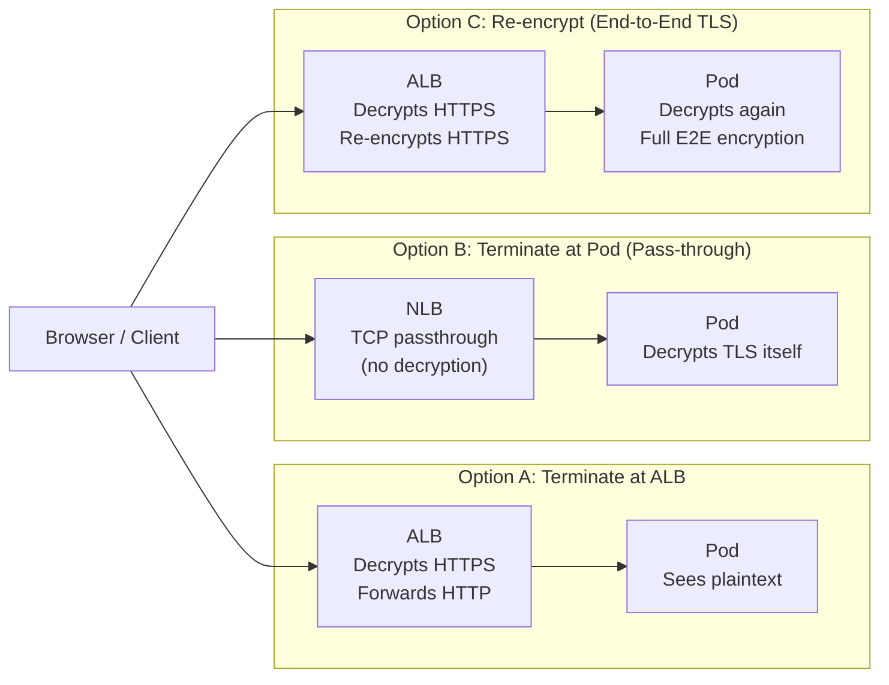
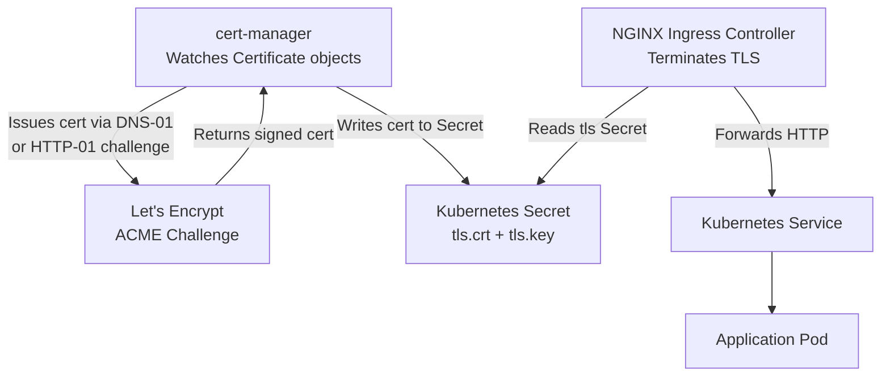
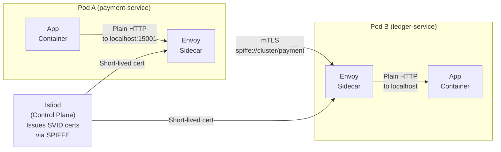
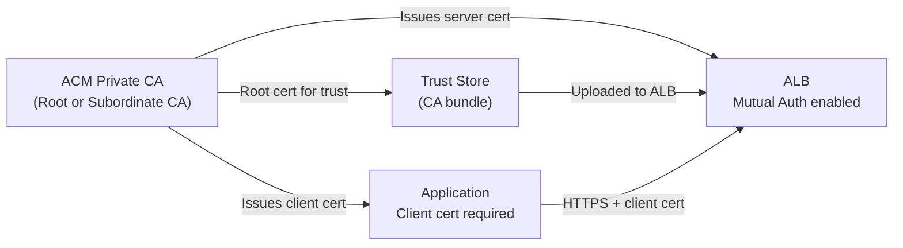

# TLS/SSL Deep Dive: Certificates, mTLS, and Debugging in Production

> Part 3 of the series: *"Networking for DevOps and Cloud Architects: From Packets to Production"*
>
> Prerequisites: [Part 1 — Networking Fundamentals](./01-networking-fundamentals.md) | [Part 2 — DNS Deep Dive](./02-dns-deep-dive.md)

---

## Table of Contents

- [Why This Matters](#why-this-matters)
- [Mental Model](#mental-model)
- [Core Concepts](#core-concepts)
- [How It Works in Real Production Systems](#how-it-works-in-real-production-systems)
- [End-to-End TLS Flow Example](#end-to-end-tls-flow-example)
- [Common Failure Patterns](#common-failure-patterns)
- [Commands Every Engineer Should Know](#commands-every-engineer-should-know)
- [AWS / Cloud Angle](#aws--cloud-angle)
- [Kubernetes Angle](#kubernetes-angle)
- [Troubleshooting Framework](#troubleshooting-framework)
- [Senior Engineer Interview Explanation](#senior-engineer-interview-explanation)
- [Production Checklist](#production-checklist)
- [Key Takeaways](#key-takeaways)

---

## Why This Matters

Let's be honest — TLS is one of those topics most engineers treat like plumbing. You set it up once, it works, and you try not to think about it until something breaks.

Then at 2am you get paged because your API is returning `SSL_ERROR_RX_RECORD_TOO_LONG` and half your users are getting certificate warnings. Suddenly TLS is the most important thing in the world and you wish you understood it better.

Here's the reality of TLS in production:

- **Expired certificates are still one of the top causes of production outages.** Despite years of automation tooling, teams still get caught with certificates that expire because someone set up cert-manager two years ago, the renewal job silently failed three months ago, and nobody noticed until customers started calling.

- **Missing intermediate certificates break mobile clients.** Your browser might be forgiving. Android devices and IoT clients often aren't. You can test your endpoint manually and it works fine — then 20% of your users get TLS errors because you forgot to include the intermediate cert in the chain.

- **mTLS misconfiguration is one of the hardest service mesh problems to debug.** Istio or Linkerd enforcing mutual TLS between services sounds great until you have a legacy service that doesn't present a client cert and you spend 3 hours wondering why it's getting `CERTIFICATE_REQUIRED` errors.

- **TLS termination points matter architecturally.** Where you terminate TLS determines your security posture, latency profile, and where you can inspect traffic. Terminating at the ALB versus at the pod has completely different implications for zero-trust networking.

Understanding TLS is not optional for anyone operating production systems. This article will make it less scary.

---

## Mental Model

**Think of TLS like a safety deposit box at a bank — but one that proves who you are before it opens.**

Here's the analogy that makes TLS click:

Imagine you want to safely exchange a secret message with your bank. The problem is you've never met them in person and anyone could be pretending to be the bank.

Here's how TLS solves this:

1. **The bank has a certificate** — like a government-issued ID card. It was issued by a trusted authority (a Certificate Authority, or CA), signed with that CA's seal. Anyone can verify the seal is real.

2. **When you connect, the bank shows you its ID.** You check: does this ID match the bank's name? Was it issued by a CA I trust? Has it expired? If all checks pass, you believe you're actually talking to the bank.

3. **Then you use the bank's public key to seal an envelope.** Only the bank's private key can open it. You put a randomly generated shared secret in that envelope and send it. Now both of you have the same secret without ever saying it aloud.

4. **From that point on, all communication is encrypted** using that shared secret. Even if someone is listening to every byte of traffic, they see gibberish.

That's TLS. The complexity is in the details — how keys are exchanged, how certificates are verified, what happens when something in the chain is wrong — but the core idea is: **prove identity, exchange a secret, encrypt everything.**

Now let's get into those details.

---

## Core Concepts

### 1. Encryption Types — Symmetric vs. Asymmetric

There are two kinds of encryption at play in TLS, and understanding why *both* are needed is the first mental unlock.

**Asymmetric encryption (Public/Private Key)**

You have two mathematically linked keys:
- **Public key** — share it with anyone. They use it to *encrypt* data for you, or to *verify* your signature.
- **Private key** — never leaves your server. You use it to *decrypt* data encrypted with your public key, or to *sign* data.

The math works one way: encrypt with public key → only private key can decrypt. This is magic for key exchange — you can publish your public key on a billboard and anyone can send you a secret that only you can read.

**The catch:** Asymmetric encryption is *computationally expensive*. Encrypting a 100MB API response with RSA would melt your CPU.

**Symmetric encryption (Shared Secret Key)**

Both sides have the same key. Encrypting and decrypting is *fast* — orders of magnitude faster than asymmetric.

**The catch:** How do you get both sides the same key without someone intercepting it?

**TLS solves this by combining both:**

> Use asymmetric encryption to *safely share a symmetric key*, then use the symmetric key for everything after.

The TLS handshake is the asymmetric part (happens once per connection). The actual data transfer uses symmetric encryption (happens for every byte). Fast where it needs to be fast.

---

### 2. Certificate Anatomy — What's Actually Inside a Cert

A certificate is a signed document that says: *"I, the CA, hereby confirm that the entity at this domain is who they claim to be, and their public key is this."*

Open any certificate and you'll find:

```
Subject:    CN=api.example.com
Issuer:     CN=Amazon RSA 2048 M02, O=Amazon, C=US
Valid From: 2024-01-15 00:00:00
Valid Until: 2025-02-14 23:59:59
Public Key: RSA 2048-bit (the server's public key)
SANs:       DNS:api.example.com, DNS:*.example.com
Signature:  [CA's digital signature over all of the above]
```

**Key fields to understand:**

**Subject / Common Name (CN):** The old way to specify which hostname this cert covers. Largely deprecated in favor of SANs but still present.

**Subject Alternative Names (SANs):** The *actual* list of hostnames this certificate is valid for. Modern browsers and clients validate against SANs, not CN. A cert with `SAN: api.example.com, *.example.com` covers `api.example.com` and `www.example.com` but *not* `example.com` (the apex) or `sub.api.example.com` (wildcards only cover one level).

**Validity Period:** Start and end datetime. After the end datetime, the certificate is expired and every client will reject it — no exceptions, no grace period.

**Public Key:** The server's public key. Clients use this to encrypt the key exchange data during the handshake.

**Signature:** The CA signed the entire certificate using *its* private key. Anyone with the CA's public key can verify this signature is authentic. This is the chain of trust.

**Key Usage / Extended Key Usage:** Tells clients what this cert is for. `serverAuth` = can be used for TLS server authentication. `clientAuth` = can be used for mTLS client authentication. A cert without `serverAuth` in its extended key usage will be rejected by clients — a subtle issue that surfaces when using custom CAs.

---

### 3. The Certificate Chain — Why "Full Chain" Matters

Here's one of the most misunderstood concepts that causes real production incidents.

You don't just have *one* certificate. You have a **chain**:

```
Root CA
  └── Intermediate CA  (signed by Root CA)
        └── Your Leaf Certificate  (signed by Intermediate CA)
```

**Why intermediates?**

Root CAs are extremely precious. Their private keys are kept in hardware security modules in physical vaults. If a Root CA private key were ever compromised, trust in the entire internet would collapse. So Root CAs don't directly sign website certificates.

Instead, they sign Intermediate CA certificates. Intermediate CAs do the day-to-day work of signing website certificates. If an Intermediate is compromised, it can be revoked without touching the Root.

**The client's job during TLS:**

The client received your leaf certificate. It needs to verify the signature. To verify your leaf cert's signature, it needs the Intermediate CA's public key — but it doesn't have it. You have to send it.

This is why your web server must serve the **full chain** (leaf + all intermediates), not just the leaf certificate.

```
✅ Correct (what your server should send):
  [Your Leaf Cert]
  [Intermediate CA Cert]
  (Root CA is pre-installed in the client's trust store — don't send it)

❌ Wrong (what breaks mobile/embedded clients):
  [Your Leaf Cert only]
```

**What happens when you miss the intermediate?**

Desktop browsers are forgiving — they often fetch missing intermediates automatically (AIA chasing). Mobile apps, older Android versions, IoT devices, and many HTTP clients do not. They get a verification failure and refuse to connect.

This is why your API works fine in Chrome but an Android app gets TLS errors.

---

### 4. Certificate Authorities — Who Do You Trust?

A Certificate Authority is an organization that the operating system or browser vendor has decided to trust. Their root certificates come pre-installed in your OS's trust store (`/etc/ssl/certs/` on Linux, Keychain on macOS, Certificate Store on Windows).

**Public CAs** (trusted by everyone):
- DigiCert, Sectigo, GlobalSign, Let's Encrypt, Amazon Root CAs

**Private/Internal CAs** (trusted only by systems you configure):
- Your own CA (created with `openssl` or HashiCorp Vault)
- AWS Private CA
- cert-manager with a self-signed issuer

When you use an internal CA for service-to-service communication (common in mTLS setups), you must distribute the internal CA's root certificate to every system that needs to trust it. Miss one system and it gets `certificate verify failed: unable to get local issuer certificate`.

---

### 5. The TLS Handshake — Step by Step, Without the Textbook Tone

Most explanations of the TLS handshake are dense and forgettable. Let's walk through what actually happens on the wire in a way that sticks.

**TLS 1.2 (still common in older systems):**

```
Client                                          Server
  |                                               |
  |--- ClientHello -------------------------------->|
  |    "I speak TLS 1.2, here are the cipher      |
  |    suites I support, here's my random nonce"  |
  |                                               |
  |<-- ServerHello + Certificate + ServerHelloDone|
  |    "OK, we'll use TLS_RSA_WITH_AES_256_GCM,   |
  |    here's my cert (and intermediate),          |
  |    here's my random nonce"                    |
  |                                               |
  | [Client verifies cert chain, expiry, SAN]     |
  |                                               |
  |--- ClientKeyExchange ------------------------->|
  |    "Here's a pre-master secret encrypted       |
  |    with your public key. Only you can open it" |
  |                                               |
  | [Both sides independently derive session keys] |
  |                                               |
  |--- ChangeCipherSpec + Finished --------------->|
  |<-- ChangeCipherSpec + Finished ----------------|
  |                                               |
  |=== Encrypted application data begins ========|
```

**TLS 1.3 (modern, what you should be using):**

TLS 1.3 does the whole key exchange in 1 round-trip (vs 2 for TLS 1.2). It also:
- Removes all the weak cipher suites that TLS 1.2 allowed
- Encrypts the certificate (the cert itself is hidden from passive observers)
- Supports 0-RTT resumption (reconnecting clients can send data immediately)

```
Client                                Server
  |                                      |
  |--- ClientHello + KeyShare ---------->|
  |    "Here are my cipher suites,       |
  |    and here's my key share already"  |
  |                                      |
  |<-- ServerHello + KeyShare + Cert ----|
  |    + Finished                        |
  |    "Great, we have enough to derive  |
  |    keys. Here's my cert. I'm done."  |
  |                                      |
  |--- Finished + Application Data ----->|
  |                                      |
  |=== Encrypted data ==================|
```

One round trip. That's the difference you see as the `time_appconnect` time in `curl` output shrinking.

---

### 6. SNI — How One IP Serves Many Certificates

Before SNI (Server Name Indication), one IP address could only serve one TLS certificate. To host 50 HTTPS websites, you needed 50 IP addresses.

SNI fixes this. During the ClientHello (the very first message the client sends), it includes the hostname it wants to connect to. The server reads this and selects the right certificate to serve — before the handshake completes, before any application data.

```
ClientHello {
  server_name: "api.example.com"    ← SNI extension
  supported_versions: TLS 1.3, 1.2
  cipher_suites: [...]
}
```

This is how:
- Your ALB can serve certificates for 50 different domains on one IP
- Kubernetes Ingress can handle TLS for dozens of services
- Cloudflare can host millions of domains on shared IPs

**The SNI gotcha:** SNI is sent unencrypted in the ClientHello (TLS 1.3 encrypts it with Encrypted Client Hello, but it's not universal yet). This means a network observer can see *which hostname* you're connecting to, even though they can't read the data. Deep packet inspection firewalls use this to block or log destinations.

**In code:** When you use `curl`, `openssl s_client`, or any HTTP client, always pass the hostname explicitly for SNI — especially when testing with IP addresses directly.

```bash
# Wrong — no SNI, server might serve wrong cert or default cert
openssl s_client -connect 54.12.3.4:443

# Correct — sends SNI, gets the right cert
openssl s_client -connect 54.12.3.4:443 -servername api.example.com
```

---

### 7. mTLS — When Both Sides Need to Prove Identity

Regular TLS only requires the *server* to present a certificate. The client verifies the server is legitimate, but the server doesn't know who the client is.

**Mutual TLS (mTLS)** requires *both sides* to present certificates:

```
Client                                Server
  |--- ClientHello ------------------->|
  |<-- ServerHello + Certificate ------|
  |    + CertificateRequest            |
  |    "I need to see your cert too"   |
  |                                    |
  |--- Certificate (client cert) ----->|
  |--- CertificateVerify ------------->|
  |    [Proves client has private key] |
  |                                    |
  |=== Both sides verified ============|
```

**Why mTLS matters:**

In a microservices environment, you might have 50 services. Network-level access controls (security groups) can say "only pods in this subnet can talk to this service." But security groups don't know *which service* is making the request — any compromised pod in the subnet can call any other service.

mTLS solves this. Each service has a certificate with a specific identity (SPIFFE URI like `spiffe://cluster.local/ns/production/sa/payment-service`). The server validates not just "is this a valid cert?" but "is this the specific service I expect?" A compromised `frontend` service cannot impersonate `payment-service` to call `ledger-service` — even if they're both in the same subnet.

**mTLS in practice:**

| Where | How it's implemented |
|-------|---------------------|
| Kubernetes (Istio) | Envoy sidecar proxies handle mTLS automatically per-pod |
| Kubernetes (Linkerd) | Lightweight proxies, auto-mTLS for all meshed services |
| AWS App Mesh | Envoy sidecars with ACM Private CA |
| AWS ALB | Mutual authentication with ACM Private CA (2023 feature) |
| Service-to-service (no mesh) | Client certs in app config, validated by server TLS config |
| HashiCorp Vault | Issues short-lived client certs via PKI secrets engine |

**The operational complexity of mTLS:**

mTLS shifts the security boundary from the network to the identity layer — which is powerful. But it also means:
- Every service needs a certificate
- Certificates expire (if rotation is not automated, mTLS becomes an outage waiting to happen)
- Certificate rotation must be zero-downtime (old and new certs must be trusted simultaneously during rotation)
- Any service that doesn't participate breaks (non-meshed pods calling meshed pods need to handle the TLS requirement)

This is why service meshes exist — to automate all of this rather than making every dev team manage client certs manually.

---

### 8. Certificate Rotation — The Part Everyone Gets Wrong

**Let's Encrypt** certificates expire every 90 days by design — forcing automation. **ACM** certificates auto-renew automatically if the domain validation is still in place. **cert-manager** in Kubernetes handles rotation and reloads.

Where things go wrong is not the renewal — it's the **reload**.

Renewing a certificate creates a new file on disk. Your NGINX or Envoy doesn't automatically pick it up unless:
1. It's watching the file and hot-reloads (cert-manager triggers this with annotations)
2. You send it a SIGHUP (or equivalent reload signal)
3. The container restarts (not zero-downtime)

**The silent rotation failure pattern:**

```
Day 1:   cert-manager renews cert, writes new files to Secret
Day 1:   NGINX doesn't reload (no annotation, no signal)
Day 30:  Old cert in NGINX memory expires
Day 30:  NGINX serving expired cert despite new cert sitting on disk
Day 30:  2am page
```

The fix: `cert-manager.io/inject-ca-from` annotations + NGINX Ingress watching for Secret updates, or explicitly configuring reloader tools like `stakater/reloader`.

---

## How It Works in Real Production Systems

### TLS Termination Points — An Architectural Decision

Where you terminate TLS determines your entire security and observability model. This is not a detail — it's an architectural decision.



**Option A: Terminate at ALB (most common)**
- ALB handles TLS. Pods receive plain HTTP.
- Pros: Centralized cert management (ACM), ALB can inspect HTTP headers for routing rules, easy to manage.
- Cons: Traffic between ALB and pod is unencrypted. If you're in a private VPC with network controls, this is usually acceptable. In a zero-trust model, it's a gap.
- Real-world: 90% of AWS workloads use this. Acceptable for most teams.

**Option B: Pass-through to Pod**
- NLB passes raw TCP to the pod. Pod handles TLS termination.
- Pros: True end-to-end encryption. NLB never sees plaintext.
- Cons: ALB routing rules (host/path) don't work. Cert management is per-pod. More operationally complex.
- Real-world: gRPC services, WebSockets that need end-to-end encryption, regulatory requirements.

**Option C: Re-encrypt (End-to-End TLS with ALB)**
- ALB decrypts for routing/inspection, then re-encrypts before forwarding to pod.
- Pros: Best of both worlds — ALB routing + end-to-end encryption.
- Cons: Requires managing certs on both ALB and pods. Higher latency (two TLS terminations).
- Real-world: Financial services, healthcare, anywhere data must never be plaintext in transit.

---

### TLS in Kubernetes Ingress

The most common pattern: cert-manager issues a certificate, stores it as a Kubernetes Secret, and the Ingress controller uses it.



**The Certificate resource that drives this:**

```yaml
apiVersion: cert-manager.io/v1
kind: Certificate
metadata:
  name: api-tls
  namespace: production
spec:
  secretName: api-tls-secret      # Where to store the cert
  duration: 2160h                 # 90 days
  renewBefore: 360h               # Renew 15 days before expiry
  dnsNames:
  - api.example.com
  - www.example.com
  issuerRef:
    name: letsencrypt-prod
    kind: ClusterIssuer
```

**The Ingress that uses it:**

```yaml
apiVersion: networking.k8s.io/v1
kind: Ingress
metadata:
  name: api-ingress
  annotations:
    kubernetes.io/ingress.class: nginx
    cert-manager.io/cluster-issuer: letsencrypt-prod
spec:
  tls:
  - hosts:
    - api.example.com
    secretName: api-tls-secret
  rules:
  - host: api.example.com
    http:
      paths:
      - path: /
        pathType: Prefix
        backend:
          service:
            name: api-service
            port:
              number: 8080
```

**What cert-manager does for you:**
1. Sees the `Certificate` resource
2. Creates a `CertificateRequest` and sends the ACME challenge to Let's Encrypt
3. Completes HTTP-01 or DNS-01 challenge to prove domain ownership
4. Gets the signed certificate back
5. Stores it in the `api-tls-secret` Secret
6. NGINX Ingress picks up the new Secret and starts serving the cert
7. Monitors expiry and repeats before `renewBefore` deadline

**When this breaks:** The ACME challenge. HTTP-01 requires `/.well-known/acme-challenge/` to be publicly reachable. DNS-01 requires cert-manager to create a TXT record in Route 53 (needs IAM permissions). Both fail silently if the plumbing isn't right — and you only find out when the cert expires.

---

### mTLS in Kubernetes with Istio (Simplified)

Istio implements mTLS between services without any application code changes. Here's how:



**What your application sees:** Plain HTTP to localhost. The Envoy sidecar intercepts the outbound call, wraps it in mTLS with its SPIFFE identity cert, and sends it to the other pod's Envoy. The receiving Envoy unwraps the mTLS and passes plain HTTP to the app container.

**The application doesn't know mTLS is happening.** That's the point.

**What can go wrong:**
- A pod missing the Envoy sidecar (wasn't in a meshed namespace) calling a pod that requires mTLS → `CERTIFICATE_REQUIRED`
- PeerAuthentication policy set to `STRICT` mTLS but one service is legacy and can't do TLS → denied
- Expired SVID cert not being rotated (Istio rotates every 24h by default, but if istiod is down...)
- Wrong namespace label (`istio-injection: enabled` forgotten on a new namespace)

---

## End-to-End TLS Flow Example

**Scenario: User's browser connects to `https://api.example.com` → traffic terminates at ALB → forwards to EKS pod**

```
Step 1: DNS resolves api.example.com → ALB IP (54.12.3.4)
        [Covered in Part 2 — see DNS Deep Dive]

Step 2: Browser initiates TCP connection to 54.12.3.4:443
        SYN → SYN-ACK → ACK
        (Takes ~1 RTT)

Step 3: Browser sends ClientHello
        ┌─────────────────────────────────────────────┐
        │ TLS Version: 1.3                            │
        │ Cipher Suites: TLS_AES_256_GCM_SHA384, ...  │
        │ SNI: api.example.com   ← "I want this cert" │
        │ Key Share: [client's Diffie-Hellman params] │
        └─────────────────────────────────────────────┘

Step 4: ALB selects the certificate for api.example.com (via SNI)
        ALB sends ServerHello + Certificate + Finished
        ┌─────────────────────────────────────────────┐
        │ Certificate Chain:                          │
        │   [Leaf: api.example.com, expires 2025-02] │
        │   [Intermediate: Amazon RSA 2048 M02]      │
        │ Key Share: [server's DH params]            │
        │ Both sides now derive session keys          │
        └─────────────────────────────────────────────┘

Step 5: Browser verifies certificate
        ┌─────────────────────────────────────────────┐
        │ Check 1: Is SAN "api.example.com" in cert? │ ✓
        │ Check 2: Is the cert expired?               │ ✓ (not expired)
        │ Check 3: Verify intermediate signature      │ ✓ (Amazon signed it)
        │ Check 4: Verify root CA is in trust store   │ ✓ (Amazon Root CA)
        │ Check 5: Is cert revoked? (OCSP/CRL check) │ ✓ (not revoked)
        └─────────────────────────────────────────────┘

Step 6: Browser sends Finished
        TLS handshake complete.
        Encrypted channel established.
        (Total TLS handshake: ~1 RTT for TLS 1.3)

Step 7: Browser sends encrypted HTTP request
        GET /v1/users HTTP/2
        Host: api.example.com
        Authorization: Bearer eyJ...

Step 8: ALB decrypts, routes based on host+path rules
        Adds headers: X-Forwarded-For, X-Forwarded-Proto: https
        Forwards plain HTTP to EKS pod at 10.0.11.23:8080

Step 9: Pod processes request, queries database, returns response

Step 10: Response travels back
         Pod → ALB (plain HTTP)
         ALB re-encrypts → Browser (HTTPS)
         Browser decrypts using session keys
```

**Where this breaks:**

- Step 4: ALB has no cert for this SNI → serves default cert → browser sees wrong hostname → `NET::ERR_CERT_COMMON_NAME_INVALID`
- Step 5, Check 1: Cert has `api.old-example.com` but you moved to `api.example.com` → `NET::ERR_CERT_COMMON_NAME_INVALID`
- Step 5, Check 2: Cert expired yesterday → `NET::ERR_CERT_DATE_INVALID`
- Step 5, Check 3: Intermediate missing → `NET::ERR_CERT_AUTHORITY_INVALID` (on strict clients)
- Step 5, Check 4: Internal CA cert not in trust store → `SSL: CERTIFICATE_VERIFY_FAILED`

---

## Common Failure Patterns

### Failure 1: Certificate Expired

This is the most embarrassing and most preventable production failure in existence. And yet it keeps happening.

**Symptom:**
- `ERR_CERT_DATE_INVALID` in browser
- `SSL: certificate has expired` in application logs
- `curl: (60) SSL certificate problem: certificate has expired`

**Likely cause:**
- ACM auto-renewal failed because DNS validation record was deleted
- cert-manager renewal job failed silently (CertificateRequest stuck in `Pending`)
- Manually managed cert (someone did `openssl req` two years ago and forgot)
- Cert renewed but server never reloaded

**Verify:**
```bash
# Check expiry date
echo | openssl s_client -connect api.example.com:443 -servername api.example.com 2>/dev/null \
  | openssl x509 -noout -dates

# Check cert-manager Certificate status
kubectl get certificate -A
kubectl describe certificate api-tls -n production

# Check if NGINX actually loaded the new cert (check cert in memory vs. disk)
kubectl exec -n ingress-nginx <nginx-pod> -- nginx -T 2>/dev/null | grep ssl_certificate
```

**Fix:** Rotate cert immediately. For ACM: re-create DNS validation record. For cert-manager: delete the CertificateRequest and let cert-manager recreate it. For manual certs: rotate and reload server.

**Prevention:** Set alerts at 30 days and 7 days before expiry. In Datadog/Prometheus:
```
# Prometheus alert for cert-manager
ssl_certificate_expiry_seconds < 7 * 24 * 3600
```

---

### Failure 2: Missing Intermediate Certificate

**Symptom:**
- Works fine in Chrome/Firefox desktop
- Breaks in mobile apps, curl without CA bundle, older Android versions
- `unable to verify the first certificate` or `unable to get local issuer certificate`

**The asymmetry** is what makes this hard to catch: browsers cache and fetch intermediates. Strict clients don't. You test in Chrome, it works, you ship it — and 15% of your mobile users get TLS errors.

**Verify:**
```bash
# Test with explicit chain verification (like a strict client would)
openssl s_client -connect api.example.com:443 -servername api.example.com 2>&1 \
  | grep "Verify return code"

# Good: Verify return code: 0 (ok)
# Bad:  Verify return code: 20 (unable to get local issuer certificate)

# See what certificates the server actually sends
openssl s_client -connect api.example.com:443 -servername api.example.com \
  -showcerts 2>/dev/null | grep "subject\|issuer"

# Should see MULTIPLE certs: your leaf + at least one intermediate
```

**Fix:** Configure your server (NGINX/ALB/Ingress) to serve the full chain file. In NGINX:
```nginx
# Wrong — leaf only
ssl_certificate /etc/ssl/leaf.crt;

# Correct — full chain (leaf + intermediates concatenated)
ssl_certificate /etc/ssl/fullchain.pem;
```

In ACM: ACM automatically handles the full chain. If you're using third-party certs, import the full chain when uploading to ACM.

---

### Failure 3: Wrong Certificate Served (SNI Mismatch)

**Symptom:**
- `NET::ERR_CERT_COMMON_NAME_INVALID`
- `hostname mismatch` in logs
- Browser shows a different domain's certificate

**Likely causes:**
- ALB serving default certificate instead of the one for this domain (SNI lookup failed)
- Ingress controller serving wrong TLS secret
- Multiple Ingress resources fighting over the same hostname
- Client not sending SNI (old client, or testing by IP without `-servername`)

**Verify:**
```bash
# Check what cert is actually being served
openssl s_client -connect api.example.com:443 -servername api.example.com \
  2>/dev/null | openssl x509 -noout -subject -ext subjectAltName

# Check Ingress TLS config
kubectl describe ingress my-ingress | grep -A10 TLS

# Check all Ingress resources claiming the same hostname
kubectl get ingress -A | grep api.example.com
```

**Fix:** Ensure exactly one Ingress resource claims each hostname. Verify the TLS secret name in the Ingress spec matches the actual Secret. For ALB, confirm the cert is attached to the listener for port 443.

---

### Failure 4: TLS Version / Cipher Suite Mismatch

**Symptom:**
- `SSL_ERROR_NO_CYPHER_OVERLAP` (Firefox)
- `ERR_SSL_VERSION_OR_CIPHER_MISMATCH` (Chrome)
- `no protocols available`
- Connection fails to very old clients (legacy enterprise software, old Java versions)

**Likely causes:**
- Server configured with TLS 1.3 only but client only supports TLS 1.2
- Server disabled old cipher suites that legacy client requires
- ALB security policy changed (AWS has named security policies like `ELBSecurityPolicy-TLS13-1-2-2021-06`)

**Verify:**
```bash
# Test which TLS versions the server accepts
nmap --script ssl-enum-ciphers -p 443 api.example.com

# Test specific TLS version support
openssl s_client -connect api.example.com:443 -tls1_2 -servername api.example.com
openssl s_client -connect api.example.com:443 -tls1_3 -servername api.example.com

# Check ALB security policy
aws elbv2 describe-listeners \
  --load-balancer-arn <arn> \
  --query 'Listeners[?Port==`443`].SslPolicy'
```

**Fix:** For legacy clients, keep TLS 1.2 enabled alongside TLS 1.3. Choose an ALB security policy that supports both:
- `ELBSecurityPolicy-TLS13-1-2-2021-06` — supports TLS 1.2 and 1.3 with strong ciphers (recommended)
- Avoid `ELBSecurityPolicy-2016-08` — includes weak ciphers

---

### Failure 5: mTLS — Client Certificate Not Presented or Rejected

**Symptom:**
- `400 Bad Request: No required SSL certificate was sent` (NGINX)
- `CERTIFICATE_REQUIRED` in gRPC
- `tls: client didn't provide a certificate` in Go app logs
- Works without mTLS enforcement, breaks after enabling it

**Likely causes:**
- Client application not configured to present a certificate
- Client cert signed by a different CA than what the server trusts
- Client cert expired
- In Istio: pod not part of the mesh (missing sidecar), but destination requires STRICT mTLS

**Verify:**
```bash
# Test mTLS with a client certificate
openssl s_client -connect internal-api:8443 \
  -servername internal-api \
  -cert /path/to/client.crt \
  -key /path/to/client.key \
  -CAfile /path/to/ca-bundle.crt

# In Kubernetes with Istio, check PeerAuthentication policy
kubectl get peerauthentication -A

# Check if a pod has the Istio sidecar
kubectl get pod <pod-name> -o jsonpath='{.spec.containers[*].name}'
# Should show both your container name AND "istio-proxy"

# Check Istio's certificate for a pod
istioctl proxy-config secret <pod-name>
```

**Fix:** Configure the client to present a certificate. Verify both the client cert and the CA bundle the server trusts are from the same PKI. In Istio, set PeerAuthentication to `PERMISSIVE` temporarily during migration, then `STRICT` after all services are meshed.

---

### Failure 6: Internal CA Not Trusted

**Symptom:**
- `SSL: CERTIFICATE_VERIFY_FAILED: unable to get local issuer certificate`
- Works when `verify=False` is passed (in Python requests, for example)
- Only fails in specific environments (new pods, new nodes, new lambda)

**Likely cause:**
- Internal/private CA root certificate not distributed to all systems
- New container image doesn't include the internal CA cert
- Trust store update not propagated to all nodes/pods

**Verify:**
```bash
# Check if the internal CA is in the system trust store
cat /etc/ssl/certs/ca-certificates.crt | grep "MyInternalCA"

# Or check with openssl
openssl verify -CAfile /etc/ssl/certs/ca-certificates.crt my-service.crt

# Test connection with explicit CA
curl --cacert /path/to/internal-ca.crt https://internal-service.corp/health
```

**Fix:** Add the internal CA cert to the container image's trust store, or mount it via a ConfigMap/Secret and set `SSL_CERT_FILE` / `NODE_EXTRA_CA_CERTS` (for Node.js) / `REQUESTS_CA_BUNDLE` (for Python) environment variables.

---

## Commands Every Engineer Should Know

### `openssl s_client` — The Swiss Army Knife of TLS Debugging

```bash
# Basic connection + full cert info
openssl s_client -connect api.example.com:443 -servername api.example.com

# Show full certificate chain
openssl s_client -connect api.example.com:443 \
  -servername api.example.com -showcerts

# Check expiry dates only
openssl s_client -connect api.example.com:443 \
  -servername api.example.com 2>/dev/null \
  | openssl x509 -noout -dates

# Check all SANs (Subject Alternative Names)
openssl s_client -connect api.example.com:443 \
  -servername api.example.com 2>/dev/null \
  | openssl x509 -noout -ext subjectAltName

# Test mTLS — present a client certificate
openssl s_client -connect internal-api:8443 \
  -servername internal-api \
  -cert client.crt -key client.key

# Test specific TLS version
openssl s_client -connect api.example.com:443 -tls1_3

# Check OCSP stapling (cert revocation)
openssl s_client -connect api.example.com:443 \
  -servername api.example.com -status 2>/dev/null \
  | grep -A10 "OCSP response"
```

**Reading the output:**

```
depth=2 C=US, O=Amazon, CN=Amazon Root CA 1    ← Root CA (trusted)
depth=1 C=US, O=Amazon, CN=Amazon RSA 2048 M02 ← Intermediate CA
depth=0 CN=api.example.com                     ← Your leaf cert

Verify return code: 0 (ok)     ← ✅ Chain is valid
Verify return code: 20 (...)   ← ❌ Can't verify — missing intermediate or untrusted CA
Verify return code: 10 (...)   ← ❌ Cert expired
```

---

### `curl` for TLS Testing

```bash
# Test HTTPS with verbose TLS info
curl -v https://api.example.com/health 2>&1 | grep -E "SSL|TLS|certificate|expire"

# Test against a specific IP without DNS (to test new cert before DNS change)
curl --resolve api.example.com:443:54.12.3.4 https://api.example.com/health

# Test with a specific CA bundle
curl --cacert /path/to/ca-bundle.crt https://internal-api.corp/health

# Test with client certificate (mTLS)
curl --cert client.crt --key client.key https://mtls-api.example.com/health

# Disable cert verification (TESTING ONLY — never in production code)
curl -k https://api.example.com/health

# Show TLS timing breakdown
curl -w "TLS: %{time_appconnect}s\n" -o /dev/null -s https://api.example.com/health
```

> **On `curl -k`:** It skips certificate verification entirely. Never use `-k` as a fix — use it only to confirm whether the problem is cert-related. If `-k` works but normal doesn't, the problem is definitely in cert verification. Find and fix the root cause.

---

### Checking Certificate Files Directly

```bash
# View a certificate file
openssl x509 -in certificate.crt -noout -text

# Check a private key
openssl rsa -in private.key -check

# Verify a cert matches its private key
# (the modulus should match)
openssl x509 -noout -modulus -in certificate.crt | md5sum
openssl rsa -noout -modulus -in private.key | md5sum

# Verify the cert is signed by a given CA
openssl verify -CAfile ca-bundle.crt certificate.crt

# Decode a PEM to see what's inside (cert? key? chain?)
openssl pem -in bundle.pem
```

---

### Kubernetes-Specific TLS Commands

```bash
# Check a TLS secret in Kubernetes
kubectl get secret api-tls-secret -n production -o jsonpath='{.data.tls\.crt}' \
  | base64 -d | openssl x509 -noout -dates -subject -ext subjectAltName

# Check cert-manager Certificate status
kubectl get certificate -A
kubectl describe certificate api-tls -n production

# Check CertificateRequests (renewal in progress?)
kubectl get certificaterequest -A

# List all TLS secrets and their expiry
for secret in $(kubectl get secrets -A -o json | jq -r \
  '.items[] | select(.type=="kubernetes.io/tls") | .metadata.namespace + "/" + .metadata.name'); do
  ns=$(echo $secret | cut -d/ -f1)
  name=$(echo $secret | cut -d/ -f2)
  expiry=$(kubectl get secret $name -n $ns -o jsonpath='{.data.tls\.crt}' \
    | base64 -d | openssl x509 -noout -enddate 2>/dev/null)
  echo "$secret: $expiry"
done

# Check NGINX Ingress TLS configuration
kubectl exec -n ingress-nginx <nginx-pod> -- nginx -T 2>/dev/null \
  | grep -E "ssl_certificate|ssl_certificate_key"

# Check Istio proxy TLS secrets
istioctl proxy-config secret <pod-name>.<namespace>
```

---

### AWS CLI for TLS / ACM

```bash
# List all ACM certificates
aws acm list-certificates --region us-east-1

# Check a specific cert's details (expiry, SANs, status)
aws acm describe-certificate \
  --certificate-arn arn:aws:acm:us-east-1:123456:certificate/xxxx \
  --query 'Certificate.{Status:Status,NotAfter:NotAfter,DomainName:DomainName,SANs:SubjectAlternativeNames}'

# Check ALB HTTPS listener and its cert
aws elbv2 describe-listeners \
  --load-balancer-arn <alb-arn> \
  --query 'Listeners[?Port==`443`].{Cert:Certificates,Policy:SslPolicy}'

# List all certs expiring within 30 days
aws acm list-certificates --query \
  'CertificateSummaryList[*].CertificateArn' --output text | \
  xargs -I{} aws acm describe-certificate --certificate-arn {} \
  --query 'Certificate.{ARN:CertificateArn,Expiry:NotAfter,Status:Status}' | \
  jq 'select(.Expiry != null)'
```

---

## AWS / Cloud Angle

### ACM — AWS Certificate Manager

ACM is the managed certificate service that makes TLS on AWS significantly less painful. Certs issued through ACM auto-renew as long as DNS validation records are in place.

**Two types of ACM certificates:**

| Type | Trusted by | Use case | Cost |
|------|-----------|----------|------|
| Public | All browsers/clients | Internet-facing endpoints | Free |
| Private (ACM PCA) | Systems with the CA cert installed | Internal services, mTLS | $400/month per CA + $0.75/cert |

**Validation methods:**

- **DNS validation** (recommended): Add a CNAME record to your DNS. ACM validates ownership and auto-renews as long as the record exists. Set-and-forget.
- **Email validation**: ACM sends email to addresses at the domain (admin@, webmaster@, etc.). Someone has to click a link. Not automatable. Avoid.

**The ACM renewal failure pattern:**

1. You validate domain via DNS, get the cert
2. Two months later, someone cleans up "orphaned DNS records" and deletes the ACM validation CNAME
3. 13 months later (certs renew 60 days before expiry), ACM tries to validate and fails
4. ACM sends email warnings — to an alias no one monitors
5. Cert expires
6. Page

**Prevention:** Tag the ACM validation CNAME records clearly. Use AWS Config rules to alert on ACM cert expiry. Never delete DNS records you don't understand.

**ACM + ALB:**

When you attach an ACM cert to an ALB, ACM handles the full chain automatically. The ALB serves the leaf cert + appropriate intermediates. You never touch the cert file. This is the zero-maintenance path — use it.

---

### ACM Private CA for mTLS

For internal service-to-service mTLS, AWS offers ACM Private Certificate Authority. It's an AWS-managed CA that issues private certificates.



**ALB Mutual Authentication** (released 2023) lets the ALB enforce client cert validation — without a service mesh. The ALB checks the client cert against a trust store you upload. If the cert isn't signed by a trusted CA, the connection is rejected at the load balancer layer.

This is the AWS-native path to mTLS without Istio. Simpler operationally, less flexible than a full mesh, but covers most use cases.

---

### EKS + cert-manager + Route 53 (DNS-01 Challenge)

For EKS clusters where your pods have private IPs and HTTP-01 challenge isn't viable, DNS-01 is the path. cert-manager creates a TXT record in Route 53 to prove domain ownership.

```yaml
# ClusterIssuer using Route 53 DNS-01
apiVersion: cert-manager.io/v1
kind: ClusterIssuer
metadata:
  name: letsencrypt-prod
spec:
  acme:
    server: https://acme-v02.api.letsencrypt.org/directory
    email: ops@example.com
    privateKeySecretRef:
      name: letsencrypt-prod-account-key
    solvers:
    - dns01:
        route53:
          region: us-east-1
          hostedZoneID: Z1234XXXX  # Your Route 53 hosted zone ID
```

**IAM permissions cert-manager needs:**

```json
{
  "Version": "2012-10-17",
  "Statement": [
    {
      "Effect": "Allow",
      "Action": [
        "route53:GetChange",
        "route53:ChangeResourceRecordSets",
        "route53:ListResourceRecordSets"
      ],
      "Resource": [
        "arn:aws:route53:::change/*",
        "arn:aws:route53:::hostedzone/Z1234XXXX"
      ]
    },
    {
      "Effect": "Allow",
      "Action": "route53:ListHostedZonesByName",
      "Resource": "*"
    }
  ]
}
```

Grant this via IRSA (IAM Roles for Service Accounts) — the cert-manager ServiceAccount assumes an IAM role that has these permissions. This is the production pattern.

---

## Kubernetes Angle

### cert-manager in Production — What You Need to Know

cert-manager is the standard for certificate management in Kubernetes. Here's what matters operationally:

**Issuer vs. ClusterIssuer:**
- `Issuer` — namespace-scoped. Can only issue certs in its own namespace.
- `ClusterIssuer` — cluster-wide. Can issue certs in any namespace. Use this for shared infrastructure (the NGINX Ingress controller's certs).

**Certificate lifecycle states:**

```bash
kubectl get certificate -A

# States you'll see:
# True/Ready   → cert is valid and not near expiry ✅
# False/Ready  → cert is invalid, expired, or renewal failed ❌
# True/Issuing → renewal in progress ⏳
```

**When renewal gets stuck:**

```bash
# CertificateRequest stuck in Pending?
kubectl describe certificaterequest <name> -n <namespace>
# Look at "Events" section — will tell you exactly why it's stuck

# Delete stuck CertificateRequest to force retry
kubectl delete certificaterequest <stuck-request> -n <namespace>
# cert-manager will create a new one automatically

# Check cert-manager controller logs
kubectl logs -n cert-manager \
  -l app=cert-manager,app.kubernetes.io/component=controller \
  --tail=50 | grep -i "error\|failed\|certificate"
```

---

### Wildcard Certificates in Kubernetes

A wildcard cert (`*.example.com`) covers all first-level subdomains. Useful when you have many services under a single domain.

```yaml
apiVersion: cert-manager.io/v1
kind: Certificate
metadata:
  name: wildcard-tls
  namespace: ingress-nginx    # Shared cert in Ingress namespace
spec:
  secretName: wildcard-tls-secret
  dnsNames:
  - "*.example.com"
  - "example.com"             # Apex needs to be explicit — wildcard doesn't cover it
  issuerRef:
    name: letsencrypt-prod
    kind: ClusterIssuer
```

**Wildcard limitations:**
- Covers `api.example.com` but not `api.sub.example.com` (wildcards are one level)
- Only works with DNS-01 challenge (Let's Encrypt requires DNS-01 for wildcards)
- Rotating one cert affects all services under that domain — more blast radius

**When to use wildcards vs. per-service certs:**
- Wildcard: simple setups, few services, all under one domain
- Per-service: large clusters, different teams, different cert lifecycle requirements, or when you want per-service rotation

---

### Sidecar TLS Without a Service Mesh

If you need TLS between services but don't want a full service mesh, you can use a sidecar pattern with a simpler proxy:

```yaml
# Pod with NGINX sidecar handling TLS termination
spec:
  containers:
  - name: app
    image: my-app:latest
    # App listens on 127.0.0.1:8080 (localhost only)

  - name: tls-proxy
    image: nginx:alpine
    ports:
    - containerPort: 8443
    volumeMounts:
    - name: tls-certs
      mountPath: /etc/nginx/certs
  volumes:
  - name: tls-certs
    secret:
      secretName: my-service-tls
```

The NGINX sidecar terminates TLS on port 8443 and forwards plain HTTP to the app container on localhost:8080. From outside the pod, traffic is always encrypted. The app container never handles TLS.

---

## Troubleshooting Framework

### Step 1: What's the exact error?

Every TLS error has a specific meaning. Don't guess — read it.

| Error | Root Cause |
|-------|-----------|
| `ERR_CERT_DATE_INVALID` | Certificate expired or not yet valid |
| `ERR_CERT_COMMON_NAME_INVALID` | Hostname doesn't match cert SANs |
| `ERR_CERT_AUTHORITY_INVALID` | Cert signed by untrusted CA, or missing intermediate |
| `ERR_SSL_VERSION_OR_CIPHER_MISMATCH` | Client/server TLS version or cipher mismatch |
| `SSL_ERROR_RX_RECORD_TOO_LONG` | Server not speaking TLS on that port (HTTP on HTTPS port) |
| `certificate verify failed` | CA not trusted, or chain incomplete |
| `CERTIFICATE_REQUIRED` | mTLS — server needs a client cert, none provided |
| `certificate has expired` | Cert expired |
| `hostname mismatch` | SAN doesn't match the hostname you connected to |

### Step 2: Can you connect at all?

```bash
# Raw TCP connect — does TLS even start?
nc -zv api.example.com 443

# If nc succeeds but TLS fails → TLS is the problem
# If nc fails → networking problem (see Part 1)
```

### Step 3: What cert is being served?

```bash
openssl s_client -connect api.example.com:443 \
  -servername api.example.com 2>/dev/null \
  | openssl x509 -noout -dates -subject -ext subjectAltName
```

Compare what's returned against what you expect. Wrong cert? → SNI issue or wrong cert configured. Expired cert? → Renewal failed.

### Step 4: Is the full chain present?

```bash
openssl s_client -connect api.example.com:443 \
  -servername api.example.com -showcerts 2>/dev/null \
  | grep "subject\|issuer"

# Should see 2-3 entries (leaf + 1-2 intermediates)
# If only 1 entry → missing intermediate
```

### Step 5: Does the CA verify?

```bash
# Strict verification (no browser forgiveness)
openssl s_client -connect api.example.com:443 \
  -servername api.example.com 2>&1 | grep "Verify return code"

# For internal CA:
openssl s_client -connect internal.example.com:443 \
  -servername internal.example.com \
  -CAfile /path/to/internal-ca.crt 2>&1 | grep "Verify return code"
```

### Step 6: Is mTLS the issue?

```bash
# Test without client cert (should fail if mTLS is required)
openssl s_client -connect service:8443 -servername service

# Test with client cert (should succeed)
openssl s_client -connect service:8443 -servername service \
  -cert client.crt -key client.key

# In Kubernetes — check if Istio sidecar is present
kubectl get pod <pod> -o jsonpath='{.spec.containers[*].name}'

# Check Istio PeerAuthentication
kubectl get peerauthentication -A
```

### Step 7: Is the cert in the right place?

```bash
# In Kubernetes — check the TLS Secret
kubectl get secret <secret-name> -n <namespace> -o json | \
  jq -r '.data["tls.crt"]' | base64 -d | openssl x509 -noout -dates

# Check cert-manager Certificate object
kubectl describe certificate <name> -n <namespace> | grep -A5 "Status:"
```

### Step 8: Are logs telling the full story?

```bash
# NGINX Ingress TLS errors
kubectl logs -n ingress-nginx <nginx-pod> | grep -i "ssl\|tls\|cert"

# cert-manager controller logs
kubectl logs -n cert-manager \
  -l app.kubernetes.io/component=controller | grep -i "error\|renew"

# ALB access logs (if enabled in S3)
# Look for 4xx errors from SSL negotiation failures
aws s3 cp s3://my-alb-logs/AWSLogs/... - | gunzip | grep "SSLError\|SSL"
```

---

## Senior Engineer Interview Explanation

*If asked "How does TLS work and how do you manage it in a Kubernetes environment?"*

---

"TLS does three things: proves the server's identity via certificates, negotiates a shared session key using asymmetric cryptography, then uses that key for fast symmetric encryption of all traffic.

In Kubernetes, cert-manager handles certificate lifecycle. For public endpoints, I use ClusterIssuer with Let's Encrypt and DNS-01 challenges via Route 53 — this works for wildcard certs and works even when pods aren't publicly reachable. For internal services, I use ACM Private CA or a Vault PKI backend. Either way, certs land in Kubernetes Secrets, Ingress controllers pick them up, and cert-manager handles renewal before expiry with a `renewBefore` window.

The operational failures I've actually seen: certs renewed but NGINX not reloaded — fixed with stakater/reloader or the cert-manager NGINX reloader annotation. Missing intermediates breaking mobile clients — fixed by ensuring fullchain.pem is always used, not just the leaf cert. CertificateRequest stuck in Pending after a DNS configuration change — fixed by deleting the stuck request and checking IAM permissions for the DNS-01 solver.

For mTLS, in service mesh environments Istio handles it transparently via Envoy sidecars. For environments where I don't want a full mesh, I use ALB Mutual Authentication with ACM Private CA — simpler operationally, covers most zero-trust service-to-service requirements without the complexity of Istio.

The principle I hold: TLS cert management must be fully automated. Any manually rotated certificate is a future 2am incident."

---

## Production Checklist

### Certificate Management

- [ ] All public certs managed through ACM or cert-manager (not manual)
- [ ] cert-manager `renewBefore` set to at least 15 days before expiry
- [ ] ACM DNS validation CNAME records tagged and protected from accidental deletion
- [ ] Alerts configured for cert expiry at 30 days and 7 days
- [ ] Wildcard cert scope is intentional — not a shortcut to avoid cert management
- [ ] cert-manager controller logs being monitored
- [ ] NGINX/Ingress configured to auto-reload when TLS Secret changes

### Certificate Verification

- [ ] All endpoints serve full certificate chain (leaf + intermediates)
- [ ] `openssl s_client ... | grep "Verify return code: 0"` passes for all endpoints
- [ ] SANs cover all hostnames (including apex and www if needed)
- [ ] Cert expiry dates confirmed and in monitoring
- [ ] Certs tested from a strict client (not just a browser)

### TLS Configuration

- [ ] TLS 1.2 and 1.3 supported (TLS 1.0 and 1.1 disabled)
- [ ] ALB using `ELBSecurityPolicy-TLS13-1-2-2021-06` or newer
- [ ] NGINX `ssl_protocols TLSv1.2 TLSv1.3` in config
- [ ] No weak ciphers (RC4, DES, 3DES, EXPORT)
- [ ] HSTS header set on all HTTPS endpoints
- [ ] OCSP stapling enabled on NGINX endpoints

### mTLS (if applicable)

- [ ] All services in mesh have Envoy sidecar (check namespace labels)
- [ ] PeerAuthentication policy defined per namespace
- [ ] Legacy services using `PERMISSIVE` mode with migration plan to `STRICT`
- [ ] Client cert rotation automated (not manual)
- [ ] Internal CA root cert distributed to all clients
- [ ] mTLS tested with `openssl s_client` before rollout

### AWS / ACM

- [ ] All ALBs use ACM certs (not manually uploaded certs)
- [ ] ACM cert auto-renewal status confirmed in console
- [ ] Route 53 DNS validation records exist and are valid
- [ ] ACM Private CA set up for internal services if mTLS required
- [ ] AWS Config rule enabled for expiring ACM certificates

---

## Key Takeaways

1. **TLS does three things: authenticate, exchange keys, encrypt.** If you remember nothing else, remember this. Every TLS failure is a breakdown in one of these three steps. Knowing which step failed cuts your diagnosis time in half.

2. **Always serve the full certificate chain.** Browsers forgive missing intermediates. Mobile clients, embedded systems, and most HTTP libraries don't. Test with `openssl s_client` (which is strict), not just a browser.

3. **Cert renewal is not the same as cert rotation.** The cert can be renewed on disk while the server still serves the old cert from memory. Automate the reload, not just the renewal.

4. **`curl -k` is a diagnostic tool, not a fix.** If it works with `-k` and fails without, you have a cert problem. Find it and fix it — disabling verification in production code is a security disaster waiting to happen.

5. **mTLS is an identity problem, not just an encryption problem.** The goal of mTLS isn't just encryption — it's ensuring each service has a verified identity. If you use it, automate cert rotation, or you've just created a more complex version of the same expiry problem.

6. **SNI is how one IP serves many certificates.** Always pass `-servername` when testing with `openssl s_client`. Testing without it may show the wrong cert and lead you down the wrong path.

7. **ACM DNS validation CNAMEs must never be deleted.** Treat them like infrastructure. When ACM auto-renewal runs 60 days before expiry, it needs that record to exist. If someone deletes it during "cleanup," the next renewal silently fails.

8. **`SSL_ERROR_RX_RECORD_TOO_LONG` doesn't mean TLS is broken — it usually means you're talking HTTP to an HTTPS port.** Before diving into cert debugging, verify the server is actually listening on TLS on that port.

---

*Next in the series: [Part 4 — VPC Networking Deep Dive: Subnets, Routing, NAT, Peering, and Transit Gateway](./04-vpc-networking.md)*

---

> **Feedback or corrections?** Open an issue or PR. This is a living document.
