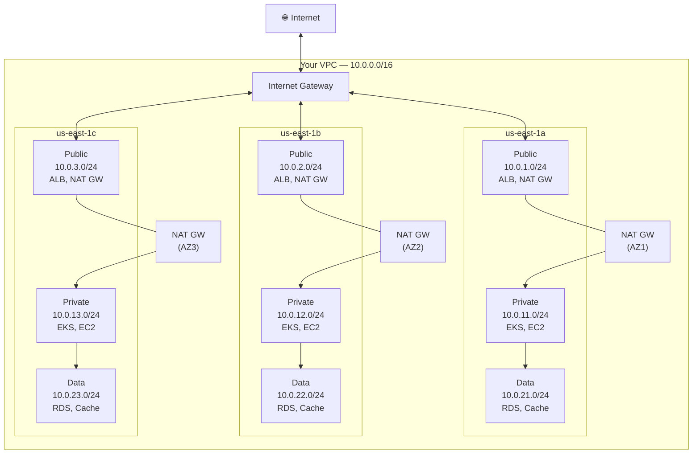
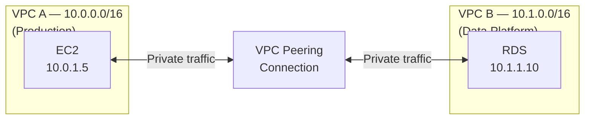
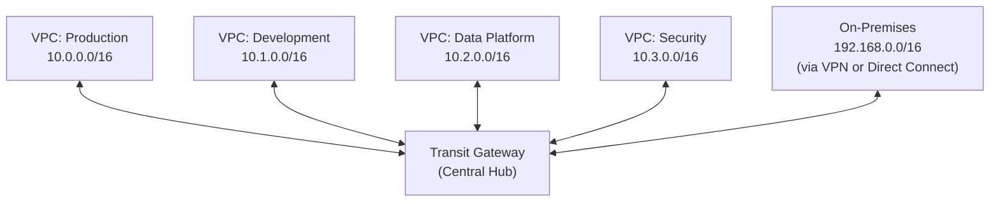
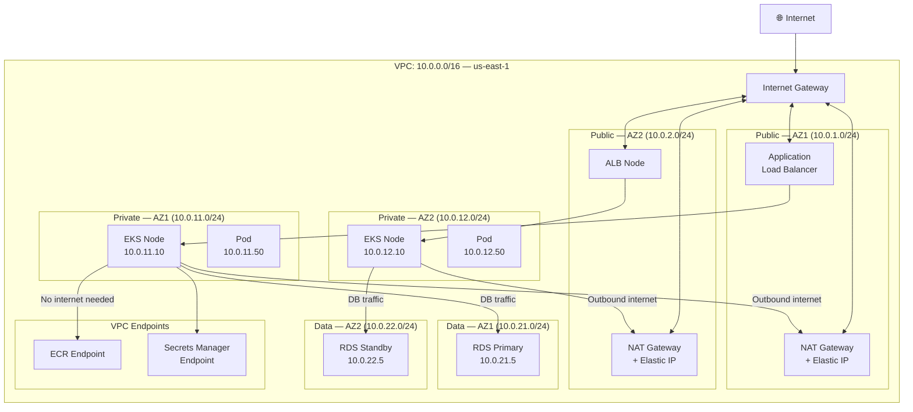
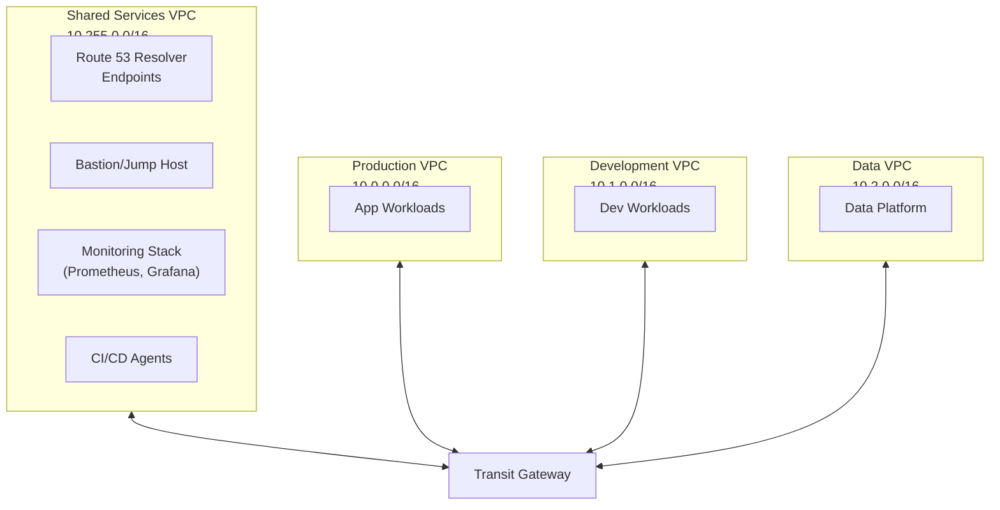
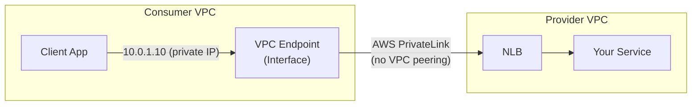
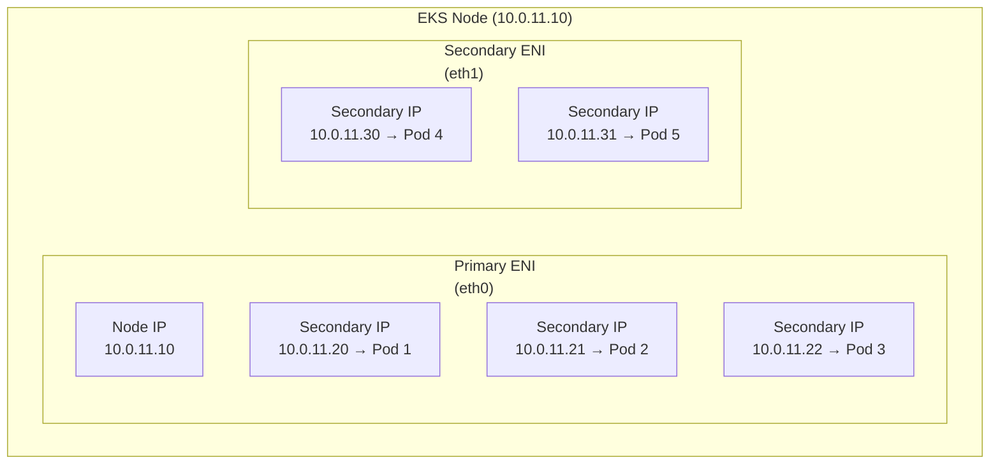

# VPC Networking Deep Dive: Subnets, Routing, NAT, Peering, and Transit Gateway

> Part 4 of the series: *"Networking for DevOps and Cloud Architects: From Packets to Production"*
>
> Prerequisites: [Part 1 — Networking Fundamentals](./01-networking-fundamentals.md) | [Part 2 — DNS Deep Dive](./02-dns-deep-dive.md) | [Part 3 — TLS/SSL Deep Dive](./03-tls-ssl-deep-dive.md)

---

## Table of Contents

- [Why This Matters](#why-this-matters)
- [Mental Model](#mental-model)
- [Core Concepts](#core-concepts)
- [How It Works in Real Production Systems](#how-it-works-in-real-production-systems)
- [End-to-End Traffic Flow Example](#end-to-end-traffic-flow-example)
- [Common Failure Patterns](#common-failure-patterns)
- [Commands Every Engineer Should Know](#commands-every-engineer-should-know)
- [AWS / Cloud Angle](#aws--cloud-angle)
- [Kubernetes Angle](#kubernetes-angle)
- [Troubleshooting Framework](#troubleshooting-framework)
- [Senior Engineer Interview Explanation](#senior-engineer-interview-explanation)
- [Production Checklist](#production-checklist)
- [Key Takeaways](#key-takeaways)

---

## Why This Matters

VPC is the foundation everything else sits on. Your EKS cluster lives in it. Your RDS database lives in it. Your Lambda functions run in it. Your ALBs front it.

Get the VPC design wrong and you spend months patching it — adding subnets you didn't plan for, dealing with IP exhaustion, untangling peering connections that don't scale, and firefighting security incidents from overly permissive security groups.

Get it right and it becomes invisible infrastructure — it just works, scales, and stays secure without constant attention.

Here's the honest truth about VPC problems in production:

- **IP exhaustion kills EKS clusters.** You picked a `/24` subnet for EKS nodes two years ago. Now your pods can't schedule because every IP in the subnet is used. You can't resize subnets. You're doing emergency CIDR surgery at 11pm.
- **Misconfigured route tables silently drop traffic.** Your private subnet has no route to a NAT Gateway. Your EC2 instance tries to call an external API. The request disappears. No error, just a timeout. You spend an hour checking the application before anyone looks at the route table.
- **VPC peering doesn't scale.** You start with 3 VPCs — dev, staging, prod. They all need to talk. Fine, 3 peering connections. A year later you have 15 VPCs and you need 105 peering connections. Each one manually maintained. Someone suggests Transit Gateway at 3am during an incident.
- **Security group sprawl becomes a security audit nightmare.** You let engineers create their own security groups. A year later nobody knows what any of them do, several are `0.0.0.0/0` on all ports, and an audit is asking you to explain all of them.

VPC networking is the layer that either makes everything else easy or makes everything else painful. This article will make it click.

---

## Mental Model

**Think of a VPC like building your own private office building inside AWS.**

You own the building (the VPC). You decide:
- **How many floors and rooms there are** — those are your subnets
- **Which rooms face the street** — those are your public subnets
- **Which rooms are internal-only** — those are your private subnets
- **Who can enter the building** — that's your Internet Gateway
- **What the internal phone directory looks like** — that's your route table
- **Who can enter each room** — that's your security groups
- **Who can enter each floor** — that's your Network ACLs
- **How you connect to other buildings** — that's VPC Peering or Transit Gateway
- **A side door to AWS services without going outside** — that's VPC Endpoints

Every concept maps to something intuitive in this model. When you're confused about how something works, come back to the building.

---

## Core Concepts

### 1. The VPC — Your Private Network in AWS

A VPC (Virtual Private Cloud) is your isolated private network inside AWS. Think of it as buying a block of IP addresses and saying "everything I build in AWS will live inside this address space and be isolated from everyone else."

When you create a VPC, you give it a CIDR block — a range of IP addresses that belong to you:

```
VPC CIDR: 10.0.0.0/16
```

This gives you IP addresses from `10.0.0.0` to `10.0.255.255` — 65,536 addresses. Everything inside your VPC gets an IP from this range. Nothing else in the AWS world touches these IPs unless you explicitly allow it.

**Why `/16` is the standard starting point:**

A `/16` gives you 65,536 addresses to distribute across subnets, availability zones, and workloads. It sounds like a lot. It isn't when:
- Each EKS pod consumes a real VPC IP (with AWS VPC CNI)
- You have 50 nodes × 30 pods each = 1,500 pod IPs
- Plus node IPs, load balancer IPs, RDS IPs, Lambda ENIs...

Start with `/16`. Never start smaller.

**AWS does something at creation time that surprises engineers:** AWS reserves 5 IPs in every subnet you create. If you create a `/24` subnet (256 addresses), you only get 251 usable IPs. This matters when planning EKS subnets.

---

### 2. Subnets — Dividing Your VPC into Rooms

A subnet is a slice of your VPC's IP range, tied to a single Availability Zone.

```
VPC: 10.0.0.0/16

Subnet A (us-east-1a): 10.0.1.0/24   → 251 usable IPs
Subnet B (us-east-1b): 10.0.2.0/24   → 251 usable IPs
Subnet C (us-east-1c): 10.0.3.0/24   → 251 usable IPs
```

**The most important concept: subnets are not inherently public or private.**

A subnet becomes "public" or "private" based on its **route table** — specifically, whether it has a route to the Internet Gateway. That's it. There is no "public subnet" checkbox. It's purely a routing decision.

```
Public Subnet Route Table:
  10.0.0.0/16  →  local         (stay inside VPC)
  0.0.0.0/0    →  igw-xxxx      (everything else → Internet)

Private Subnet Route Table:
  10.0.0.0/16  →  local         (stay inside VPC)
  0.0.0.0/0    →  nat-xxxx      (everything else → NAT Gateway)

Isolated Subnet Route Table (data tier):
  10.0.0.0/16  →  local         (stay inside VPC, nothing else)
```

**A well-structured production VPC has three tiers of subnets:**



**Why three tiers?**

- **Public subnets:** Only things that *need* a public IP live here. ALBs, NAT Gateways. Nothing else.
- **Private subnets:** Your compute. EKS nodes, EC2 instances, Lambda. They can reach the internet through NAT (outbound only) but can't be reached from the internet directly.
- **Data subnets:** Databases, caches. No internet route at all — not even NAT. The only traffic in or out is from within your VPC.

This is defense in depth. If an attacker somehow compromises a pod in your private subnet, they still can't directly reach your database from the internet — the data subnet has no internet path.

---

### 3. The Internet Gateway — Your Building's Front Door

An Internet Gateway (IGW) is what connects your VPC to the internet. Without one, nothing in your VPC can reach the internet and nothing on the internet can reach your VPC.

**An IGW is:**
- Attached to your VPC (one IGW per VPC)
- Horizontally scaled and highly available by AWS — you never worry about it going down
- A two-way door: allows outbound traffic from public subnets AND allows inbound traffic from the internet (to instances with public IPs)

**An IGW is NOT:**
- A firewall (security groups and NACLs handle that)
- Available to private subnets (by design — that's the whole point)
- Something you manage or scale yourself

**The common misconception:** Engineers sometimes think "if I attach a public IP to my EC2 instance, it can reach the internet." Half right. It also needs a route to the IGW in its subnet's route table. Both are required.

```
EC2 with public IP + no IGW route = still can't reach internet
EC2 with public IP + IGW route   = can reach internet ✓
```

---

### 4. NAT Gateway — The One-Way Door for Private Resources

Private subnet resources (your EKS pods, EC2 instances) need to reach the internet sometimes — to download packages, call external APIs, pull container images. But you don't want the internet reaching them directly.

A NAT Gateway solves this. It sits in a public subnet and acts as a translator:

```
Private EC2 (10.0.11.5) wants to reach api.stripe.com (54.12.3.4)

1. EC2 sends packet: src=10.0.11.5, dst=54.12.3.4
2. Route table sends it to NAT Gateway (10.0.1.10)
3. NAT Gateway translates: src=52.23.45.67 (Elastic IP), dst=54.12.3.4
4. Packet goes to internet via IGW
5. Response comes back to 52.23.45.67
6. NAT Gateway translates back: src=54.12.3.4, dst=10.0.11.5
7. EC2 receives the response
```

From the internet's perspective, the request came from the NAT Gateway's Elastic IP — not from the private EC2. The private IP is completely hidden.

**Key rule: NAT is outbound-only.** The internet cannot initiate a connection to your private EC2 through a NAT Gateway. That's the whole point. If you need inbound traffic, use an ALB or NLB in a public subnet.

**One NAT Gateway per AZ — this is not optional in production:**

A single NAT Gateway in one AZ means all three AZs' outbound traffic routes through it. If that AZ has issues, your entire cluster loses outbound internet access. NAT Gateways are cheap compared to the cost of that outage.

```
❌ Bad: One NAT GW in AZ1, all private subnets route to it
✅ Good: NAT GW in each AZ, each private subnet routes to its own AZ's NAT GW
```

**NAT Gateway costs:** There's a per-hour charge AND a per-GB data transfer charge. If your EKS pods are pulling large container images from ECR through NAT Gateway, the data costs add up fast. The fix is VPC Endpoints for ECR — traffic stays on AWS's internal network and doesn't go through NAT.

---

### 5. Route Tables — The Traffic Director

A route table is a list of rules that tells your subnet: "if a packet is going to *this* destination, send it *this* way."

Every subnet must have exactly one route table. Every route table has at least one rule — the `local` route that covers your VPC CIDR:

```
Route Table for Private Subnet:
┌─────────────────┬──────────────────────┬──────────┐
│ Destination     │ Target               │ Status   │
├─────────────────┼──────────────────────┼──────────┤
│ 10.0.0.0/16     │ local                │ active   │
│ 0.0.0.0/0       │ nat-0abc123def456    │ active   │
│ 10.100.0.0/16   │ pcx-0xyz789 (peer)   │ active   │
└─────────────────┴──────────────────────┴──────────┘
```

**How routing decisions are made — longest prefix match:**

When a packet arrives, AWS looks at all routes and picks the most specific one (longest matching prefix).

If a packet is going to `10.0.5.50`:
- `10.0.0.0/16` matches (16-bit prefix)
- `0.0.0.0/0` matches (0-bit prefix — matches everything)

The `/16` is more specific, so the packet goes → `local` (stays in VPC). This is correct.

If a packet is going to `8.8.8.8`:
- `10.0.0.0/16` doesn't match
- `0.0.0.0/0` matches → goes to NAT Gateway

This is why `0.0.0.0/0` is called the "default route" — it catches anything that doesn't match a more specific route.

**The silent failure:** If a packet has no matching route at all (no `0.0.0.0/0` and the destination isn't in the VPC CIDR), AWS simply drops it with no notification. The sender gets a timeout. This is a very common misconfiguration — missing the default route in a route table.

---

### 6. Security Groups — Your Per-Resource Firewall

Security groups are stateful firewalls attached to individual resources (EC2 instances, EKS nodes, RDS instances, Lambda ENIs). They control what traffic is allowed in and out.

**Stateful** means: if you allow an inbound connection, the response traffic is automatically allowed back out — you don't need to write a separate outbound rule for return traffic.

**Key characteristics:**

| Feature | Detail |
|---------|--------|
| Attachment | Per ENI (network interface), not per subnet |
| Rules | Allow only — no explicit deny |
| Statefulness | Stateful — return traffic auto-allowed |
| Default behavior | All inbound denied, all outbound allowed |
| Multiple SGs | A resource can have up to 5 SGs (rules are unioned) |

**The power move: reference other security groups instead of IPs**

Instead of:
```
RDS Inbound Rule: Allow port 5432 from 10.0.10.0/24
```

Do this:
```
RDS Inbound Rule: Allow port 5432 from sg-eks-nodes
```

Now *any resource in the `sg-eks-nodes` security group* can reach RDS on port 5432. When you add a new EKS node, it inherits the security group, and it automatically gets DB access. When you remove a resource from the SG, it loses access. Clean, scalable, zero IP management.

**The most common security group mistakes:**

1. `0.0.0.0/0` on port 22 (SSH) — your instance is being port-scanned and brute-forced constantly
2. One mega security group shared by everything — you lose all granularity
3. Copying security groups without understanding them — SG sprawl
4. Forgetting that ALB needs to reach your EKS nodes — ALB SG must be allowed in node SG

---

### 7. Network ACLs — The Floor-Level Checkpoint

While security groups work at the resource level, Network ACLs (NACLs) work at the *subnet* level. Every subnet has a NACL. Traffic entering or leaving a subnet passes through the NACL.

**NACLs vs. Security Groups — the critical differences:**

| Feature | Security Group | Network ACL |
|---------|---------------|-------------|
| Level | Resource (ENI) | Subnet |
| Statefulness | Stateful | **Stateless** |
| Rule types | Allow only | Allow AND Deny |
| Rule evaluation | All rules evaluated | Rules evaluated in order, first match wins |
| Default | Deny all inbound | Allow all (default NACL) |

**Stateless means:** You must explicitly allow BOTH inbound AND outbound traffic — including ephemeral return ports. 

A request from a client to your web server on port 443:
- **Security group:** Allow inbound 443 → response automatically allowed
- **NACL inbound rule:** Allow inbound 443 ✓
- **NACL outbound rule:** Must also allow outbound **ephemeral ports 1024-65535** for the response

Forgetting ephemeral ports in NACL rules is one of the most common "why is this randomly not working" problems in AWS.

**When to use NACLs:**

NACLs are your subnet-level emergency stop. Use them to:
- Blanket-block a CIDR that's DDoS attacking you
- Add a second layer of isolation between subnet tiers
- Audit-required network controls at the subnet boundary

For day-to-day traffic control, use security groups. They're stateful, easier to reason about, and more granular.

---

### 8. VPC Peering — Connecting Two VPCs Directly

VPC Peering is a direct, private connection between two VPCs. Traffic flows over AWS's internal network — never touches the internet.



**To make peering work, three things must be done:**
1. Create the peering connection (and accept it if cross-account)
2. Add routes in *both* VPCs' route tables pointing each other's CIDR at the peering connection
3. Update security groups to allow traffic from the peer VPC's CIDR

Miss any of these and it silently doesn't work. Forget step 3 and you'll think peering is broken when the security group is blocking.

**The peering limitation that catches teams:** Peering is **not transitive**.

```
VPC A  ←peered→  VPC B  ←peered→  VPC C

VPC A CANNOT talk to VPC C through VPC B.
Each VPC pair needs its own peering connection.
```

With 3 VPCs that all need to talk: 3 connections.
With 5 VPCs: 10 connections.
With 10 VPCs: 45 connections.
With 20 VPCs: 190 connections.

This is why peering doesn't scale past ~5 VPCs, and why Transit Gateway exists.

**CIDR overlap is fatal for peering.** If VPC A uses `10.0.0.0/16` and VPC B also uses `10.0.0.0/16`, you cannot peer them. Ever. AWS will reject it. This is a painful lesson if you learn it after the fact — it requires re-addressing an entire VPC.

---

### 9. Transit Gateway — The Hub for Connecting Everything

Transit Gateway (TGW) is a centralized router that connects VPCs, on-premises networks, and VPN connections through a single hub.



**Why TGW changes the game:**

With peering, 5 VPCs need 10 connections, all manually managed. With TGW, 5 VPCs each attach to one hub — 5 connections, and every VPC can reach every other VPC automatically.

More importantly, TGW supports routing *policies*. You can allow `Production → Data Platform` while blocking `Development → Production`. Try doing that cleanly with mesh peering.

**TGW Route Tables — where the power is:**

TGW has its own route tables, separate from VPC route tables. You can:
- Create multiple TGW route tables for different network segments
- Block communication between environments at the TGW level
- Inspect all inter-VPC traffic through a centralized firewall VPC

```
TGW Route Table: Production
  10.0.0.0/16  → VPC-Production attachment
  10.2.0.0/16  → VPC-DataPlatform attachment
  192.168.0.0/16 → VPN attachment
  (NO route to VPC-Development — isolated by design)
```

**TGW costs:** There's a per-attachment-hour charge and a per-GB charge. For light traffic between a few VPCs, TGW can be more expensive than peering. For complex multi-VPC architectures, it's worth every cent in operational simplicity.

---

### 10. VPC Endpoints — Reaching AWS Services Without Leaving Your Network

VPC Endpoints let your resources call AWS services (S3, DynamoDB, ECR, Secrets Manager) without the traffic going through NAT Gateway or the internet.

**Why this matters:**

Without VPC endpoints, your EKS pod pulling an image from ECR takes this path:
```
Pod → NAT Gateway → Internet → ECR → Internet → NAT Gateway → Pod
```

With a VPC endpoint for ECR:
```
Pod → VPC Endpoint (private, stays on AWS network) → ECR → Pod
```

No NAT. No internet. Faster. Cheaper. More secure.

**Two types of VPC Endpoints:**

**Gateway Endpoints** (free):
- Only for S3 and DynamoDB
- Added as entries in your route table
- No cost whatsoever

**Interface Endpoints** (cost per AZ per hour):
- For everything else: ECR, Secrets Manager, SSM, STS, CloudWatch, etc.
- Creates an ENI in your subnet with a private IP
- Your resources connect to that private IP

```
# Common interface endpoints to create for EKS:
com.amazonaws.us-east-1.ecr.api        # ECR API
com.amazonaws.us-east-1.ecr.dkr        # ECR Docker registry
com.amazonaws.us-east-1.s3             # S3 (can use gateway too)
com.amazonaws.us-east-1.secretsmanager # Secrets Manager
com.amazonaws.us-east-1.ssm            # SSM Parameter Store
com.amazonaws.us-east-1.sts            # IAM STS (for IRSA)
```

**The payback calculation:** An ECR interface endpoint costs ~$7/AZ/month. If you're running 50 EKS nodes pulling images regularly through NAT, the NAT data transfer costs dwarf $7/month easily. Run the numbers for your workload.

---

## How It Works in Real Production Systems

### The Complete Production VPC Architecture

Here's what a production-ready VPC actually looks like when all the pieces come together:



---

### CIDR Planning for EKS — Where Engineers Get Burned

EKS with AWS VPC CNI assigns a real VPC IP to *every pod*. Not just nodes — every single pod.

Let's do the math for a modest cluster:
- 20 EKS nodes × 30 pods each = 600 pod IPs
- 20 node IPs
- Headroom for rolling deployments (2× pods briefly)
- Total: ~1,400 IPs needed in your private subnets

A `/24` subnet has 251 usable IPs. Three AZs × 251 = 753 IPs. You're already tight before you've deployed anything.

**Recommended EKS subnet sizing:**

| Cluster Size | Nodes | Pods (est.) | Recommended Subnet | IPs per AZ |
|-------------|-------|-------------|-------------------|------------|
| Small | 5–10 | ~200 | /22 | 1,019 |
| Medium | 20–50 | ~1,500 | /21 | 2,043 |
| Large | 100+ | ~3,000+ | /20 | 4,091 |

Go bigger than you think you need. You cannot resize a subnet. The pain of IP exhaustion is worse than the cost of unused IP space (which costs nothing in AWS).

---

### The "Secondary CIDR" Rescue Operation

If you've already shipped with small subnets and you're running out of IPs, AWS lets you add a secondary CIDR block to an existing VPC.

```bash
# Add a secondary CIDR block to your VPC
aws ec2 associate-vpc-cidr-block \
  --vpc-id vpc-xxxx \
  --cidr-block 100.64.0.0/16
```

Then create new subnets from the secondary CIDR and configure EKS to use them for pods via the `ENABLE_PREFIX_DELEGATION` option in AWS VPC CNI.

This is emergency surgery. It works, but it's messy. Plan your CIDRs upfront.

---

## End-to-End Traffic Flow Example

**Scenario: An EKS pod in a private subnet calls the Stripe API at `api.stripe.com`**

```
┌─────────────────────────────────────────────────────────────────────┐
│ Step 1: DNS Resolution                                              │
│                                                                     │
│  Pod queries CoreDNS → CoreDNS forwards to Route 53 Resolver       │
│  Route 53 resolves api.stripe.com → 104.18.12.67                   │
│  (See Part 2 for DNS details)                                       │
└──────────────────────────────┬──────────────────────────────────────┘
                               │
┌──────────────────────────────▼──────────────────────────────────────┐
│ Step 2: Pod sends packet                                            │
│                                                                     │
│  Source:      10.0.11.50 (pod IP in private subnet)                │
│  Destination: 104.18.12.67 (Stripe API)                            │
│  Port:        443                                                   │
└──────────────────────────────┬──────────────────────────────────────┘
                               │
┌──────────────────────────────▼──────────────────────────────────────┐
│ Step 3: Route table lookup (private subnet 10.0.11.0/24)           │
│                                                                     │
│  Destination 104.18.12.67...                                        │
│  ✗ Not in 10.0.0.0/16 (local)                                      │
│  ✓ Matches 0.0.0.0/0 → nat-0abc123 (NAT Gateway in AZ1)           │
│                                                                     │
│  Packet forwarded to NAT Gateway                                    │
└──────────────────────────────┬──────────────────────────────────────┘
                               │
┌──────────────────────────────▼──────────────────────────────────────┐
│ Step 4: NAT Gateway translates                                      │
│                                                                     │
│  NAT Gateway receives packet: src=10.0.11.50, dst=104.18.12.67    │
│  Translates source: src=52.23.45.67 (Elastic IP), dst=104.18.12.67 │
│  Records translation in state table for return traffic              │
│                                                                     │
│  Packet forwarded to Internet Gateway                               │
└──────────────────────────────┬──────────────────────────────────────┘
                               │
┌──────────────────────────────▼──────────────────────────────────────┐
│ Step 5: Internet Gateway sends packet to internet                   │
│                                                                     │
│  Public route table for public subnet has:                          │
│  0.0.0.0/0 → igw-xxxx                                              │
│                                                                     │
│  Packet exits to internet → reaches Stripe's servers               │
└──────────────────────────────┬──────────────────────────────────────┘
                               │
┌──────────────────────────────▼──────────────────────────────────────┐
│ Step 6: Response comes back                                         │
│                                                                     │
│  Stripe responds to 52.23.45.67:ephemeral_port                     │
│  IGW receives response, routes to NAT Gateway                      │
│  NAT checks state table: 52.23.45.67:port → 10.0.11.50:port       │
│  Translates destination back: dst=10.0.11.50                       │
│  Routes to private subnet → arrives at pod                         │
└─────────────────────────────────────────────────────────────────────┘
```

**What breaks in this flow:**

| Breaking point | Symptom | Fix |
|---------------|---------|-----|
| No `0.0.0.0/0` → NAT in route table | Connection timeout | Add route to private subnet route table |
| NAT Gateway in wrong AZ | Traffic crosses AZ (costs money, works) or fails (if AZ issue) | Use per-AZ NAT Gateways |
| Security group blocks outbound 443 | Connection timeout | Allow outbound 443 in node/pod security group |
| NAT Gateway doesn't exist | Connection timeout | Create NAT GW in public subnet |
| No route from public subnet to IGW | NAT Gateway can't reach internet | Add `0.0.0.0/0 → igw` to public subnet route table |

---

## Common Failure Patterns

### Failure 1: Private Subnet Has No Internet Access

**Symptom:**
- Pods can't pull container images
- EC2 instances can't install packages
- External API calls time out
- `curl https://google.com` from inside the subnet → no response

**Likely cause:**
The private subnet's route table is missing `0.0.0.0/0 → NAT Gateway`, or the NAT Gateway itself doesn't exist, or the NAT Gateway's public subnet doesn't have a route to the IGW.

**Verify:**
```bash
# Find which subnet your resource is in
aws ec2 describe-instances \
  --instance-ids i-xxxx \
  --query 'Reservations[*].Instances[*].SubnetId'

# Check that subnet's route table
aws ec2 describe-route-tables \
  --filters "Name=association.subnet-id,Values=subnet-xxxx" \
  --query 'RouteTables[*].Routes'

# Check NAT Gateway status
aws ec2 describe-nat-gateways \
  --filter "Name=state,Values=available" \
  --query 'NatGateways[*].{ID:NatGatewayId,State:State,SubnetId:SubnetId}'
```

**Fix:** Add the missing route. If NAT Gateway doesn't exist, create one in a public subnet and associate an Elastic IP. If the public subnet doesn't have an IGW route, add it.

---

### Failure 2: EKS Pod IP Exhaustion

**Symptom:**
- New pods stuck in `Pending` forever
- `kubectl describe pod <name>` shows: `Failed to create pod sandbox: ... failed to allocate for range 0: no IP addresses available in range set`
- All pod IPs in the subnet are assigned

**Likely cause:**
EKS subnets are too small. Every pod gets a real VPC IP. When IPs are exhausted, pods can't be scheduled.

**Verify:**
```bash
# Check how many IPs are available in your EKS subnets
aws ec2 describe-subnets \
  --subnet-ids subnet-xxxx subnet-yyyy \
  --query 'Subnets[*].{ID:SubnetId,Available:AvailableIpAddressCount,CIDR:CidrBlock}'

# Check how many IPs are in use per node (AWS VPC CNI)
kubectl get node -o json | \
  jq '.items[] | {name: .metadata.name, allocatable: .status.allocatable["vpc.amazonaws.com/pod-eni"]}'
```

**Fix (emergency):** Scale down non-critical workloads to free IPs. Add secondary CIDR block and new subnets. Configure VPC CNI prefix delegation.

**Fix (proper):** Plan bigger subnets from the start. Use `/21` or `/20` for EKS private subnets.

---

### Failure 3: VPC Peering Traffic Not Flowing

**Symptom:**
- Peering connection shows `active` in the console
- But `nc -zv 10.1.1.5 5432` times out
- Everything *looks* configured

**Likely cause:** One of three things always:
1. Route tables in one or both VPCs are missing routes pointing to the peering connection
2. Security groups don't allow traffic from the peer VPC CIDR
3. CIDR overlap between the two VPCs (peering accepted but routing is broken)

**Verify:**
```bash
# Check routes in the source VPC for the peering connection
aws ec2 describe-route-tables \
  --filters "Name=association.subnet-id,Values=subnet-source" \
  --query 'RouteTables[*].Routes[?GatewayId!=`local`]'

# Check routes in the destination VPC
aws ec2 describe-route-tables \
  --filters "Name=association.subnet-id,Values=subnet-destination" \
  --query 'RouteTables[*].Routes'

# Check peering connection status
aws ec2 describe-vpc-peering-connections \
  --query 'VpcPeeringConnections[*].{Status:Status.Code,ID:VpcPeeringConnectionId}'
```

**Fix:** Add routes on BOTH sides. `VPC-A route table → 10.1.0.0/16 → pcx-xxxx`. `VPC-B route table → 10.0.0.0/16 → pcx-xxxx`. Update security groups to allow source CIDR from the peer.

---

### Failure 4: Security Group Allows Traffic But It's Still Blocked

**Symptom:**
- Security group shows the right rule
- But traffic is still timing out
- Very confusing

**Likely cause:** A Network ACL is blocking the traffic at the subnet level. Engineers forget NACLs exist because the default NACL allows everything. But if someone added a custom NACL...

**Also possible:** You updated the security group on the wrong resource. There are two SGs to check — source (outbound rule) and destination (inbound rule). Both must be correct.

**Verify:**
```bash
# Check the NACL for the destination subnet
aws ec2 describe-network-acls \
  --filters "Name=association.subnet-id,Values=subnet-destination" \
  --query 'NetworkAcls[*].Entries'

# Check all security groups on the destination resource
aws ec2 describe-instances \
  --instance-ids i-destination \
  --query 'Reservations[*].Instances[*].SecurityGroups'

# Check VPC Flow Logs for REJECT entries
# (Enables you to see exactly which packet was rejected and where)
aws logs filter-log-events \
  --log-group-name vpc-flow-logs \
  --filter-pattern "REJECT" \
  --start-time $(date -d '10 minutes ago' +%s000)
```

**Fix:** Update the NACL to allow the traffic, remembering to allow both inbound AND outbound (including ephemeral return ports). Or find the correct SG and update the right rule.

---

### Failure 5: Cross-AZ NAT Gateway Traffic (The Silent Cost Problem)

**Symptom:**
- No connectivity issues, but AWS bill is higher than expected
- Data transfer costs in Cost Explorer show high inter-AZ transfer

**Cause:** Private subnets in AZ2 and AZ3 are routing their outbound internet traffic to a NAT Gateway that only exists in AZ1. The traffic crosses AZ boundaries — which AWS charges for at $0.01/GB.

This isn't a failure — traffic still works. But it's a cost and resilience problem.

**Verify:**
```bash
# List all NAT Gateways and their subnets/AZs
aws ec2 describe-nat-gateways \
  --filter "Name=state,Values=available" \
  --query 'NatGateways[*].{ID:NatGatewayId,Subnet:SubnetId}'

# Check route tables for private subnets in each AZ
# They should each point to their own AZ's NAT GW, not all to one
aws ec2 describe-route-tables \
  --filters "Name=route.destination-cidr-block,Values=0.0.0.0/0" \
  --query 'RouteTables[*].{Subnet:Associations[0].SubnetId,Target:Routes[?DestinationCidrBlock==`0.0.0.0/0`].NatGatewayId}'
```

**Fix:** Create a NAT Gateway in each AZ. Update each private subnet's route table to point `0.0.0.0/0` to its local AZ's NAT Gateway.

---

## Commands Every Engineer Should Know

### Core AWS CLI Commands for VPC Debugging

```bash
# ── VPC ──────────────────────────────────────────────────────────────

# List all VPCs with their CIDRs
aws ec2 describe-vpcs \
  --query 'Vpcs[*].{ID:VpcId,CIDR:CidrBlock,Name:Tags[?Key==`Name`].Value|[0]}'

# ── Subnets ──────────────────────────────────────────────────────────

# List subnets with available IPs
aws ec2 describe-subnets \
  --query 'Subnets[*].{ID:SubnetId,AZ:AvailabilityZone,CIDR:CidrBlock,Available:AvailableIpAddressCount}'

# Find which subnet an instance is in
aws ec2 describe-instances \
  --instance-ids i-xxxx \
  --query 'Reservations[*].Instances[*].{SubnetId:SubnetId,PrivateIP:PrivateIpAddress}'

# ── Route Tables ─────────────────────────────────────────────────────

# Get route table for a specific subnet
aws ec2 describe-route-tables \
  --filters "Name=association.subnet-id,Values=subnet-xxxx" \
  --query 'RouteTables[*].Routes'

# List all routes — find where 0.0.0.0/0 goes in each route table
aws ec2 describe-route-tables \
  --query 'RouteTables[*].{ID:RouteTableId,Routes:Routes[?DestinationCidrBlock==`0.0.0.0/0`]}'

# ── Security Groups ───────────────────────────────────────────────────

# Show all inbound rules for a security group
aws ec2 describe-security-groups \
  --group-ids sg-xxxx \
  --query 'SecurityGroups[*].IpPermissions'

# Find all security groups allowing SSH from anywhere (security audit)
aws ec2 describe-security-groups \
  --query 'SecurityGroups[?IpPermissions[?FromPort==`22` && IpRanges[?CidrIp==`0.0.0.0/0`]]].{Name:GroupName,ID:GroupId}'

# ── NAT Gateways ──────────────────────────────────────────────────────

# List all NAT Gateways with their state and subnet
aws ec2 describe-nat-gateways \
  --filter "Name=state,Values=available" \
  --query 'NatGateways[*].{ID:NatGatewayId,Subnet:SubnetId,State:State,EIP:NatGatewayAddresses[0].PublicIp}'

# ── VPC Flow Logs ─────────────────────────────────────────────────────

# Check if flow logs are enabled on your VPC
aws ec2 describe-flow-logs \
  --filter "Name=resource-id,Values=vpc-xxxx"

# Search for rejected traffic in the last 30 minutes
aws logs filter-log-events \
  --log-group-name /vpc/flow-logs \
  --filter-pattern "[version, account, eni, source, destination, srcport, destport, protocol, packets, bytes, start, end, action=REJECT, log_status]" \
  --start-time $(date -d '30 minutes ago' +%s000)
```

---

### Network Connectivity Tests from Inside a VPC

```bash
# ── From an EC2 instance or via kubectl exec ──────────────────────────

# Test if internet access works (basic)
curl -s --connect-timeout 5 https://checkip.amazonaws.com
# Returns your public IP (the NAT Gateway's EIP) if working

# Test connectivity to another resource in the VPC
nc -zv 10.0.21.5 5432    # Can I reach RDS?

# Trace the route packets take (shows NAT GW hop)
traceroute -n 8.8.8.8

# See what your default gateway is
ip route show
# Should show something like: default via 10.0.11.1 dev eth0

# Check if you can reach S3 via VPC endpoint (no internet needed)
curl https://s3.amazonaws.com
# If this works from a private subnet with S3 endpoint → endpoint working
# If this fails → might be going through NAT (or NAT is broken)

# ── From inside a Kubernetes pod ─────────────────────────────────────

# Launch a debug pod
kubectl run debug --image=nicolaka/netshoot --rm -it --restart=Never

# Inside the pod:
curl -s https://checkip.amazonaws.com    # What's my public IP?
traceroute 8.8.8.8                       # What path does traffic take?
cat /etc/resolv.conf                     # What DNS am I using?
ip route                                 # What's my routing table?
```

---

### VPC Flow Logs — Your Network Truth Serum

VPC Flow Logs capture metadata about every network flow in your VPC. They don't capture payload content — just the headers: source IP, destination IP, port, protocol, whether it was accepted or rejected.

**Enable flow logs:**
```bash
# Enable VPC flow logs to CloudWatch
aws ec2 create-flow-logs \
  --resource-type VPC \
  --resource-ids vpc-xxxx \
  --traffic-type ALL \
  --log-group-name /vpc/flow-logs \
  --deliver-logs-permission-arn arn:aws:iam::xxxx:role/vpc-flow-log-role
```

**Query flow logs with CloudWatch Insights:**
```
# Find all REJECT events in the last hour
fields @timestamp, srcAddr, dstAddr, srcPort, dstPort, protocol, action
| filter action = "REJECT"
| sort @timestamp desc
| limit 50

# Find all traffic to a specific destination IP
fields @timestamp, srcAddr, dstAddr, dstPort, action
| filter dstAddr = "10.0.21.5"
| sort @timestamp desc

# Find traffic from a specific source IP
fields @timestamp, srcAddr, dstAddr, dstPort, action
| filter srcAddr = "10.0.11.50"
| sort @timestamp desc
```

Flow logs are your ground truth. When all other debugging has failed and you're not sure if traffic is even reaching the destination, flow logs tell you definitively. Enable them on every VPC in production.

---

## AWS / Cloud Angle

### The Shared Services VPC Pattern

In multi-account AWS environments (AWS Organizations), a common pattern is to have a centralized "Shared Services" or "Hub" VPC connected via Transit Gateway to all spoke VPCs:



Benefits of this pattern:
- One bastion host manages SSH access to all accounts
- One monitoring stack collects metrics from all VPCs
- One set of Route 53 Resolver forwarding rules handles hybrid DNS for all accounts
- CI/CD agents in the shared VPC can deploy to any environment

---

### AWS PrivateLink — Sharing Services Without Peering

VPC Peering exposes your *entire VPC* to the peer. PrivateLink exposes a *single service* from your VPC to other VPCs — nothing else.



The consumer VPC gets a private IP in their own subnet that connects to your service. They never see your VPC's CIDR. They can't accidentally reach anything else in your VPC.

**When to use PrivateLink instead of peering:**
- Selling a service to other teams or customers
- Exposing a shared service (logging, monitoring, auth) to many VPCs without CIDR conflict risk
- Compliance requirements for strict service isolation

AWS services you use every day (ECR, Secrets Manager, S3) use this exact mechanism for VPC Interface Endpoints — you're connecting to AWS's PrivateLink-based services.

---

## Kubernetes Angle

### How AWS VPC CNI Works

The AWS VPC CNI plugin is what gives EKS pods real VPC IP addresses. Understanding this prevents a lot of confusion.

**The traditional Kubernetes approach (overlay network):**
```
Pod IP: 192.168.1.5 (virtual, only exists inside the cluster)
Node IP: 10.0.11.10 (real VPC IP)
Traffic from outside cluster → Node IP → translated to Pod IP
```

**The AWS VPC CNI approach:**
```
Pod IP: 10.0.11.50 (real VPC IP!)
Node IP: 10.0.11.10 (real VPC IP)
Traffic from anywhere in VPC → Pod IP directly (no translation needed)
```

How it does this: The CNI plugin requests secondary IP addresses from AWS for each node's ENI. These secondary IPs are assigned to pods. From the VPC's perspective, each pod IP is just another IP address on that node's network interface.



**The max pods per node is determined by ENI limits**, not CPU/memory. Each EC2 instance type supports a maximum number of ENIs and secondary IPs per ENI:

```bash
# Check how many pods a node type can support
# Formula: (max ENIs × max IPs per ENI) - 1
# For m5.xlarge: (4 ENIs × 15 IPs) - 1 = 59 max pods

aws ec2 describe-instance-types \
  --instance-types m5.xlarge \
  --query 'InstanceTypes[*].NetworkInfo.{MaxENIs:MaximumNetworkInterfaces,MaxIPs:Ipv4AddressesPerInterface}'
```

When you're hitting pod scheduling failures that aren't about IP exhaustion but about pod density, this is the limit you're hitting. The fix: use larger instance types (more ENIs) or enable prefix delegation (each IP can serve a /28 prefix, 16 pod IPs).

---

### EKS Networking Security with NetworkPolicy

By default, any pod in any namespace can reach any other pod. That's a terrible security posture for production.

AWS VPC CNI now supports Kubernetes NetworkPolicy natively. Enable it and add a default-deny policy per namespace:

```yaml
# Default deny all in the production namespace
apiVersion: networking.k8s.io/v1
kind: NetworkPolicy
metadata:
  name: default-deny-all
  namespace: production
spec:
  podSelector: {}        # applies to all pods in namespace
  policyTypes:
  - Ingress
  - Egress
---
# Explicitly allow payment-service to reach database
apiVersion: networking.k8s.io/v1
kind: NetworkPolicy
metadata:
  name: allow-payment-to-db
  namespace: production
spec:
  podSelector:
    matchLabels:
      app: postgres
  policyTypes:
  - Ingress
  ingress:
  - from:
    - podSelector:
        matchLabels:
          app: payment-service
    ports:
    - port: 5432
```

Without NetworkPolicy, a compromised pod can reach every other service in the cluster. With NetworkPolicy and default-deny, a compromised pod is isolated — it can only reach what you explicitly allowed.

---

## Troubleshooting Framework

When something can't connect in your VPC, work through these steps methodically. Don't skip steps.

### Step 1: Can the source resource reach anything?

```bash
# From the source (EC2 or pod)
curl -s --connect-timeout 5 https://checkip.amazonaws.com
ping -c 3 10.0.0.1    # Try to ping VPC router
```

If nothing works → route table issue, or the resource itself has no network. Check the route table first.

### Step 2: What does the route table say?

```bash
aws ec2 describe-route-tables \
  --filters "Name=association.subnet-id,Values=<source-subnet>" \
  --query 'RouteTables[*].Routes'
```

Is there a route for the destination? Is there a `0.0.0.0/0` route pointing somewhere sensible? If not, that's your problem.

### Step 3: Is the destination reachable at the IP layer?

```bash
# TCP connect test (more reliable than ping in AWS)
nc -zv <destination-ip> <port>
```

Timeout → firewall (security group or NACL) or routing hole.
Refused → destination is up, nothing listening on that port.

### Step 4: Is the security group right?

```bash
# Check destination resource's inbound rules
aws ec2 describe-security-groups \
  --group-ids <destination-sg> \
  --query 'SecurityGroups[*].IpPermissions'

# Does it allow the source's IP/SG on the correct port?
```

### Step 5: Is there a NACL blocking it?

```bash
aws ec2 describe-network-acls \
  --filters "Name=association.subnet-id,Values=<destination-subnet>" \
  --query 'NetworkAcls[*].Entries'

# Check BOTH inbound and outbound rules
# Check for deny rules before the allow rules (NACLs evaluate in order)
# Check that ephemeral ports (1024-65535) are allowed outbound
```

### Step 6: Check VPC Flow Logs for the final answer

```bash
# Look for REJECT entries with the source and destination IPs
aws logs filter-log-events \
  --log-group-name /vpc/flow-logs \
  --filter-pattern "REJECT <source-ip> <destination-ip>"
```

If you see `REJECT` in flow logs, you know traffic is reaching the ENI but being blocked (SG or NACL). If you see `ACCEPT` but traffic still fails, the blocking is happening at the application layer — check the app logs.

### Step 7: Is this a peering or routing issue?

```bash
# Check peering connection status
aws ec2 describe-vpc-peering-connections

# Check route tables on BOTH sides of the peering connection
# Both sides must have routes pointing to the peering connection
# for the other VPC's CIDR
```

### Step 8: Can you reproduce it with a simple test?

```bash
# Spin up a test EC2 in the same subnet as the failing resource
# Give it the same security groups
# Try to connect to the destination
# If test EC2 works but original doesn't → it's application-level or different SGs
# If test EC2 also fails → it's the subnet/route table/SG configuration
```

---

## Senior Engineer Interview Explanation

*If asked: "Walk me through how you'd design VPC networking for a multi-team, multi-environment AWS setup."*

---

"I'd start with the account structure. Each major environment — production, staging, development — gets its own AWS account and its own VPC. This gives you blast-radius containment, independent IAM boundaries, and clean cost attribution.

CIDR planning is done upfront and never revisited. I'd allocate non-overlapping CIDRs across all VPCs — overlapping CIDRs can never be peered. Something like production gets `10.0.0.0/16`, staging gets `10.1.0.0/16`, development gets `10.2.0.0/16`, shared services gets `10.255.0.0/16`. Document it and treat it like infrastructure code.

Each VPC gets three subnet tiers per AZ: public for load balancers and NAT Gateways, private for compute, and data for databases. EKS subnets get at least `/21` — I've been burned by IP exhaustion and it's not a fun night.

For connectivity, I'd use Transit Gateway. More than 3 VPCs means peering doesn't scale — TGW gives you centralized routing with proper route table policies to control which environments can talk. Production cannot talk to development. Both can talk to shared services.

Security groups follow a reference model — every SG rule references another SG, not a CIDR range where possible. This keeps rules clean as infrastructure scales. Network ACLs are deployed with a deny for known bad CIDRs, but security groups are the primary control.

VPC Flow Logs are enabled everywhere, shipped to S3 with Athena for ad-hoc queries. This is non-negotiable — when something weird happens at 2am, flow logs are the ground truth.

VPC Endpoints for S3, ECR, Secrets Manager, and SSM in every VPC. It keeps traffic off the internet, reduces NAT Gateway costs, and improves security posture.

The two things I've seen teams get consistently wrong: CIDR planning too small for EKS, and single-AZ NAT Gateways as a 'temporary' measure that becomes permanent. I design both of these right from day one."

---

## Production Checklist

### VPC Foundation

- [ ] VPC CIDR is `/16` or larger
- [ ] No CIDR overlap with existing VPCs (needed for future peering/TGW)
- [ ] CIDR planning documented and reviewed before provisioning
- [ ] VPC DNS attributes: `enableDnsSupport: true`, `enableDnsHostnames: true`
- [ ] VPC Flow Logs enabled and shipping to S3 or CloudWatch

### Subnets

- [ ] Three tiers: public, private, data — per AZ
- [ ] Minimum 3 AZs for all production subnets
- [ ] EKS private subnets are `/21` or larger
- [ ] Data subnets have no route to the internet (not even NAT)
- [ ] Subnets tagged correctly (Name, Tier, Environment)

### Routing

- [ ] Public subnets have `0.0.0.0/0 → IGW` in route table
- [ ] Private subnets have `0.0.0.0/0 → NAT GW` (one per AZ, each pointing to its AZ's NAT)
- [ ] Data subnets have NO `0.0.0.0/0` route
- [ ] VPC peering routes added on BOTH sides (if using peering)
- [ ] TGW routes configured in TGW route tables (if using TGW)

### NAT Gateways

- [ ] One NAT Gateway per AZ (not one shared)
- [ ] Each private subnet routes to its own AZ's NAT GW
- [ ] NAT Gateways have Elastic IPs assigned
- [ ] NAT Gateway CloudWatch metrics being monitored

### Security Groups

- [ ] Default security group is not used (create purpose-specific SGs)
- [ ] SG rules reference other SGs, not hardcoded CIDRs where possible
- [ ] No `0.0.0.0/0` on port 22, 3389, or database ports
- [ ] ALB SG whitelisted in EKS node/pod SG for health checks
- [ ] RDS SG only allows source from application tier SG

### Network ACLs

- [ ] Default NACL reviewed — custom rules added if needed
- [ ] Ephemeral ports (1024-65535) allowed outbound in custom NACLs
- [ ] Deny rules added for known bad CIDRs (if needed)

### VPC Endpoints

- [ ] S3 Gateway Endpoint created (free — no reason not to)
- [ ] ECR Interface Endpoints created if running EKS
- [ ] Secrets Manager/SSM Interface Endpoints created
- [ ] Endpoint policies configured to restrict access if needed

### Multi-VPC (if applicable)

- [ ] Transit Gateway deployed for >3 VPCs
- [ ] TGW route tables configured to enforce environment isolation
- [ ] All VPC CIDRs are non-overlapping
- [ ] PrivateLink used for service exposure (not peering) where isolation is needed

---

## Key Takeaways

1. **A subnet is not public or private by nature — it's public or private because of its route table.** A `0.0.0.0/0` route pointing to an IGW makes it public. Pointing to a NAT Gateway makes it private. This single insight resolves most VPC confusion.

2. **Plan CIDR blocks generously and upfront — you cannot change them later.** Subnets cannot be resized. VPCs cannot be re-addressed without rebuilding. The cost of unused IP space is zero. The cost of IP exhaustion is a production incident.

3. **EKS with AWS VPC CNI consumes one IP per pod, not per node.** A 50-node cluster with 30 pods per node needs 1,500+ IPs in your private subnets. Plan for this. `/24` subnets are not enough.

4. **One NAT Gateway per AZ is not over-engineering — it's basic resilience.** Single-AZ NAT means all your private subnets lose internet when that AZ has issues. Three NAT Gateways cost ~$100/month. An outage costs more.

5. **VPC peering doesn't scale past ~5 VPCs.** It's not transitive, each connection is manually maintained, and CIDR overlaps become a hard blocker. Use Transit Gateway before you need it, not after the peering mesh is unmanageable.

6. **VPC Flow Logs are your network ground truth.** When something is unreachable and you can't figure out why, flow logs show you every ACCEPT and REJECT at the ENI level. Enable them on every production VPC and query them with CloudWatch Insights or Athena.

7. **NACLs are stateless — don't forget ephemeral ports.** Security groups handle return traffic automatically. NACLs don't. If you're adding a custom NACL, allow inbound on your service port AND outbound on `1024-65535` for return traffic. Forgetting this causes intermittent connectivity failures that seem impossible to explain.

8. **VPC Endpoints save money and improve security simultaneously.** Routing ECR, S3, and Secrets Manager traffic through VPC Endpoints keeps it off the internet, removes NAT Gateway data costs, and means a compromised NAT Gateway can't intercept that traffic. There's no downside.

---

*Next in the series: [Part 5 — Kubernetes Networking Deep Dive: CNI, kube-proxy, Services, and Ingress](./05-kubernetes-networking.md)*

---

> **Feedback or corrections?** Open an issue or PR. This is a living document.
