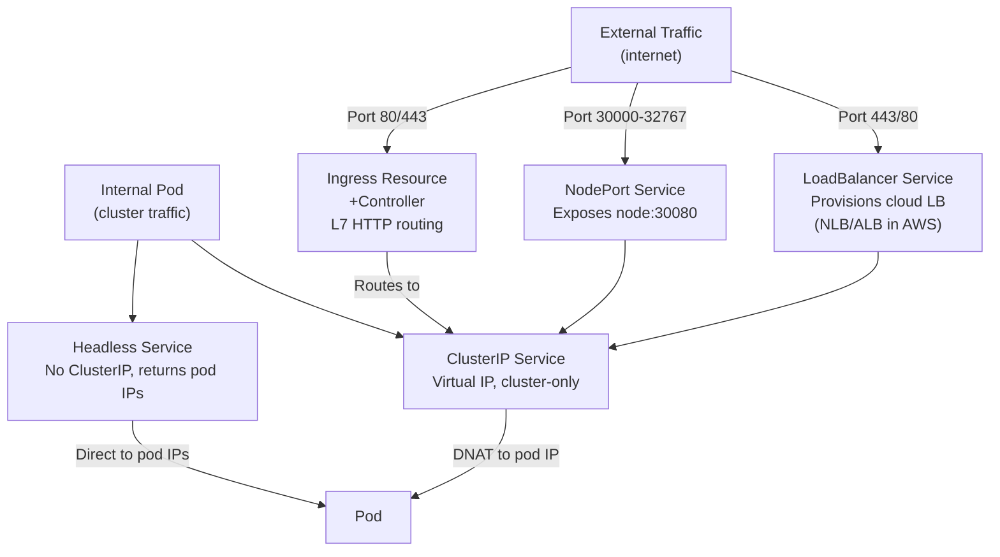
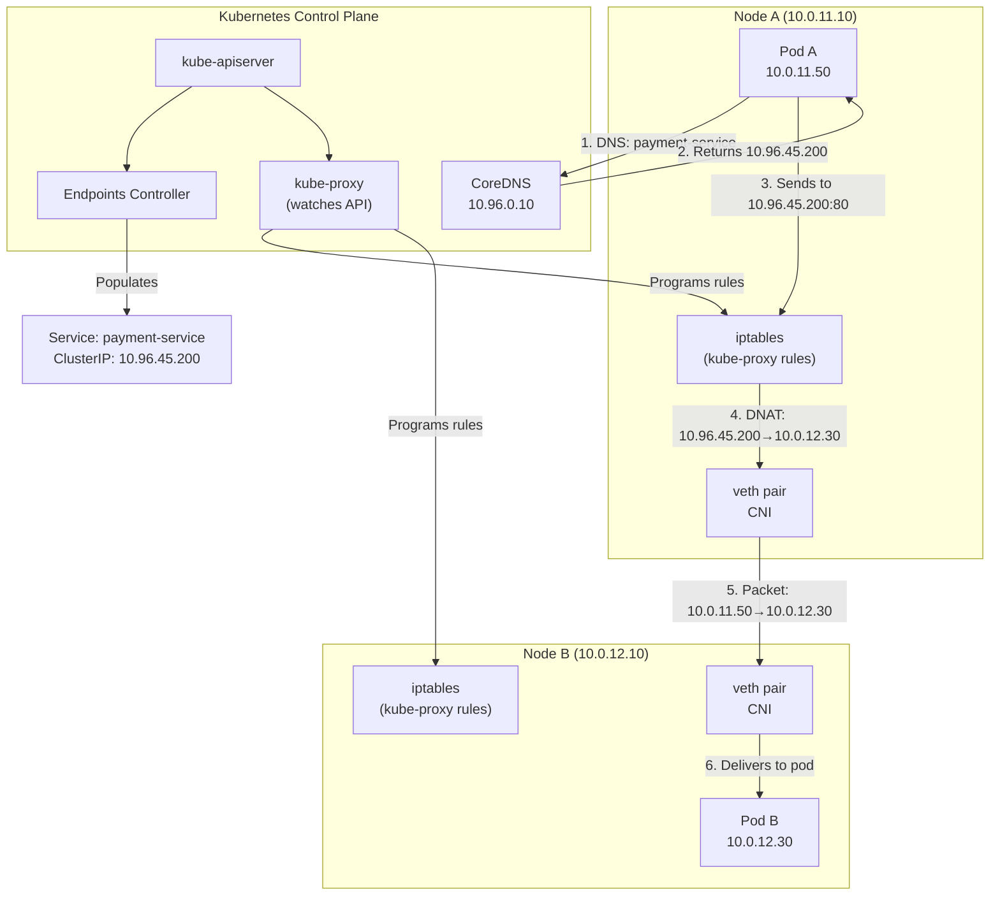
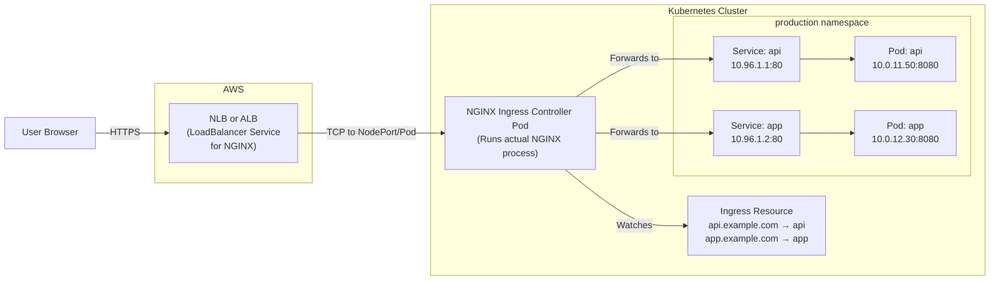
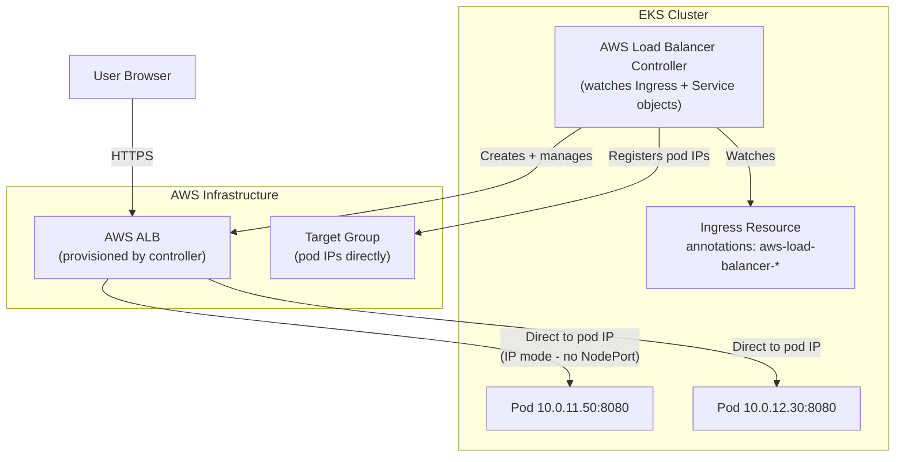
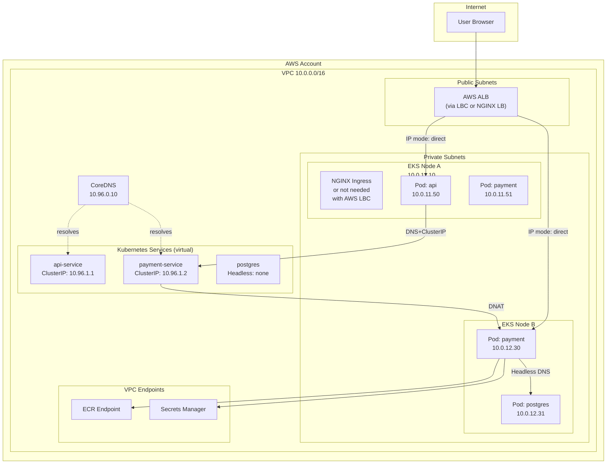

# Kubernetes Networking Deep Dive: CNI, kube-proxy, Services, and Ingress

> Part 5 of the series: *"Networking for DevOps and Cloud Architects: From Packets to Production"*
>
> Prerequisites: [Part 1 — Networking Fundamentals](./01-networking-fundamentals.md) | [Part 2 — DNS Deep Dive](./02-dns-deep-dive.md) | [Part 3 — TLS/SSL](./03-tls-ssl-deep-dive.md) | [Part 4 — VPC Networking](./04-vpc-networking.md)

---

## Table of Contents

- [Why This Matters](#why-this-matters)
- [Mental Model](#mental-model)
- [Core Concepts](#core-concepts)
- [How It Works in Real Production Systems](#how-it-works-in-real-production-systems)
- [End-to-End Traffic Flow Example](#end-to-end-traffic-flow-example)
- [Common Failure Patterns](#common-failure-patterns)
- [Commands Every Engineer Should Know](#commands-every-engineer-should-know)
- [AWS / EKS Angle](#aws--eks-angle)
- [Troubleshooting Framework](#troubleshooting-framework)
- [Senior Engineer Interview Explanation](#senior-engineer-interview-explanation)
- [Production Checklist](#production-checklist)
- [Key Takeaways](#key-takeaways)

---

## Why This Matters

Kubernetes networking is where most platform engineers hit a wall.

You understand Docker. You understand VPCs. You've used `kubectl apply`. But the moment something *network-related* breaks inside a cluster — a pod can't reach a service, an Ingress isn't routing, a database connection keeps dropping — you're staring at abstractions stacked on top of abstractions and you don't know where to start.

Here's the honest reality of Kubernetes networking in production:

- **Services are not magic.** They're iptables rules generated by kube-proxy. When kube-proxy falls behind under load, or gets stuck after a node restart, your services stop routing correctly. If you don't know this, you'll blame the application for hours.

- **Pods come and go. IPs change. Services exist to paper over this.** That's the whole point. But when a Service has no endpoints — because pod labels don't match, or pods aren't Ready — traffic just vanishes. No error, just silence.

- **Ingress is not a Kubernetes feature — it's a spec that someone else implements.** NGINX, AWS ALB, Traefik, Istio — they all implement Ingress differently. "Why is my Ingress not working?" is 90% about which controller is running and how it's configured, not the Kubernetes spec itself.

- **NetworkPolicy is opt-in and silently does nothing without the right CNI.** Teams deploy NetworkPolicy objects thinking they're securing their cluster. Their CNI plugin doesn't enforce it. They have zero network security and don't know it.

- **DNS inside Kubernetes has its own quirks** — `ndots:5`, CoreDNS overload, negative caching — that cause mysterious intermittent failures at scale. (Covered deeply in Part 2, referenced throughout here.)

This article is about making Kubernetes networking concrete. Not the spec — the actual mechanics. What happens on the wire when a pod calls another pod. What kube-proxy actually writes to iptables. How the CNI plugin gives pods their IPs. And how to debug all of it when something goes wrong.

---

## Mental Model

**Think of Kubernetes networking like a city's postal system, built on top of your VPC's road system.**

Your VPC (from Part 4) is the road infrastructure — the actual physical roads, addresses, and traffic rules. Kubernetes builds its own postal system *on top* of that:

- **Pods are houses.** Each one gets an address (IP). Addresses can change when houses are demolished and rebuilt (pod restarts).
- **Services are PO Boxes.** A stable address that doesn't change, even when the actual houses behind it do. Mail goes to the PO Box, the postal system figures out which house to deliver it to.
- **kube-proxy is the postal sorting room.** It maintains the mapping of PO Box → current house addresses and physically routes each letter (packet).
- **CoreDNS is the directory assistance.** You say "I want to send mail to the payments department" and it gives you the PO Box number.
- **Ingress is the main reception desk.** External visitors come to one front door, and the receptionist (Ingress controller) figures out which department (Service) to send them to based on what they're asking for.
- **CNI is the road construction crew.** Before a new house (pod) can receive mail, someone needs to connect it to the road network. CNI does that — wires up each pod to the network when it starts.
- **NetworkPolicy is the security checkpoint.** Even though everyone has an address, security checkpoints decide who is allowed to deliver to whom.

Keep this mental model as you read. Every concept maps back to it.

---

## Core Concepts

### 1. The Kubernetes Networking Contract

Before anything else, understand the three rules Kubernetes demands of every networking implementation. These aren't optional — they're the contract every CNI plugin must fulfill:

```
Rule 1: Every pod gets its own unique IP address.
Rule 2: Pods can communicate with any other pod without NAT.
Rule 3: The IP a pod sees as its own is the same IP others use to reach it.
```

Rule 2 is the important one. In plain English: a pod on Node A can send a packet directly to a pod on Node B, and that packet arrives with the *original source IP* — it's not translated. No NAT in the middle.

This sounds simple but it means the underlying network has to actually route pod IPs. CNI plugins solve this in different ways:

| CNI | How it routes pod traffic |
|-----|--------------------------|
| **AWS VPC CNI** | Pod IPs are real VPC IPs. VPC routing handles it natively. |
| **Calico** | Either BGP routing (pod IPs announced to the network) or IP-in-IP overlay tunnel |
| **Cilium** | eBPF-based, either native routing or overlay. Bypasses iptables entirely. |
| **Flannel** | VXLAN overlay — wraps pod packets in UDP packets to cross nodes |
| **Weave** | Encrypted mesh overlay |

AWS VPC CNI (what EKS uses) is the simplest — pods get real VPC IPs and routing works the same as any VPC traffic. No encapsulation overhead, no overlay to debug. Traffic from an ALB goes straight to a pod IP as if it were any other VPC resource.

---

### 2. CNI — The Plugin That Wires Pods to the Network

CNI (Container Network Interface) is a specification for how a network plugin connects a container to a network. When Kubernetes starts a new pod, it calls the CNI plugin and says: *"I just started a container. Wire it up."*

The CNI plugin then:
1. Creates a network interface inside the pod's namespace
2. Assigns an IP address to it
3. Sets up routes so the pod can reach other pods and the outside world
4. Ensures other pods can reach this pod

**What this looks like with AWS VPC CNI:**

```
New pod scheduled on Node (10.0.11.10)
    │
    ▼
AWS VPC CNI plugin called
    │
    ├── Checks if the node has pre-allocated secondary IPs
    │   (CNI pre-warms IPs in the background for faster pod startup)
    │
    ├── Claims one IP from the warm pool (e.g., 10.0.11.50)
    │
    ├── Creates a veth pair:
    │   eth0 inside pod ←→ eniY on node host network
    │
    ├── Assigns 10.0.11.50 to eth0 inside the pod
    │
    └── Sets up routes:
        - Pod's default route: via node's internal gateway
        - Node's route: 10.0.11.50 via veth interface
```

After this, the pod is on the network. It has a real VPC IP. Any other resource in the VPC can reach it directly.

**The warm pool matters for startup speed.** AWS VPC CNI requests IPs from the VPC ahead of time, before pods need them. When a pod starts, it gets an IP instantly from this warm pool instead of waiting for an AWS API call. If the warm pool is depleted (after a surge of pod starts), pods wait for new IPs — this is why you sometimes see pods stuck in `ContainerCreating` during large deployments.

```bash
# Check CNI warm pool configuration
kubectl get daemonset aws-node -n kube-system -o yaml | grep -E "WARM_IP_TARGET|MINIMUM_IP_TARGET"

# See how many IPs each node has available
kubectl get node <node-name> -o json | \
  jq '.metadata.annotations | with_entries(select(.key | contains("vpc.amazonaws")))'
```

---

### 3. Services — The Stable Address for Unstable Pods

Pods are ephemeral. They crash, they restart, they get rescheduled to different nodes. Their IP addresses change every time.

If you hardcode a pod IP anywhere — in config, in another service, in an environment variable — it's wrong the moment that pod restarts.

**Services solve this.** A Service is a stable virtual IP address (called a ClusterIP) that never changes, and forwards traffic to whatever pods currently match its selector.

```yaml
apiVersion: v1
kind: Service
metadata:
  name: payment-service
  namespace: production
spec:
  selector:
    app: payment    # ← matches pods with this label
  ports:
  - port: 80        # ← port on the Service (what callers use)
    targetPort: 8080  # ← port on the Pod (where the app actually listens)
  type: ClusterIP   # ← default, internal only
```

When you create this Service:
1. Kubernetes assigns a ClusterIP (e.g., `10.96.45.200`) from the service CIDR range
2. kube-proxy notices the new Service and programs iptables rules on every node
3. Any packet destined for `10.96.45.200:80` gets DNAT'd to one of the matching pod IPs

The ClusterIP is *virtual* — there's no actual network interface listening on it anywhere. It exists only as an iptables rule. When a packet hits it, iptables rewrites the destination before the packet ever touches a real interface.

**The selector is the glue.** The Service doesn't directly track pods — it just has a label selector. The Endpoints controller (running in the control plane) watches all pods, finds the ones whose labels match the selector, and builds an Endpoints object with their IPs.

```bash
# See the pods a service is currently routing to
kubectl get endpoints payment-service -n production

# Output:
# NAME              ENDPOINTS                         AGE
# payment-service   10.0.11.50:8080,10.0.12.30:8080   2d
```

If `kubectl get endpoints` shows `<none>` — the Service has no pods to route to. This is one of the most common "why is my service broken?" answers.

**Why endpoints are empty:**
- No pods exist with matching labels
- Pods exist but their labels don't *exactly* match the selector (typo)
- Pods exist and labels match, but pods aren't Ready (readinessProbe failing)

---

### 4. kube-proxy — The Engine Behind Services

kube-proxy is a DaemonSet running on every node. It watches the Kubernetes API for Service and EndpointSlice changes, and programs the node's networking so those Services actually work.

**By default, kube-proxy uses iptables.** Here's what it actually writes when you create the payment-service:

```bash
# kube-proxy creates chains like these (simplified):

# Entry point: if dest is the ClusterIP, jump to the service chain
-A KUBE-SERVICES -d 10.96.45.200/32 -p tcp --dport 80 -j KUBE-SVC-PAYMT

# Load balancing: randomly distribute to endpoints (33% each for 3 pods)
-A KUBE-SVC-PAYMT -m statistic --mode random --probability 0.33 -j KUBE-SEP-POD1
-A KUBE-SVC-PAYMT -m statistic --mode random --probability 0.50 -j KUBE-SEP-POD2
-A KUBE-SVC-PAYMT -j KUBE-SEP-POD3

# Endpoint rules: DNAT to actual pod IPs
-A KUBE-SEP-POD1 -j DNAT --to-destination 10.0.11.50:8080
-A KUBE-SEP-POD2 -j DNAT --to-destination 10.0.12.30:8080
-A KUBE-SEP-POD3 -j DNAT --to-destination 10.0.13.20:8080
```

Every node has these identical rules. So traffic destined for `10.96.45.200:80` works from any pod on any node — the local node's iptables handles the translation.

**The iptables scaling problem:**

iptables rules are a linked list. The kernel evaluates them one by one until it finds a match. With:
- 500 services × 5 pods each = 2,500 endpoint rules
- Plus the service chain rules, NAT rules, network policy rules

...iptables can have tens of thousands of rules. Evaluating them for every packet becomes measurable latency. Large clusters (500+ services, 1000+ pods) with iptables kube-proxy show measurable p99 latency degradation just from rule evaluation.

**The solution: IPVS mode or Cilium**

IPVS (IP Virtual Server) mode uses hash table lookups instead of linear rule scanning. O(1) instead of O(n). Service rule evaluation stays constant regardless of cluster size.

```bash
# Check which mode kube-proxy is running in
kubectl get configmap kube-proxy -n kube-system -o yaml | grep mode

# Or check logs
kubectl logs -n kube-system -l k8s-app=kube-proxy --tail=5
```

Cilium replaces kube-proxy entirely with eBPF programs that run in the kernel with even better performance and much better observability.

---

### 5. Service Types — Choosing the Right Tool

Kubernetes has four Service types. Using the wrong one is a common architectural mistake.



**ClusterIP (default)** — Internal traffic only. Gives a stable virtual IP accessible from anywhere inside the cluster. Use this for all service-to-service communication. Everything you build should start here.

```yaml
spec:
  type: ClusterIP    # or just omit — this is the default
```

**NodePort** — Opens a port (30000–32767) on *every node* and forwards traffic to the Service. The only reason to use NodePort directly is for development or when you're building something on top of it. Don't expose NodePort directly to the internet — it bypasses your Ingress, is hard to secure, and the port numbers are ugly.

```yaml
spec:
  type: NodePort
  ports:
  - port: 80
    targetPort: 8080
    nodePort: 30080    # optional — AWS assigns one if omitted
```

**LoadBalancer** — Tells the cloud provider (AWS) to provision a load balancer and point it at this Service. In EKS, this creates an NLB by default (or an ALB if you use the AWS Load Balancer Controller with the right annotations). Use this when you need direct TCP/UDP access or a dedicated load balancer for a single service. Not for HTTP microservices — that's Ingress.

```yaml
spec:
  type: LoadBalancer
  # In EKS with AWS Load Balancer Controller:
  # annotations:
  #   service.beta.kubernetes.io/aws-load-balancer-type: "external"
  #   service.beta.kubernetes.io/aws-load-balancer-nlb-target-type: "ip"
```

**Headless Service (`clusterIP: None`)** — No virtual IP. DNS for a headless service returns the individual pod IPs instead of a single ClusterIP. This gives clients direct access to specific pods. Essential for StatefulSets — databases, Kafka, Zookeeper — where clients need to connect to specific instances (not just any replica).

```yaml
spec:
  clusterIP: None    # Makes it headless
  selector:
    app: postgres
```

With headless service, `postgres.production.svc.cluster.local` resolves to *all pod IPs*. `postgres-0.postgres.production.svc.cluster.local` resolves to *that specific pod* — this is how StatefulSet pod identity works over DNS.

---

### 6. EndpointSlices — The Modern Backend for Services

EndpointSlices replaced Endpoints objects in Kubernetes 1.17+. The old Endpoints object had a scalability problem: it was a single object that stored ALL pod IPs for a service. With 1,000 pods, that's one enormous object being updated on every pod change — every update triggers a full sync to every node.

EndpointSlices shard this into multiple smaller objects (default max 100 endpoints per slice). A service with 300 pods has 3 EndpointSlices. When one pod restarts, only one slice is updated — not the whole set.

```bash
# View EndpointSlices for a service
kubectl get endpointslices -l kubernetes.io/service-name=payment-service

# Detailed view
kubectl describe endpointslice payment-service-xk2p9
```

You rarely interact with EndpointSlices directly. But knowing they exist helps when debugging: if `kubectl get endpoints` looks fine but traffic isn't working, check the EndpointSlice — kube-proxy reads from EndpointSlices in modern clusters, not the legacy Endpoints object.

---

### 7. Ingress — The Front Door for HTTP Traffic

An Ingress resource is a set of routing rules for HTTP/HTTPS traffic into your cluster. It's how you expose multiple services through a single load balancer using hostname and path rules.

```yaml
apiVersion: networking.k8s.io/v1
kind: Ingress
metadata:
  name: production-ingress
  namespace: production
  annotations:
    kubernetes.io/ingress.class: nginx
spec:
  tls:
  - hosts:
    - api.example.com
    - app.example.com
    secretName: production-tls
  rules:
  - host: api.example.com
    http:
      paths:
      - path: /v1/payments
        pathType: Prefix
        backend:
          service:
            name: payment-service
            port:
              number: 80
      - path: /v1/users
        pathType: Prefix
        backend:
          service:
            name: user-service
            port:
              number: 80
  - host: app.example.com
    http:
      paths:
      - path: /
        pathType: Prefix
        backend:
          service:
            name: frontend-service
            port:
              number: 80
```

One external load balancer, two hostnames, multiple path-based routes to different services. This is why Ingress exists — instead of one NLB per service, you have one ALB for the whole cluster.

**The crucial thing engineers miss: an Ingress resource does nothing without an Ingress controller.**

The Ingress spec is just a Kubernetes object. Someone has to watch those objects and actually configure a load balancer or proxy based on them. That's the Ingress controller.

| Controller | What it provisions | Best for |
|------------|-------------------|----------|
| **NGINX Ingress** | NGINX running in the cluster, receives a NodePort/LoadBalancer | Most common, flexible, battle-tested |
| **AWS Load Balancer Controller** | Real AWS ALB per Ingress (or shared) | EKS, native AWS integration, direct pod routing |
| **Traefik** | Traefik proxy, good auto-discovery | Dynamic environments |
| **Istio Gateway** | Envoy proxy, part of service mesh | When you're already running Istio |
| **Kong** | Kong API gateway | API management features needed |

In EKS, the **AWS Load Balancer Controller** is the recommended path. It creates a real ALB in AWS for each Ingress (or shared ALBs with `IngressGroup`). Traffic flows directly from ALB to pod IPs — no kube-proxy, no NodePort hop in between.

---

### 8. NetworkPolicy — Security That Actually Does Something (If Your CNI Supports It)

By default, every pod in a Kubernetes cluster can talk to every other pod. Any namespace, any service, no restrictions. If an attacker compromises one pod, they have free network access to everything else.

NetworkPolicy lets you restrict this. But here's the part that trips teams up:

**NetworkPolicy only works if your CNI plugin enforces it.**

The standard Kubernetes CNI (kubenet) doesn't enforce NetworkPolicy. Neither does Flannel. You need Calico, Cilium, AWS VPC CNI with network policy enabled, or another policy-aware CNI.

```bash
# Check if your CNI supports NetworkPolicy
# For EKS with AWS VPC CNI - check if network policy is enabled
kubectl describe daemonset aws-node -n kube-system | grep ENABLE_NETWORK_POLICY
```

**A production NetworkPolicy setup starts with default-deny:**

```yaml
# Step 1: Deny everything in the production namespace
apiVersion: networking.k8s.io/v1
kind: NetworkPolicy
metadata:
  name: default-deny-all
  namespace: production
spec:
  podSelector: {}    # empty = applies to all pods
  policyTypes:
  - Ingress
  - Egress
```

After this, no pod can receive or send any traffic. Then you layer in explicit allows:

```yaml
# Step 2: Allow payment-service to receive traffic from api-gateway only
apiVersion: networking.k8s.io/v1
kind: NetworkPolicy
metadata:
  name: allow-api-to-payment
  namespace: production
spec:
  podSelector:
    matchLabels:
      app: payment-service
  policyTypes:
  - Ingress
  ingress:
  - from:
    - podSelector:
        matchLabels:
          app: api-gateway
    ports:
    - port: 8080
---
# Step 3: Allow payment-service to reach its database
apiVersion: networking.k8s.io/v1
kind: NetworkPolicy
metadata:
  name: allow-payment-to-db
  namespace: production
spec:
  podSelector:
    matchLabels:
      app: payment-service
  policyTypes:
  - Egress
  egress:
  - to:
    - podSelector:
        matchLabels:
          app: postgres
    ports:
    - port: 5432
  # Also allow DNS (CoreDNS)
  - to:
    - namespaceSelector:
        matchLabels:
          kubernetes.io/metadata.name: kube-system
    ports:
    - port: 53
      protocol: UDP
```

**The DNS gotcha:** When you add a default-deny egress policy, your pods can no longer reach CoreDNS (port 53 in kube-system). Every DNS query fails. Every connection attempt fails. Your pods appear completely broken. Always include an explicit egress allow for DNS in your NetworkPolicy.

---

### 9. CoreDNS — Service Discovery Inside the Cluster

Every pod in Kubernetes has `/etc/resolv.conf` automatically set to point at CoreDNS:

```
nameserver 10.96.0.10    ← CoreDNS ClusterIP
search default.svc.cluster.local svc.cluster.local cluster.local
options ndots:5
```

CoreDNS watches the Kubernetes API and maintains a live map of all Services. When a pod queries `payment-service.production.svc.cluster.local`, CoreDNS:
1. Looks up the Service in its cache (populated by the kubernetes plugin watching the API)
2. Returns the ClusterIP

The full DNS name format is always:
```
<service-name>.<namespace>.svc.<cluster-domain>
```

Short names work *within the same namespace* because of search domain expansion:
- `payment-service` → CoreDNS first tries `payment-service.production.svc.cluster.local` → finds it
- `payment-service.other-namespace` → this does NOT work as a cross-namespace shortcut

For cross-namespace calls, always use the full name: `payment-service.production.svc.cluster.local` or at minimum `payment-service.production`.

**Deep DNS details and the ndots problem are covered thoroughly in Part 2.** The key reminder here: `ndots:5` causes external hostnames to generate 5 DNS queries. At scale, this floods CoreDNS. Deploy NodeLocal DNSCache in any cluster with more than 30 nodes or services making heavy external calls.

---

## How It Works in Real Production Systems

### The Complete Picture: All Networking Layers Together

This is what's actually happening when Pod A calls Pod B through a Service:



Every single layer is essential. Remove any one of them and traffic breaks.

---

### NGINX Ingress Controller — How It Actually Works

The NGINX Ingress Controller is a pod running NGINX. It watches Ingress objects in Kubernetes and rewrites its NGINX configuration every time something changes.



**When you update an Ingress object**, the NGINX Ingress Controller:
1. Receives the update via the Kubernetes API watch
2. Regenerates its NGINX config
3. Hot-reloads NGINX (`nginx -s reload`)
4. New traffic routing takes effect in seconds

**The catch:** NGINX reload is not zero-downtime out of the box. During reload, in-flight connections using keep-alive may be dropped. At high request rates, this is noticeable. The fix: `upstream keepalive` and proper `worker_shutdown_timeout` settings.

---

### AWS Load Balancer Controller — The EKS Native Path

In EKS, the AWS Load Balancer Controller (formerly AWS ALB Ingress Controller) replaces the standard LoadBalancer/Ingress pattern with native AWS infrastructure.



**Key difference from NGINX Ingress:** Traffic goes ALB → Pod IP directly. No NGINX pod in between, no NodePort hop, no iptables DNAT for inbound traffic. This is faster and simpler to debug.

**Ingress with AWS LBC:**

```yaml
apiVersion: networking.k8s.io/v1
kind: Ingress
metadata:
  name: production-ingress
  namespace: production
  annotations:
    kubernetes.io/ingress.class: alb
    alb.ingress.kubernetes.io/scheme: internet-facing
    alb.ingress.kubernetes.io/target-type: ip        # Direct to pod IPs
    alb.ingress.kubernetes.io/certificate-arn: arn:aws:acm:us-east-1:xxxx:certificate/yyyy
    alb.ingress.kubernetes.io/listen-ports: '[{"HTTP": 80}, {"HTTPS": 443}]'
    alb.ingress.kubernetes.io/actions.ssl-redirect: '{"Type": "redirect", "RedirectConfig": {"Protocol": "HTTPS", "StatusCode": "HTTP_301"}}'
spec:
  rules:
  - host: api.example.com
    http:
      paths:
      - path: /
        pathType: Prefix
        backend:
          service:
            name: api-service
            port:
              number: 80
```

**IngressGroup — sharing one ALB across multiple Ingress objects:**

```yaml
annotations:
  alb.ingress.kubernetes.io/group.name: production-shared
  alb.ingress.kubernetes.io/group.order: "10"
```

Two Ingress resources with the same `group.name` share one ALB. Different teams can manage their own Ingress objects without owning the ALB. One ALB, many services, no per-service cost.

---

## End-to-End Traffic Flow Example

**Scenario: Browser calls `https://api.example.com/v1/payments` → NGINX Ingress → payment-service → postgres**

```
═══════════════════════════════════════════════════════════════════
 PHASE 1: EXTERNAL TRAFFIC IN
═══════════════════════════════════════════════════════════════════

Browser
  │
  ├─ DNS: api.example.com → ALB/NLB IP (via Route 53)
  ├─ TCP connect to load balancer :443
  ├─ TLS handshake (cert for api.example.com)
  └─ HTTP/2 request: GET /v1/payments

                    │
                    ▼

NLB / ALB (AWS)
  │
  ├─ NLB: passes TCP to Node:NodePort (30443)
  │   OR
  └─ ALB: terminates TLS, routes to NGINX pod IP directly (IP mode)

                    │
                    ▼

NGINX Ingress Controller Pod
  │
  ├─ Receives request
  ├─ Checks Ingress rules:
  │   Host: api.example.com, Path: /v1/payments
  │   → Route to service: payment-service, port 80
  ├─ Adds headers: X-Real-IP, X-Forwarded-For, X-Forwarded-Proto
  └─ Makes upstream request to payment-service ClusterIP

═══════════════════════════════════════════════════════════════════
 PHASE 2: SERVICE ROUTING (INTERNAL)
═══════════════════════════════════════════════════════════════════

NGINX Pod sends to 10.96.45.200:80 (payment-service ClusterIP)
  │
  ▼

iptables on NGINX's node:
  KUBE-SERVICES matches 10.96.45.200:80
    → DNAT: rewrite destination to 10.0.12.30:8080 (Pod B)
  Packet leaves node with:
    src: NGINX pod IP
    dst: 10.0.12.30:8080 (payment pod, may be on different node)

                    │
                    ▼

AWS VPC routing: 10.0.12.30 is a secondary IP on Node B's ENI
  → Packet delivered to Node B
  → veth pair delivers to payment-service pod

═══════════════════════════════════════════════════════════════════
 PHASE 3: DATABASE CALL
═══════════════════════════════════════════════════════════════════

payment-service pod needs to query postgres
  │
  ├─ DNS query: postgres.production.svc.cluster.local
  │   → CoreDNS → headless service → returns pod IPs:
  │     postgres-0: 10.0.11.100
  │     postgres-1: 10.0.12.100
  │
  ├─ App connects to postgres-0 (primary, determined by app logic)
  │
  ├─ Security Group check:
  │   SG on postgres pod allows port 5432 from payment-service SG ✓
  │
  ├─ NetworkPolicy check:
  │   allow-payment-to-db policy allows this ✓
  │
  └─ TCP connection to 10.0.11.100:5432 established
     Query executes, response returns to payment-service pod

═══════════════════════════════════════════════════════════════════
 PHASE 4: RESPONSE PATH
═══════════════════════════════════════════════════════════════════

payment-service pod → HTTP response → iptables un-NATs → NGINX pod
NGINX pod → HTTP response → NLB/ALB → TLS re-encrypt → Browser
```

**The layers involved in this one request:**
- DNS (CoreDNS + Route 53)
- TLS (ACM cert on ALB, cert-manager cert on NGINX)
- AWS VPC routing (real pod IPs, ENIs)
- iptables DNAT (ClusterIP → Pod IP)
- AWS Security Groups (payment-service → postgres)
- Kubernetes NetworkPolicy (explicit egress allow)

Every layer is a potential failure point.

---

## Common Failure Patterns

### Failure 1: Service Has No Endpoints

This is the single most common Kubernetes networking issue. The Service exists. DNS resolves the ClusterIP. But traffic goes nowhere.

**Symptom:**
- `Connection refused` or timeout when calling the service
- `curl http://payment-service` returns nothing or hangs
- HTTP 503 from your Ingress controller

**Verify:**
```bash
# The first thing to check
kubectl get endpoints payment-service -n production

# If this shows <none>:
NAME              ENDPOINTS   AGE
payment-service   <none>      2d

# Check if pods actually exist and are Ready
kubectl get pods -n production -l app=payment

# Compare pod labels to service selector
kubectl get svc payment-service -n production -o yaml | grep -A5 selector
kubectl get pods -n production --show-labels | grep payment
```

**Likely causes and fixes:**

| Cause | Symptom | Fix |
|-------|---------|-----|
| Label mismatch (typo) | Pods Running but endpoints empty | Fix the selector or pod label |
| Pods not Ready | Pods exist but endpoints empty | Fix readinessProbe |
| No pods scheduled | No pods at all | Check deployment, resource limits |
| Wrong namespace | Pods in different namespace | Use full FQDN or check namespace |

---

### Failure 2: Ingress Returns 502/504

**Symptom:** Ingress is reachable, DNS works, TLS works — but requests return 502 Bad Gateway or 504 Gateway Timeout.

**What this means:** The Ingress controller itself is healthy, but it can't reach the backend Service/pods.

**Verify — work backward from the Ingress:**
```bash
# Step 1: Check Ingress configuration
kubectl describe ingress my-ingress -n production

# Step 2: Verify the Service the Ingress points to exists
kubectl get svc payment-service -n production

# Step 3: Verify the Service has endpoints
kubectl get endpoints payment-service -n production

# Step 4: Check pods are Running AND Ready
kubectl get pods -n production -l app=payment

# Step 5: Test directly from NGINX pod to the backend service
kubectl exec -n ingress-nginx <nginx-pod> -- \
  curl -v http://payment-service.production.svc.cluster.local/health

# Step 6: Check NGINX logs for the specific error
kubectl logs -n ingress-nginx <nginx-pod> --tail=50 | grep "payment"
```

**Common causes:**
- 502: Backend pod is crashing or returning an error immediately
- 504: Backend pod is alive but taking longer than the Ingress timeout (default 60s for NGINX)
- Connection refused: Nothing listening on the targetPort

---

### Failure 3: DNS Resolves But Connection Times Out

**Symptom:** `nslookup my-service` works. `curl http://my-service` times out. DNS is fine but packets disappear.

**What this means:** The Service exists and DNS is working, but somewhere between the source and destination, a packet is being dropped silently.

**Verify:**
```bash
# Confirm what IP DNS returned
kubectl exec -it <pod> -- nslookup my-service.namespace.svc.cluster.local

# Try connecting to the ClusterIP directly (bypass DNS)
kubectl exec -it <pod> -- nc -zv <ClusterIP> <port>

# Check if pods are actually listening on the right port
kubectl exec -it <target-pod> -- ss -tlnp

# Check kube-proxy is actually running and healthy on the node
kubectl get pods -n kube-system -l k8s-app=kube-proxy

# Verify iptables rules exist for the service on that node
kubectl debug node/<node-name> -it --image=ubuntu -- bash
iptables -t nat -L KUBE-SERVICES -n | grep <ClusterIP>
```

**Common causes:**
- kube-proxy pod crashed on the node where the source pod runs — iptables rules are stale
- NetworkPolicy blocking the traffic (check with `kubectl get networkpolicy -A`)
- Security group on the node blocking traffic to the target pod port

---

### Failure 4: NetworkPolicy Breaks Everything After Apply

**Symptom:** Service was working. You applied a NetworkPolicy. Now nothing works — DNS fails, all connections refused.

**The classic mistake:** You added a `default-deny` egress policy without first allowing DNS traffic (port 53 to kube-system).

```bash
# Verify DNS is what's broken first
kubectl exec -it <pod> -- nslookup kubernetes.default
# If this fails → DNS is blocked

# List all NetworkPolicies affecting this pod
kubectl get networkpolicy -n production

# Describe the policy and check egress rules
kubectl describe networkpolicy default-deny-all -n production
```

**Fix — always include DNS in your egress policies:**

```yaml
spec:
  podSelector: {}
  policyTypes:
  - Egress
  egress:
  # Allow DNS to CoreDNS
  - to:
    - namespaceSelector:
        matchLabels:
          kubernetes.io/metadata.name: kube-system
    ports:
    - port: 53
      protocol: UDP
    - port: 53
      protocol: TCP
  # Allow everything else you need...
```

**Also check:** Is your CNI actually enforcing NetworkPolicy? AWS VPC CNI requires the network policy feature to be explicitly enabled.

```bash
kubectl describe daemonset aws-node -n kube-system | grep -i "network_policy\|ENABLE_NETWORK"
```

---

### Failure 5: Intermittent Connection Resets Between Pods

**Symptom:** Most requests succeed, but you see random TCP resets (RST packets). Connection pool logs show connections being unexpectedly closed. Happens more during deployments.

**Likely cause:** Pod was deleted (during a rolling update) while it had in-flight connections. The pod died, the connection was reset. The calling service either retried (if retry logic exists) or returned an error.

**Also possible:** kube-proxy iptables rules updated while a connection was mid-flight — iptables connections are tracked, but there's a brief window where the old pod IP is removed from endpoints before connections to it are drained.

**Verify:**
```bash
# During a deployment, watch endpoints change in real time
kubectl get endpoints payment-service -n production -w

# Check for RST packets during deployment
tcpdump -i any -nn 'tcp[tcpflags] & tcp-rst != 0'

# Check if preStop hook is configured (gives pods time to drain)
kubectl get pod <pod-name> -o yaml | grep -A10 preStop
```

**Fix:**
```yaml
# Add preStop hook to delay pod shutdown — gives load balancer time to deregister
spec:
  containers:
  - name: payment-service
    lifecycle:
      preStop:
        exec:
          command: ["/bin/sleep", "10"]   # Wait 10s before shutdown
    # Also set a graceful termination period
  terminationGracePeriodSeconds: 30
```

And configure your Ingress/ALB with proper connection draining (30+ seconds deregistration delay).

---

### Failure 6: Pods Can't Reach External Services

**Symptom:** Pods can reach other pods and services inside the cluster. But `curl https://api.stripe.com` times out. External calls fail.

**Likely causes:**
- No NAT Gateway for the private subnet (covered in Part 4)
- NetworkPolicy blocking egress to `0.0.0.0/0`
- Security group on the node blocking outbound traffic
- Pods on nodes in a subnet with no `0.0.0.0/0` route

**Verify:**
```bash
# Test from inside the pod
kubectl exec -it <pod> -- curl -s --connect-timeout 5 https://checkip.amazonaws.com
# Returns public IP if working, hangs if not

# Check the node the pod is on
kubectl get pod <pod> -o wide

# Check that node's subnet route table (from Part 4 commands)
aws ec2 describe-route-tables \
  --filters "Name=association.subnet-id,Values=<node-subnet-id>" \
  --query 'RouteTables[*].Routes'

# Check for egress NetworkPolicy blocking external traffic
kubectl get networkpolicy -n <namespace>
kubectl describe networkpolicy <name> | grep -A10 "Egress"
```

---

## Commands Every Engineer Should Know

### Service and Endpoint Debugging

```bash
# ── The First Four Commands to Run When a Service Is Broken ──────────

# 1. Does the service exist?
kubectl get svc -n <namespace>

# 2. Does it have endpoints (are pods registered)?
kubectl get endpoints <service-name> -n <namespace>

# 3. Are the pods Running AND Ready?
kubectl get pods -n <namespace> -l <selector-from-service>

# 4. Do pod labels match service selector?
kubectl get svc <service-name> -n <namespace> -o jsonpath='{.spec.selector}'
kubectl get pods -n <namespace> --show-labels

# ── Deeper Inspection ─────────────────────────────────────────────────

# Describe service (see all details)
kubectl describe svc payment-service -n production

# Check EndpointSlices (modern replacement for Endpoints)
kubectl get endpointslices -n production \
  -l kubernetes.io/service-name=payment-service

# Test service DNS from inside the cluster
kubectl run dns-test --image=busybox:1.28 --rm -it --restart=Never -- \
  nslookup payment-service.production.svc.cluster.local

# Test actual connectivity to the service
kubectl run curl-test --image=curlimages/curl --rm -it --restart=Never -- \
  curl -v http://payment-service.production.svc.cluster.local/health
```

---

### Ingress Debugging

```bash
# Check Ingress configuration and events
kubectl describe ingress my-ingress -n production

# Check Ingress controller pods are running
kubectl get pods -n ingress-nginx
# or for AWS LBC:
kubectl get pods -n kube-system -l app.kubernetes.io/name=aws-load-balancer-controller

# Check NGINX Ingress controller logs
kubectl logs -n ingress-nginx \
  -l app.kubernetes.io/name=ingress-nginx \
  --tail=50

# For AWS LBC — check ALB provisioning events
kubectl get events -n production --field-selector reason=CREATE \
  | grep ingress

# Verify the ALB was actually created
aws elbv2 describe-load-balancers \
  --query 'LoadBalancers[*].{Name:LoadBalancerName,DNS:DNSName,State:State.Code}'

# Check ALB target group health
aws elbv2 describe-target-groups \
  --query 'TargetGroups[*].TargetGroupArn' --output text | \
  xargs aws elbv2 describe-target-health --target-group-arn
```

---

### Pod Network Debugging

```bash
# Get full network info for a pod
kubectl get pod <pod-name> -n <namespace> -o wide
# Shows: Node, Pod IP, readiness

# Check pod's networking config from inside
kubectl exec -it <pod> -- ip addr      # IP addresses
kubectl exec -it <pod> -- ip route     # Routing table
kubectl exec -it <pod> -- cat /etc/resolv.conf   # DNS config

# Check what ports the pod is actually listening on
kubectl exec -it <pod> -- ss -tlnp
# or
kubectl exec -it <pod> -- netstat -tlnp

# Launch a fully-equipped debug pod (best debug image)
kubectl run netshoot --image=nicolaka/netshoot \
  --rm -it --restart=Never -n <namespace> -- bash

# Inside netshoot, you have: curl, dig, nslookup, ping, nc, tcpdump,
# traceroute, ss, iperf3, and more

# Test connectivity from a debug pod
kubectl run netshoot --image=nicolaka/netshoot \
  --rm -it --restart=Never -n production -- \
  curl -v http://payment-service.production.svc.cluster.local/health
```

---

### kube-proxy and iptables

```bash
# Check kube-proxy health
kubectl get pods -n kube-system -l k8s-app=kube-proxy
kubectl logs -n kube-system -l k8s-app=kube-proxy --tail=20

# Check kube-proxy mode (iptables vs ipvs)
kubectl get configmap kube-proxy -n kube-system -o yaml | grep mode

# Check iptables rules for a specific service (run on the node)
# First, get on the node via kubectl debug or SSH
sudo iptables -t nat -L KUBE-SERVICES -n | grep <ClusterIP>
sudo iptables -t nat -L KUBE-SVC-XXXX -n    # Replace XXXX with chain name

# Count total iptables rules (useful for scale analysis)
sudo iptables-save | wc -l

# For IPVS mode — check virtual servers
sudo ipvsadm -Ln | grep -A5 <ClusterIP>
```

---

### NetworkPolicy Debugging

```bash
# List all NetworkPolicies cluster-wide
kubectl get networkpolicy -A

# Describe a specific policy
kubectl describe networkpolicy default-deny-all -n production

# Check if a specific pod is affected by any NetworkPolicy
kubectl get networkpolicy -n production -o json | \
  jq --arg pod_labels '{"app":"payment-service"}' \
  '.items[] | select(.spec.podSelector.matchLabels == ($pod_labels | fromjson))'

# With Cilium — see network policy verdicts (who's allowing/denying what)
kubectl exec -n kube-system <cilium-pod> -- \
  cilium monitor --type policy-verdict

# Test connectivity to check if NetworkPolicy is the blocker
# (if nc works after you delete the policy, the policy was blocking)
kubectl exec -it <source-pod> -- nc -zv <target-pod-ip> <port>
```

---

### CNI / Node IP Management (EKS)

```bash
# Check CNI plugin version and configuration
kubectl describe daemonset aws-node -n kube-system

# See IP allocations per node
kubectl get node -o json | \
  jq '.items[] | {
    node: .metadata.name,
    instance_type: .metadata.labels["node.kubernetes.io/instance-type"],
    allocatable_pods: .status.allocatable["pods"]
  }'

# Check available IPs on a specific node
kubectl get node <node-name> -o json | \
  jq '.metadata.annotations | 
    to_entries | 
    map(select(.key | contains("vpc.amazonaws"))) | 
    from_entries'

# Check if any pods are stuck due to IP exhaustion
kubectl get events -A | grep "failed to allocate\|no IP"

# Check VPC CNI warm pool settings
kubectl get daemonset aws-node -n kube-system -o yaml | \
  grep -E "WARM_IP_TARGET|MINIMUM_IP_TARGET|WARM_ENI_TARGET"
```

---

## AWS / EKS Angle

### EKS Networking Architecture — The Full Stack



---

### EKS Add-ons and Their Network Roles

| Add-on | Network Role | Why it matters |
|--------|-------------|----------------|
| **AWS VPC CNI** | Assigns real VPC IPs to pods | Pod IPs = VPC IPs. Enables direct routing. |
| **CoreDNS** | Service discovery DNS | All internal name resolution |
| **kube-proxy** | Programs iptables for Services | Without it, ClusterIPs don't work |
| **AWS LBC** | Provisions ALBs/NLBs for Ingress/Services | Native AWS load balancing |
| **cert-manager** | Manages TLS certificates | Automates cert rotation for Ingress TLS |
| **ExternalDNS** | Syncs K8s services to Route 53 | Auto-creates DNS records for LoadBalancer services |

**ExternalDNS** is worth calling out specifically — it watches Service and Ingress objects and automatically creates/updates Route 53 records. When you create an Ingress with `host: api.example.com`, ExternalDNS creates the Route 53 record pointing to your ALB. No manual DNS management.

```yaml
# ExternalDNS annotation on Ingress
annotations:
  external-dns.alpha.kubernetes.io/hostname: api.example.com
  external-dns.alpha.kubernetes.io/ttl: "60"
```

---

### EKS Security Groups for Pods

By default, all pods on an EKS node share the node's security group. You can't apply different security groups to different pods on the same node.

**Security Groups for Pods** changes this. It assigns ENIs (and their security groups) directly to individual pods.

```yaml
# SecurityGroupPolicy CRD (requires EKS, VPC CNI 1.7.7+)
apiVersion: vpcresources.k8s.aws/v1beta1
kind: SecurityGroupPolicy
metadata:
  name: payment-service-sgp
  namespace: production
spec:
  podSelector:
    matchLabels:
      app: payment-service
  securityGroups:
    groupIds:
    - sg-payment-service-xxxx    # Only payment pods get this SG
```

Now the payment-service pods have a dedicated SG that allows port 5432 to RDS. Other pods on the same node still use the node SG — no access to RDS.

This is the AWS-native approach to pod-level network security without a service mesh.

---

## Troubleshooting Framework

The right order matters. Work from the outside in.

### Step 1: What exactly is broken?

Get the precise error before touching anything:

| Error | Layer | Start here |
|-------|-------|-----------|
| DNS lookup failed | DNS | `kubectl exec` → `nslookup` |
| Connection timeout | Network/Firewall | `nc -zv`, check route tables, SGs |
| Connection refused | Application/Port | `ss -tlnp` on target pod |
| 502/503 from Ingress | Backend | `kubectl get endpoints` |
| 504 from Ingress | Timeout | Backend latency, Ingress timeout config |
| Works sometimes | Intermittent | Check pod restarts, kube-proxy health |

### Step 2: Is DNS working inside the cluster?

```bash
kubectl exec -it <pod> -- nslookup kubernetes.default
kubectl exec -it <pod> -- nslookup <service-name>.<namespace>.svc.cluster.local
kubectl get pods -n kube-system -l k8s-app=kube-dns
```

### Step 3: Does the Service have endpoints?

```bash
kubectl get endpoints <service> -n <namespace>
# <none> = no pods matching selector, or pods not Ready
```

### Step 4: Are pods Running AND Ready?

```bash
kubectl get pods -n <namespace> -l <selector>
# Running but not Ready = readinessProbe failing
kubectl describe pod <pod> | grep -A5 "Readiness\|Conditions"
```

### Step 5: Can you reach the pod IP directly?

```bash
# Get pod IP
kubectl get pod <pod> -o wide

# Test directly to pod IP (bypass Service/kube-proxy)
kubectl exec -it <debug-pod> -- nc -zv <pod-ip> <port>
# If this works but ClusterIP doesn't → kube-proxy/iptables issue
# If this also fails → NetworkPolicy or pod itself
```

### Step 6: Is kube-proxy healthy on the relevant nodes?

```bash
kubectl get pods -n kube-system -l k8s-app=kube-proxy -o wide
# Are they Running? Any restarts?

# Check iptables rules exist for the ClusterIP
# (requires node access via kubectl debug or SSH)
sudo iptables -t nat -L KUBE-SERVICES -n | grep <ClusterIP>
```

### Step 7: Is NetworkPolicy blocking traffic?

```bash
kubectl get networkpolicy -n <namespace>
# Any default-deny? Any policy that might block this specific traffic?

# Temporarily delete the NetworkPolicy and test
# (do this in staging, not prod)
kubectl delete networkpolicy default-deny-all -n staging
```

### Step 8: Check Ingress controller logs and events

```bash
kubectl describe ingress <name> -n <namespace>
kubectl logs -n ingress-nginx -l app.kubernetes.io/name=ingress-nginx --tail=50
kubectl get events -n <namespace> --sort-by='.lastTimestamp' | tail -20
```

---

## Senior Engineer Interview Explanation

*If asked: "Explain how a request flows from a user's browser to a pod in EKS, and what can go wrong."*

---

"There are roughly six layers a request touches, and each one is a failure domain.

Starting from outside: the browser resolves the hostname via DNS — Route 53 in AWS. That returns the ALB or NLB address. TLS is established at the load balancer, which holds an ACM certificate. The load balancer forwards traffic to either an NGINX Ingress pod via NodePort, or directly to pod IPs if you're using the AWS Load Balancer Controller in IP mode.

Inside the cluster, if there's an Ingress controller, it routes based on hostname and path rules to a Kubernetes Service. That Service is a virtual IP — it doesn't really exist anywhere. kube-proxy programs iptables rules on every node so that packets destined for the ClusterIP get DNAT'd to one of the ready pod IPs. The CNI plugin — AWS VPC CNI in EKS — gives every pod a real VPC IP, so routing to the destination pod is just normal VPC routing.

The pod receives the request, makes a database call — resolves the DB hostname via CoreDNS, goes through the same kube-proxy + iptables path if it's another Service, or directly to a pod IP if it's a headless Service for a StatefulSet.

What breaks: Services with empty endpoints — the most common issue, almost always a label mismatch or pods not passing readinessProbe. kube-proxy falling behind after a node restart, leaving stale iptables rules. CoreDNS overloaded from ndots:5 search domain amplification. NetworkPolicy applied without a DNS egress allow rule, breaking all name resolution. And the pod lifecycle issues — pods terminating during rolling deploys without preStop hooks, dropping in-flight connections.

The debugging path: check endpoints first, then pod readiness, then kube-proxy health, then NetworkPolicy, then CNI IP availability. VPC Flow Logs are your ground truth when you can't tell if a packet is even reaching the destination."

---

## Production Checklist

### Services and Endpoints

- [ ] All Services use label selectors that exactly match pod labels (no typos)
- [ ] `kubectl get endpoints` verified for all critical services after deployment
- [ ] Readiness probes configured on all pods and actually reflect service health
- [ ] Services use ClusterIP for internal traffic (not LoadBalancer for everything)
- [ ] Headless services used for StatefulSets (databases, message brokers)
- [ ] ExternalName services or proper external DNS for third-party services

### Ingress

- [ ] Ingress controller deployed and healthy (check controller pod status)
- [ ] TLS configured on all production Ingress resources (see Part 3)
- [ ] Ingress rules tested — correct host + path routing to correct services
- [ ] Connection draining / deregistration delay configured on load balancer
- [ ] Access logs enabled on ALB/NLB
- [ ] IngressGroup used if multiple teams share one ALB (reduce LB cost)

### kube-proxy

- [ ] kube-proxy pods Running on all nodes (`kubectl get pods -n kube-system -l k8s-app=kube-proxy`)
- [ ] kube-proxy mode assessed — IPVS or Cilium for clusters with 500+ services
- [ ] kube-proxy resource limits set (OOMKilled kube-proxy = broken Services)

### CoreDNS

- [ ] CoreDNS pods Running (2+ replicas minimum)
- [ ] CoreDNS resource limits appropriate for cluster size
- [ ] NodeLocal DNSCache deployed on clusters with 30+ nodes
- [ ] `ndots: 2` set on pods making heavy external DNS calls
- [ ] CoreDNS metrics exported to Prometheus

### NetworkPolicy

- [ ] CNI plugin confirmed to enforce NetworkPolicy (not just accept the objects)
- [ ] Default-deny policy applied to all production namespaces
- [ ] DNS egress (port 53 UDP/TCP to kube-system) allowed in all deny policies
- [ ] Explicit ingress/egress policies for all service-to-service communication
- [ ] NetworkPolicy tested — verified deny is actually denying before shipping

### AWS VPC CNI / EKS

- [ ] EKS subnets sized for pod density (see Part 4 — `/21` minimum)
- [ ] WARM_IP_TARGET configured for expected pod burst rate
- [ ] Security Groups for Pods configured where per-pod SG control is needed
- [ ] AWS LBC deployed if using ALB Ingress
- [ ] IRSA configured for AWS LBC and ExternalDNS service accounts

### Pod Lifecycle (Networking Implications)

- [ ] `preStop` hook added to all Deployments (sleep 5–15s before shutdown)
- [ ] `terminationGracePeriodSeconds` set to at least 30s
- [ ] ALB/NLB deregistration delay set to 30s+ (matching or exceeding preStop)
- [ ] Readiness gate configured for pods behind ALB with AWS LBC

---

## Key Takeaways

1. **Kubernetes networking has four independent layers that all have to work together.** CNI gives pods their IPs. kube-proxy programs Service routing. CoreDNS provides name resolution. Ingress routes external traffic. A failure in any one layer breaks the whole thing — and each layer needs to be debugged independently.

2. **A Service with no endpoints is not a Service.** It's a ClusterIP that routes to nothing. `kubectl get endpoints` should be the *first* command you run when a service isn't reachable. 90% of "my service is broken" incidents are resolved here.

3. **kube-proxy is iptables rules, not a process that proxies traffic.** The actual forwarding happens in the kernel via iptables DNAT rules that kube-proxy programs. If kube-proxy crashes, rules already in place continue working — but they never get updated. New pods won't be added, deleted pods won't be removed. Connections go to ghost IPs.

4. **NetworkPolicy does nothing without a CNI that enforces it.** Flannel doesn't. The default kubenet doesn't. Check your CNI before trusting your network security posture. And always include DNS egress in any default-deny policy or you'll break every pod in the namespace.

5. **DNS inside Kubernetes has its own gotchas.** `ndots:5` multiplies external DNS queries by 5. Cross-namespace calls need full FQDNs. CoreDNS overloads under ndots amplification. NodeLocal DNSCache is the solution for anything bigger than a small cluster. (Read Part 2 if you haven't.)

6. **`nicolaka/netshoot` is the debugging pod you should always use.** It has curl, dig, tcpdump, nslookup, nc, traceroute, iperf3, and 50 other tools. Keep the image pull command memorized: `kubectl run netshoot --image=nicolaka/netshoot --rm -it --restart=Never -- bash`

7. **Pod termination without a preStop hook causes connection drops during deployments.** The moment Kubernetes sends SIGTERM, the pod IP is removed from the Endpoints. In-flight requests die. A 5–15 second preStop sleep gives load balancers and kube-proxy time to drain connections gracefully.

8. **AWS Load Balancer Controller in IP mode is the cleanest EKS ingress path.** Traffic goes ALB → pod IP directly, bypassing kube-proxy and NodePort hops. Fewer moving parts, easier debugging, better performance. Use it over NGINX Ingress for most EKS deployments unless you need NGINX-specific features.

---

*Next in the series: [Part 6 — Load Balancing Deep Dive: ALB, NLB, Health Checks, and Connection Draining](./06-load-balancing.md)*

---

> **Feedback or corrections?** Open an issue or PR. This is a living document.
