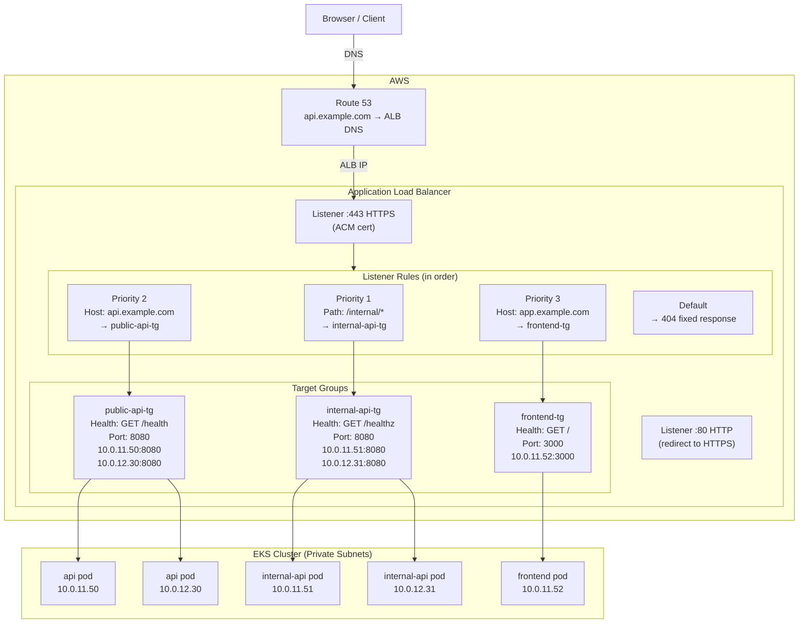
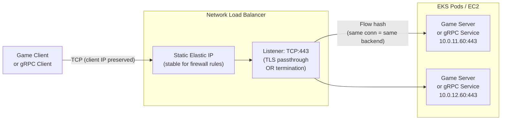
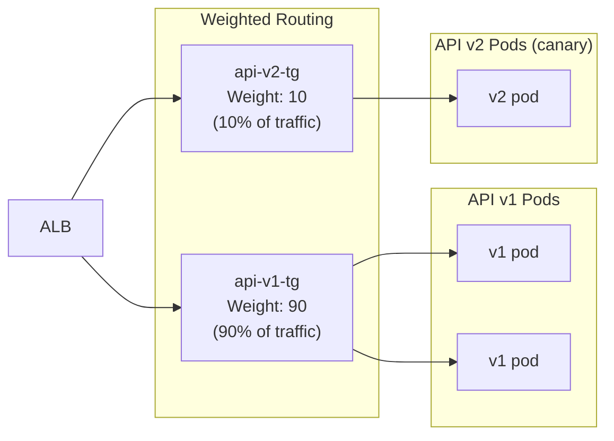
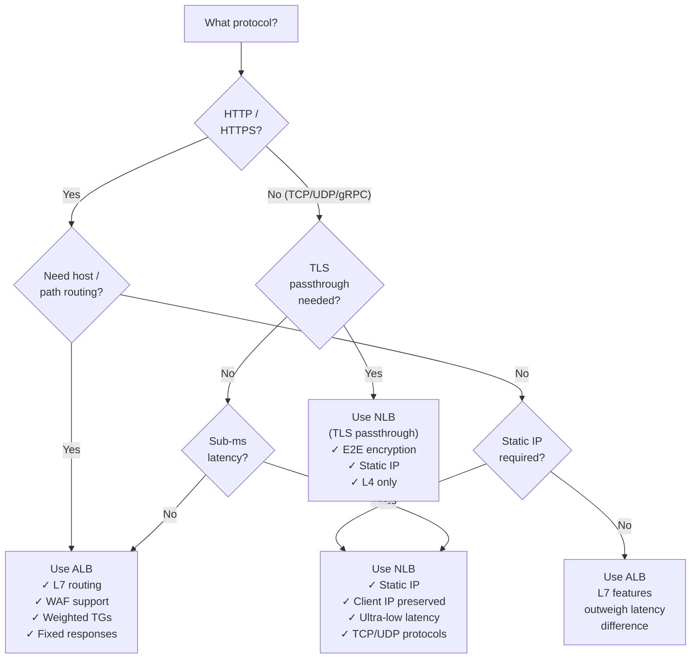

# Load Balancing Deep Dive: ALB, NLB, Health Checks, and Connection Draining

> Part 6 of the series: *"Networking for DevOps and Cloud Architects: From Packets to Production"*
>
> Prerequisites: [Part 1 — Networking Fundamentals](./01-networking-fundamentals.md) | [Part 4 — VPC Networking](./04-vpc-networking.md) | [Part 5 — Kubernetes Networking](./05-kubernetes-networking.md)

---

## Table of Contents

- [Why This Matters](#why-this-matters)
- [Mental Model](#mental-model)
- [Core Concepts](#core-concepts)
- [How It Works in Real Production Systems](#how-it-works-in-real-production-systems)
- [End-to-End Traffic Flow Example](#end-to-end-traffic-flow-example)
- [Common Failure Patterns](#common-failure-patterns)
- [Commands Every Engineer Should Know](#commands-every-engineer-should-know)
- [AWS / Cloud Angle](#aws--cloud-angle)
- [Kubernetes Angle](#kubernetes-angle)
- [Troubleshooting Framework](#troubleshooting-framework)
- [Senior Engineer Interview Explanation](#senior-engineer-interview-explanation)
- [Production Checklist](#production-checklist)
- [Key Takeaways](#key-takeaways)

---

## Why This Matters

Load balancers are one of those things that feel deceptively simple — "it distributes traffic, right?" — until you're on-call during an incident where your ALB is healthy, your pods are healthy, but 15% of requests are failing and nobody knows why.

Here's what's actually happening in production systems that most engineers don't fully grasp:

- **A load balancer is not just a traffic distributor.** It's a health sentinel, a connection drainer, a TLS terminator, a request router, and in AWS's case, a fully managed service with its own failure modes that have nothing to do with your application.

- **Health checks are the contract between your app and the load balancer.** Get them wrong — wrong path, wrong threshold, wrong timeout — and perfectly healthy pods get marked unhealthy and pulled from rotation. Your service degrades for no reason.

- **Connection draining is the difference between zero-downtime deployments and dropped connections.** Without it, the load balancer keeps sending traffic to a pod that's shutting down. With it, in-flight requests complete before the pod dies. This is not an optional nicety — it's a production requirement.

- **ALB and NLB are not interchangeable.** They operate at different OSI layers, make different routing decisions, have different latency profiles, and suit different workloads. Using an NLB for an HTTP microservices platform is a design smell. Using an ALB for a gaming server that needs sub-millisecond latency is the wrong tool.

- **Target group health is what actually matters, not load balancer health.** The load balancer itself is highly available by design. What fails is target group health — backends getting marked unhealthy for reasons that have nothing to do with whether your app is actually broken.

This article makes load balancing concrete: what each type does, how health checks actually work, what connection draining means in practice, and how to debug every failure mode you'll encounter.

---

## Mental Model

**Think of a load balancer like a smart traffic control system at the entrance to a city.**

Imagine a city with multiple entry points (your backends — pods, EC2 instances). The traffic control system at the entrance has a few jobs:

- **Count and distribute cars** — don't send all traffic down one road while others sit empty. That's basic load distribution.
- **Know which roads are open** — if a road is flooded (unhealthy backend), stop sending cars down it. That's health checking.
- **Handle rush hour gracefully** — when a road is about to close for maintenance, let the cars already on it finish their journey before blocking the road. That's connection draining.
- **Read road signs and route accordingly** — if a car wants the beach, send it to Road A. If it wants the mountains, send it to Road B. That's L7 routing (ALB).
- **Or just distribute cars without reading anything** — faster for the control system, but it can't make smart decisions. That's L4 routing (NLB).

The deeper insight: the traffic control system doesn't know if the roads are *actually* good — it can only check periodically. If a road floods between health check intervals, cars sent there hit a real problem. **Health checks are polling, not real-time.** There's always a detection gap.

---

## Core Concepts

### 1. What a Load Balancer Actually Does

Let's be precise. A load balancer does these things, in order:

**Accepts connections** from clients. In AWS, the ALB/NLB IP is what DNS resolves to. The client connects here.

**Terminates or passes connections.** An ALB terminates TCP and TLS at the load balancer — it reads the HTTP request, makes a routing decision, then makes a *new* connection to the backend. An NLB in TCP mode passes the connection through to the backend — the backend sees the original connection.

**Selects a backend** (target) from the healthy pool using a load balancing algorithm.

**Forwards the request** to the selected backend, optionally adding headers, modifying the request, or re-encrypting.

**Monitors backend health** by periodically sending health check requests and tracking success/failure.

**Drains connections** from backends being removed — waits for in-flight requests to complete before marking the backend as fully deregistered.

That's the whole job. But each of these steps has significant depth.

---

### 2. Layer 4 vs Layer 7 Load Balancing — The Fundamental Difference

This distinction shapes every architectural decision around load balancers.

**Layer 4 (Transport Layer) — NLB**

The load balancer sees: source IP, destination IP, source port, destination port, protocol (TCP/UDP). That's it. It cannot read HTTP headers, URL paths, cookies, or anything in the payload.

```
Client SYN → NLB → Backend SYN
                    (same TCP connection, just forwarded)
```

The NLB makes its routing decision based purely on the incoming connection metadata. Once routed to a backend, all subsequent packets in that TCP session go to the same backend (connection affinity is built-in — TCP is a stateful connection).

**Layer 7 (Application Layer) — ALB**

The load balancer reads the actual HTTP request — method, URL, headers, query strings. It can make routing decisions based on any of this.

```
Client → ALB (full HTTP request received)
         ALB reads: Host: api.example.com, Path: /v1/payments
         Makes routing decision
         Opens NEW TCP connection to backend
         Forwards request (with added headers like X-Forwarded-For)
```

The ALB terminates the connection from the client, reads the full request, then makes a new connection to the backend. This is called a **proxy** model.

**When to use which:**

| Use NLB when | Use ALB when |
|-------------|-------------|
| Ultra-low latency (<1ms) needed | HTTP/HTTPS routing by host/path |
| TCP/UDP protocols (not HTTP) | Microservices with different paths on same domain |
| Client IP preservation is critical | WebSocket connections with HTTP upgrade |
| gRPC with TLS passthrough | Need to add/modify HTTP headers |
| Static IP addresses required | Need WAF integration |
| Gaming, IoT, financial trading | Standard web APIs and services |
| Preserving TLS end-to-end | Cost-effective L7 routing |

**The latency difference is real but usually not the deciding factor.** ALB adds ~1-5ms per request for the L7 processing. For an API that takes 50-200ms to respond, this is noise. For a high-frequency trading system where 1ms matters, it's not.

---

### 3. AWS ALB Deep Dive — What It Can Do

The Application Load Balancer is more capable than most engineers use it for. Here's the full picture:

**Listeners** — an ALB has one or more listeners, each bound to a port:
```
Listener: HTTPS:443
Listener: HTTP:80  (usually just redirects to 443)
```

**Listener Rules** — each listener has ordered rules evaluated top to bottom:
```
Rule 1 (priority 1):  Host: api.example.com, Path: /v1/internal/*
                      → Forward to internal-api-tg (target group)

Rule 2 (priority 2):  Host: api.example.com, Path: /v1/*
                      → Forward to public-api-tg

Rule 3 (priority 3):  Host: app.example.com
                      → Forward to frontend-tg

Rule 4 (default):     → Return 404 fixed response
```

Rules can also: redirect (HTTP → HTTPS), return fixed responses (404, 503 maintenance pages), rewrite paths, set headers.

**Target Groups** — a pool of backends with its own health check config:
```
Target Group: public-api-tg
  Targets:    Pod IPs (in IP mode) or EC2 instance IDs (in instance mode)
  Protocol:   HTTP
  Port:        8080
  Health Check: GET /health, 200 OK expected, 5s timeout, 30s interval
```

One ALB can have many target groups. One target group can be used by multiple rules (fan-in). Targets can be EC2 instances, ECS tasks, Lambda functions, or pod IPs.

**Advanced ALB routing — things engineers don't know they can do:**

```
# Route mobile users to a different backend
Condition: http-header User-Agent contains "Mobile"
Action: Forward to mobile-api-tg

# A/B testing via query string
Condition: query-string ?version=2
Action: Forward to api-v2-tg

# Canary deployment via weighted target groups
Action: Forward to:
  api-v1-tg (95% weight)
  api-v2-tg (5% weight)

# IP-based routing (block or allow specific CIDRs)
Condition: source-ip 10.0.0.0/8
Action: Forward to internal-api-tg
```

Weighted routing in ALB is the cleanest way to do canary deployments — no DNS TTL games, instant traffic shifting, and you can go from 0% to 100% in seconds if the canary is healthy.

---

### 4. AWS NLB Deep Dive — What Makes It Different

The Network Load Balancer is built for performance and protocol flexibility. Key characteristics:

**Static IPs** — each NLB gets one static IP per AZ. This is a major operational difference from ALB (which has dynamic IPs). If you have firewall rules or partner companies that whitelist your IP, NLB gives you stable IPs that never change.

**TLS passthrough** — NLB can forward raw TCP to backends without decrypting TLS. The backend handles TLS termination. This is the only way to do end-to-end TLS without the load balancer ever seeing plaintext.

**TLS termination** — NLB can also terminate TLS itself and forward plain TCP, like an ALB. The difference: NLB can't do HTTP/path-based routing after termination (it's still just TCP after decryption).

**Client IP preservation** — NLB in TCP mode preserves the real client IP. The backend sees the actual client IP in the packet source, not the NLB's IP. With ALB, backends see the ALB's IP and must use the `X-Forwarded-For` header to get the real client IP.

**Connection-level routing** — once a TCP connection is established through an NLB, all packets in that connection go to the same backend. There's no request-level routing decisions after initial connection — unlike ALB which makes per-request decisions.

**Ultra-low latency** — NLB processes at the network layer with minimal overhead. Benchmarks typically show NLB at sub-millisecond vs ALB at 1-5ms additional latency.

---

### 5. Health Checks — The Most Important Configuration Nobody Gets Right

A health check is the load balancer asking your backend "are you alive and ready to serve traffic?"

**If the health check says unhealthy, the load balancer stops sending traffic to that target.** Doesn't matter if your app is working fine — from the load balancer's perspective, that target is dead.

**Health check parameters and what they mean:**

```
Protocol:           HTTP / HTTPS / TCP / gRPC
Path:               /health (for HTTP/HTTPS)
Port:               traffic port or a dedicated health port
Interval:           30s   ← how often to check
Timeout:            5s    ← how long to wait for response before marking as failed
Healthy threshold:  3     ← how many consecutive successes to mark as healthy
Unhealthy threshold: 2    ← how many consecutive failures to mark as unhealthy
Success codes:      200   ← which HTTP codes count as healthy
```

**The timing math that matters:**

When a pod becomes unhealthy:
```
Worst case detection time = Interval × Unhealthy threshold
= 30s × 2 = 60 seconds of bad traffic before removal

With aggressive settings (10s interval, 2 failures):
= 10s × 2 = 20 seconds
```

When a new pod starts up (warmup time):
```
Time before first traffic = Interval × Healthy threshold
= 30s × 3 = 90 seconds before a new pod receives any traffic

With faster warmup (10s interval, 2 successes):
= 10s × 2 = 20 seconds
```

**This timing directly affects your deployment speed.** If healthy threshold is 3 checks at 30s intervals, each new pod in a rolling deployment takes 90 seconds before it starts receiving real traffic. For a 10-pod deployment, that can mean 15 minutes for a rollout to complete — not because pods are slow to start, but because the load balancer is being cautious.

**The health check endpoint itself matters enormously:**

```
❌ Bad health check endpoints:

GET /health → always returns 200, even when DB is down
GET /health → connects to DB (adds latency, can cascade)
GET / (homepage) → involves full render, slow, may have side effects

✅ Good health check endpoints:

GET /health → returns 200 if app is running, 503 if not ready
GET /healthz → checks app is alive (liveness)
GET /readyz → checks all dependencies ready (readiness)
              returns 503 if DB connection pool exhausted
              returns 503 if downstream service is degraded
              returns 200 when fully ready to serve traffic
```

**Liveness vs readiness for ALB health checks:**

Use a *readiness* check for ALB health checks, not liveness. The difference:
- Liveness: "Is the process alive?" — if this fails, restart the pod
- Readiness: "Is the pod ready to serve traffic?" — if this fails, remove from load balancer rotation

An app can be alive but not ready. During startup, it's alive but not ready. During a DB connection pool exhaustion, it's alive but not ready to take more traffic. If your ALB health check is a liveness check (just returns 200 always), the load balancer doesn't know about degraded states.

---

### 6. Connection Draining — How Zero-Downtime Deployments Actually Work

This is the concept that separates teams that have connection drops during deployments from teams that don't.

**What happens without connection draining:**

```
Time 0:   Pod is running. ALB is sending it traffic.
          In-flight: 50 requests currently being processed.
Time 1:   Pod is marked for termination (rolling update starts).
Time 1:   Kubernetes sends SIGTERM to pod.
Time 1:   ALB immediately stops sending NEW requests to this pod.
          But the 50 in-flight requests? The pod starts shutting down.
          Their connections are reset mid-response.
          50 users see errors.
```

**What happens with connection draining:**

```
Time 0:   Pod is running. ALB is sending it traffic.
Time 1:   Pod is deregistered from the target group.
Time 1:   ALB stops sending NEW requests to this pod.
Time 1:   ALB starts "draining" — waits for in-flight requests to complete.
Time 1-31: The 50 in-flight requests complete normally.
           ALB routes no new traffic to this pod.
Time 31:  Deregistration delay expires (30 seconds).
          ALB considers the target fully deregistered.
Time 31:  Kubernetes sends SIGTERM to pod.
          Pod is now idle — no in-flight requests.
          Pod shuts down gracefully.
          Zero connection drops.
```

**The deregistration delay** (called "connection draining" in classic ELB, "deregistration delay" in ALB/NLB target groups) controls how long the load balancer waits. Default is 300 seconds. For most HTTP services, 30-60 seconds is enough.

**The Kubernetes side of this equation:**

AWS ALB doesn't automatically know when Kubernetes is deleting a pod. The AWS Load Balancer Controller handles this — when a pod is removed from an Endpoints/EndpointSlice, the controller deregisters it from the target group, and ALB starts the draining period.

But there's a race condition: Kubernetes sends SIGTERM to the pod and starts the termination process *at the same time* the deregistration request goes to AWS. The AWS API call takes a few seconds. During that gap, the ALB might still send requests to a pod that's already shutting down.

**The fix — a preStop hook:**

```yaml
spec:
  containers:
  - name: api
    lifecycle:
      preStop:
        exec:
          command: ["/bin/sh", "-c", "sleep 15"]
  terminationGracePeriodSeconds: 60
```

The preStop hook runs before SIGTERM, keeping the pod alive for 15 seconds. This gives the ALB deregistration time to propagate before the pod starts shutting down. The terminationGracePeriodSeconds must be longer than preStop + your app's shutdown time.

**Deregistration delay should match or exceed preStop duration:**

```
preStop: 15 seconds
ALB deregistration delay: 30 seconds
terminationGracePeriodSeconds: 60 seconds

Timeline:
0s:  Kubernetes starts termination. Calls preStop hook.
     AWS LBC sends deregistration to ALB API.
0-15s: preStop hook runs. Pod still alive. ALB still sending traffic.
~5s: ALB API acknowledges deregistration. Starts draining.
15s: preStop ends. Kubernetes sends SIGTERM.
15-45s: App shuts down gracefully. No new traffic from ALB.
30s: ALB deregistration delay complete. ALB fully removes target.
45s: App finishes shutdown. Pod terminates.
```

Clean. Zero drops.

---

### 7. Load Balancing Algorithms — How Traffic Is Distributed

**Round Robin** (ALB default for most cases)
Requests go to each backend in turn: 1, 2, 3, 1, 2, 3...
Works well when all backends take similar time to respond and have similar capacity.

**Least Outstanding Requests** (ALB default for HTTP/2 and WebSockets)
New requests go to the backend with the fewest active, in-flight requests.
Better than round robin when request processing times vary significantly — a slow request to one backend doesn't cause that backend to pile up if LOR is in use.

**Random** (NLB)
Selects a target randomly. Simple. Good enough for homogeneous backends.

**Flow Hash / Connection-based** (NLB default for TCP/UDP)
All packets in a TCP flow go to the same target. Not a load balancing algorithm in the request sense — it's per-connection stickiness baked into TCP.

**Sticky Sessions / Session Affinity** (ALB optional)
ALB adds a cookie (`AWSALB`) to responses. Subsequent requests with that cookie go to the same target. Use only for stateful applications. For stateless applications, sticky sessions reduce effective load balancing — if one backend is slow, its "sticky" users pile up on it.

```
ALB sticky session annotation (for Kubernetes):
alb.ingress.kubernetes.io/target-group-attributes: stickiness.enabled=true,stickiness.lb_cookie.duration_seconds=86400
```

---

### 8. Slow Start / Target Warmup

Newly registered targets get traffic gradually, not all at once. This prevents a cold pod — still loading caches, warming JVM, establishing DB connections — from being immediately hammered with full production traffic.

**ALB slow start:**
```
alb.ingress.kubernetes.io/target-group-attributes: slow_start.duration_seconds=60
```

During the slow start duration, traffic to the new target ramps from 0% to its full share linearly. A 60-second slow start means the new pod gets barely any traffic for the first minute, then full traffic share at 60 seconds.

Combine this with proper readiness probes and you have:
1. Pod starts
2. Readiness probe passes → pod added to target group
3. Slow start begins → minimal traffic for 60 seconds (app is warming)
4. Slow start ends → full traffic share (app is warm)

This is how you prevent "cold pod" 502 errors during deployments at scale.

---

## How It Works in Real Production Systems

### The Full ALB Architecture in EKS



---

### NLB for Non-HTTP Workloads



**NLB is the right choice here because:**
- Client IP matters for game server logic (anti-cheat, rate limiting)
- gRPC is long-lived connections — connection affinity is important
- Static IP required for client-side firewall rules
- TLS passthrough needed for end-to-end encryption

---

### Health Check Design Patterns

**Pattern 1: Simple liveness check (insufficient for production)**
```python
# Bad — this will always return 200 even when the app is broken
@app.get("/health")
def health():
    return {"status": "ok"}
```

**Pattern 2: Deep readiness check (production-grade)**
```python
# Good — checks actual dependencies
@app.get("/readyz")
async def readyz():
    checks = {}
    
    # Check DB connection
    try:
        await db.execute("SELECT 1")
        checks["database"] = "ok"
    except Exception as e:
        checks["database"] = f"failed: {str(e)}"
    
    # Check cache
    try:
        await redis.ping()
        checks["cache"] = "ok"
    except Exception:
        checks["cache"] = "degraded"  # Non-fatal
    
    # Check critical downstream service
    try:
        resp = await http_client.get("http://payments-service/health", timeout=2)
        checks["payments"] = "ok" if resp.status_code == 200 else "degraded"
    except Exception:
        checks["payments"] = "unreachable"
    
    # Only fail if critical checks fail
    is_healthy = checks["database"] == "ok"
    
    status_code = 200 if is_healthy else 503
    return JSONResponse({"status": checks}, status_code=status_code)
```

**Pattern 3: Separate liveness and readiness endpoints**
```python
@app.get("/healthz")   # Kubernetes liveness probe → ALB should NOT use this
def liveness():
    # Just checks if the process is running and not deadlocked
    return {"alive": True}

@app.get("/readyz")    # Kubernetes readiness probe + ALB health check
async def readiness():
    # Checks if ready to serve traffic
    # Returns 503 if not ready
    ...
```

The liveness probe is for Kubernetes to decide "should I restart this pod?" The readiness probe (and ALB health check) is for "should I send traffic to this pod?" They should be different endpoints with different logic.

---

### Canary Deployments with Weighted Target Groups

This is one of the most underused ALB features. You can shift traffic between two target groups by percentage — no DNS changes, no code changes, instant adjustment.



```yaml
# Kubernetes Ingress with weighted target groups (AWS LBC)
annotations:
  alb.ingress.kubernetes.io/actions.forward-with-weight: |
    {
      "type":"forward",
      "forwardConfig":{
        "targetGroups":[
          {"serviceName":"api-v1","servicePort":"80","weight":90},
          {"serviceName":"api-v2","servicePort":"80","weight":10}
        ]
      }
    }
```

**The canary rollout flow:**
```
Deploy v2 pods alongside v1
Set weight: v1=95, v2=5
Monitor error rates and latency for v2
Set weight: v1=80, v2=20
Monitor...
Set weight: v1=0, v2=100
Delete v1 pods
```

Instant rollback if v2 shows problems: set weight back to v1=100, v2=0. Takes effect within seconds — no DNS TTL wait.

---

## End-to-End Traffic Flow Example

**Scenario: Rolling deployment of `api-service` — no connection drops**

```
═══════════════════════════════════════════════════════════════════
 STATE: api-service has 3 pods. Deployment update triggered.
═══════════════════════════════════════════════════════════════════

Target Group: api-tg
  10.0.11.50:8080  → healthy (Pod 1, v1)
  10.0.12.30:8080  → healthy (Pod 2, v1)
  10.0.13.20:8080  → healthy (Pod 3, v1)

════════════════════════════════════════════════════════════════════
 STEP 1: New pod (v2) starts on Node 1
════════════════════════════════════════════════════════════════════

  Pod 4 (v2) starts: 10.0.11.51:8080
  Pod is Running but NOT Ready (readinessProbe not yet passing)
  
  ALB target group: Pod 4 not yet registered — no traffic sent to it
  
  Pod 4 finishes startup. Readiness probe starts passing.
  AWS LBC registers 10.0.11.51:8080 in api-tg
  
  ALB runs health checks:
    GET http://10.0.11.51:8080/health → 200 OK (check 1 of 3)
    GET http://10.0.11.51:8080/health → 200 OK (check 2 of 3)
    GET http://10.0.11.51:8080/health → 200 OK (check 3 of 3) ✓
  
  Target group after 90s (3 checks × 30s interval):
    10.0.11.50:8080  → healthy (Pod 1, v1)
    10.0.12.30:8080  → healthy (Pod 2, v1)
    10.0.13.20:8080  → healthy (Pod 3, v1)
    10.0.11.51:8080  → healthy (Pod 4, v2) ← new

════════════════════════════════════════════════════════════════════
 STEP 2: Old pod (v1) Pod 1 is deregistered
════════════════════════════════════════════════════════════════════

  Kubernetes deletes Pod 1
  AWS LBC calls ALB API: deregister 10.0.11.50:8080
  
  ALB begins draining:
    - No NEW requests sent to 10.0.11.50:8080
    - In-flight requests to 10.0.11.50:8080 complete normally
    - Other pods (2, 3, 4) absorb new traffic
  
  preStop hook fires on Pod 1 (sleep 15s):
    Pod 1 still alive. ALB has 15s to propagate deregistration.
  
  After 15s: Pod 1 receives SIGTERM
    App begins graceful shutdown.
    Pod 1 handles any remaining in-flight requests.
    Pod 1 shuts down. No active connections.
  
  ALB deregistration delay (30s) completes:
    10.0.11.50:8080 fully removed from target group.
  
  Target group:
    10.0.12.30:8080  → healthy (Pod 2, v1)
    10.0.13.20:8080  → healthy (Pod 3, v1)
    10.0.11.51:8080  → healthy (Pod 4, v2) ← serving traffic
  
════════════════════════════════════════════════════════════════════
 STEP 3: Repeat for Pod 2 and Pod 3
════════════════════════════════════════════════════════════════════

  Start Pod 5 (v2), wait for healthy, deregister Pod 2...
  Start Pod 6 (v2), wait for healthy, deregister Pod 3...
  
  Final target group:
    10.0.11.51:8080  → healthy (Pod 4, v2)
    10.0.12.31:8080  → healthy (Pod 5, v2)
    10.0.13.21:8080  → healthy (Pod 6, v2)
  
  Zero connection drops. 100% traffic on v2. Deployment complete.
```

**What would have caused drops:**
- No preStop hook → Pod gets SIGTERM while ALB still sending traffic
- Deregistration delay too short (5s) → ALB sends requests during shutdown
- Health check healthy threshold too high (5) → new pods wait too long
- readinessProbe not configured → pod added to LB before app is ready → 502s

---

## Common Failure Patterns

### Failure 1: All Targets Unhealthy — 503 Service Unavailable

**Symptom:** ALB returns 503. `aws elbv2 describe-target-health` shows all targets `unhealthy`.

**This is the most stressful production failure.** The load balancer is working. The pods are probably running. Something about the health check is failing.

**Verify — work through these in order:**

```bash
# Step 1: Check target health status
aws elbv2 describe-target-health \
  --target-group-arn <arn> \
  --query 'TargetHealthDescriptions[*].{Target:Target.Id,Port:Target.Port,State:TargetHealth.State,Reason:TargetHealth.Reason,Description:TargetHealth.Description}'

# Step 2: Test the health check endpoint directly
curl -v http://<pod-ip>:<port>/health

# Step 3: Check if the security group allows ALB to reach pods
# ALB SG must be in the inbound rules of the pod/node SG
aws ec2 describe-security-groups \
  --group-ids <pod-or-node-sg-id> \
  --query 'SecurityGroups[*].IpPermissions[?FromPort==`8080`]'

# Step 4: Check what health check the target group is using
aws elbv2 describe-target-groups \
  --target-group-arns <arn> \
  --query 'TargetGroups[*].{Path:HealthCheckPath,Port:HealthCheckPort,Protocol:HealthCheckProtocol,Timeout:HealthCheckTimeoutSeconds,Interval:HealthCheckIntervalSeconds,Threshold:HealthyThresholdCount,Codes:Matcher.HttpCode}'
```

**Common causes:**

| Cause | Symptom in describe-target-health | Fix |
|-------|----------------------------------|-----|
| Wrong health check path | `Health checks failed with these codes: [404]` | Fix path to one that returns 200 |
| Security group blocks ALB | `Health checks failed` with timeout | Allow ALB SG in node/pod SG |
| App returns non-200 | `Health checks failed with these codes: [500]` | Fix app startup, check app logs |
| Wrong port | `Connection refused` | Match targetPort to app's actual port |
| App hasn't started yet | `Initial health checks failed` | Increase health check grace period |

---

### Failure 2: Intermittent 502s During Deployment

**Symptom:** Normal traffic works fine. During rolling deployments, a percentage of requests return 502. Clears up after deployment finishes.

**Cause:** Race condition between Kubernetes pod termination and ALB deregistration. Pod is receiving SIGTERM (shutting down) while ALB still sends it traffic.

**Verify:**
```bash
# Check if 502s correlate with deployment events
kubectl rollout history deployment/api-service -n production

# Check pod preStop configuration
kubectl get deployment api-service -n production -o yaml | \
  grep -A10 "lifecycle\|preStop\|terminationGrace"

# Check ALB target group deregistration delay
aws elbv2 describe-target-group-attributes \
  --target-group-arn <arn> \
  --query 'Attributes[?Key==`deregistration_delay.timeout_seconds`]'

# Watch target health during a deployment
watch -n 2 'aws elbv2 describe-target-health --target-group-arn <arn> \
  --query "TargetHealthDescriptions[*].{IP:Target.Id,State:TargetHealth.State}"'
```

**Fix:**
```yaml
# Add preStop hook and set termination grace period
spec:
  containers:
  - name: api
    lifecycle:
      preStop:
        exec:
          command: ["/bin/sh", "-c", "sleep 15"]
  terminationGracePeriodSeconds: 60
```

```bash
# Set deregistration delay to 30s (must be >= preStop duration)
aws elbv2 modify-target-group-attributes \
  --target-group-arn <arn> \
  --attributes Key=deregistration_delay.timeout_seconds,Value=30
```

---

### Failure 3: Slow Deployment — New Pods Wait Forever for Traffic

**Symptom:** Rolling deployment takes much longer than expected. New pods are Running and Ready, but it takes 3–5 minutes before they're actually serving traffic. Deployment of 10 pods takes 30+ minutes.

**Cause:** Health check interval × healthy threshold = time before first traffic.
Default: 30s interval × 3 healthy checks = 90 seconds per pod, before slow start.

**Verify:**
```bash
# Check health check settings
aws elbv2 describe-target-groups \
  --target-group-arns <arn> \
  --query 'TargetGroups[*].{Interval:HealthCheckIntervalSeconds,Threshold:HealthyThresholdCount}'

# Result: Interval: 30, Threshold: 3 → 90s before first traffic per pod
```

**Fix — tune for faster deployments (balance against stability):**
```bash
aws elbv2 modify-target-group \
  --target-group-arn <arn> \
  --health-check-interval-seconds 10 \
  --healthy-threshold-count 2
# Now: 10s × 2 = 20 seconds before first traffic
```

Also check if `slow_start.duration_seconds` is set — if it's 300s (5 minutes), you found your culprit.

---

### Failure 4: Sticky Sessions Causing Uneven Load

**Symptom:** One backend is handling 60% of traffic while others handle 20% each. Scaling isn't helping — one pod is always overloaded regardless of how many you add.

**Cause:** Sticky sessions create affinity between clients and backends. A small number of high-traffic clients are all pinned to the same backend. Adding more pods helps new users, but existing sticky sessions still go to the overloaded pod.

**Verify:**
```bash
# Check if stickiness is enabled
aws elbv2 describe-target-group-attributes \
  --target-group-arn <arn> \
  --query 'Attributes[?contains(Key, `stickiness`)]'

# Check per-target request distribution in CloudWatch
# Look for uneven distribution in "HealthyHostCount" and request metrics
```

**Fix:** Disable sticky sessions if your application is stateless (it should be). If the app genuinely needs session state, move state to an external store (Redis, DynamoDB) and make the app stateless — then drop sticky sessions.

```bash
aws elbv2 modify-target-group-attributes \
  --target-group-arn <arn> \
  --attributes Key=stickiness.enabled,Value=false
```

---

### Failure 5: ALB Timeout Before Backend Responds

**Symptom:** Requests that should succeed return 504 Gateway Timeout. The backend is doing a legitimate long-running operation (report generation, batch processing, file export).

**Cause:** ALB has a 60-second idle timeout by default. If a backend takes longer than 60 seconds to respond (or there's no data flowing for 60 seconds), ALB closes the connection and returns 504.

**Verify:**
```bash
# Check current idle timeout
aws elbv2 describe-load-balancer-attributes \
  --load-balancer-arn <arn> \
  --query 'Attributes[?Key==`idle_timeout.timeout_seconds`]'

# Check if it's a timeout issue (504 = timeout, 502 = bad response)
# ALB access logs show the request processing time
```

**Fix options:**
```bash
# Option 1: Increase ALB idle timeout (max 4000 seconds)
aws elbv2 modify-load-balancer-attributes \
  --load-balancer-arn <arn> \
  --attributes Key=idle_timeout.timeout_seconds,Value=120

# Option 2 (better): Make long-running operations async
# Accept request → return 202 Accepted + job ID immediately
# Client polls /jobs/{id}/status
# Operation runs in background worker
# This is the right architectural pattern — don't rely on 120s HTTP timeouts
```

---

### Failure 6: Health Checker IPs Getting Blocked

**Symptom:** ALB marks healthy pods as unhealthy despite the pods working fine. Direct curl to the pod health endpoint succeeds. Health checks from the ALB fail.

**Cause:** Security group on the pods/nodes doesn't allow ALB health check traffic. The ALB health checker uses the ALB's VPC IPs (not a fixed range) — it sends health checks from the ALB nodes in each AZ.

**Verify:**
```bash
# Test from inside the cluster — does the health endpoint work?
kubectl exec -it <pod> -- curl -v http://localhost:8080/health

# Test from a different pod on the same node — does it work?
kubectl exec -it <other-pod> -- curl -v http://<pod-ip>:8080/health

# If both work → network policy or security group blocking ALB health checks

# Check node security group inbound rules
aws ec2 describe-security-groups \
  --group-ids <node-sg-id> \
  --query 'SecurityGroups[*].IpPermissions'

# The ALB SG should be listed as allowed source for the health check port
```

**Fix:**
```bash
# Allow ALB SG to reach pods on the health check port
aws ec2 authorize-security-group-ingress \
  --group-id <node-or-pod-sg-id> \
  --protocol tcp \
  --port 8080 \
  --source-group <alb-sg-id>
```

For AWS LBC in IP mode (traffic direct to pod IPs), the ALB health checks go to pod IPs. The pod's security group (or the node's SG if using Security Groups for Pods) must allow traffic from the ALB security group.

---

## Commands Every Engineer Should Know

### ALB Target Health

```bash
# ── The Single Most Useful Load Balancer Command ───────────────────

# Check all target health in a target group (formatted)
aws elbv2 describe-target-health \
  --target-group-arn <arn> \
  --query 'TargetHealthDescriptions[*].{
    IP:Target.Id,
    Port:Target.Port,
    State:TargetHealth.State,
    Reason:TargetHealth.Reason,
    Description:TargetHealth.Description
  }' \
  --output table

# ── Finding ARNs When You Don't Have Them ─────────────────────────

# List all load balancers
aws elbv2 describe-load-balancers \
  --query 'LoadBalancers[*].{Name:LoadBalancerName,ARN:LoadBalancerArn,DNS:DNSName,State:State.Code}'

# List all target groups for a load balancer
aws elbv2 describe-target-groups \
  --load-balancer-arn <alb-arn> \
  --query 'TargetGroups[*].{Name:TargetGroupName,ARN:TargetGroupArn,Protocol:Protocol,Port:Port,HealthPath:HealthCheckPath}'

# ── Detailed Configuration ─────────────────────────────────────────

# Full health check configuration
aws elbv2 describe-target-groups \
  --target-group-arns <arn> \
  --query 'TargetGroups[0]'

# Listener rules (what routes to where)
aws elbv2 describe-rules \
  --listener-arn <listener-arn> \
  --query 'Rules[*].{Priority:Priority,Conditions:Conditions,Actions:Actions}'

# Target group attributes (deregistration delay, stickiness, slow start)
aws elbv2 describe-target-group-attributes \
  --target-group-arn <arn>

# ALB attributes (idle timeout, access logs, deletion protection)
aws elbv2 describe-load-balancer-attributes \
  --load-balancer-arn <arn>
```

---

### Monitoring During Deployments

```bash
# Watch target health in real-time during deployment
watch -n 5 'aws elbv2 describe-target-health \
  --target-group-arn <arn> \
  --query "TargetHealthDescriptions[*].{IP:Target.Id,State:TargetHealth.State,Reason:TargetHealth.Reason}" \
  --output table'

# Watch Kubernetes endpoints changing
kubectl get endpoints api-service -n production -w

# Watch pod rollout
kubectl rollout status deployment/api-service -n production

# Watch pod states during rolling update
kubectl get pods -n production -l app=api -w
```

---

### ALB Access Logs (when enabled in S3)

```bash
# Enable access logs
aws elbv2 modify-load-balancer-attributes \
  --load-balancer-arn <arn> \
  --attributes Key=access_logs.s3.enabled,Value=true \
               Key=access_logs.s3.bucket,Value=my-alb-logs-bucket \
               Key=access_logs.s3.prefix,Value=alb-logs

# Query access logs with Athena (after setting up Athena table)
# Find all 5xx errors in the last hour
SELECT time, elb, request_url, elb_status_code, 
       target_status_code, response_processing_time
FROM alb_logs
WHERE elb_status_code LIKE '5%'
  AND time > date_add('hour', -1, now())
ORDER BY time DESC
LIMIT 100;

# Find slow requests (>5 seconds)
SELECT time, request_url, request_processing_time, 
       target_processing_time, response_processing_time,
       (request_processing_time + target_processing_time + response_processing_time) AS total_time
FROM alb_logs
WHERE (request_processing_time + target_processing_time + response_processing_time) > 5
ORDER BY total_time DESC
LIMIT 50;
```

---

### CloudWatch Metrics for Load Balancers

```bash
# Get ALB request count for the last hour
aws cloudwatch get-metric-statistics \
  --namespace AWS/ApplicationELB \
  --metric-name RequestCount \
  --dimensions Name=LoadBalancer,Value=<alb-name> \
  --start-time $(date -u -d '1 hour ago' +%FT%TZ) \
  --end-time $(date -u +%FT%TZ) \
  --period 300 \
  --statistics Sum

# Get 5xx error count
aws cloudwatch get-metric-statistics \
  --namespace AWS/ApplicationELB \
  --metric-name HTTPCode_Target_5XX_Count \
  --dimensions Name=LoadBalancer,Value=<alb-name> \
  --start-time $(date -u -d '1 hour ago' +%FT%TZ) \
  --end-time $(date -u +%FT%TZ) \
  --period 60 \
  --statistics Sum

# Get unhealthy host count
aws cloudwatch get-metric-statistics \
  --namespace AWS/ApplicationELB \
  --metric-name UnHealthyHostCount \
  --dimensions Name=LoadBalancer,Value=<alb-name> \
              Name=TargetGroup,Value=<tg-name> \
  --start-time $(date -u -d '1 hour ago' +%FT%TZ) \
  --end-time $(date -u +%FT%TZ) \
  --period 60 \
  --statistics Maximum
```

---

### Kubernetes + Load Balancer Debugging

```bash
# Check AWS LBC is running and healthy
kubectl get pods -n kube-system \
  -l app.kubernetes.io/name=aws-load-balancer-controller

# Check AWS LBC logs (provisioning events, errors)
kubectl logs -n kube-system \
  -l app.kubernetes.io/name=aws-load-balancer-controller \
  --tail=50 | grep -E "error|failed|created|reconcil"

# Check Ingress events (why did provisioning fail?)
kubectl describe ingress <name> -n <namespace> | \
  grep -A30 "Events:"

# List all Ingress resources and their ALB DNS
kubectl get ingress -A \
  -o custom-columns='NAMESPACE:.metadata.namespace,NAME:.metadata.name,HOSTS:.spec.rules[*].host,ADDRESS:.status.loadBalancer.ingress[*].hostname'

# Check Service of type LoadBalancer and its external hostname
kubectl get svc -A --field-selector spec.type=LoadBalancer \
  -o custom-columns='NAMESPACE:.metadata.namespace,NAME:.metadata.name,EXTERNAL-IP:.status.loadBalancer.ingress[*].hostname'

# Verify target registration matches pod IPs
kubectl get endpoints <service-name> -n <namespace>
# Compare with:
aws elbv2 describe-target-health --target-group-arn <arn> \
  --query 'TargetHealthDescriptions[*].Target.Id'
```

---

## AWS / Cloud Angle

### ALB vs NLB Decision Matrix



---

### ALB Security Policy Selection

ALB security policies control which TLS versions and cipher suites are accepted. Choosing the wrong one either breaks old clients or allows weak encryption.

| Policy | TLS 1.0 | TLS 1.1 | TLS 1.2 | TLS 1.3 | Recommendation |
|--------|---------|---------|---------|---------|----------------|
| ELBSecurityPolicy-TLS13-1-3-2021-06 | ✗ | ✗ | ✗ | ✓ | TLS 1.3 only, most secure |
| **ELBSecurityPolicy-TLS13-1-2-2021-06** | ✗ | ✗ | ✓ | ✓ | **Default recommendation** |
| ELBSecurityPolicy-TLS13-1-1-2021-06 | ✗ | ✓ | ✓ | ✓ | Legacy support needed |
| ELBSecurityPolicy-2016-08 | ✓ | ✓ | ✓ | ✗ | Avoid — allows RC4, DES |

For new services: `ELBSecurityPolicy-TLS13-1-2-2021-06`. You support TLS 1.2 (still common in enterprise) and TLS 1.3 (fast, secure, modern). Nothing older.

---

### ALB Access Logs — What to Enable and Why

ALB access logs give you per-request detail that CloudWatch metrics can't:

| Field | What it tells you |
|-------|------------------|
| `elb_status_code` | What ALB returned (502 vs 504 tells you different things) |
| `target_status_code` | What the backend actually returned |
| `target_processing_time` | How long the backend took — is this a backend issue? |
| `request_processing_time` | How long ALB took to process — is this an ALB issue? |
| `target_ip:port` | Which specific backend handled the request |
| `received_bytes` / `sent_bytes` | Request and response sizes |
| `ssl_cipher` | Cipher suite used — for security audits |
| `user_agent` | Client type — useful for correlating mobile vs desktop failures |

Enable access logs on every production ALB. The storage cost is minimal (S3 is cheap). The value during an incident is enormous — you can see exactly what happened on every single request.

---

### Deletion Protection and Change Management

```bash
# Enable deletion protection on production load balancers
# (prevents accidental terraform destroy / console delete)
aws elbv2 modify-load-balancer-attributes \
  --load-balancer-arn <arn> \
  --attributes Key=deletion_protection.enabled,Value=true

# Verify it's set
aws elbv2 describe-load-balancer-attributes \
  --load-balancer-arn <arn> \
  --query 'Attributes[?Key==`deletion_protection.enabled`]'
```

This saved multiple teams from catastrophic Terraform accidents. Enable it on every production load balancer, then add a pre-destroy check in your Terraform code to disable it intentionally.

---

## Kubernetes Angle

### Ingress Annotations Reference for AWS LBC

The AWS Load Balancer Controller is configured primarily through Ingress annotations. Here are the ones that matter in production:

```yaml
metadata:
  annotations:
    # ── Basic Setup ──────────────────────────────────────────────────
    kubernetes.io/ingress.class: alb
    alb.ingress.kubernetes.io/scheme: internet-facing  # or internal
    alb.ingress.kubernetes.io/target-type: ip          # direct to pod IPs

    # ── TLS ──────────────────────────────────────────────────────────
    alb.ingress.kubernetes.io/certificate-arn: arn:aws:acm:...
    alb.ingress.kubernetes.io/ssl-policy: ELBSecurityPolicy-TLS13-1-2-2021-06
    alb.ingress.kubernetes.io/listen-ports: '[{"HTTP": 80}, {"HTTPS": 443}]'
    alb.ingress.kubernetes.io/ssl-redirect: "443"

    # ── Health Checks ────────────────────────────────────────────────
    alb.ingress.kubernetes.io/healthcheck-path: /health
    alb.ingress.kubernetes.io/healthcheck-interval-seconds: "15"
    alb.ingress.kubernetes.io/healthcheck-timeout-seconds: "5"
    alb.ingress.kubernetes.io/healthy-threshold-count: "2"
    alb.ingress.kubernetes.io/unhealthy-threshold-count: "2"
    alb.ingress.kubernetes.io/success-codes: "200"

    # ── Connection / Timeouts ────────────────────────────────────────
    alb.ingress.kubernetes.io/target-group-attributes: |
      deregistration_delay.timeout_seconds=30,
      slow_start.duration_seconds=60

    # ── Shared ALB (IngressGroup) ────────────────────────────────────
    alb.ingress.kubernetes.io/group.name: production-shared
    alb.ingress.kubernetes.io/group.order: "10"

    # ── Security ─────────────────────────────────────────────────────
    alb.ingress.kubernetes.io/wafv2-acl-arn: arn:aws:wafv2:...
    alb.ingress.kubernetes.io/shield-advanced-protection: "true"
    alb.ingress.kubernetes.io/security-groups: sg-xxxx

    # ── Access Logs ──────────────────────────────────────────────────
    alb.ingress.kubernetes.io/load-balancer-attributes: |
      access_logs.s3.enabled=true,
      access_logs.s3.bucket=my-alb-logs,
      access_logs.s3.prefix=production,
      idle_timeout.timeout_seconds=60,
      deletion_protection.enabled=true
```

---

### Pod Disruption Budget — Protecting Availability During Deployments

A PodDisruptionBudget (PDB) tells Kubernetes: "when doing rolling updates or node drains, always keep at least N pods (or X%) of this deployment running."

```yaml
apiVersion: policy/v1
kind: PodDisruptionBudget
metadata:
  name: api-pdb
  namespace: production
spec:
  minAvailable: 2       # Always keep at least 2 pods available
  # OR:
  # maxUnavailable: 1   # At most 1 pod unavailable at a time
  selector:
    matchLabels:
      app: api-service
```

Without a PDB, Kubernetes can (and will, during node drains or upgrades) take down multiple pods simultaneously. If you have 3 pods and Kubernetes evicts 2 at once, you're running on 1 pod with full load — potentially causing a brownout.

With `minAvailable: 2`, Kubernetes can only evict pods one at a time, waiting for the replacement to be healthy before removing another.

**PDB works directly with load balancer health** — a pod being evicted goes through the normal deregistration + draining process. The PDB prevents Kubernetes from moving too fast.

---

### NGINX Ingress Specific Tuning

When running NGINX Ingress (instead of or alongside AWS LBC):

```yaml
# ConfigMap for NGINX Ingress global settings
apiVersion: v1
kind: ConfigMap
metadata:
  name: ingress-nginx-controller
  namespace: ingress-nginx
data:
  # Connection handling
  keep-alive: "75"
  keep-alive-requests: "100"
  upstream-keepalive-connections: "50"
  upstream-keepalive-time: "1h"

  # Timeouts
  proxy-connect-timeout: "5"
  proxy-send-timeout: "60"
  proxy-read-timeout: "60"

  # Performance
  worker-processes: "auto"
  max-worker-connections: "16384"
  worker-shutdown-timeout: "30s"   # ← gives in-flight requests time to complete on reload

  # Real IP
  use-forwarded-headers: "true"
  forwarded-for-header: "X-Forwarded-For"
  compute-full-forwarded-for: "true"

  # Logging
  log-format-upstream: >-
    {"time":"$time_iso8601","remote_addr":"$proxy_add_x_forwarded_for",
    "host":"$host","method":"$request_method","uri":"$request_uri",
    "status":$status,"request_time":$request_time,
    "upstream_response_time":"$upstream_response_time"}
```

The `worker-shutdown-timeout: 30s` is the key NGINX setting for zero-downtime reloads. Without it, NGINX reloads abort in-flight connections. With it, workers wait 30 seconds for connections to drain before shutting down.

---

## Troubleshooting Framework

When a load balancer issue surfaces, work from the outside in.

### Step 1: What's the exact failure?

| HTTP Code | Meaning | Start debugging at |
|-----------|---------|-------------------|
| 502 | ALB got an invalid response from backend | Backend app logs, health check |
| 503 | No healthy targets | `describe-target-health` |
| 504 | ALB timed out waiting for backend | Backend latency, idle timeout config |
| 000 | Connection to ALB itself failed | ALB status, DNS, security groups |
| 4xx from app | App-level error, LB is fine | App logs |

### Step 2: Is the load balancer itself up?

```bash
aws elbv2 describe-load-balancers \
  --load-balancer-arns <arn> \
  --query 'LoadBalancers[*].State'
# Should be: {"Code": "active"}
```

### Step 3: Are targets healthy?

```bash
aws elbv2 describe-target-health \
  --target-group-arn <arn> \
  --output table
```

`unhealthy` targets → go to Step 4.
All `healthy` but still getting errors → go to Step 6.

### Step 4: Why are targets unhealthy?

```bash
# What reason does AWS give?
aws elbv2 describe-target-health \
  --target-group-arn <arn> \
  --query 'TargetHealthDescriptions[*].TargetHealth'

# Test the health check endpoint directly
curl -v http://<target-ip>:<health-check-port><health-check-path>

# Check security group allows ALB to reach the health check port
aws ec2 describe-security-groups \
  --group-ids <target-sg> \
  --query 'SecurityGroups[*].IpPermissions'
```

### Step 5: Are pods actually registered as targets?

```bash
# Pod IPs should match target IPs
kubectl get endpoints <service> -n <namespace>
aws elbv2 describe-target-health --target-group-arn <arn>
```

If endpoints has IPs that target group doesn't → AWS LBC reconciliation lag or error.

```bash
# Check LBC logs for errors
kubectl logs -n kube-system \
  -l app.kubernetes.io/name=aws-load-balancer-controller --tail=50
```

### Step 6: Is the app responding correctly to healthy requests?

```bash
# Test directly to a pod, bypassing the load balancer
kubectl exec -it <debug-pod> -- \
  curl -v http://<pod-ip>:8080/api/endpoint

# Check app logs during a failure
kubectl logs <pod-name> -n <namespace> --tail=50 -f
```

### Step 7: Are there timeout issues?

```bash
# Check ALB idle timeout
aws elbv2 describe-load-balancer-attributes \
  --load-balancer-arn <arn> \
  --query 'Attributes[?Key==`idle_timeout.timeout_seconds`]'

# Check ALB access logs for request timing
# Look for requests where target_processing_time > idle_timeout
```

### Step 8: Check metrics for the pattern

```bash
# CloudWatch: is UnhealthyHostCount spiking?
# Is HTTPCode_Target_5XX_Count high?
# Is TargetResponseTime p99 spiking during the issue?
# Correlate with deployment events (kubectl rollout history)
```

---

## Senior Engineer Interview Explanation

*If asked: "Walk me through how you'd design the load balancing layer for a microservices platform on EKS, including zero-downtime deployments."*

---

"I'd use the AWS Load Balancer Controller with ALB in IP mode. Traffic goes from the ALB directly to pod IPs — no NGINX Ingress pod in the critical path, no kube-proxy DNAT for inbound traffic. Fewer hops, easier to debug when something goes wrong.

For the ALB itself: HTTPS only on port 443, HTTP:80 redirects to HTTPS, ACM certificates managed automatically. I use IngressGroup annotations so multiple teams can manage their own Ingress objects while sharing one ALB — this avoids the cost and operational overhead of one ALB per service.

Health checks are the part most teams get wrong. I insist on separate `/healthz` (liveness — is the process alive?) and `/readyz` (readiness — is it ready for traffic?) endpoints. The ALB health check uses `/readyz`. The readiness endpoint actually checks the DB connection pool, critical downstream services, and anything else that would make the pod unable to serve traffic correctly. If it's not ready, it returns 503 and gets pulled from rotation automatically.

For zero-downtime deployments, there are three pieces that have to work together. First, a preStop hook that sleeps for 15 seconds — this keeps the pod alive while the ALB deregistration propagates. Second, a deregistration delay of 30 seconds on the target group — this gives in-flight requests time to complete after the pod is removed from rotation. Third, terminationGracePeriodSeconds of at least 60 — longer than preStop plus app shutdown time. Without all three, you get connection drops during rolling updates.

I also add PodDisruptionBudgets with minAvailable: 2 for all production services, so node drains and cluster upgrades can't take down more than one pod at a time.

The monitoring layer: ALB access logs to S3 with Athena for ad-hoc queries, CloudWatch alarms on UnhealthyHostCount and HTTPCode_Target_5XX_Count. When UnhealthyHostCount goes non-zero, I want to know within 60 seconds.

The failure mode I've been burned by most: health check security group misconfiguration — ALB can't reach pods to health check them, marks everything unhealthy, and you get a 503 outage on a perfectly healthy cluster. That's why I always test the health check path directly from a pod in the cluster immediately after setup."

---

## Production Checklist

### ALB / NLB Core Configuration

- [ ] ALB or NLB selected based on protocol requirements (HTTP → ALB, TCP/UDP → NLB)
- [ ] Scheme correct: `internet-facing` for public, `internal` for VPC-only
- [ ] HTTPS listener configured with ACM certificate
- [ ] HTTP:80 listener redirects to HTTPS:443
- [ ] TLS security policy: `ELBSecurityPolicy-TLS13-1-2-2021-06` or newer
- [ ] Deletion protection enabled on all production load balancers
- [ ] Access logs enabled and shipping to S3

### Target Groups

- [ ] Target type: `ip` (for EKS with AWS LBC) or `instance` (for node port)
- [ ] Health check path returns 200 only when app is genuinely ready
- [ ] Health check interval: 10–15s for production (30s default is too slow)
- [ ] Healthy threshold: 2 (not 3 — reduces warmup time)
- [ ] Unhealthy threshold: 2 (fast failure detection)
- [ ] Deregistration delay: 30s minimum (match or exceed preStop hook duration)
- [ ] Slow start configured for services with cold-start overhead (JVM, large caches)
- [ ] Stickiness disabled for stateless services

### Zero-Downtime Deployment Requirements

- [ ] `preStop` hook configured on all production pods (sleep 10–15s)
- [ ] `terminationGracePeriodSeconds` > preStop duration + app shutdown time
- [ ] Deregistration delay >= preStop duration
- [ ] Readiness probe configured and reflects actual service readiness
- [ ] PodDisruptionBudget configured (minAvailable: 2 or maxUnavailable: 1)
- [ ] Rolling update strategy configured (not Recreate)

### Security

- [ ] ALB security group allows only 80/443 from internet (or 0.0.0.0/0)
- [ ] Node/pod security group allows ALB SG on health check port
- [ ] Node/pod security group allows ALB SG on application port
- [ ] WAF attached to public ALBs with rate limiting rules
- [ ] NLB client IP preservation understood (backends see real client IPs)

### Monitoring and Alerting

- [ ] CloudWatch alarm: `UnhealthyHostCount > 0` (critical)
- [ ] CloudWatch alarm: `HTTPCode_Target_5XX_Count > threshold` (critical)
- [ ] CloudWatch alarm: `TargetResponseTime p99 > SLO threshold` (warning)
- [ ] CloudWatch alarm: `RejectedConnectionCount > 0` (NLB capacity)
- [ ] ALB access logs searchable via Athena or CloudWatch Insights
- [ ] Deployment health monitored (watch target health during rollouts)

### Kubernetes / AWS LBC

- [ ] AWS LBC deployed and healthy in kube-system
- [ ] IRSA configured for AWS LBC service account
- [ ] IngressGroup used to share ALBs across multiple Ingress resources
- [ ] Ingress annotations validated in staging before production
- [ ] `kubectl get ingress -A` shows correct external hostnames (ADDRESS column)

---

## Key Takeaways

1. **ALB is L7 (reads HTTP), NLB is L4 (reads TCP/UDP).** This one distinction drives almost every load balancer architecture decision. If you need host-based or path-based routing, HTTP header inspection, or WAF integration — ALB. If you need static IPs, TLS passthrough, client IP preservation, or sub-millisecond overhead — NLB.

2. **Health checks are a contract, not a formality.** A health check that always returns 200 gives you false confidence. A health check that actually tests DB connectivity, connection pool availability, and critical dependencies gives you real health signal. The load balancer can only protect you as well as your health check tells it to.

3. **Connection draining is what separates zero-downtime deployments from ones that drop connections.** Three pieces must align: preStop hook (keeps pod alive during deregistration), deregistration delay (lets in-flight requests complete), and terminationGracePeriodSeconds (overall deadline). All three, or you get drops.

4. **The detection gap is real.** Between when a backend becomes unhealthy and when the load balancer stops sending it traffic, requests continue to fail. With default settings that's up to 60 seconds. Tune interval and unhealthy threshold based on your SLO, not the defaults.

5. **New pods don't get traffic instantly.** With default settings, a new pod waits 90 seconds (30s × 3 checks) before receiving traffic. Tune to 20 seconds (10s × 2 checks) for faster deployments. Add slow start for cold-start-sensitive apps.

6. **ALB access logs are your post-incident truth.** CloudWatch metrics tell you *that* something went wrong. ALB access logs tell you *exactly what happened* on every request — which backend handled it, how long it took, what status it returned. Enable them on every production ALB. The S3 cost is negligible.

7. **IngressGroup sharing one ALB across multiple teams is the right EKS pattern.** One ALB per Ingress = one LB per service = enormous cost and management overhead at scale. IngressGroup lets multiple Ingress objects share one ALB with independent routing rules per team. Use it.

8. **A 503 from ALB almost always means target group health, not ALB failure.** The ALB itself almost never fails — it's managed and highly available. When you get a 503, go straight to `describe-target-health`. The answer is almost always there.

---

*Next in the series: [Part 7 — Network Security: Security Groups, NACLs, Zero Trust, and WAF](./07-network-security.md)*

---

> **Feedback or corrections?** Open an issue or PR. This is a living document.
