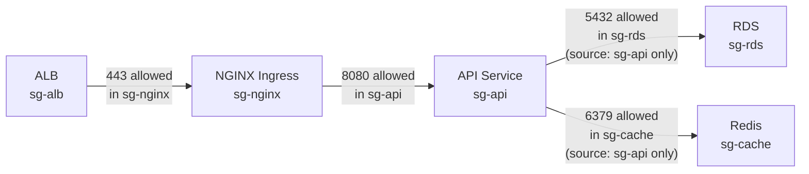
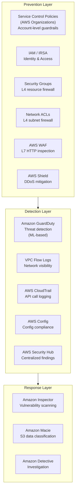

# Network Security: Security Groups, NACLs, Zero Trust, and WAF

> Part 7 of the series: *"Networking for DevOps and Cloud Architects: From Packets to Production"*
>
> Prerequisites: [Part 1 — Networking Fundamentals](./01-networking-fundamentals.md) | [Part 4 — VPC Networking](./04-vpc-networking.md) | [Part 5 — Kubernetes Networking](./05-kubernetes-networking.md) | [Part 6 — Load Balancing](./06-load-balancing.md)

---

## Table of Contents

- [Why This Matters](#why-this-matters)
- [Mental Model](#mental-model)
- [Core Concepts](#core-concepts)
- [How It Works in Real Production Systems](#how-it-works-in-real-production-systems)
- [End-to-End Security Flow Example](#end-to-end-security-flow-example)
- [Common Failure Patterns](#common-failure-patterns)
- [Commands Every Engineer Should Know](#commands-every-engineer-should-know)
- [AWS / Cloud Angle](#aws--cloud-angle)
- [Kubernetes Angle](#kubernetes-angle)
- [Troubleshooting Framework](#troubleshooting-framework)
- [Senior Engineer Interview Explanation](#senior-engineer-interview-explanation)
- [Production Checklist](#production-checklist)
- [Key Takeaways](#key-takeaways)

---

## Why This Matters

Network security is the topic every team says they take seriously — right up until an audit, a breach, or a compliance review forces them to actually look at what they built.

Here's the honest picture of how most cloud environments actually end up:

**Security groups accumulate rules like sediment.** Someone added `0.0.0.0/0` on port 22 to debug a problem two years ago and never removed it. A new service needed to reach the database, so someone added the entire private CIDR instead of the specific security group. The "temporary" rule became permanent. Multiply this by 50 engineers over 3 years and you have a security group so permissive it's essentially open.

**NACLs are the most commonly ignored control in AWS.** Teams deploy them with the default "allow everything" configuration, pat themselves on the back for having "defense in depth," and never touch them again. The default NACL allows all traffic in both directions. It provides zero security.

**Zero Trust is a buzzword until your company gets breached.** Then it becomes a mandate. Teams that didn't build zero trust principles in from the start face an expensive, disruptive retrofit. Teams that did build it in from the start have smaller blast radius, better auditability, and sleep better.

**WAF is treated as optional until the first DDoS or injection attack.** Then it becomes a P0 emergency deployment, rushed in without proper rule tuning, and immediately starts blocking legitimate traffic because nobody understood what they were deploying.

Real production network security is not about ticking compliance checkboxes. It's about building layers of controls that limit blast radius when — not if — something goes wrong. One compromised pod should not be able to reach your payment database. One compromised engineer credential should not expose all 50 production services. One SQL injection attempt should not reach your application server.

This article is about building security that actually works in production — not security theater.

---

## Mental Model

**Think of network security as concentric rings around your most valuable assets.**

Picture your production database at the center. Around it, rings of defense:

```
          ┌─────────────────────────────────────┐
          │            Internet                 │
          │   ┌─────────────────────────────┐   │
          │   │          WAF                │   │
          │   │   ┌─────────────────────┐   │   │
          │   │   │    Load Balancer     │   │   │
          │   │   │   ┌─────────────┐   │   │   │
          │   │   │   │  NACL       │   │   │   │
          │   │   │   │ ┌─────────┐ │   │   │   │
          │   │   │   │ │   SG    │ │   │   │   │
          │   │   │   │ │ ┌─────┐ │ │   │   │   │
          │   │   │   │ │ │ DB  │ │ │   │   │   │
          │   │   │   │ │ └─────┘ │ │   │   │   │
          │   │   │   │ └─────────┘ │   │   │   │
          │   │   │   └─────────────┘   │   │   │
          │   │   └─────────────────────┘   │   │
          │   └─────────────────────────────┘   │
          └─────────────────────────────────────┘
```

Each ring has a different job:
- **WAF** — inspects HTTP content, blocks malicious patterns at the edge before they touch your infrastructure
- **Load Balancer** — exposes only the ports you intend, absorbs internet-facing traffic
- **NACL** — subnet-level guardrails, stateless, used for broad controls and emergency blocks
- **Security Group** — resource-level firewall, stateful, your primary day-to-day access control
- **Application** — should also validate input, enforce authz, and not trust the network

The principle: **an attacker who breaks through one ring should still be stopped by the next.** No single layer should be your only defense. This is what "defense in depth" actually means in practice.

---

## Core Concepts

### 1. Security Groups — Deep Dive

You've seen security groups in every previous part of this series. Here's the depth that matters for production security.

**Security groups are stateful allow-lists attached to ENIs.**

Let's unpack each word:
- **Stateful:** If you allow inbound TCP on port 443, the response traffic is automatically allowed outbound — you don't write a separate outbound rule. The connection tracking table handles this.
- **Allow-list:** You can only write allow rules. There is no deny rule in a security group. If traffic doesn't match an allow rule, it's dropped silently.
- **Attached to ENIs:** Security groups attach to network interfaces, not to instances directly. An EC2 instance with two NICs can have different security groups per NIC. EKS pods with Security Groups for Pods have their own NIC and their own security group.

**The reference model — the most important pattern you're not using enough:**

Instead of writing rules with CIDR ranges, reference other security groups as sources:

```
# Fragile approach — breaks when IPs change
RDS inbound: allow 5432 from 10.0.10.0/24

# Resilient approach — scales with your infrastructure
RDS inbound: allow 5432 from sg-eks-nodes

# Even more precise — only a specific service, not all nodes
RDS inbound: allow 5432 from sg-payment-service
```

When you reference a security group, AWS resolves it to all ENIs currently in that SG. When you add a new EKS node or a new pod with that SG, it automatically gets DB access. When you remove one, it automatically loses access. Zero IP management. Zero stale rules.

**Security group chaining for micro-segmentation:**



Each tier only accepts traffic from the tier directly above it. The database accepts connections only from the API service security group — not from the load balancer, not from NGINX, not from any other service. If NGINX is compromised, the attacker still can't reach the database directly.

**The default security group trap:**

Every VPC comes with a default security group. Its default rules allow all inbound traffic from *other resources in the same security group* and all outbound traffic. This means if you accidentally put two services in the default SG, they can freely communicate — no explicit rules required.

Never use the default security group for production resources. Create purpose-specific SGs with descriptive names. Audit regularly.

---

### 2. NACLs — Stateless Subnet Guards

Network ACLs operate at the subnet boundary. Every packet entering or leaving a subnet passes through its NACL — regardless of security groups.

**The statefulness difference — this is critical:**

```
Security Group (stateful):
  Inbound rule: allow TCP 443 from 0.0.0.0/0
  → Client connects on port 443
  → Response automatically allowed (stateful tracking)
  → No outbound rule needed for the return traffic

NACL (stateless):
  Inbound rule: allow TCP 443 from 0.0.0.0/0
  → Client connects on port 443
  → BUT you also need an outbound rule:
     allow TCP 1024-65535 to 0.0.0.0/0  (ephemeral ports for response)
  → Without both rules, the handshake completes but responses are blocked
```

**Rule evaluation — order matters with NACLs:**

```
NACL Rule Evaluation (first match wins):

Rule 100: Allow TCP 443 from 0.0.0.0/0     → Checked first
Rule 110: Allow TCP 80 from 0.0.0.0/0      → Checked if 100 doesn't match
Rule 120: Deny TCP 22 from 0.0.0.0/0       → Explicit deny
Rule *:   Deny all                          → Default catch-all deny
```

A common mistake: adding a deny rule at rule 200 but the allow rule for the same traffic is at rule 100. The allow at 100 wins. Rule order matters — deny rules must have *lower numbers* than the allow rules they're meant to override.

**When NACLs shine — and when they don't:**

| Good use of NACLs | Poor use of NACLs |
|-------------------|-------------------|
| Emergency block of an attacking CIDR | Fine-grained per-service access control |
| Subnet-level isolation between environments | Replacing security groups |
| Compliance-required subnet boundary controls | Complex rule sets with many exceptions |
| Blocking known bad IP ranges globally | High-frequency rule changes |

**The most practical NACL use case:** You're getting DDoSed from a specific CIDR range. You can add a deny rule to your NACL in seconds — blocking all traffic from that range at the subnet level without touching any application or security group configuration.

```bash
# Emergency: block an attacking CIDR at the NACL level
aws ec2 create-network-acl-entry \
  --network-acl-id acl-xxxx \
  --rule-number 1 \
  --protocol -1 \
  --rule-action deny \
  --ingress \
  --cidr-block 203.0.113.0/24    # The attacking range
```

Rule number 1 means it's evaluated first — before any allow rules. Instant mitigation.

---

### 3. Zero Trust — What It Actually Means in Practice

"Zero Trust" is one of the most overused terms in cloud security. Strip away the marketing and the actual principle is simple:

> **Never trust, always verify. Authenticate and authorize every request, regardless of where it comes from — including inside your own network.**

The old model was: **perimeter security**. Build a wall around your network. Anything inside the wall is trusted. This worked when "inside the network" meant a corporate office. It doesn't work when:
- Your "network" is a VPC where any compromised pod can reach any other service
- Engineers work from coffee shops on unmanaged devices
- Third-party SaaS tools have access to your internal services
- Supply chain attacks compromise your own CI/CD pipeline

**Zero Trust in practice for DevOps engineers — not theoretical:**

**1. Never trust network location.** Just because a request comes from inside the VPC doesn't mean it's authorized. A compromised pod inside your VPC should not automatically get access to your payment service. Enforce authentication between every service.

**2. Authenticate every service-to-service call.** Use mTLS (Part 3), IAM roles, JWT tokens, or API keys — but use *something*. "The request came from inside the cluster" is not authentication.

**3. Authorize based on identity, not IP.** "This pod's IP is 10.0.11.50 so it can access the DB" is weak. "This service account has the `db-reader` IAM policy" is strong. IPs change. Identities are stable.

**4. Least privilege everywhere.** Each service should only be able to reach what it needs. Payment service needs database on port 5432. It does not need to reach the logging service, the user service, or ECR directly. NetworkPolicy and security groups should enforce this.

**5. Assume breach.** Design your security as if an attacker is already inside. If they compromise one pod, what can they reach? If the answer is "everything," your blast radius is the entire production environment. If the answer is "only the things that specific pod needs," you've limited the damage.

**The maturity levels of Zero Trust implementation:**

```
Level 0 (Most teams):
  - Security groups on subnets/instances
  - No service-to-service authentication
  - Any pod can reach any other pod
  - "It's inside our VPC, it's fine"

Level 1 (Intermediate):
  - Security groups per service (not per subnet)
  - NetworkPolicy for pod-to-pod controls
  - IAM roles per service (not shared IAM user keys)
  - VPC endpoints to avoid internet for AWS APIs

Level 2 (Mature):
  - mTLS between all services (service mesh or AWS LBC mutual auth)
  - Service identities via SPIFFE/SPIRE or Istio
  - Zero implicit trust within the VPC
  - Secrets managed via Vault or AWS Secrets Manager (not env vars)

Level 3 (Advanced):
  - Continuous verification (not just at connection time)
  - Behavioral anomaly detection
  - All inter-service traffic inspected and logged
  - Automatic certificate rotation with short TTLs
```

Most production teams are at Level 0–1. Level 2 is achievable without massive investment. Level 3 is for high-security environments (finance, healthcare, defense).

---

### 4. WAF — Web Application Firewall

A WAF sits in front of your web application and inspects HTTP/HTTPS requests *before* they reach your application. It can block, rate-limit, or flag requests based on rules.

**What a WAF protects against:**

| Attack | How WAF Helps |
|--------|--------------|
| SQL Injection | Detects SQL patterns in query strings, headers, body |
| Cross-Site Scripting (XSS) | Detects JavaScript injection patterns |
| Remote Code Execution | Detects shell command patterns |
| Path Traversal | Detects `../../../etc/passwd` patterns |
| DDoS (L7) | Rate limiting per IP, per session, per URI |
| Bot traffic | Bot fingerprinting and behavioral analysis |
| IP reputation | Blocks requests from known malicious IPs |
| Geo-blocking | Blocks traffic from specific countries |

**What a WAF does NOT protect against:**
- Application logic flaws (broken auth, IDOR — WAF has no idea what's "correct" in your app)
- Encrypted payloads (if you use client-side encryption before sending, WAF can't inspect it)
- Authenticated abuse (a valid user abusing your API — WAF doesn't know who your valid users are)
- L3/L4 DDoS (that's AWS Shield, not WAF)

**AWS WAF v2 — the components:**

```
Web ACL
  ├── Rule Group 1: AWS Managed Rules
  │   ├── AWSManagedRulesCommonRuleSet (OWASP Top 10)
  │   ├── AWSManagedRulesSQLiRuleSet
  │   └── AWSManagedRulesKnownBadInputsRuleSet
  │
  ├── Rule Group 2: Custom Rules
  │   ├── Rate limit: 1000 req/5min per IP
  │   ├── Geo block: CN, RU, KP (example)
  │   └── Custom header required: X-API-Key present
  │
  └── Default Action: Allow (or Block)
```

**WAF capacity units (WCUs) — the thing that catches teams off guard:**

Every rule in a WAF consumes capacity units. A Web ACL has a maximum of 1,500 WCUs by default. AWS managed rule groups use significant WCUs:
- `AWSManagedRulesCommonRuleSet`: 700 WCUs
- `AWSManagedRulesSQLiRuleSet`: 200 WCUs
- `AWSManagedRulesKnownBadInputsRuleSet`: 200 WCUs

That's 1,100 WCUs just for three managed rule groups. Add custom rules and you can hit the limit quickly. Request a WCU limit increase if needed, or use managed rule groups selectively.

**WAF in COUNT vs BLOCK mode:**

Never deploy a new WAF rule in BLOCK mode immediately. Start in COUNT mode:
- **COUNT mode:** WAF logs that the rule would have fired, but allows the request through
- **BLOCK mode:** WAF blocks the request

Deploy in COUNT mode, monitor for 1–2 weeks, verify you're not blocking legitimate traffic, then switch to BLOCK mode. Skipping this step causes immediate production incidents when the WAF blocks your own health check traffic, your CDN's origin requests, or your legitimate API clients.

---

### 5. AWS Shield — DDoS Protection

While we're in the security layer: AWS Shield sits alongside WAF and protects against DDoS attacks.

| Tier | Cost | Protection |
|------|------|-----------|
| **Shield Standard** | Free (automatic) | L3/L4 DDoS protection for all AWS resources |
| **Shield Advanced** | $3,000/month | Enhanced L3/L4/L7, DDoS cost protection, 24/7 DRT access |

Shield Standard is automatic — you get it for free on all AWS resources (ALBs, CloudFront, Route 53, EC2 EIPs). It handles the common volumetric attacks (UDP floods, SYN floods, reflection attacks).

Shield Advanced is worth it if:
- You're a target (financial services, crypto, gaming — anything with money involved)
- You need cost protection (DDoS can spike your data transfer bill by 10x in minutes)
- You want proactive engagement from AWS's DDoS Response Team (DRT)

---

### 6. VPC Flow Logs for Security

Flow logs are not just a networking tool — they're your primary security visibility into network-layer activity. If you're not querying them regularly, you're flying blind.

**What flow logs tell you from a security perspective:**

```
# A rejected connection from an unexpected source
version account-id eni-id srcIP srcPort dstIP dstPort protocol bytes start end REJECT OK
2 123456 eni-xxxx 185.220.101.1 54321 10.0.11.50 22 6 0 1700000000 1700000060 REJECT OK
                   ^               ^ This looks like a Tor exit node trying SSH
```

```
# Unusual port scanning pattern — lots of rejects from same source
185.220.101.1 → 10.0.11.50:22  REJECT
185.220.101.1 → 10.0.11.50:23  REJECT
185.220.101.1 → 10.0.11.50:80  ACCEPT   ← this one got through
185.220.101.1 → 10.0.11.50:443 ACCEPT
185.220.101.1 → 10.0.11.50:3306 REJECT
```

```
# A pod making unexpected outbound connections (data exfiltration?)
10.0.11.50:random → 203.0.113.100:443  ACCEPT
10.0.11.50:random → 203.0.113.101:443  ACCEPT
10.0.11.50:random → 203.0.113.102:443  ACCEPT
              ^ This pod is talking to IPs it's never talked to before
```

VPC Flow Logs won't tell you *what* was in the traffic — that requires application logs and potentially network inspection. But they tell you *who was talking to whom* at the IP/port level, which is often enough to detect anomalies and trigger deeper investigation.

---

## How It Works in Real Production Systems

### The Security Layer Stack for a Production EKS Platform

```mermaid
graph TB
    Internet["🌐 Internet\n(Attackers + Legitimate Users)"]

    subgraph Edge["Edge Security Layer"]
        Shield["AWS Shield Standard\n(Auto DDoS mitigation)"]
        CF["CloudFront (optional)\nEdge caching + DDoS absorption"]
        WAF["AWS WAF v2\nHTTP inspection\nRate limiting\nOWASP rules"]
    end

    subgraph LB["Load Balancer Layer"]
        ALB["ALB\nsg-alb: 443 from 0.0.0.0/0\n80 from 0.0.0.0/0"]
    end

    subgraph Public["Public Subnet (NACL: pub-nacl)"]
        NACL_pub["NACL Rules:\n100: Allow TCP 443 in\n110: Allow TCP 80 in\n120: Allow TCP 1024-65535 out\n*: Deny all"]
    end

    subgraph Private["Private Subnet (NACL: priv-nacl)"]
        NACL_priv["NACL Rules:\n100: Allow VPC CIDR in\n110: Allow VPC CIDR out\n120: Allow 1024-65535 out\n*: Deny all"]
        EKS["EKS Nodes\nsg-nodes: 443 from sg-alb\n8080 from sg-alb\nephem. from VPC CIDR"]
    end

    subgraph Data["Data Subnet (NACL: data-nacl)"]
        NACL_data["NACL Rules:\n100: Allow 5432 from 10.0.10.0/24\n110: Allow 1024-65535 to 10.0.10.0/24\n*: Deny all (no internet)"]
        RDS["RDS\nsg-rds: 5432 from sg-payment-pods\nNO outbound internet"]
    end

    subgraph K8s["Inside Kubernetes"]
        NetPol["NetworkPolicy:\ndefault-deny all\nallow: payment→db\nallow: api→payment"]
        SG4P["Security Groups for Pods:\nsg-payment-pods on payment SAs"]
    end

    Internet --> Shield
    Shield --> CF
    CF --> WAF
    WAF --> ALB
    ALB --> NACL_pub
    NACL_pub --> NACL_priv
    NACL_priv --> EKS
    EKS --> K8s
    K8s --> NACL_data
    NACL_data --> RDS
```



Each layer does a distinct job. An attacker who gets through WAF still hits NACL rules. An attacker who gets through NACLs still hits security groups. A compromised pod inside the cluster still hits NetworkPolicy. Defense in depth, implemented concretely.

---

### Security Group Design for a Real Service

Let's design security groups for a 3-tier architecture: ALB → API → RDS.

```bash
# ── sg-alb-production ─────────────────────────────────────────────
# Applied to: ALB
# Purpose: Accept public HTTPS/HTTP traffic

Inbound:
  TCP 443 from 0.0.0.0/0      # HTTPS from internet
  TCP 80  from 0.0.0.0/0      # HTTP (redirect to HTTPS)

Outbound:
  TCP 8080 to sg-api-nodes    # Forward to API service
  TCP 8443 to sg-api-nodes    # If HTTPS to backend

# ── sg-api-nodes ──────────────────────────────────────────────────
# Applied to: EKS nodes running API service
# Purpose: Accept traffic from ALB, allow DB access

Inbound:
  TCP 8080 from sg-alb-production     # API traffic from ALB
  TCP 443  from sg-alb-production     # ALB health checks
  TCP 10250 from sg-eks-control-plane # kubelet from EKS control plane

Outbound:
  TCP 5432 to sg-rds-production       # PostgreSQL
  TCP 6379 to sg-redis-production     # Redis
  TCP 443  to 0.0.0.0/0              # External APIs (via NAT)
  UDP 53   to 10.0.0.2/32            # DNS to Route 53

# ── sg-rds-production ─────────────────────────────────────────────
# Applied to: RDS instance
# Purpose: Accept DB connections ONLY from API service

Inbound:
  TCP 5432 from sg-api-nodes          # PostgreSQL from API only
  # Nothing else. Not from bastion. Not from dev VPC.
  # Bastion uses Session Manager, not SSH directly to DB.

Outbound:
  (RDS doesn't initiate connections — no outbound rules needed)
```

**The discipline that matters:** Every rule has a comment explaining why it exists. Every 6 months, audit every rule and ask "is this still needed?" Rules that can't be explained should be removed.

---

### WAF Rule Configuration for Production

A practical WAF configuration for an EKS-backed API:

```json
{
  "WebACL": {
    "Name": "production-api-waf",
    "Rules": [
      {
        "Name": "AWSManagedRulesCommonRuleSet",
        "Priority": 1,
        "Statement": {
          "ManagedRuleGroupStatement": {
            "VendorName": "AWS",
            "Name": "AWSManagedRulesCommonRuleSet",
            "ExcludedRules": [
              {"Name": "SizeRestrictions_BODY"}
            ]
          }
        },
        "OverrideAction": {"Count": {}},
        "VisibilityConfig": {
          "SampledRequestsEnabled": true,
          "CloudWatchMetricsEnabled": true,
          "MetricName": "CommonRuleSet"
        }
      },
      {
        "Name": "RateLimitPerIP",
        "Priority": 2,
        "Statement": {
          "RateBasedStatement": {
            "Limit": 2000,
            "AggregateKeyType": "IP"
          }
        },
        "Action": {"Block": {}},
        "VisibilityConfig": {
          "MetricName": "RateLimit",
          "SampledRequestsEnabled": true,
          "CloudWatchMetricsEnabled": true
        }
      },
      {
        "Name": "BlockKnownBadInputs",
        "Priority": 3,
        "Statement": {
          "ManagedRuleGroupStatement": {
            "VendorName": "AWS",
            "Name": "AWSManagedRulesKnownBadInputsRuleSet"
          }
        },
        "OverrideAction": {"Count": {}},
        "VisibilityConfig": {
          "MetricName": "KnownBadInputs",
          "SampledRequestsEnabled": true,
          "CloudWatchMetricsEnabled": true
        }
      }
    ],
    "DefaultAction": {"Allow": {}}
  }
}
```

Notice: all managed rule groups are in `Count` mode initially. The rate limit is in `Block` mode because that's well-understood and won't cause false positives for normal traffic. Move rule groups to `Block` after 1–2 weeks of monitoring COUNT metrics.

---

## End-to-End Security Flow Example

**Scenario: SQL injection attack attempts against your API, and what stops it at each layer**

```
═══════════════════════════════════════════════════════════════════════
 ATTACK: Attacker sends: GET /api/users?id=1; DROP TABLE users; --
═══════════════════════════════════════════════════════════════════════

Step 1: AWS Shield Standard
  ─────────────────────────
  Inspects L3/L4 headers.
  This is a normal HTTP request — no volumetric attack signature.
  → PASSES THROUGH

Step 2: AWS WAF
  ─────────────
  WAF receives the full HTTP request.
  AWSManagedRulesSQLiRuleSet fires:
    Pattern match: "; DROP TABLE" matches SQLi rule
    Rule is in BLOCK mode (after your testing period)
  → REQUEST BLOCKED
  → Returns 403 Forbidden
  → Attack never reaches your infrastructure
  → Logged in WAF CloudWatch metrics and sampled requests

═══════════════════════════════════════════════════════════════════════
 What if the attacker encodes the payload to bypass WAF?
 GET /api/users?id=1%3B%20DROP%20TABLE%20users%3B%20--
═══════════════════════════════════════════════════════════════════════

Step 2: AWS WAF
  ─────────────
  WAF automatically URL-decodes before matching.
  Decoded: 1; DROP TABLE users; --
  Same SQLi rule fires.
  → REQUEST BLOCKED

═══════════════════════════════════════════════════════════════════════
 What if WAF misses it? (Defense in depth)
═══════════════════════════════════════════════════════════════════════

Step 3: ALB
  ─────────
  L7 routing — passes the request to the API pod.
  No SQLi inspection here (that's WAF's job).
  → PASSES THROUGH

Step 4: NACL
  ──────────
  Stateless subnet rules.
  This is legitimate HTTP traffic on port 443.
  NACL allows it.
  → PASSES THROUGH

Step 5: Security Group
  ─────────────────────
  Allows TCP 8080 from ALB SG.
  Traffic matches.
  → PASSES THROUGH

Step 6: NetworkPolicy
  ───────────────────
  Allows API pod to receive traffic on port 8080.
  → PASSES THROUGH

Step 7: Application Layer (Last Line of Defense)
  ───────────────────────────────────────────────
  The API uses a parameterized query:
    cursor.execute("SELECT * FROM users WHERE id = %s", (user_id,))
  The database driver treats the entire input as a parameter value.
  SQL injection has no effect — it's just a string being compared.
  → ATTACK FAILS

═══════════════════════════════════════════════════════════════════════
 Result: The attack was stopped at layer 2 (WAF).
 Even if WAF had missed it, the application's parameterized
 queries would have prevented data loss.
 Two independent layers stopped the attack.
═══════════════════════════════════════════════════════════════════════
```

---

**Scenario: Compromised pod attempting lateral movement**

```
═══════════════════════════════════════════════════════════════════════
 ATTACK: A compromised frontend pod tries to reach the payment DB
═══════════════════════════════════════════════════════════════════════

Attacker controls: frontend pod (10.0.11.55)
Target: RDS PostgreSQL (10.0.21.5:5432)

Step 1: Attacker runs from frontend pod:
  nc -zv 10.0.21.5 5432

Step 2: NetworkPolicy check
  ──────────────────────────
  frontend pod has label: app=frontend
  NetworkPolicy: only pods with app=payment-service can egress to port 5432
  → CONNECTION BLOCKED by NetworkPolicy
  → Kernel drops the packet before it leaves the pod

Step 3 (if NetworkPolicy not configured):
  Packet leaves the pod, reaches the node.

Step 4: Security Group check on RDS
  ────────────────────────────────────
  RDS sg-rds-production:
    Inbound: TCP 5432 from sg-payment-service only
  frontend pod has sg-frontend (or shares sg-api-nodes)
  sg-frontend is NOT sg-payment-service
  → CONNECTION BLOCKED by RDS security group

Step 5 (if SG was misconfigured):
  Data subnet NACL:
    Only allows 5432 from private subnet CIDR (10.0.10.0/24)
    frontend pod is also in 10.0.10.0/24... NACL wouldn't save us here.
    ← This is why NACL isn't a replacement for SGs

Final Result:
  TWO layers stopped this attack: NetworkPolicy + Security Group.
  The attacker could not move laterally from frontend to the DB.
  The blast radius of the compromised frontend pod is limited
  to what the frontend is explicitly allowed to reach.
```

---

## Common Failure Patterns

### Failure 1: Overly Permissive Security Groups — The `0.0.0.0/0` Creep

**Symptom:** Security audit finds inbound `0.0.0.0/0` on non-standard ports. VPC Flow Logs show external IPs scanning your instances. SSH brute force attempts in auth logs.

**How it happens:**
- Someone opened port 22 from `0.0.0.0/0` to debug a problem at 2am
- They created a "temp-sg" that ended up on 12 production resources
- Nobody reviewed it because it was labeled "temporary"

**Verify:**
```bash
# Find all security groups with 0.0.0.0/0 inbound on dangerous ports
aws ec2 describe-security-groups \
  --query 'SecurityGroups[?IpPermissions[?
    (FromPort<=`22` && ToPort>=`22`) &&
    IpRanges[?CidrIp==`0.0.0.0/0`]
  ]].{Name:GroupName,ID:GroupId,VPC:VpcId}' \
  --output table

# Find ALL security groups with any 0.0.0.0/0 inbound rule
aws ec2 describe-security-groups \
  --query 'SecurityGroups[?IpPermissions[?
    IpRanges[?CidrIp==`0.0.0.0/0`]
  ]].{Name:GroupName,ID:GroupId}' \
  --output table

# Check which resources use a specific security group
aws ec2 describe-network-interfaces \
  --filters "Name=group-id,Values=sg-xxxx" \
  --query 'NetworkInterfaces[*].{ID:NetworkInterfaceId,Type:InterfaceType,Description:Description}'
```

**Fix:**
1. Remove `0.0.0.0/0` rules immediately
2. Replace SSH access with AWS Systems Manager Session Manager (no port 22 needed)
3. Use AWS Config rule `restricted-ssh` to alert on port 22 from `0.0.0.0/0`
4. Add SCPs (Service Control Policies) in AWS Organizations to prevent future `0.0.0.0/0` on SSH/RDP

---

### Failure 2: WAF Blocking Legitimate Traffic After Rule Change

**Symptom:** After enabling a WAF rule or adding it to BLOCK mode, legitimate API calls start returning 403. Mobile app users are getting blocked. Your internal health checks return 403.

**Likely causes:**
- Managed rule group firing on legitimate request patterns (e.g., base64-encoded data triggering SQLi rule)
- Rate limit too aggressive for your traffic patterns
- Health check endpoint matches a WAF rule
- WAF rule fires on a specific User-Agent used by your app

**Verify:**
```bash
# Check WAF sampled requests — see what's being blocked
aws wafv2 get-sampled-requests \
  --web-acl-arn <arn> \
  --rule-metric-name CommonRuleSet \
  --scope REGIONAL \
  --time-window StartTime=$(date -d '1 hour ago' +%s),EndTime=$(date +%s) \
  --max-items 100

# Check WAF metrics in CloudWatch
aws cloudwatch get-metric-statistics \
  --namespace AWS/WAFV2 \
  --metric-name BlockedRequests \
  --dimensions Name=WebACL,Value=production-api-waf Name=Region,Value=us-east-1 \
  --start-time $(date -d '1 hour ago' +%FT%TZ) \
  --end-time $(date +%FT%TZ) \
  --period 60 \
  --statistics Sum
```

**Fix:**
- Switch the problematic rule to COUNT mode immediately to stop blocking
- Identify the legitimate requests being matched
- Add a rule exclusion for the specific pattern (WAF rule scope-down statement)
- Or add an IP set rule to allow known good IPs before the managed rules run

```json
{
  "Name": "AllowHealthCheckFromALB",
  "Priority": 0,
  "Statement": {
    "IPSetReferenceStatement": {
      "ARN": "arn:aws:wafv2:...:ipset/alb-health-check-ips"
    }
  },
  "Action": {"Allow": {}},
  "VisibilityConfig": {...}
}
```

Priority 0 means this rule runs first — ALB health check IPs are always allowed, before any block rules run.

---

### Failure 3: NACL Blocking Return Traffic (Stateless Gotcha)

**Symptom:** New TCP connections work. But responses are dropped intermittently. Some operations succeed, others time out seemingly randomly.

**Cause:** NACL is blocking return traffic. The connection was allowed inbound (rule matched), but the response needs to go outbound on ephemeral ports (1024-65535). If the NACL outbound rules don't allow ephemeral ports, the response is dropped.

**Verify:**
```bash
# Check NACL rules for the affected subnet
aws ec2 describe-network-acls \
  --filters "Name=association.subnet-id,Values=subnet-xxxx" \
  --query 'NetworkAcls[*].Entries[*].{Rule:RuleNumber,
    Action:RuleAction,
    Egress:Egress,
    CIDR:CidrBlock,
    Protocol:Protocol,
    From:PortRange.From,
    To:PortRange.To}' \
  --output table

# Look for outbound rules — is 1024-65535 allowed?
# If outbound rules only allow specific ports but NOT 1024-65535,
# return traffic is getting dropped
```

**Fix:**
```bash
# Add outbound rule for ephemeral ports
aws ec2 create-network-acl-entry \
  --network-acl-id acl-xxxx \
  --rule-number 900 \
  --protocol 6 \
  --rule-action allow \
  --egress \
  --cidr-block 0.0.0.0/0 \
  --port-range From=1024,To=65535
```

---

### Failure 4: Security Group Rule Limit Hit

**Symptom:** Cannot add new security group rules. Error: `RulesPerSecurityGroupLimitExceeded`.

**Cause:** Default limit is 60 inbound + 60 outbound rules per security group. When you use CIDR ranges instead of SG references, rules proliferate fast.

**Verify:**
```bash
# Count rules in a security group
aws ec2 describe-security-groups \
  --group-ids sg-xxxx \
  --query 'length(SecurityGroups[0].IpPermissions)'

# Find security groups near the limit
aws ec2 describe-security-groups \
  --query 'SecurityGroups[?length(IpPermissions) > `50`].{Name:GroupName,ID:GroupId,Rules:length(IpPermissions)}'
```

**Fix:**
- Refactor rules to use SG references instead of CIDRs (reduces many CIDR rules to one SG rule)
- Consolidate multiple security groups into fewer, properly designed ones
- Request a limit increase from AWS (up to 1,000 rules per SG possible)
- Use prefix lists for commonly grouped CIDRs

---

### Failure 5: Cross-Account Security Group References Broken

**Symptom:** After migrating a service to a different AWS account, it can no longer reach resources in the original account. Security group reference rules that used to work now fail.

**Cause:** Security group references only work within the same account and same VPC (or peered VPCs in specific cases). You cannot reference a security group from Account A in a rule in Account B.

**Verify:**
```bash
# Check if the SG reference in the rule is from a different account
aws ec2 describe-security-groups \
  --group-ids sg-xxxx \
  --query 'SecurityGroups[*].IpPermissions[*].UserIdGroupPairs'
# Shows the account ID of the referenced SG
```

**Fix:**
- Replace SG references with CIDR ranges (less ideal but works cross-account)
- Use AWS Resource Access Manager (RAM) to share security groups across accounts
- Design cross-account access via PrivateLink (cleanest long-term solution)

---

### Failure 6: WAF Rate Limit Too Low — Legitimate Users Blocked During Traffic Spikes

**Symptom:** During a product launch, a viral moment, or a sale event, your WAF starts returning 429/403 to legitimate users. Traffic is real but too high for your rate limit.

**Cause:** Rate limit was set for normal traffic patterns. A traffic spike — even legitimate — hits the limit.

**Verify:**
```bash
# Check current rate limit
aws wafv2 get-web-acl \
  --name production-api-waf \
  --scope REGIONAL \
  --id <id> \
  --query 'WebACL.Rules[?Type==`RATE_BASED`].Statement.RateBasedStatement.Limit'

# Check if BlockedRequests metric is spiking in CloudWatch
# and correlate with legitimate traffic spike
```

**Fix:**
- Increase rate limit before known traffic spikes
- Add exception rules for authenticated users (rate limit anonymous traffic differently)
- Use AWS WAF Bot Control to rate limit bots separately from real users
- Consider per-URI rate limits (tighter on `/login`, looser on `/api/products`)

---

## Commands Every Engineer Should Know

### Security Group Auditing

```bash
# ── Finding Security Issues ───────────────────────────────────────

# All SGs with port 22 open to the world
aws ec2 describe-security-groups \
  --query 'SecurityGroups[?IpPermissions[?
    (FromPort<=`22` && ToPort>=`22`) &&
    IpRanges[?CidrIp==`0.0.0.0/0`]]
  ].{Name:GroupName,ID:GroupId}' --output table

# All SGs with ANY 0.0.0.0/0 inbound rule
aws ec2 describe-security-groups \
  --query 'SecurityGroups[?IpPermissions[?
    IpRanges[?CidrIp==`0.0.0.0/0`]]
  ].{Name:GroupName,ID:GroupId,VPC:VpcId}' --output table

# Orphaned security groups (not attached to any resource)
ATTACHED=$(aws ec2 describe-network-interfaces \
  --query 'NetworkInterfaces[*].Groups[*].GroupId' \
  --output text | tr '\t' '\n' | sort -u)
ALL=$(aws ec2 describe-security-groups \
  --query 'SecurityGroups[*].GroupId' --output text | tr '\t' '\n' | sort)
comm -23 <(echo "$ALL") <(echo "$ATTACHED")

# Find which resources use a security group
aws ec2 describe-network-interfaces \
  --filters "Name=group-id,Values=sg-xxxx" \
  --query 'NetworkInterfaces[*].{
    ENI:NetworkInterfaceId,
    InstanceId:Attachment.InstanceId,
    Description:Description,
    Type:InterfaceType}'
```

---

### NACL Inspection

```bash
# View all NACL rules for a subnet (ordered by rule number)
aws ec2 describe-network-acls \
  --filters "Name=association.subnet-id,Values=subnet-xxxx" \
  --query 'NetworkAcls[0].Entries | sort_by(@, &RuleNumber)' \
  --output table

# Check if default NACL is still in use (security risk)
aws ec2 describe-network-acls \
  --filters "Name=default,Values=true" \
  --query 'NetworkAcls[*].{ID:NetworkAclId,
    VPC:VpcId,
    Subnets:Associations[*].SubnetId}'

# List all NACLs and their associated subnets
aws ec2 describe-network-acls \
  --query 'NetworkAcls[*].{
    ID:NetworkAclId,
    Default:IsDefault,
    Subnets:Associations[*].SubnetId}' \
  --output table
```

---

### WAF Management

```bash
# List all Web ACLs
aws wafv2 list-web-acls --scope REGIONAL \
  --query 'WebACLs[*].{Name:Name,ID:Id,ARN:ARN}'

# Get Web ACL details (rules, actions)
aws wafv2 get-web-acl \
  --name production-api-waf \
  --scope REGIONAL \
  --id <id>

# Check what resources (ALBs) are associated with a Web ACL
aws wafv2 list-resources-for-web-acl \
  --web-acl-arn <arn>

# Associate WAF with an ALB (if not done yet)
aws wafv2 associate-web-acl \
  --web-acl-arn <waf-arn> \
  --resource-arn <alb-arn>

# Check sampled blocked requests (diagnose false positives)
aws wafv2 get-sampled-requests \
  --web-acl-arn <arn> \
  --rule-metric-name CommonRuleSet \
  --scope REGIONAL \
  --time-window StartTime=$(date -d '1 hour ago' +%s),EndTime=$(date +%s) \
  --max-items 20

# Switch a rule from COUNT to BLOCK mode
# (Must update the full Web ACL — download, modify, update)
aws wafv2 get-web-acl --name <name> --scope REGIONAL --id <id> > waf.json
# Edit waf.json: change "Count": {} to "Block": {}
aws wafv2 update-web-acl --cli-input-json file://waf.json
```

---

### VPC Flow Log Security Queries

```bash
# ── Enable Flow Logs ──────────────────────────────────────────────

aws ec2 create-flow-logs \
  --resource-type VPC \
  --resource-ids vpc-xxxx \
  --traffic-type ALL \
  --log-destination-type cloud-watch-logs \
  --log-group-name /vpc/flow-logs \
  --deliver-logs-permission-arn arn:aws:iam::xxxx:role/vpc-flow-log-role

# ── Security Queries (CloudWatch Logs Insights) ───────────────────

# Find all REJECT traffic (potential attacks or misconfigured SGs)
fields @timestamp, srcAddr, dstAddr, srcPort, dstPort, protocol, action
| filter action = "REJECT"
| stats count(*) as attempts by srcAddr, dstAddr, dstPort
| sort attempts desc
| limit 20

# Find top talkers to your database port (who's hitting RDS?)
fields @timestamp, srcAddr, dstAddr, dstPort, action
| filter dstPort = 5432
| stats count(*) as connections by srcAddr, action
| sort connections desc

# Find unexpected outbound connections from private subnet
# (potential data exfiltration or C2 callback)
fields @timestamp, srcAddr, dstAddr, dstPort, action
| filter srcAddr like /^10\.0\.1[0-9]\./ and action = "ACCEPT"
  and not dstAddr like /^10\./
| stats count(*) as connections by srcAddr, dstAddr, dstPort
| sort connections desc

# Port scan detection (many different ports from same source)
fields @timestamp, srcAddr, dstPort, action
| filter action = "REJECT"
| stats count_distinct(dstPort) as ports_tried, count(*) as total by srcAddr
| filter ports_tried > 10
| sort ports_tried desc
```

---

### AWS Config Security Rules

```bash
# Check AWS Config compliance for security rules
aws configservice describe-compliance-by-config-rule \
  --config-rule-names \
    restricted-ssh \
    restricted-common-ports \
    vpc-default-security-group-closed \
    vpc-flow-logs-enabled \
  --query 'ComplianceByConfigRules[*].{Rule:ConfigRuleName,Compliance:Compliance.ComplianceType}'

# Get non-compliant resources for a specific rule
aws configservice get-compliance-details-by-config-rule \
  --config-rule-name restricted-ssh \
  --compliance-types NON_COMPLIANT \
  --query 'EvaluationResults[*].EvaluationResultIdentifier.EvaluationResultQualifier'
```

---

## AWS / Cloud Angle

### AWS Security Services — The Complete Map



**GuardDuty** deserves special mention. It ingests VPC Flow Logs, CloudTrail, DNS logs, and EKS audit logs. It uses machine learning to detect:
- EC2 instances communicating with known malicious IPs
- Unusual API calls (credential exfiltration patterns)
- Cryptocurrency mining activity
- Port scanning from inside your VPC
- EKS pods making suspicious API server calls

Enable GuardDuty everywhere. It costs fractions of a cent per GB analyzed and has caught real breaches that would have been invisible otherwise. This is not optional.

---

### AWS Config Rules for Continuous Compliance

Don't do one-time security audits. Use AWS Config to continuously monitor and alert on security drift:

```bash
# Essential security Config rules to enable:

# Checks that no security groups allow unrestricted SSH (port 22)
aws configservice put-config-rule \
  --config-rule '{"ConfigRuleName":"restricted-ssh",
    "Source":{"Owner":"AWS","SourceIdentifier":"INCOMING_SSH_DISABLED"}}'

# Checks that default SG blocks all traffic
aws configservice put-config-rule \
  --config-rule '{"ConfigRuleName":"vpc-default-security-group-closed",
    "Source":{"Owner":"AWS","SourceIdentifier":"VPC_DEFAULT_SECURITY_GROUP_CLOSED"}}'

# Checks that Flow Logs are enabled on all VPCs
aws configservice put-config-rule \
  --config-rule '{"ConfigRuleName":"vpc-flow-logs-enabled",
    "Source":{"Owner":"AWS","SourceIdentifier":"VPC_FLOW_LOGS_ENABLED"}}'

# Checks that WAF is attached to ALBs
aws configservice put-config-rule \
  --config-rule '{"ConfigRuleName":"alb-waf-enabled",
    "Source":{"Owner":"AWS","SourceIdentifier":"ALB_WAF_ENABLED"}}'
```

When a rule becomes non-compliant (someone adds port 22 from 0.0.0.0/0), Config sends an alert. Combined with auto-remediation via Lambda, you can even auto-revert the change.

---

### Service Control Policies — Account-Level Guardrails

If you're in AWS Organizations (you should be), SCPs give you account-level guardrails that even account admins can't override.

```json
{
  "Version": "2012-10-17",
  "Statement": [
    {
      "Sid": "DenyPublicS3",
      "Effect": "Deny",
      "Action": [
        "s3:PutBucketPublicAccessBlock",
        "s3:DeletePublicAccessBlock"
      ],
      "Resource": "*",
      "Condition": {
        "StringEquals": {
          "s3:PublicAccessBlockConfiguration/BlockPublicAcls": "false"
        }
      }
    },
    {
      "Sid": "DenyLeavingRegion",
      "Effect": "Deny",
      "NotAction": [
        "iam:*",
        "sts:*",
        "route53:*"
      ],
      "Resource": "*",
      "Condition": {
        "StringNotEquals": {
          "aws:RequestedRegion": ["us-east-1", "us-west-2"]
        }
      }
    },
    {
      "Sid": "DenyRootUser",
      "Effect": "Deny",
      "Action": "*",
      "Resource": "*",
      "Condition": {
        "StringLike": {
          "aws:PrincipalArn": "arn:aws:iam::*:root"
        }
      }
    }
  ]
}
```

These are preventive controls you can't accidentally disable. Even a compromised admin account can't deploy resources to unapproved regions or make S3 buckets public.

---

## Kubernetes Angle

### NetworkPolicy for Zero Trust in Kubernetes

Start with these four building blocks in every production namespace:

```yaml
# ── 1. Default deny everything ────────────────────────────────────
apiVersion: networking.k8s.io/v1
kind: NetworkPolicy
metadata:
  name: default-deny-all
  namespace: production
spec:
  podSelector: {}
  policyTypes:
  - Ingress
  - Egress
---
# ── 2. Allow DNS egress (CRITICAL — without this, nothing resolves)
apiVersion: networking.k8s.io/v1
kind: NetworkPolicy
metadata:
  name: allow-dns-egress
  namespace: production
spec:
  podSelector: {}
  policyTypes:
  - Egress
  egress:
  - to:
    - namespaceSelector:
        matchLabels:
          kubernetes.io/metadata.name: kube-system
    ports:
    - port: 53
      protocol: UDP
    - port: 53
      protocol: TCP
---
# ── 3. Allow specific service communication ───────────────────────
apiVersion: networking.k8s.io/v1
kind: NetworkPolicy
metadata:
  name: allow-api-to-payment
  namespace: production
spec:
  podSelector:
    matchLabels:
      app: payment-service
  policyTypes:
  - Ingress
  ingress:
  - from:
    - podSelector:
        matchLabels:
          app: api-gateway
    ports:
    - port: 8080
---
# ── 4. Allow monitoring to scrape all pods ────────────────────────
apiVersion: networking.k8s.io/v1
kind: NetworkPolicy
metadata:
  name: allow-prometheus-scrape
  namespace: production
spec:
  podSelector: {}     # All pods
  policyTypes:
  - Ingress
  ingress:
  - from:
    - namespaceSelector:
        matchLabels:
          kubernetes.io/metadata.name: monitoring
    ports:
    - port: 9090    # Prometheus metrics port
```

**Cross-namespace communication with NetworkPolicy:**

```yaml
# Allow ingress-nginx namespace to reach production pods
apiVersion: networking.k8s.io/v1
kind: NetworkPolicy
metadata:
  name: allow-ingress-controller
  namespace: production
spec:
  podSelector:
    matchLabels:
      app: api-gateway
  policyTypes:
  - Ingress
  ingress:
  - from:
    - namespaceSelector:
        matchLabels:
          kubernetes.io/metadata.name: ingress-nginx
    ports:
    - port: 8080
```

---

### Falco — Runtime Security in Kubernetes

NetworkPolicy controls what's allowed at the network layer. Falco watches what's actually *happening* inside your pods at runtime.

Falco is an open-source runtime security tool that detects:
- A process trying to read `/etc/shadow` (credential theft)
- A container spawning a shell (`bash`, `sh`) unexpectedly
- An outbound connection to an unexpected external IP
- A container writing to a binary directory (tampering)
- A privileged container being spawned

```yaml
# Example Falco rule: detect shell spawned in a container
- rule: Terminal shell in container
  desc: A shell was spawned in a container
  condition: >
    spawned_process and container
    and shell_procs and proc.tty != 0
    and container.image.repository != "debug-tools"
  output: >
    Shell spawned in a container (user=%user.name container=%container.name
    image=%container.image.repository shell=%proc.name
    parent=%proc.pname cmdline=%proc.cmdline)
  priority: WARNING
```

When an attacker compromises a pod and spawns a shell to explore your environment, Falco fires an alert within seconds. Without Falco, you might not know for days.

---

### Pod Security Standards — Preventing Privileged Containers

Privileged containers can break out to the host node. Kubernetes Pod Security Standards (PSS) prevent this at the admission level:

```yaml
# Apply Restricted policy to production namespace
# Prevents: privileged containers, host networking, host PID,
#           hostPath volumes, running as root
apiVersion: v1
kind: Namespace
metadata:
  name: production
  labels:
    pod-security.kubernetes.io/enforce: restricted
    pod-security.kubernetes.io/audit: restricted
    pod-security.kubernetes.io/warn: restricted
```

With `enforce: restricted`:
- Pods that try to run as root are rejected at admission
- Pods requesting `privileged: true` are rejected
- Pods trying to mount host paths are rejected
- Capabilities like `NET_ADMIN`, `SYS_ADMIN` are denied

This is your container-level zero trust enforcement — even if an attacker deploys a malicious workload to your cluster, it can't escalate to host access.

---

## Troubleshooting Framework

Network security troubleshooting requires distinguishing between "this traffic should work and doesn't" vs "this traffic was correctly blocked." Both need investigation — one is a misconfiguration, one is a potential attack.

### Step 1: Is this traffic supposed to be allowed?

Before debugging, decide: should this traffic be allowed? If a pod is trying to reach a database it has no business reaching, the block is correct. Don't "fix" security controls without first understanding intent.

### Step 2: Identify the blocking layer

```bash
# Test connectivity step by step
kubectl exec -it <source-pod> -- nc -zv <dest-ip> <port>
# Timeout → firewall (SG, NACL, or NetworkPolicy)
# Refused → destination is reachable but nothing listening

# If timeout: check VPC Flow Logs for REJECT
aws logs filter-log-events \
  --log-group-name /vpc/flow-logs \
  --filter-pattern "REJECT <source-ip>" \
  --start-time $(date -d '5 minutes ago' +%s000)
```

### Step 3: Is it NetworkPolicy?

```bash
# Check if NetworkPolicy is blocking inside the cluster
kubectl get networkpolicy -n <namespace>
kubectl describe networkpolicy <name>

# Temporarily disable (in non-prod) to confirm
kubectl delete networkpolicy default-deny-all -n staging
# Test connectivity
# Re-apply policy
```

### Step 4: Is it a Security Group?

```bash
# Check source security group
aws ec2 describe-instances --instance-ids <source-instance> \
  --query 'Reservations[*].Instances[*].SecurityGroups'

# Check destination security group allows the source SG/CIDR
aws ec2 describe-security-groups --group-ids <dest-sg> \
  --query 'SecurityGroups[*].IpPermissions'

# Does the rule reference the source SG? Or a CIDR that includes source IP?
```

### Step 5: Is it a NACL?

```bash
aws ec2 describe-network-acls \
  --filters "Name=association.subnet-id,Values=<dest-subnet>" \
  --query 'NetworkAcls[*].Entries | sort_by(@, &RuleNumber)' \
  --output table

# Check for deny rules before allow rules (order matters)
# Check for missing outbound ephemeral port rules
```

### Step 6: Is it a WAF rule?

```bash
# Check sampled requests for the time period of the failure
aws wafv2 get-sampled-requests \
  --web-acl-arn <arn> \
  --rule-metric-name <rule-name> \
  --scope REGIONAL \
  --time-window StartTime=<start>,EndTime=<end> \
  --max-items 10

# Check WAF CloudWatch metrics for BlockedRequests spike
```

### Step 7: Confirm with Flow Logs

```bash
# Ground truth — was the packet ACCEPTED or REJECTED?
aws logs start-query \
  --log-group-name /vpc/flow-logs \
  --start-time $(date -d '10 minutes ago' +%s) \
  --end-time $(date +%s) \
  --query-string "fields srcAddr, dstAddr, dstPort, action | 
    filter srcAddr = '<source-ip>' and dstAddr = '<dest-ip>' | 
    sort @timestamp desc | limit 10"
```

### Step 8: Check for security events (was this an attack?)

```bash
# GuardDuty findings
aws guardduty list-findings \
  --detector-id <id> \
  --finding-criteria '{"Criterion":{"updatedAt":{"Gte":<1hour-ago-epoch>}}}'

# Check if the source IP is known malicious
# (GuardDuty does this automatically, but manual check for context)
aws guardduty get-findings \
  --detector-id <id> \
  --finding-ids <finding-id>
```

---

## Senior Engineer Interview Explanation

*If asked: "How do you design network security for a multi-service production environment on AWS/EKS?"*

---

"I think about this in layers, where each layer assumes the one above it might fail.

At the edge: WAF for HTTP inspection with AWS managed rules for OWASP top 10, rate limiting per IP, and Shield Standard for DDoS. WAF rules go through COUNT mode first for 1–2 weeks, then BLOCK — skipping that step has caused several production incidents I've seen where health checks got blocked.

At the VPC boundary: Security groups as the primary control. I use a reference model exclusively — SG rules reference other SGs, never CIDR ranges where possible. This scales automatically when infrastructure changes. NACLs as a secondary layer for broad controls and emergency blocks — they're stateless, so I always need ephemeral port rules or responses get dropped in unexpected ways.

Inside the Kubernetes cluster: NetworkPolicy with default-deny in all production namespaces. The DNS egress exception is easy to forget and breaks everything. I enforce it with a Conftest/OPA policy that prevents Kubernetes deployments without corresponding NetworkPolicy. For EKS specifically, I use Security Groups for Pods for services that need per-service security group granularity without a full service mesh.

For zero trust between services: mTLS via Istio or AWS ALB mutual authentication depending on complexity. Short-lived certificates from ACM PCA. IRSA instead of IAM user keys — pods get IAM roles, not credentials they could leak.

The detective controls are as important as the preventive ones: VPC Flow Logs enabled everywhere, GuardDuty in every account, CloudTrail with integrity validation, AWS Config with continuous compliance rules. When something breaks through the preventive layer, I need to know within minutes, not days.

The principle I hold: an attacker who compromises one pod should be contained to what that pod is explicitly allowed to reach. The blast radius of any breach should be bounded by design, not luck."

---

## Production Checklist

### Security Groups

- [ ] No security group allows `0.0.0.0/0` on ports 22, 3389, or any database port
- [ ] Default security group has no rules (or is not used by any resource)
- [ ] All SG rules use SG references instead of CIDR ranges where possible
- [ ] Every SG has a Name tag and Description explaining its purpose
- [ ] Security group changes require peer review (via Terraform PRs, not console)
- [ ] AWS Config rule `restricted-ssh` enabled and alerting
- [ ] Quarterly audit of all security groups and their attached resources

### Network ACLs

- [ ] Custom NACLs deployed (not just default allow-all)
- [ ] Ephemeral ports (1024-65535) allowed outbound in all custom NACLs
- [ ] Deny rules have lower rule numbers than allow rules for same traffic
- [ ] Data subnet NACLs block all internet traffic (inbound and outbound)
- [ ] Emergency CIDR block process documented

### WAF

- [ ] WAF attached to all public-facing ALBs
- [ ] AWS managed rule groups enabled (CommonRuleSet, SQLiRuleSet minimum)
- [ ] All new rules deployed in COUNT mode first, then BLOCK after monitoring
- [ ] WAF logging enabled (CloudWatch or S3)
- [ ] Rate limiting configured per IP
- [ ] WAF metrics monitored: BlockedRequests, AllowedRequests, CountedRequests
- [ ] False positive response process documented

### Zero Trust / Kubernetes

- [ ] NetworkPolicy default-deny applied to all production namespaces
- [ ] DNS egress explicitly allowed in NetworkPolicy
- [ ] CNI enforces NetworkPolicy (AWS VPC CNI with network policy enabled)
- [ ] Pod Security Standards enforced (`restricted` profile on production namespaces)
- [ ] IRSA used for all pod-level AWS API access (no static IAM keys in pods)
- [ ] Security Groups for Pods configured for services needing SG-level isolation
- [ ] Falco or equivalent runtime security monitoring deployed

### Detection and Monitoring

- [ ] VPC Flow Logs enabled on ALL production VPCs
- [ ] GuardDuty enabled in ALL AWS accounts
- [ ] CloudTrail enabled with log file integrity validation
- [ ] AWS Config enabled with security compliance rules
- [ ] AWS Security Hub enabled (aggregates GuardDuty, Config, Inspector findings)
- [ ] Alerts configured on: GuardDuty HIGH/CRITICAL findings, Config non-compliance, WAF blocked spike

### Compliance and Governance

- [ ] SCPs in place preventing public S3 buckets, unapproved regions
- [ ] SCP blocking root account usage
- [ ] Secrets in AWS Secrets Manager or HashiCorp Vault (never in environment variables or git)
- [ ] All security changes go through version-controlled IaC (Terraform, CDK)
- [ ] Penetration test scheduled and findings tracked

---

## Key Takeaways

1. **Defense in depth is not redundancy — it's containment.** Each layer (WAF, NACL, SG, NetworkPolicy) catches different attacks and limits blast radius when another layer fails. An attack that gets through WAF should still be stopped by an SG. A compromised pod should still be stopped by NetworkPolicy before reaching the database.

2. **Security groups should reference other security groups, not CIDRs.** CIDR-based rules break when IPs change, accumulate stale entries, and require constant maintenance. SG references are self-maintaining — they resolve to current members automatically. This single pattern eliminates a huge class of security drift.

3. **NACLs are stateless — the ephemeral port rule is not optional.** Every team learns this the hard way: you add a NACL, traffic mysteriously breaks intermittently, you spend hours debugging, and eventually discover return traffic is being dropped because outbound ephemeral ports (1024-65535) aren't allowed. Add the rule when you create the NACL.

4. **Deploy WAF rules in COUNT mode first, always.** Skipping this causes immediate production incidents. One managed rule group can block your health checks, your CDN's origin requests, or your API clients' legitimate payloads. One to two weeks in COUNT mode shows you what would be blocked before you actually block it.

5. **Zero Trust is not a product you buy — it's a posture you build.** Start with: one IAM role per service (IRSA), NetworkPolicy default-deny in production namespaces, mTLS for critical service-to-service calls. These three changes move you from Level 0 to Level 2 without massive complexity.

6. **GuardDuty + VPC Flow Logs are your minimum security visibility.** Without them, you're defending blind. GuardDuty processes Flow Logs, CloudTrail, and DNS logs automatically and alerts on behavioral anomalies. Enable both in every account. The cost is trivial compared to the visibility they provide.

7. **The default security group and default NACL are security liabilities.** The default SG allows traffic between members. The default NACL allows everything. Neither provides meaningful security. Never use the default SG for production resources. Deploy custom NACLs on production subnets.

8. **Security drift is inevitable without continuous compliance enforcement.** Someone will add `0.0.0.0/0` to a security group during an incident. AWS Config rules catch it automatically and can even auto-remediate. Static audits miss changes between reviews. Continuous monitoring doesn't.

---

*Next in the series: [Part 8 — Network Observability: VPC Flow Logs, tcpdump, Packet Analysis, and Distributed Tracing](./08-network-observability.md)*

---

> **Feedback or corrections?** Open an issue or PR. This is a living document.
