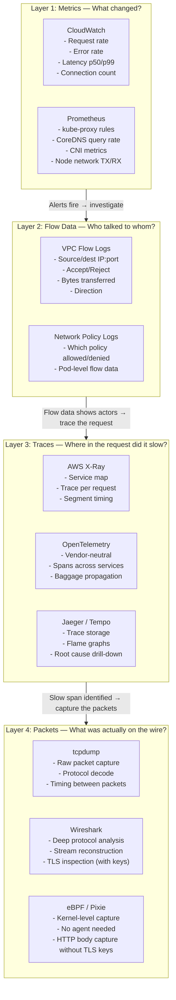
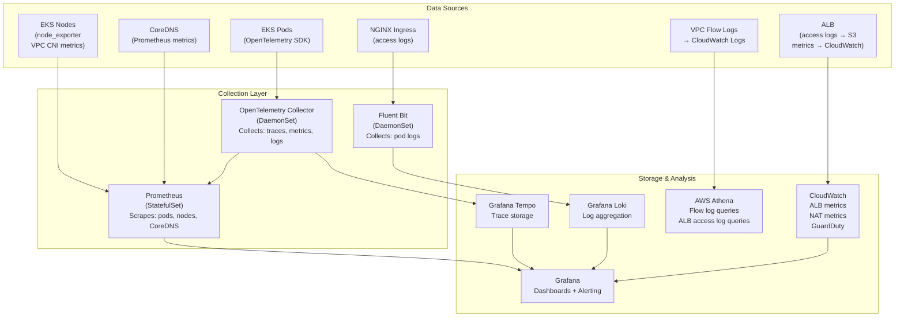
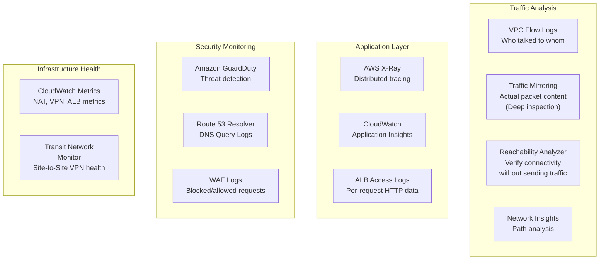

# Network Observability: Flow Logs, tcpdump, Packet Analysis, and Distributed Tracing

> Part 8 of the series: *"Networking for DevOps and Cloud Architects: From Packets to Production"*
>
> Prerequisites: All previous parts — this is the capstone. Every tool here ties back to concepts from Parts 1–7.

---

## Table of Contents

- [Why This Matters](#why-this-matters)
- [Mental Model](#mental-model)
- [Core Concepts](#core-concepts)
- [How It Works in Real Production Systems](#how-it-works-in-real-production-systems)
- [End-to-End Debugging Walkthrough](#end-to-end-debugging-walkthrough)
- [Common Failure Patterns and How Observability Catches Them](#common-failure-patterns)
- [Commands Every Engineer Should Know](#commands-every-engineer-should-know)
- [AWS / Cloud Angle](#aws--cloud-angle)
- [Kubernetes Angle](#kubernetes-angle)
- [Troubleshooting Framework](#troubleshooting-framework)
- [Senior Engineer Interview Explanation](#senior-engineer-interview-explanation)
- [Production Checklist](#production-checklist)
- [Key Takeaways](#key-takeaways)

---

## Why This Matters

Every failure pattern in this series — DNS timeouts, TLS mismatches, routing holes, unhealthy targets, compromised pods — has one thing in common: **you can't fix what you can't see.**

The difference between a 45-minute incident and a 4-hour incident is almost always observability. Teams with good network visibility find the problem fast. Teams without it make assumptions, try random fixes, and waste hours blaming the wrong layer.

Here's what observability means in practice for networking:

**You can't trust application logs alone.** An application that times out connecting to a database logs `connection timeout to postgres:5432`. It doesn't log whether the packet was dropped at the security group, the NACL, the NAT Gateway, or whether DNS never resolved the hostname. The application doesn't know. It just knows the connection failed.

**Metrics tell you *that* something is wrong. Traces tell you *where*. Packets tell you *what*.** A spike in error rate is an alarm. A distributed trace narrows it to a specific service-to-service call. A packet capture proves what was actually on the wire. You need all three — they answer different questions.

**Production network problems are often invisible without the right tools.** TCP retransmissions happen silently — the application eventually succeeds, but latency spikes. UDP packet loss for DNS queries causes 5-second timeouts. A NAT Gateway dropping idle connections causes long-lived WebSocket failures. None of these show up as "errors" in standard application metrics. You need network-layer visibility.

**The engineers who resolve incidents fastest aren't smarter — they're more instrumented.** They have VPC Flow Logs they can query in 30 seconds. They can run a packet capture on a pod in two commands. They have distributed traces that show exactly which microservice added 800ms to a request. This article teaches you to be that engineer.

---

## Mental Model

**Think of network observability as three different cameras watching the same road.**

```
Camera 1: CCTV Overview (VPC Flow Logs)
─────────────────────────────────────────
Sees: Every car that passed, license plate, direction, time
Misses: What's inside the car, what the driver said
Good for: "Was that car here? Did it get through the checkpoint?"

Camera 2: Dashcam (tcpdump / Packet Capture)
──────────────────────────────────────────────
Sees: The exact road surface, exact moment of collision
Sees: What the driver said through the window (unencrypted traffic)
Good for: "What exactly happened in this 30-second window?"

Camera 3: GPS Tracker (Distributed Tracing)
────────────────────────────────────────────
Sees: The full journey from start to finish across every road
Shows: Which road leg took the longest, where the detour happened
Good for: "Where in the entire trip did things slow down?"
```

Each camera answers a different question. Real network debugging uses all three. You start with the overview (Flow Logs) to know *something* happened, zoom in with the dashcam (tcpdump) to see *what* happened, and follow the GPS (tracing) to understand *where across the system* the problem lives.

---

## Core Concepts

### 1. The Observability Stack for Networks

Network observability is not one tool — it's a layered stack, each layer answering questions the others can't:



**When to reach for each layer:**

| Question | Tool |
|---------|------|
| "Error rate is up 5%, what changed?" | Metrics (CloudWatch/Prometheus) |
| "Is traffic reaching our pod from the ALB?" | VPC Flow Logs |
| "Which microservice is adding 800ms?" | Distributed Tracing |
| "Why is our payment service timing out?" | Flow Logs → Traces → tcpdump |
| "Is DNS resolution actually working?" | tcpdump on port 53 |
| "What did the HTTP request body look like?" | eBPF / Wireshark with TLS keys |
| "Is there packet loss between nodes?" | tcpdump + sequence number analysis |

---

### 2. VPC Flow Logs — Deep Dive

You've seen Flow Logs mentioned throughout this series. Here's the full depth.

**What a flow log record looks like:**

```
version account-id interface-id srcaddr dstaddr srcport dstport protocol packets bytes start end action log-status

2 123456789 eni-abc12345 10.0.11.50 10.0.21.5 54321 5432 6 10 1200 1700000000 1700000060 ACCEPT OK
```

Field by field:
```
version:       2 (v2 is standard, v5 adds extra fields)
account-id:    123456789
interface-id:  eni-abc12345 (which ENI this flow passed through)
srcaddr:       10.0.11.50 (source IP)
dstaddr:       10.0.21.5 (destination IP)
srcport:       54321 (ephemeral port on client side)
dstport:       5432 (PostgreSQL)
protocol:      6 (TCP — 17=UDP, 1=ICMP)
packets:       10 (packets in this flow aggregate)
bytes:         1200 (bytes transferred)
start:         1700000000 (Unix timestamp)
end:           1700000060 (Unix timestamp)
action:        ACCEPT (or REJECT)
log-status:    OK (NODATA=no traffic, SKIPDATA=log capacity exceeded)
```

**V5 fields (extra diagnostic information):**

```
vpc-id subnet-id instance-id tcp-flags type pkt-srcaddr pkt-dstaddr
region az-id sublocation-type sublocation-id pkt-src-aws-service pkt-dst-aws-service flow-direction traffic-path
```

`flow-direction` (ingress/egress) and `traffic-path` are particularly useful — `traffic-path` tells you whether traffic went through an IGW, NAT Gateway, VPC Endpoint, or stayed local.

**Flow log aggregation intervals:**

Flow logs don't capture every packet — they aggregate flows into time windows. The default is a 10-minute capture window followed by a 5-minute publish delay. That means a flow that happened right now might not appear in CloudWatch for up to 15 minutes.

For faster security response, you can set a 1-minute aggregation interval:

```bash
aws ec2 create-flow-logs \
  --resource-type VPC \
  --resource-ids vpc-xxxx \
  --traffic-type ALL \
  --log-destination-type cloud-watch-logs \
  --log-group-name /vpc/flow-logs \
  --deliver-logs-permission-arn arn:aws:iam::xxxx:role/vpc-flow-logs \
  --max-aggregation-interval 60    # 1 minute instead of 600 (10 min default)
```

**The SKIPDATA problem:** Flow logs have a capacity limit per ENI. In very high-throughput scenarios (a node handling tens of thousands of connections), some flow records get `log-status: SKIPDATA` — they were captured but not logged due to capacity. You won't know you're missing data unless you query for it:

```sql
-- Find records where log-status is SKIPDATA (you're missing data)
SELECT COUNT(*) as missed_records, interface_id
FROM vpc_flow_logs
WHERE log_status = 'SKIPDATA'
GROUP BY interface_id
ORDER BY missed_records DESC;
```

---

### 3. tcpdump — Reading the Wire

`tcpdump` captures raw packets on a network interface. It's the most direct way to see what's actually happening on the network — bypassing all abstractions.

**The filter syntax is what makes or breaks tcpdump.** An unfiltered capture on a busy production node produces millions of packets per second — unusable noise. Precise filters give you surgical visibility.

**Filter syntax basics:**

```bash
# Capture by host
tcpdump host 10.0.11.50

# Capture by port
tcpdump port 5432

# Capture by protocol
tcpdump tcp
tcpdump udp
tcpdump icmp

# Combine with AND, OR, NOT
tcpdump host 10.0.11.50 and port 5432
tcpdump port 53 or port 5353          # All DNS traffic
tcpdump not port 22                    # Everything except SSH

# Capture by direction
tcpdump src 10.0.11.50               # Only traffic FROM this IP
tcpdump dst 10.0.21.5                # Only traffic TO this IP

# TCP flags (for specific connection states)
tcpdump 'tcp[tcpflags] & tcp-syn != 0'   # SYN packets (new connections)
tcpdump 'tcp[tcpflags] & tcp-rst != 0'   # RST packets (abrupt closes)
tcpdump 'tcp[tcpflags] & tcp-fin != 0'   # FIN packets (graceful closes)
```

**What the output means:**

```
14:23:45.123456 IP 10.0.11.50.54321 > 10.0.21.5.5432: Flags [S], seq 1234567, win 65535, length 0
│              │  │                   │               │       │   │           │         │
│              │  │                   │               │       │   │           │         └── payload bytes (0 = SYN)
│              │  │                   │               │       │   │           └── TCP window size
│              │  │                   │               │       │   └── sequence number
│              │  │                   │               │       └── [S]=SYN [.]=ACK [F]=FIN [R]=RST [P]=PSH
│              │  │                   │               └── destination port
│              │  │                   └── destination IP
│              │  └── source IP:port
│              └── IP layer
└── timestamp (microsecond precision)
```

**A healthy TCP connection in tcpdump:**
```
# Three-way handshake
10.0.11.50.54321 > 10.0.21.5.5432: Flags [S]    ← SYN (client initiates)
10.0.21.5.5432 > 10.0.11.50.54321: Flags [S.]   ← SYN-ACK (server responds)
10.0.11.50.54321 > 10.0.21.5.5432: Flags [.]    ← ACK (connection established)

# Data flowing
10.0.11.50.54321 > 10.0.21.5.5432: Flags [P.]  ← PSH (push data)
10.0.21.5.5432 > 10.0.11.50.54321: Flags [.]   ← ACK

# Graceful close
10.0.11.50.54321 > 10.0.21.5.5432: Flags [F.]  ← FIN (initiating close)
10.0.21.5.5432 > 10.0.11.50.54321: Flags [.]   ← ACK
10.0.21.5.5432 > 10.0.11.50.54321: Flags [F.]  ← FIN
10.0.11.50.54321 > 10.0.21.5.5432: Flags [.]   ← ACK (closed)
```

**A broken connection:**
```
# SYN with no SYN-ACK response → firewall dropping packets
10.0.11.50.54321 > 10.0.21.5.5432: Flags [S]    ← SYN sent
(no response)
10.0.11.50.54321 > 10.0.21.5.5432: Flags [S]    ← retransmit after 1s
(no response)
10.0.11.50.54321 > 10.0.21.5.5432: Flags [S]    ← retransmit after 3s

# SYN-ACK then RST → server responded but something rejected the connection
10.0.11.50.54321 > 10.0.21.5.5432: Flags [S]
10.0.21.5.5432 > 10.0.11.50.54321: Flags [S.]
10.0.21.5.5432 > 10.0.11.50.54321: Flags [R]    ← RST — server reset the connection
```

---

### 4. Distributed Tracing — Following a Request Across Services

A distributed trace tracks a single request as it flows through multiple services. Each service adds a **span** — a timed record of what it did. All spans for one request share a **trace ID**.

```
TraceID: abc-123-xyz
│
├── Span: api-gateway (200ms total)
│   ├── DNS resolve: payment-service (1ms)
│   ├── TCP connect (2ms)
│   └── HTTP request → payment-service (197ms)
│
├── Span: payment-service (195ms total)
│   ├── Validate request (3ms)
│   ├── Redis lookup: customer (5ms)
│   └── DB query: INSERT payment (180ms) ← THIS IS THE SLOW PART
│
└── Span: postgres (178ms actual query time)
    └── Query: INSERT INTO payments... (178ms)
```

Without tracing, you'd see "the API call took 200ms" and have no idea where those 200ms went. With tracing, you see the 178ms INSERT query is the bottleneck — in one click.

**The trace context propagation header:**

For tracing to work across services, each service must read the trace context from incoming requests and pass it to outgoing requests. The standard header is `traceparent` (W3C standard):

```
traceparent: 00-4bf92f3577b34da6a3ce929d0e0e4736-00f067aa0ba902b7-01
             └── version └── trace-id (128-bit)         └── parent-span-id  └── flags
```

If a service doesn't propagate this header, the trace breaks at that service — you lose visibility downstream.

**OpenTelemetry** is the vendor-neutral standard. You instrument once, and can export to any backend: AWS X-Ray, Jaeger, Grafana Tempo, Datadog, Honeycomb. Use OpenTelemetry, not vendor-specific SDKs, unless you're committed to one platform forever.

---

### 5. eBPF — Kernel-Level Network Visibility Without Agents

eBPF (Extended Berkeley Packet Filter) is a technology that lets you run programs in the Linux kernel — safely, without kernel modules, without rebooting. For networking, this is transformative.

**What eBPF enables that traditional tools don't:**

- Capture HTTP request/response bodies *without TLS keys* — eBPF hooks into the application before encryption
- Get per-pod network metrics at the kernel level without any sidecar
- See system calls that applications make — which files they open, which connections they make
- Network policy enforcement at the kernel level (Cilium uses eBPF instead of iptables)

**Pixie** is a Kubernetes observability tool built on eBPF. You deploy one DaemonSet and immediately get:
- Full HTTP/gRPC/DNS request/response data per pod
- Database query latency per pod
- Network flow data between every pod pair
- Service performance metrics

Zero application code changes. Zero sidecars. The kernel does the work.

```bash
# Install Pixie (one command)
px deploy

# Immediately see HTTP traffic for a namespace
px run px/http_data -- -namespace production

# See database queries from all pods
px run px/mysql_data
px run px/pgsql_data

# See DNS queries cluster-wide
px run px/dns_queries_with_latency
```

This is the future of network observability. eBPF-based tools like Cilium + Hubble give you flow visibility between every pod pair in a Kubernetes cluster, with HTTP-level details, with zero application changes.

---

### 6. Metrics That Matter for Network Observability

Metrics are your early warning system. The right set of metrics tells you *something is wrong* before users start complaining.

**The metrics that matter (and what they tell you):**

```
─── Application / ALB Level ──────────────────────────────────────

HTTPCode_Target_5XX_Count     → Backends returning errors
HTTPCode_ELB_5XX_Count        → ALB itself erroring (502/503/504)
TargetResponseTime            → How long backends take (p50, p99, p99.9)
UnhealthyHostCount            → Targets failing health checks
RequestCount                  → Traffic volume (baseline for anomaly detection)
ActiveConnectionCount         → Current open connections
NewConnectionCount            → Connection rate (DDoS detection)

─── DNS Level (CoreDNS Prometheus metrics) ───────────────────────

coredns_dns_requests_total              → Total queries (with rcode label)
coredns_dns_responses_total{rcode="NXDOMAIN"} → Failed lookups (ndots problem)
coredns_forward_requests_total          → Upstream queries (ndots multiplier)
coredns_dns_request_duration_seconds    → Resolution latency
coredns_cache_hits_total               → Cache effectiveness

─── TCP / Network Level (Node Exporter) ─────────────────────────

node_netstat_Tcp_CurrEstab             → Current established connections
node_netstat_TcpExt_TCPRetrans         → TCP retransmissions (signal of congestion)
node_netstat_TcpExt_TCPTimeouts        → TCP timeouts (signal of packet loss/high latency)
node_network_transmit_errs_total       → NIC transmission errors
node_network_receive_errs_total        → NIC receive errors

─── Kubernetes Level ────────────────────────────────────────────

kube_pod_status_ready                  → Pod readiness
container_network_receive_bytes_total  → Per-pod inbound bytes
container_network_transmit_bytes_total → Per-pod outbound bytes
container_network_receive_errors_total → Per-pod receive errors

─── VPC / AWS Level (CloudWatch) ────────────────────────────────

NAT Gateway: BytesInFromDestination   → Outbound internet usage
NAT Gateway: ErrorPortAllocation      → Port exhaustion
NAT Gateway: PacketsDropCount         → Dropped packets
VPN: TunnelState                      → VPN connection status
```

**The four golden signals for any network path:**

```
Latency  → How long does it take? (p50, p99, p99.9)
Traffic  → How many requests/connections? (rate)
Errors   → How many failures? (error rate %)
Saturation → How close to capacity? (connection limits, bandwidth)
```

Instrument every service-to-service boundary with these four signals. When they deviate from baseline, you have a lead to investigate.

---

## How It Works in Real Production Systems

### The Observability Setup for EKS



This stack gives you:
- **Traces** from every service (OpenTelemetry → Tempo → Grafana)
- **Metrics** from every layer (Prometheus → Grafana)
- **Logs** from every pod (Fluent Bit → Loki → Grafana)
- **Flow data** for network-level investigation (Flow Logs → Athena)
- **ALB insights** for load balancer behavior (CloudWatch + S3 → Athena)

Everything in Grafana for correlation — you can click from a trace to the logs from that pod at that timestamp, then jump to Flow Logs for the same IP pair.

---

### Cilium + Hubble — Network Observability Without Agents

If you're running Cilium as your CNI, Hubble gives you flow-level observability across the entire cluster for free:

```bash
# Install Hubble UI
cilium hubble enable --ui

# Real-time network flows between all pods
hubble observe --follow

# Filter: only payment-service traffic
hubble observe --namespace production --pod payment-service

# Show HTTP-level details
hubble observe --protocol http --follow

# Show dropped flows (NetworkPolicy violations)
hubble observe --verdict DROPPED --follow

# Flows between specific pods
hubble observe \
  --from-pod production/api-gateway \
  --to-pod production/payment-service
```

The Hubble UI shows a live service dependency graph — every pod, every connection, every request rate, every error. You can literally watch your microservices talking to each other in real time.

---

### Correlating the Layers — A Real Incident Workflow

Here's how the observability layers work together during an actual incident:

```
═══════════════════════════════════════════════════════════════
 INCIDENT: "Payment failures increasing, error rate 3%"
═══════════════════════════════════════════════════════════════

Step 1: METRICS alert fires (p99 latency > 500ms, error rate 3%)
  ──────────────────────────────────────────────────────────────
  Grafana dashboard: payment-service p99 latency spiking
  ALB CloudWatch: HTTPCode_Target_5XX_Count increasing
  Timeframe: started 14 minutes ago

Step 2: TRACES to find the slow span
  ──────────────────────────────────────────────────────────────
  Open Grafana Tempo → filter traces with duration > 500ms
  Find 50 slow traces → click one

  Trace breakdown:
    api-gateway:          12ms  (normal)
    payment-service:      487ms (abnormal! normal is 45ms)
      ├─ request validate:  3ms
      ├─ redis lookup:      4ms
      └─ db INSERT:        480ms  ← CULPRIT

  Conclusion: database query is slow. Not a network issue?

Step 3: FLOW LOGS to check if DB is even receiving connections
  ──────────────────────────────────────────────────────────────
  Query Athena:
  SELECT srcaddr, dstaddr, action, bytes
  FROM vpc_flow_logs
  WHERE dstaddr = '10.0.21.5' AND dstport = 5432
    AND from_unixtime(start) > now() - interval '20' minute
  
  Result: All connections ACCEPT, normal byte counts
  Connections are reaching RDS. Network is not dropping packets.
  
  Conclusion: It's not a network layer problem — RDS is slow.

Step 4: CONFIRM with RDS metrics
  ──────────────────────────────────────────────────────────────
  CloudWatch: RDS WriteLatency spiking → 450ms average
  RDS Enhanced Monitoring: CPU 95%, waiting on I/O
  
  Root cause: RDS disk I/O saturated. Unrelated to networking.
  Fix: Scale up RDS instance / add read replica / optimize query.

═══════════════════════════════════════════════════════════════
 Incident resolved in 18 minutes because:
 - Metrics gave the alert (3%)
 - Traces pinpointed the span (DB query)
 - Flow Logs confirmed no network issue (ruled out whole layer)
 - RDS metrics confirmed root cause
═══════════════════════════════════════════════════════════════
```

Without traces, this incident becomes "database seems slow, but we're not sure if it's network or DB." With traces, you rule out 5 layers in 2 minutes and go straight to RDS metrics.

---

## End-to-End Debugging Walkthrough

**Scenario: A service intermittently fails with `connection timeout` to an external API. It happens about 1 in every 200 requests. No errors in the application logs.**

This is one of the hardest production problems — intermittent, low-rate, silent at the application layer. Let's walk through using every observability layer.

```
════════════════════════════════════════════════════════════════
 PHASE 1: Establish what's happening with metrics
════════════════════════════════════════════════════════════════

Check: connection timeout error rate
  Prometheus query:
  rate(http_client_errors_total{service="payment-service",
    error="timeout"}[5m])
  
  Result: 0.5% error rate, spikes every few minutes, not random.
  
  Note: spikes seem to correlate with cluster load increases.
  Hypothesis: resource contention? DNS? NAT?

════════════════════════════════════════════════════════════════
 PHASE 2: Check DNS with Flow Logs
════════════════════════════════════════════════════════════════

Query: Are DNS queries to external resolver taking longer under load?

-- Find DNS traffic from payment pods to CoreDNS
SELECT from_unixtime(start) as time, srcaddr, bytes, packets
FROM vpc_flow_logs
WHERE dstport = 53 AND dstaddr = '10.96.0.10'  -- CoreDNS ClusterIP
ORDER BY time DESC LIMIT 100;

Result: Normal DNS query pattern. Not the issue.

-- Check CoreDNS metrics during incident window
Prometheus: coredns_forward_request_duration_seconds_bucket
            At spike times: p99 latency = 4.8s (normal: 50ms)
            
FINDING: CoreDNS forwarding latency spikes to 4.8s!
Hypothesis: CoreDNS is overwhelmed during load spikes.

════════════════════════════════════════════════════════════════
 PHASE 3: Confirm DNS problem with tcpdump
════════════════════════════════════════════════════════════════

# Run tcpdump on CoreDNS pod during a load spike
kubectl exec -n kube-system <coredns-pod> -- \
  tcpdump -i eth0 -nn 'port 53' -c 500

Output during spike:
10.0.11.50.12345 > 10.96.0.10.53: 53+ A? api.stripe.com.default.svc.cluster.local.
10.0.11.50.12346 > 10.96.0.10.53: 53+ A? api.stripe.com.svc.cluster.local.
10.0.11.51.12347 > 10.96.0.10.53: 53+ A? api.stripe.com.default.svc.cluster.local.
10.0.11.52.12348 > 10.96.0.10.53: 53+ A? api.stripe.com.default.svc.cluster.local.
[hundreds more similar lines — all search domain queries for the same name]

CONFIRMED: ndots:5 amplification. Every external call generates 5 DNS queries.
Under load, CoreDNS hits max_concurrent and drops queries.
The 5-second "timeout" is actually Go's DNS resolver timing out a dropped UDP packet.

════════════════════════════════════════════════════════════════
 PHASE 4: Verify with Flow Logs (UDP drops)
════════════════════════════════════════════════════════════════

-- Check for dropped UDP packets to CoreDNS
SELECT srcaddr, dstaddr, dstport, action, COUNT(*) as count
FROM vpc_flow_logs
WHERE dstport = 53 AND action = 'REJECT'
  AND from_unixtime(start) > now() - interval '30' minute
GROUP BY 1,2,3,4

Result: No REJECT entries — the packets aren't being rejected at
the network layer. They're being dropped inside CoreDNS (max_concurrent
limit) without any response — the client just waits until timeout.

════════════════════════════════════════════════════════════════
 PHASE 5: Root cause confirmed. Fix applied.
════════════════════════════════════════════════════════════════

Fixes deployed:
1. NodeLocal DNSCache DaemonSet deployed
2. ndots:2 set on payment-service pods via dnsConfig
3. CoreDNS max_concurrent increased from 1000 to 3000
4. CoreDNS replicas scaled from 2 to 4

Post-fix validation:
  tcpdump on CoreDNS: only absolute queries (trailing dot) for external names
  CoreDNS metrics: forwarding latency p99 back to 50ms under load
  payment-service: connection timeout errors drop to 0%

Total investigation time: 35 minutes.
With no observability: this would have been a multi-day mystery.
```

---

## Common Failure Patterns

### Pattern 1: Invisible TCP Retransmissions

**Symptom:** Application latency is higher than expected. Requests succeed but are slow. No obvious errors. The problem is intermittent and hard to reproduce.

**The hidden truth:** TCP retransmissions are completely transparent to applications. When a packet is lost, TCP retransmits silently. The application eventually gets its response — but with added latency equal to the retransmit timeout (200ms–3s depending on round-trip time and retransmit count).

**How to see it:**

```bash
# On the source node — check retransmit count (should be near 0)
cat /proc/net/snmp | grep Tcp
# Look for: RetransSegs — should be very low relative to OutSegs
# RetransSegs/OutSegs > 0.1% = you have meaningful packet loss

# Real-time retransmit monitoring
watch -n 2 'netstat -s | grep -i retransmit'

# With tcpdump — look for duplicate sequence numbers (retransmits)
tcpdump -nn -i eth0 host 10.0.21.5 | grep 'dup ack\|retransmit'

# With ss — see TCP retransmit count per connection
ss -tin dst 10.0.21.5
# Look for: retrans:X/Y in the output
# X = retransmitted segments, Y = total retransmits ever
```

**Common causes in AWS:**
- Overloaded node NIC (high traffic, packet drops at NIC level)
- NAT Gateway under extreme load
- Cross-AZ traffic through a bottleneck
- EBS-backed instance with I/O contention affecting network performance

---

### Pattern 2: NAT Gateway Connection Tracking Exhaustion

**Symptom:** Connections from private subnet pods to the internet fail at high concurrency. Error: `cannot assign requested address`. NAT Gateway metrics show high `ErrorPortAllocation`.

**The problem:** Each NAT Gateway connection consumes a (source IP, destination IP, destination port) tuple. One NAT Gateway can handle ~55,000 simultaneous connections to the same destination IP:port. If you have 100 pods all connecting to the same external API endpoint, you can hit this limit.

```bash
# Check NAT Gateway metrics for port allocation errors
aws cloudwatch get-metric-statistics \
  --namespace AWS/NATGateway \
  --metric-name ErrorPortAllocation \
  --dimensions Name=NatGatewayId,Value=nat-xxxx \
  --start-time $(date -u -d '1 hour ago' +%FT%TZ) \
  --end-time $(date -u +%FT%TZ) \
  --period 60 \
  --statistics Sum

# Check active connections
aws cloudwatch get-metric-statistics \
  --namespace AWS/NATGateway \
  --metric-name ActiveConnectionCount \
  --dimensions Name=NatGatewayId,Value=nat-xxxx \
  --start-time $(date -u -d '1 hour ago' +%FT%TZ) \
  --end-time $(date -u +%FT%TZ) \
  --period 60 \
  --statistics Maximum
```

**Fix:**
- Use connection pooling in your application (don't open a new connection per request)
- Add VPC Interface Endpoints for AWS services (removes NAT entirely)
- Spread load across multiple NAT Gateways (if calling different destination IPs)

---

### Pattern 3: Flow Logs Show ACCEPT But Connection Still Fails

**Symptom:** VPC Flow Logs show `ACCEPT` for the connection. But the application still fails to connect. This seems impossible — the packet was accepted, right?

**The explanation:** `ACCEPT` in flow logs means the *security group allowed the packet*. It does NOT mean the application received it and responded. After the security group accepts the packet, several things can still go wrong:
- The application crashed and nobody is listening on the port
- A NetworkPolicy blocked it at the pod level (after SG)
- The process ran out of file descriptors and can't accept new connections
- The application's connection queue is full (listen backlog overflow)

```bash
# Verify: is anything listening on the port?
kubectl exec -it <pod> -- ss -tlnp | grep 8080

# Check for connection queue overflow
kubectl exec -it <pod> -- ss -tlnp
# Look for: Recv-Q column — if non-zero, connections queued but not accepted
# Look for: Send-Q column — if non-zero, data queued to send

# Check for file descriptor exhaustion
kubectl exec -it <pod> -- cat /proc/$(pgrep -f app)/limits | grep "open files"
kubectl exec -it <pod> -- ls /proc/$(pgrep -f app)/fd | wc -l

# Check dmesg for kernel-level connection drops
kubectl debug node/<node-name> -it --image=ubuntu -- dmesg | grep -i "nf_conntrack\|connection"
```

---

### Pattern 4: Distributed Trace Shows Missing Spans

**Symptom:** Traces in Jaeger/Tempo are incomplete. You can see the entry point (API gateway) and the final response, but several intermediate service calls are missing.

**Likely causes:**
- A service isn't instrumented with OpenTelemetry
- A service isn't propagating the `traceparent` header
- A message queue or async job breaks the trace context
- A service is stripping headers for security reasons (some WAF configs strip custom headers)

```bash
# Check if a service is propagating trace headers
# Run a curl with a trace ID and see if downstream services have it
curl -H "traceparent: 00-4bf92f3577b34da6a3ce929d0e0e4736-00f067aa0ba902b7-01" \
     https://api.example.com/v1/payments

# Check OpenTelemetry collector logs
kubectl logs -n observability <otel-collector-pod> | grep -i "error\|dropped\|failed"

# Verify the otel-collector is receiving spans
kubectl port-forward -n observability svc/otel-collector 8888:8888
curl http://localhost:8888/metrics | grep otelcol_receiver_accepted_spans
```

---

### Pattern 5: CloudWatch Log Insights Query Times Out

**Symptom:** Your Flow Log queries in CloudWatch Logs Insights time out or return partial results for production traffic analysis.

**Why it happens:** Flow logs for a busy VPC generate gigabytes of data per day. CloudWatch Logs Insights scans everything sequentially. At 10GB/day, a 7-day query scans 70GB — slow and expensive.

**Solution: Use Athena for large-scale flow log analysis.**

```bash
# Create Athena table for Flow Logs in S3
# (One-time setup)
CREATE EXTERNAL TABLE vpc_flow_logs (
  version int,
  account string,
  interfaceid string,
  sourceaddress string,
  destinationaddress string,
  sourceport int,
  destinationport int,
  protocol int,
  numpackets int,
  numbytes bigint,
  starttime int,
  endtime int,
  action string,
  logstatus string
)
PARTITIONED BY (dt string)
ROW FORMAT DELIMITED
FIELDS TERMINATED BY ' '
LOCATION 's3://my-flow-logs-bucket/AWSLogs/123456/vpcflowlogs/us-east-1/'
TBLPROPERTIES ("skip.header.line.count"="1");

# Load partitions
MSCK REPAIR TABLE vpc_flow_logs;

# Now queries use column pruning and partition elimination — FAST
SELECT sourceaddress, destinationaddress, action, COUNT(*) as flows
FROM vpc_flow_logs
WHERE dt = '2024/01/15'
  AND destinationport = 5432
  AND action = 'REJECT'
GROUP BY 1, 2, 3
ORDER BY flows DESC;
```

Athena queries on partitioned Flow Logs take seconds instead of minutes, and cost fractions of a cent per query instead of being limited by CloudWatch Insights capacity.

---

## Commands Every Engineer Should Know

### tcpdump — Production Field Guide

```bash
# ── Getting on a Node or Pod ─────────────────────────────────────

# Debug pod with full networking tools (best image)
kubectl run netshoot --image=nicolaka/netshoot \
  --rm -it --restart=Never -- bash

# Run tcpdump inside a pod's network namespace from the node
# Step 1: Get pod's container PID
CONTAINER_ID=$(kubectl get pod <pod> -o jsonpath='{.status.containerStatuses[0].containerID}' | sed 's/.*:\/\///')
PID=$(docker inspect --format '{{.State.Pid}}' $CONTAINER_ID 2>/dev/null \
      || crictl inspect --output go-template --template '{{.info.pid}}' $CONTAINER_ID)

# Step 2: Run tcpdump in pod's network namespace
nsenter -t $PID -n -- tcpdump -nn -i eth0 port 5432

# Or simpler: exec directly if tcpdump is in the image
kubectl exec -it <pod> -- tcpdump -nn -i eth0 port 5432

# ── DNS Debugging ─────────────────────────────────────────────────

# Watch all DNS queries and responses
tcpdump -nn -i any port 53

# Watch for DNS queries that get no response (the timeout pattern)
tcpdump -nn -i any port 53 | grep -v "is at\|has address"

# Capture DNS with timing to measure latency
tcpdump -nn -i any -tttt port 53 2>&1 | while IFS= read -r line; do
    echo "$(date +%H:%M:%S.%3N) $line"
done

# ── TCP Connection Analysis ───────────────────────────────────────

# Watch connection establishment to a service
tcpdump -nn 'tcp[tcpflags] & (tcp-syn|tcp-ack) != 0 and port 8080'

# Find TCP resets (dropped connections, auth failures, etc.)
tcpdump -nn 'tcp[tcpflags] & tcp-rst != 0'

# Find retransmissions (packet loss indicator)
tcpdump -nn -i any 'tcp[tcpflags] & tcp-syn != 0' | \
  awk '{print $3}' | sort | uniq -d

# ── HTTP Debugging (Unencrypted Only) ────────────────────────────

# See HTTP method and URL for unencrypted traffic
tcpdump -nn -A -i any 'tcp port 8080 and (tcp[((tcp[12:1] & 0xf0) >> 2):4] = 0x47455420 or tcp[((tcp[12:1] & 0xf0) >> 2):4] = 0x504f5354)'

# More readable: see all HTTP requests
tcpdump -nn -A port 8080 2>/dev/null | grep -E "GET|POST|PUT|DELETE|HTTP"

# ── Saving and Sharing Captures ──────────────────────────────────

# Save to file for Wireshark analysis
tcpdump -i eth0 -w /tmp/capture.pcap -s 65535 host 10.0.21.5

# Read a saved capture
tcpdump -r /tmp/capture.pcap

# Filter while reading
tcpdump -r /tmp/capture.pcap 'tcp[tcpflags] & tcp-rst != 0'

# Copy capture from pod to local machine
kubectl cp <namespace>/<pod>:/tmp/capture.pcap ./capture.pcap
```

---

### VPC Flow Log Queries — Athena

```sql
-- ── Security Queries ─────────────────────────────────────────────

-- Top rejected traffic (attackers or misconfiguration)
SELECT sourceaddress, destinationport, COUNT(*) as attempts
FROM vpc_flow_logs
WHERE action = 'REJECT' AND dt = '2024/01/15'
GROUP BY 1, 2
ORDER BY attempts DESC
LIMIT 20;

-- Port scan detection (many ports from one source)
SELECT sourceaddress,
       COUNT(DISTINCT destinationport) as ports_probed,
       COUNT(*) as total_attempts
FROM vpc_flow_logs
WHERE action = 'REJECT' AND dt = '2024/01/15'
GROUP BY sourceaddress
HAVING COUNT(DISTINCT destinationport) > 10
ORDER BY ports_probed DESC;

-- ── Traffic Analysis ─────────────────────────────────────────────

-- Top talkers by bytes (find bandwidth hogs)
SELECT sourceaddress, destinationaddress,
       SUM(numbytes) as total_bytes,
       COUNT(*) as flows
FROM vpc_flow_logs
WHERE dt = '2024/01/15'
GROUP BY 1, 2
ORDER BY total_bytes DESC
LIMIT 20;

-- Database connection sources (who's hitting RDS)
SELECT sourceaddress, COUNT(*) as connections, SUM(numbytes) as bytes
FROM vpc_flow_logs
WHERE destinationaddress = '10.0.21.5'
  AND destinationport = 5432
  AND dt = '2024/01/15'
GROUP BY sourceaddress
ORDER BY connections DESC;

-- ── Debugging Specific Issues ─────────────────────────────────────

-- Was traffic from this pod ACCEPTED or REJECTED?
SELECT action, COUNT(*) as count, SUM(numbytes) as bytes
FROM vpc_flow_logs
WHERE sourceaddress = '10.0.11.50'
  AND destinationaddress = '10.0.21.5'
  AND from_unixtime(starttime)
      BETWEEN timestamp '2024-01-15 14:00:00'
      AND timestamp '2024-01-15 15:00:00'
GROUP BY action;

-- Find all traffic from an IP in the last 5 minutes
-- (Good for incident response)
SELECT from_unixtime(starttime) as time, sourceaddress, destinationaddress,
       destinationport, action, numbytes
FROM vpc_flow_logs
WHERE (sourceaddress = '10.0.11.50' OR destinationaddress = '10.0.11.50')
  AND from_unixtime(starttime) > (now() - interval '5' minute)
ORDER BY time DESC;

-- Traffic that went through NAT Gateway (traffic_path = 4)
SELECT sourceaddress, destinationaddress, destinationport, numbytes
FROM vpc_flow_logs_v5  -- v5 has traffic_path field
WHERE traffic_path = 4
  AND dt = '2024/01/15'
ORDER BY numbytes DESC
LIMIT 50;
```

---

### Distributed Tracing — OpenTelemetry

```python
# Python — OpenTelemetry instrumentation for FastAPI
from opentelemetry import trace
from opentelemetry.exporter.otlp.proto.grpc.trace_exporter import OTLPSpanExporter
from opentelemetry.sdk.trace import TracerProvider
from opentelemetry.sdk.trace.export import BatchSpanProcessor
from opentelemetry.instrumentation.fastapi import FastAPIInstrumentor
from opentelemetry.instrumentation.requests import RequestsInstrumentor
from opentelemetry.instrumentation.psycopg2 import Psycopg2Instrumentor

# Setup — configure once at startup
provider = TracerProvider()
exporter = OTLPSpanExporter(endpoint="http://otel-collector:4317")
provider.add_span_processor(BatchSpanProcessor(exporter))
trace.set_tracer_provider(provider)

# Auto-instrument FastAPI (traces every HTTP request)
FastAPIInstrumentor.instrument_app(app)

# Auto-instrument outbound HTTP calls (propagates trace context)
RequestsInstrumentor().instrument()

# Auto-instrument database calls (shows query timing)
Psycopg2Instrumentor().instrument()

# Manual span for custom operations
tracer = trace.get_tracer(__name__)

async def process_payment(payment_data):
    with tracer.start_as_current_span("process_payment") as span:
        span.set_attribute("payment.amount", payment_data["amount"])
        span.set_attribute("payment.currency", payment_data["currency"])

        # Redis lookup
        with tracer.start_as_current_span("redis.get_customer"):
            customer = await redis.get(f"customer:{payment_data['customer_id']}")

        # DB write
        with tracer.start_as_current_span("db.insert_payment"):
            await db.execute("INSERT INTO payments ...", payment_data)

        span.set_attribute("payment.status", "success")
```

```bash
# Verify OpenTelemetry Collector is receiving spans
kubectl port-forward -n observability svc/otel-collector 8888:8888
curl http://localhost:8888/metrics | grep -E "otelcol_receiver_accepted|otelcol_exporter_sent"

# Check Jaeger/Tempo for a specific trace ID
# (Get trace ID from application logs or response headers)
curl "http://jaeger:16686/api/traces/<trace-id>"
```

---

### Kubernetes Network Debugging Commands

```bash
# ── CoreDNS Performance ───────────────────────────────────────────

# Check CoreDNS metrics in real-time
kubectl port-forward -n kube-system svc/kube-dns 9153:9153
curl -s http://localhost:9153/metrics | grep -E \
  "coredns_dns_requests_total|coredns_forward_requests_total|coredns_dns_request_duration"

# Check DNS latency histogram (p99)
curl -s http://localhost:9153/metrics | grep 'coredns_dns_request_duration.*0\.99'

# ── Network Policy Verification ───────────────────────────────────

# Test if a NetworkPolicy is blocking a connection
# Step 1: Try connection (should fail if policy is correct)
kubectl exec -n production <source-pod> -- nc -zv <dest-pod-ip> 5432

# Step 2: Check NetworkPolicy is applied
kubectl get networkpolicy -n production
kubectl describe networkpolicy allow-payment-to-db -n production

# With Cilium: see which policy decision was made
kubectl exec -n kube-system <cilium-pod> -- \
  cilium monitor --type policy-verdict --from <source-pod-ip>

# ── Connection State Analysis ─────────────────────────────────────

# All connections from a pod
kubectl exec -it <pod> -- ss -tanp

# Count by state
kubectl exec -it <pod> -- ss -tan | \
  awk 'NR>1{print $1}' | sort | uniq -c | sort -rn

# Connections to specific destination
kubectl exec -it <pod> -- ss -tan 'dst 10.0.21.5'

# Detailed TCP info (RTT, retransmits, cwnd)
kubectl exec -it <pod> -- ss -tin dst 10.0.21.5

# ── Node Network Statistics ───────────────────────────────────────

# Network interface stats (errors, drops)
kubectl debug node/<node> -it --image=ubuntu -- \
  cat /proc/net/dev

# Detailed TCP stats
kubectl debug node/<node> -it --image=ubuntu -- \
  cat /proc/net/snmp | grep Tcp

# Connection tracking table (used by NAT, stateful firewall)
kubectl debug node/<node> -it --image=ubuntu -- \
  cat /proc/sys/net/netfilter/nf_conntrack_count
# Compare to:
kubectl debug node/<node> -it --image=ubuntu -- \
  cat /proc/sys/net/netfilter/nf_conntrack_max
# If count approaches max → conntrack table exhaustion
```

---

### AWS CloudWatch Insights for Network Troubleshooting

```bash
# ── CloudWatch Logs Insights Queries ─────────────────────────────
# (For Flow Logs in CloudWatch, not Athena)

# Query: All REJECT events in the last hour
# Fields: @timestamp, srcAddr, dstAddr, dstPort, action
fields @timestamp, srcAddr, dstAddr, srcPort, dstPort, protocol, action
| filter action = "REJECT"
| sort @timestamp desc
| limit 100

# Query: Traffic to a specific destination
fields @timestamp, srcAddr, dstAddr, dstPort, bytes, action
| filter dstAddr = "10.0.21.5" and dstPort = 5432
| sort @timestamp desc
| limit 50

# Query: Top source IPs by volume
fields srcAddr, bytes
| filter action = "ACCEPT"
| stats sum(bytes) as totalBytes by srcAddr
| sort totalBytes desc
| limit 20

# Query: Connection attempts from outside VPC to any port
fields @timestamp, srcAddr, dstAddr, dstPort, action
| filter not srcAddr like /^10\./
  and not srcAddr like /^172\.1[6-9]\./
  and not srcAddr like /^192\.168\./
| sort @timestamp desc
| limit 100
```

---

## AWS / Cloud Angle

### AWS Network Observability Services — The Complete Map



**VPC Traffic Mirroring** deserves a callout — it's the AWS equivalent of a wiretap for your VPC. You configure a mirror source (an ENI), a mirror target (another ENI running a packet capture tool), and a filter (which traffic to mirror). AWS copies matching packets to your capture target.

```bash
# Create a traffic mirror target (EC2 instance running tcpdump/Wireshark)
aws ec2 create-traffic-mirror-target \
  --network-interface-id eni-capture-instance

# Create a traffic mirror filter (e.g., only TCP port 5432)
aws ec2 create-traffic-mirror-filter

aws ec2 create-traffic-mirror-filter-rule \
  --traffic-mirror-filter-id tmf-xxxx \
  --traffic-direction ingress \
  --rule-number 100 \
  --rule-action accept \
  --protocol 6 \
  --destination-port-range FromPort=5432,ToPort=5432

# Create the mirror session (attach source to target)
aws ec2 create-traffic-mirror-session \
  --network-interface-id eni-source \
  --traffic-mirror-target-id tmt-xxxx \
  --traffic-mirror-filter-id tmf-xxxx \
  --session-number 1
```

This is how you do deep packet inspection on production traffic without installing any software on the source instance. Captured traffic goes to your analysis node where you run Wireshark or Suricata.

---

### VPC Reachability Analyzer

Before you send actual traffic — before you deploy — you can verify that connectivity is *theoretically possible* given your current route tables, NACLs, and security groups. The Reachability Analyzer does this analytically without sending packets.

```bash
# Create a path analysis: can pod subnet reach RDS?
aws ec2 create-network-insights-path \
  --source eni-eks-node \
  --destination eni-rds \
  --protocol TCP \
  --destination-port 5432

# Start the analysis
aws ec2 start-network-insights-analysis \
  --network-insights-path-id nip-xxxx

# Get results
aws ec2 describe-network-insights-analyses \
  --network-insights-analysis-ids nia-xxxx \
  --query 'NetworkInsightsAnalyses[0].{
    Status:Status,
    Reachable:NetworkPathFound,
    Explanations:Explanations[*].ExplanationCode
  }'

# If NetworkPathFound = false, Explanations tells you exactly why:
# "SECURITY_GROUP_RULE" → which SG rule is blocking
# "NETWORK_ACL_RULE" → which NACL rule is blocking
# "ROUTE_TABLE" → which route is missing
```

This is the tool you use *before* deploying a new service to verify your network configuration is correct. Catch the SG misconfiguration before users hit a 503, not after.

---

## Kubernetes Angle

### Hubble — Real-Time Flow Observability for Cilium

```bash
# Install Hubble CLI
export HUBBLE_VERSION=$(curl -s https://raw.githubusercontent.com/cilium/hubble/master/stable.txt)
curl -L --remote-name-all https://github.com/cilium/hubble/releases/download/$HUBBLE_VERSION/hubble-linux-amd64.tar.gz
tar xzvf hubble-linux-amd64.tar.gz
mv hubble /usr/local/bin/

# Port-forward Hubble relay
kubectl port-forward -n kube-system svc/hubble-relay 4245:80 &

# ── Real-Time Observation ─────────────────────────────────────────

# Watch all flows in the cluster
hubble observe --follow

# Watch only your namespace
hubble observe --namespace production --follow

# Watch only dropped flows (NetworkPolicy violations)
hubble observe --verdict DROPPED --follow

# Watch HTTP-level details
hubble observe --protocol http --namespace production --follow

# Watch flows from a specific pod
hubble observe --from-pod production/payment-service --follow

# Watch flows between two specific pods
hubble observe \
  --from-pod production/api-gateway \
  --to-pod production/payment-service \
  --follow

# ── Policy Analysis ───────────────────────────────────────────────

# Generate NetworkPolicy from observed flows
hubble observe --output json --namespace production \
  | hubble generate policy

# Check which policy allowed/denied a flow
hubble observe --verdict DROPPED --output json \
  | jq '.flow.policy_match_reason'
```

---

### OpenTelemetry Collector in Kubernetes

The OTel Collector is the central hub for all telemetry in the cluster:

```yaml
# OpenTelemetry Collector DaemonSet configuration
apiVersion: v1
kind: ConfigMap
metadata:
  name: otel-collector-config
  namespace: observability
data:
  config.yaml: |
    receivers:
      # Receive traces from applications
      otlp:
        protocols:
          grpc:
            endpoint: 0.0.0.0:4317
          http:
            endpoint: 0.0.0.0:4318

      # Scrape Prometheus metrics (CoreDNS, kube-proxy, node_exporter)
      prometheus:
        config:
          scrape_configs:
          - job_name: coredns
            static_configs:
            - targets: ['kube-dns.kube-system:9153']
          - job_name: node-exporter
            kubernetes_sd_configs:
            - role: node

    processors:
      # Add Kubernetes metadata to all telemetry
      k8sattributes:
        extract:
          metadata:
          - k8s.pod.name
          - k8s.namespace.name
          - k8s.deployment.name
          - k8s.node.name
      
      # Batch for efficiency
      batch:
        timeout: 10s
        send_batch_size: 1000

    exporters:
      # Traces → Grafana Tempo
      otlp/tempo:
        endpoint: tempo:4317
      
      # Metrics → Prometheus (remote write)
      prometheusremotewrite:
        endpoint: "http://prometheus:9090/api/v1/write"
      
      # AWS X-Ray (if using AWS native tracing)
      awsxray:
        region: us-east-1

    service:
      pipelines:
        traces:
          receivers: [otlp]
          processors: [k8sattributes, batch]
          exporters: [otlp/tempo, awsxray]
        metrics:
          receivers: [prometheus]
          processors: [batch]
          exporters: [prometheusremotewrite]
```

---

### Grafana Dashboards for Network Observability

The dashboards that every platform team should have:

```
Dashboard 1: Cluster Network Overview
  - Total cluster ingress/egress bytes (per node, per namespace)
  - CoreDNS: query rate, NXDOMAIN rate, forwarding latency
  - kube-proxy: sync latency (rule update delays)
  - Top N pods by network traffic

Dashboard 2: Service-to-Service Health
  - Request rate between each service pair (from Hubble or traces)
  - Error rate between each service pair
  - P99 latency per service-to-service call
  - Active connections per service

Dashboard 3: ALB + External Traffic
  - ALB request count, error rates (4xx, 5xx)
  - Unhealthy host count over time
  - Target response time p50/p99
  - New connection rate (DDoS detection)

Dashboard 4: Network Security
  - VPC Flow Log REJECT count over time (security events)
  - WAF blocked requests (by rule, by IP)
  - GuardDuty finding count (by severity)
  - NAT Gateway: bytes, connection count, port allocation errors

Dashboard 5: DNS Health
  - CoreDNS queries per second (total, by type)
  - NXDOMAIN rate (ndots problem indicator)
  - CoreDNS cache hit rate
  - Forward request latency p99
```

---

## Troubleshooting Framework

This is the capstone framework — pulling together all 8 parts of this series.

### Step 1: Is it a network problem at all?

Before going deep on network observability, rule out the obvious:

```bash
# Is the service responding at all?
kubectl get pods -n <namespace>
kubectl get endpoints <service> -n <namespace>

# Any obvious application errors?
kubectl logs <pod> --tail=50

# Any Kubernetes events?
kubectl get events -n <namespace> --sort-by='.lastTimestamp' | tail -20
```

If pods are running, endpoints have IPs, and logs show nothing — then it's a network problem. Proceed.

### Step 2: What layer is the problem at?

```bash
# L3 check — can we reach the destination at all?
kubectl exec -it <source-pod> -- ping -c 3 <dest-ip>    # ICMP (may be blocked)
kubectl exec -it <source-pod> -- nc -zv <dest-ip> <port>  # TCP

# L4 check — is port open?
# timeout = firewall, refused = port closed

# L7 check — is app responding correctly?
kubectl exec -it <source-pod> -- \
  curl -v http://<dest-ip>:<port>/health
```

### Step 3: VPC Flow Logs — ground truth

```sql
-- Was traffic ACCEPTED or REJECTED?
SELECT action, COUNT(*) as flows
FROM vpc_flow_logs
WHERE sourceaddress = '<source>'
  AND destinationaddress = '<dest>'
  AND destinationport = <port>
  AND from_unixtime(starttime) > now() - interval '30' minute
GROUP BY action;
```

- `ACCEPT` + connection still fails → application-level problem (Step 6)
- `REJECT` → network-level block (Step 4/5)
- No results → traffic isn't even reaching the VPC layer (Step 4)

### Step 4: Find the blocking rule

```bash
# Security group on destination
aws ec2 describe-security-groups --group-ids <dest-sg> \
  --query 'SecurityGroups[*].IpPermissions'

# NACL on destination subnet
aws ec2 describe-network-acls \
  --filters "Name=association.subnet-id,Values=<dest-subnet>" \
  --query 'NetworkAcls[0].Entries | sort_by(@, &RuleNumber)'

# NetworkPolicy (if inside Kubernetes)
kubectl get networkpolicy -n <namespace>
```

### Step 5: Use Reachability Analyzer to verify the full path

```bash
aws ec2 start-network-insights-analysis \
  --network-insights-path-id <path-id>

# Results in minutes with exact blocking rule identified
```

### Step 6: Distributed tracing — where is the latency?

```bash
# Get a sample trace ID from application logs
kubectl logs <pod> | grep trace_id | tail -5

# Query trace in Jaeger/Tempo
curl http://jaeger:16686/api/traces/<trace-id>

# Find which span is slow
# Which service, which operation, which DB query
```

### Step 7: tcpdump — when you need the wire

```bash
# Targeted capture on the problematic connection
kubectl exec -it <pod> -- \
  tcpdump -nn -i eth0 host <dest-ip> and port <dest-port> -c 100

# Look for:
# - SYNs with no SYN-ACK (firewall drop)
# - RST after SYN-ACK (rejected at application)
# - Long gaps between packets (latency, retransmit)
# - Repeated SYNs (retransmit on packet loss)
```

### Step 8: Metrics correlation — confirm and alert

```bash
# Confirm your finding with metrics
# If it's DNS: CoreDNS forward_latency should show the spike
# If it's DB: RDS WriteLatency should show the spike
# If it's packet loss: node_netstat_TcpExt_TCPRetrans should show the spike

# Set an alert so it pages you next time before users notice
# (This is how you go from reactive to proactive)
```

---

## Senior Engineer Interview Explanation

*If asked: "Production incident — your service error rate just jumped to 5%. Walk me through how you'd diagnose it."*

---

"The first question I ask is: is this happening for all users, some users, or specific operations? That tells me whether it's an infra-wide issue (routing, DNS) or something scoped to a specific request path.

I open the distributed traces immediately. Traces tell me which service and which operation is failing within two minutes, without any guesswork. If I see a specific span timing out — say, the database call — I go to RDS metrics and confirm. If I see a service returning errors with no slow span, it's an application logic problem.

If traces don't narrow it down — maybe the service isn't instrumented or the error happens before the trace starts — I go to VPC Flow Logs. I query: are packets from the source ACCEPTED or REJECTED at the destination? If REJECTED, I know it's a firewall layer — security group, NACL, or NetworkPolicy. If ACCEPTED but still failing, the block is at the application layer.

When I need to understand *what specifically* is wrong at the wire level — if I'm seeing weird RST packets, or connections dropping after exactly 350 seconds (NAT Gateway idle timeout), or DNS queries with no response — I use tcpdump. Targeted capture, specific host and port filter, 30 seconds, read the output. That's usually conclusive.

The pattern I've seen most often: latency spikes that turn out to be CoreDNS overload from ndots:5 amplification, connection drops during deployments from missing preStop hooks, and database latency from RDS I/O saturation — all of which look the same at the application layer but are completely different root causes. The toolchain I just described finds the right one in under 30 minutes.

The prevention side: every service gets traces, every VPC gets Flow Logs, every cluster gets NodeLocal DNSCache. The goal is to never be debugging blind."

---

## Production Checklist

### VPC Flow Logs

- [ ] Flow Logs enabled on ALL VPCs in ALL accounts (traffic-type: ALL)
- [ ] Flow Logs shipping to both CloudWatch (for live queries) and S3 (for Athena)
- [ ] Athena table created and partitioned for S3 flow logs
- [ ] Aggregation interval: 1 minute (not default 10 minutes) for production
- [ ] V5 fields enabled (includes traffic-path, flow-direction, aws-service info)
- [ ] SKIPDATA alert configured (flow log capacity exceeded = missing data)
- [ ] Retention policy set (S3 lifecycle: 90 days standard, archive after)

### Distributed Tracing

- [ ] OpenTelemetry SDK instrumented in all production services
- [ ] Trace context (`traceparent`) propagated through ALL service calls
- [ ] Database spans instrumented (shows query latency in traces)
- [ ] Outbound HTTP spans instrumented (shows downstream call latency)
- [ ] OTel Collector deployed as DaemonSet with k8s metadata enrichment
- [ ] Trace backend configured (Tempo/Jaeger/X-Ray)
- [ ] Sampling rate appropriate (100% for errors, 1-10% for success)
- [ ] Service map visible and accurate (all services connected)

### Metrics

- [ ] Prometheus scraping CoreDNS, kube-proxy, node-exporter
- [ ] ALB metrics in CloudWatch (RequestCount, 5xx, TargetResponseTime, UnhealthyHostCount)
- [ ] NAT Gateway metrics (BytesOutToDestination, ErrorPortAllocation, PacketsDropCount)
- [ ] Alerts on: UnhealthyHostCount > 0, 5xx error rate > threshold, DNS latency p99 > 1s
- [ ] Four golden signals dashboards per service: latency, traffic, errors, saturation

### tcpdump / Packet Analysis

- [ ] `nicolaka/netshoot` image or equivalent available for debug pods
- [ ] Node access available for tcpdump in pod network namespaces
- [ ] Traffic Mirroring configured for security-sensitive workloads
- [ ] VPC Reachability Analyzer used before deploying new connectivity
- [ ] Team trained on reading tcpdump output (SYN/SYN-ACK/ACK patterns)

### Kubernetes Network Observability

- [ ] Hubble enabled (if using Cilium)
- [ ] NetworkPolicy logging enabled
- [ ] CoreDNS metrics exported to Prometheus
- [ ] Pod-level network metrics (Prometheus cadvisor container_network_*)
- [ ] kube-proxy sync_proxy_rules latency monitored
- [ ] OTel Collector config reviewed — no dropped spans in exporter metrics

### Incident Response

- [ ] Flow Log query runbook documented (Athena SQL templates)
- [ ] On-call engineers trained on tcpdump basics
- [ ] Distributed trace link included in all alert notifications
- [ ] Post-incident: all uninstrumented paths that slowed investigation are instrumented

---

## Key Takeaways

1. **Observability is not one tool — it's three layers that answer different questions.** Metrics tell you *that* something changed. Traces tell you *where* in the request path it happened. Packets tell you *what exactly* was on the wire. You need all three. Each one alone is incomplete.

2. **VPC Flow Logs are your network ground truth — enable them before you need them.** The worst time to enable Flow Logs is during an incident. By then, the traffic you needed to capture is already gone. Enable them on every VPC in every account, with Athena configured for analysis. The cost is negligible.

3. **Distributed traces eliminate hours of guesswork in multi-service debugging.** Without traces, "which service is slow?" becomes a guessing game. With traces, you see the exact span, the exact timing, the exact operation — in the first minute of investigation. Instrument every service. Propagate the `traceparent` header everywhere, including through message queues and async jobs.

4. **tcpdump is the final arbiter.** When all other tools leave ambiguity, tcpdump shows you exactly what's on the wire. Learn to read SYN/SYN-ACK/ACK patterns, RST packets, and TCP retransmissions. This skill resolves incidents that would otherwise remain mysterious.

5. **VPC Reachability Analyzer lets you verify network paths before deploying.** Don't wait for a 503 to discover your security group is wrong. Run Reachability Analyzer in your CI/CD pipeline to verify connectivity is possible between components before they go live.

6. **eBPF-based tools (Cilium/Hubble, Pixie) are the future of network observability.** They give you HTTP-level visibility, per-pod flow data, and network policy decisions — with zero application changes, zero sidecars, zero TLS key management. If you're starting a new platform, start with Cilium.

7. **The engineers who debug fastest aren't smarter — they're more instrumented.** The difference between a 20-minute incident and a 4-hour incident is almost always observability. Every hour you invest in instrumentation pays back in reduced incident duration. Invest early, invest continuously.

8. **Observability is also how you prove a fix worked.** "I think that fixed it" is not engineering. After every fix, show the metrics, traces, or flow logs that confirm the symptom is gone and the root cause is resolved. This is what closes an incident properly and prevents recurrence.

---

## Series Complete

You've reached the end of *"Networking for DevOps and Cloud Architects: From Packets to Production."*

**What you can now do:**

- Trace a packet from a browser through DNS, TLS, ALB, VPC routing, security groups, Kubernetes Services, and kube-proxy to a pod — and know what to check at each layer when it breaks
- Design a production VPC with proper subnet tiers, routing, and security controls
- Configure ALB health checks and connection draining for zero-downtime deployments
- Debug Kubernetes networking failures: empty endpoints, CoreDNS overload, NetworkPolicy misconfiguration, kube-proxy staleness
- Implement defense-in-depth security: SGs, NACLs, NetworkPolicy, WAF — as independent layers
- Build an observability stack that finds network problems in minutes, not hours

**The series — full index:**

| Part | Topic |
|------|-------|
| [Part 1](./01-networking-fundamentals.md) | Networking Fundamentals |
| [Part 2](./02-dns-deep-dive.md) | DNS Deep Dive |
| [Part 3](./03-tls-ssl-deep-dive.md) | TLS/SSL Deep Dive |
| [Part 4](./04-vpc-networking.md) | VPC Networking |
| [Part 5](./05-kubernetes-networking.md) | Kubernetes Networking |
| [Part 6](./06-load-balancing.md) | Load Balancing |
| [Part 7](./07-network-security.md) | Network Security |
| [Part 8](./08-network-observability.md) | Network Observability |

---

> **Feedback or corrections?** Open an issue or PR. This is a living document.
